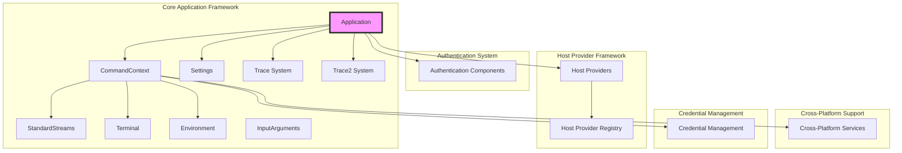
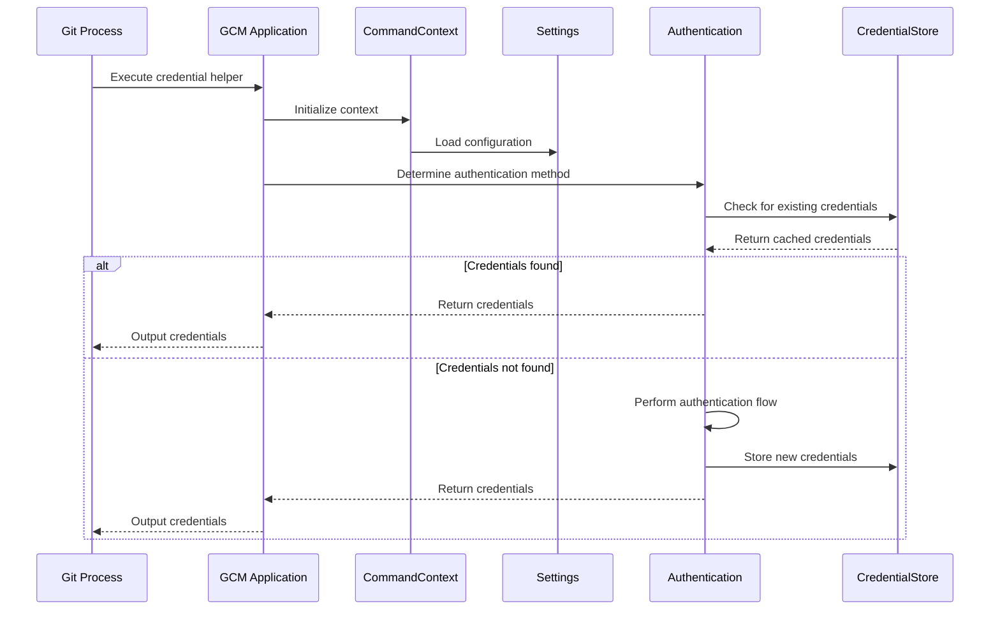

# Core Application Framework

## Overview

The Core Application Framework serves as the foundational infrastructure for the Git Credential Manager (GCM) system. It provides essential services, abstractions, and cross-platform compatibility layers that enable secure credential management across different operating systems and Git hosting platforms.

## Purpose

This framework acts as the central nervous system of GCM, orchestrating:
- Application lifecycle management and command execution
- Cross-platform system integration and interoperability
- Configuration management and settings resolution
- Credential storage and retrieval operations
- Authentication flow coordination
- Diagnostic and tracing capabilities

## Architecture



## Core Sub-modules

### 1. [Application Management](Application Management.md)
The central application orchestrator that manages command execution, provider registration, and system initialization.

**Key Components:**
- `Application` - Main application entry point and command dispatcher
- `ICommandContext` / `CommandContext` - Execution environment abstraction
- `InputArguments` - Git credential input parsing and validation

**Responsibilities:**
- Command-line argument parsing and routing
- Host provider discovery and registration
- Diagnostic system initialization
- Git configuration management
- Exception handling and error reporting

### 2. [Configuration and Settings](Configuration and Settings.md)
Manages configuration resolution from multiple sources including Git configuration, environment variables, and platform-specific settings.

**Key Components:**
- `ISettings` / `Settings` - Configuration resolution and caching
- `ProxyConfiguration` - Network proxy settings management

**Features:**
- Hierarchical configuration with environment precedence
- URL-scoped Git configuration support
- Proxy configuration with multiple backend support
- Cross-platform path resolution

### 3. [I/O and Communication](I/O and Communication.md)
Provides standardized interfaces for system interaction, including streams, terminal access, and process communication.

**Key Components:**
- `IStandardStreams` / `StandardStreams` - Process I/O abstraction
- `ITerminal` - Terminal interaction interface
- `IEnvironment` / `EnvironmentBase` - Process environment abstraction

**Capabilities:**
- Git-compatible stream handling
- Cross-platform terminal operations
- Environment variable management
- Process execution and monitoring

### 4. [Tracing and Diagnostics](Tracing and Diagnostics.md)
Comprehensive logging and diagnostic system supporting multiple output formats and granular event tracking.

**Key Components:**
- `ITrace` / `Trace` - Primary tracing system
- `ITrace2` / `Trace2` - Advanced Git-compatible tracing
- `DebugTraceWriter` - Debug output integration

**Features:**
- Multiple trace output targets (files, pipes, stderr)
- Secret masking and sensitive data protection
- Performance region tracking
- Child process monitoring
- Git-compatible TRACE2 format support

### 5. Cross-Platform Abstraction
Provides consistent APIs across Windows, macOS, and Linux platforms while leveraging native capabilities.

**Key Components:**
- Platform-specific file system implementations
- Native credential storage integration
- Terminal and UI system abstractions
- Process and session management

## Integration Points

### Authentication System Integration
The framework provides the foundation for authentication flows, supporting multiple authentication methods including:
- Basic authentication
- OAuth 2.0 flows
- Microsoft authentication
- Windows Integrated Authentication

### Host Provider Framework Integration
Enables extensible support for different Git hosting platforms through:
- Provider registration and discovery
- Command delegation to providers
- Diagnostic integration
- Configuration management

### Credential Management Integration
Coordinates with credential storage systems to provide:
- Secure credential persistence
- Cross-platform storage abstraction
- Cache management
- Session coordination

## Data Flow



## Configuration Management

The framework implements a sophisticated configuration resolution system that supports:

1. **Environment Variables** - Highest precedence, runtime configuration
2. **Git Configuration** - Repository and user-level settings with URL scoping
3. **Platform Defaults** - Operating system specific defaults
4. **External Policies** - Enterprise policy integration

### Configuration Precedence
```
Environment Variables → Git URL-scoped Config → Git Global Config → Platform Defaults
```

## Security Considerations

The Core Application Framework implements several security measures:

- **Secret Masking** - Automatic masking of sensitive data in traces
- **Secure Storage** - Platform-native credential storage integration
- **Input Validation** - Comprehensive input sanitization and validation
- **Process Isolation** - Secure process execution and communication
- **Audit Logging** - Comprehensive operation tracking

## Performance Optimization

Key performance features include:

- **Configuration Caching** - Git configuration caching to reduce I/O
- **Lazy Initialization** - Components initialized on-demand
- **Stream Optimization** - Efficient stream handling for Git communication
- **Memory Management** - Proper resource disposal and cleanup

## Error Handling

The framework implements comprehensive error handling with:

- **Exception Translation** - Platform-specific error translation
- **Graceful Degradation** - Continued operation when non-critical features fail
- **Detailed Diagnostics** - Rich error context for troubleshooting
- **User-Friendly Messages** - Clear error communication to users

## Related Documentation

- [Authentication System](Authentication System.md) - Authentication implementation details
- [Host Provider Framework](Host Provider Framework.md) - Provider extensibility
- [Cross-Platform Support](Cross-Platform Support.md) - Platform-specific implementations
- [Credential Management](Credential Management.md) - Credential storage and retrieval
- [UI Framework](UI Framework.md) - User interface components
- [Diagnostics](Diagnostics.md) - Diagnostic and troubleshooting tools