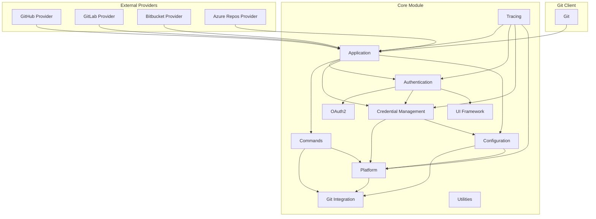

# Core Module Overview

## Purpose

The Core module serves as the foundational infrastructure for Git Credential Manager (GCM), providing essential services and abstractions that enable secure, cross-platform credential management for Git operations. This module orchestrates authentication flows, manages credential storage, handles platform-specific operations, and provides the core framework upon which all provider-specific implementations are built.

## Architecture

## Core Components

### Application Framework
The Application component provides the main entry point and orchestrates the entire credential management workflow. It manages provider registration, command routing, and coordinates between different subsystems.

### Commands Module
Implements Git's credential helper protocol with three primary commands:
- **GetCommand**: Retrieves stored credentials
- **StoreCommand**: Persists credentials securely
- **EraseCommand**: Removes credentials from storage

### Authentication System
Provides multiple authentication mechanisms:
- **Basic Authentication**: Traditional username/password
- **OAuth 2.0**: Modern token-based authentication
- **Microsoft Authentication**: Azure AD/MSA integration
- **Windows Integrated Authentication**: Domain authentication

### Credential Management
Secure credential storage with platform-specific implementations:
- **Windows**: Credential Manager and DPAPI
- **macOS**: Keychain Services
- **Linux**: Secret Service and GPG Pass
- **Cross-platform**: Plaintext and cache stores

### Configuration Services
Centralized configuration management integrating:
- Git configuration system
- Environment variables
- URL-scoped settings
- Component configuration orchestration

### Platform Abstraction
Cross-platform compatibility layer providing:
- Environment variable management
- File system operations
- Process management
- Session detection
- Terminal interactions

### Git Integration
Direct Git process interaction for:
- Repository detection
- Remote enumeration
- Configuration access
- Helper process invocation

### Tracing System
Comprehensive performance and diagnostic tracking based on Git's TRACE2 protocol, supporting multiple output formats and destinations.

### UI Framework
Avalonia-based user interface for authentication prompts, credential collection, and user interactions across all supported platforms.

### Utilities
Essential helper services including HTTP client factory, INI file parsing, and terminal menu systems.

## Key Features

- **Cross-Platform Support**: Native implementations for Windows, macOS, and Linux
- **Security-First Design**: Platform-native secure storage and encryption
- **Extensible Architecture**: Plugin-based provider system for different Git hosts
- **Comprehensive Authentication**: Support for modern authentication protocols
- **Enterprise Ready**: Proxy support, certificate management, and diagnostics
- **User-Friendly**: Both GUI and terminal interfaces with intelligent defaults

## Integration Points

The Core module integrates with external provider modules:
- [BitbucketProvider](BitbucketProvider.md) - Bitbucket Cloud and Data Center support
- [GitHubProvider](GitHubProvider.md) - Advanced GitHub authentication features
- [GitLabProvider](GitLabProvider.md) - GitLab-specific authentication
- [AzureReposProvider](AzureReposProvider.md) - Azure DevOps integration

For detailed documentation of individual components, refer to the specific module documentation pages linked in the architecture diagram above.