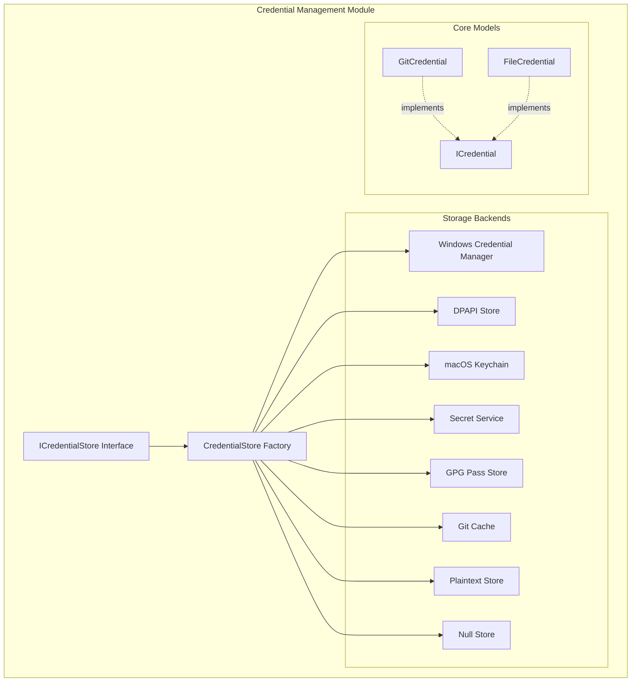
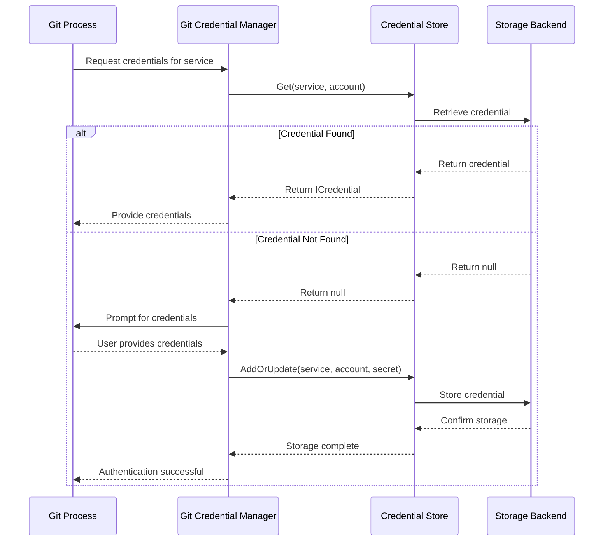

# Credential Management Module

## Overview

The Credential Management module is a core component of the Git Credential Manager (GCM) system, responsible for securely storing, retrieving, and managing authentication credentials used by Git when interacting with remote repositories. This module provides a unified interface for credential storage across different platforms and storage backends, ensuring that user credentials are handled securely and efficiently.

## Purpose

The primary purpose of the Credential Management module is to:
- Provide secure storage for Git credentials (username/password pairs)
- Abstract platform-specific credential storage mechanisms
- Support multiple credential storage backends
- Enable credential sharing across different Git operations
- Maintain credential security while providing easy access to authenticated Git operations

## Architecture

The Credential Management module follows a layered architecture with clear separation of concerns:

## Core Components

### 1. ICredentialStore Interface
The foundational interface that defines the contract for all credential storage implementations. It provides methods for:
- Retrieving credentials by service and account
- Storing new or updated credentials
- Removing credentials
- Listing accounts for a given service

### 2. CredentialStore Factory
A factory class that creates the appropriate credential store implementation based on:
- Platform detection (Windows, macOS, Linux)
- User configuration settings
- Available system capabilities
- Security requirements

### 3. Storage Backend Implementations
Platform-specific and generic storage implementations:

#### Platform-Specific Stores
- **Windows Credential Manager**: Uses Windows built-in credential management
- **DPAPI Store**: Windows Data Protection API for file-based encryption
- **macOS Keychain**: Integration with macOS Keychain services
- **Secret Service**: Linux freedesktop.org Secret Service API

#### Generic Stores
- **GPG Pass Store**: GNU pass-compatible credential storage
- **Git Cache**: In-memory credential cache
- **Plaintext Store**: Unencrypted file storage (development/testing only)
- **Null Store**: No-op store for disabling internal storage

### 4. Credential Models
Core data structures representing credentials:
- **ICredential**: Base interface for all credential types
- **GitCredential**: Standard username/password credential
- **FileCredential**: File-based credential with additional metadata

## Sub-modules

The Credential Management module is organized into several sub-modules, each handling specific aspects of credential management:

### [Credential Storage](Credential%20Storage.md)
Manages the actual storage and retrieval of credentials using various backend implementations. This sub-module handles:
- Platform-specific credential storage integration
- Encryption and security measures
- File-based credential persistence
- In-memory caching mechanisms

**Key Components:**
- `ICredentialStore` - Core interface defining credential storage operations
- `CredentialStore` - Factory class for creating platform-appropriate stores
- `CredentialCacheStore` - Git's in-memory credential cache implementation
- `NullCredentialStore` - No-op store for disabling internal storage
- `PlaintextCredentialStore` - File-based storage (development/testing only)

### [Credential Models](Credential%20Models.md)
Defines the data structures and interfaces used to represent credentials throughout the system. This includes:
- Core credential interfaces
- Concrete credential implementations
- Credential metadata and attributes

**Key Components:**
- `ICredential` - Base interface for all credential types
- `GitCredential` - Standard username/password credential implementation
- `FileCredential` - File-based credential with path and service metadata

### [Session Management Integration](Session%20Management%20Integration.md)
Coordinates with the session management system to determine:
- Desktop session availability
- Web browser accessibility
- UI capability detection
- Headless environment handling

**Key Components:**
- `ISessionManager` - Interface for session capability detection
- `SessionManager` - Base implementation for session management

## Data Flow

## Configuration

The Credential Management module supports extensive configuration through:
- Environment variables
- Git configuration settings
- Platform-specific defaults
- Runtime capability detection

Key configuration options include:
- `GCM_CREDENTIAL_STORE`: Select the credential storage backend
- `GCM_NAMESPACE`: Set a namespace for credential isolation
- Platform-specific store paths and options
- Security and encryption settings

## Security Considerations

The module implements several security measures:
- Platform-native encryption where available
- Secure file permissions on POSIX systems
- Namespace isolation for multi-user environments
- Optional plaintext storage warnings
- Validation of storage backend capabilities

## Integration Points

The Credential Management module integrates with:
- [Authentication System](Authentication%20System.md) - Provides stored credentials for authentication
- [Git Integration](Git%20Integration.md) - Responds to Git credential requests
- [Cross-Platform Support](Cross-Platform%20Support.md) - Utilizes platform-specific storage mechanisms
- [Core Application Framework](Core%20Application%20Framework.md) - Receives configuration and context

## Error Handling

The module implements comprehensive error handling for:
- Storage backend initialization failures
- Permission and access issues
- Encryption/decryption errors
- Platform capability mismatches
- Configuration validation errors

All errors are logged using the tracing system and provide helpful error messages with links to documentation for resolution.