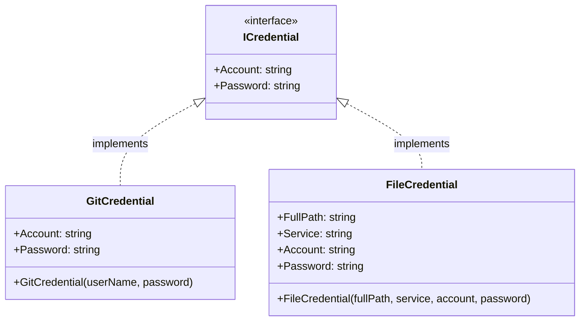
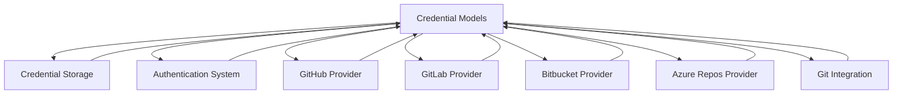
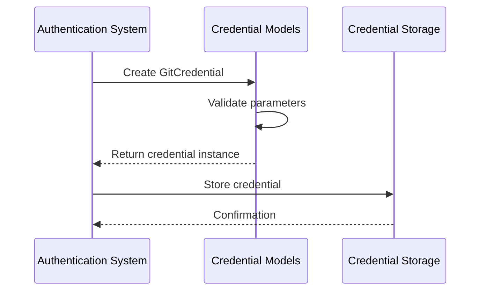
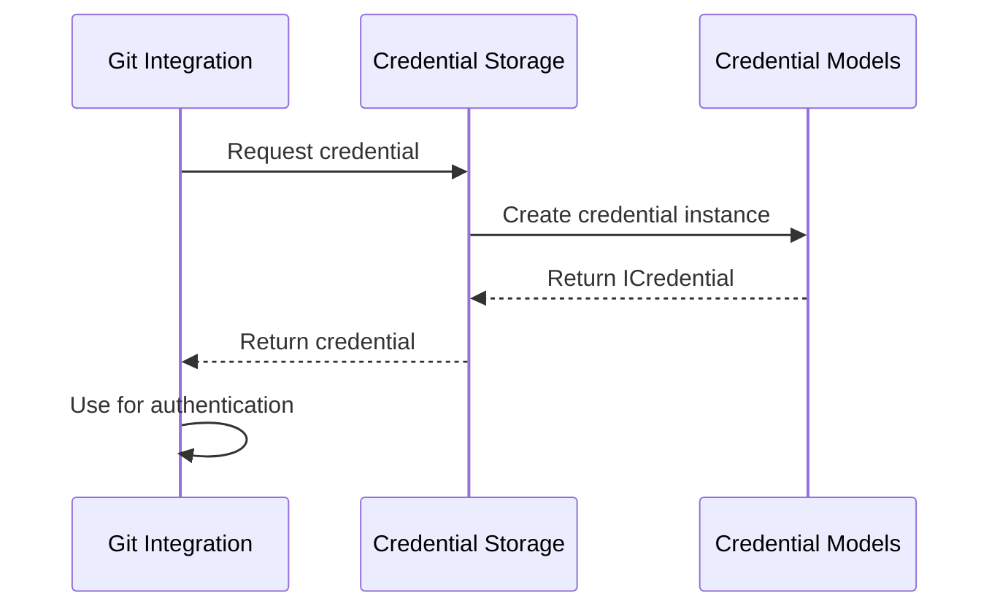

# Credential Models Module Documentation

## Introduction

The Credential Models module provides the fundamental data structures and interfaces for representing authentication credentials within the Git Credential Manager system. This module defines the core abstractions and implementations that enable consistent credential handling across different authentication providers and storage mechanisms.

## Overview

The Credential Models module serves as the foundation for credential management by providing:

- **ICredential**: The base interface that defines the contract for all credential types
- **GitCredential**: The standard implementation for Git authentication credentials
- **FileCredential**: A specialized credential type for file-based authentication scenarios

These components form the core data model that the entire authentication system builds upon, ensuring consistent credential representation across different providers (GitHub, GitLab, Bitbucket, Azure Repos) and storage mechanisms.

## Architecture

### Component Structure



### Module Dependencies



## Core Components

### ICredential Interface

The `ICredential` interface is the fundamental contract that all credential types must implement. It provides a uniform way to access credential information across the system.

**Properties:**
- `Account`: The username or account identifier associated with the credential
- `Password`: The authentication token, password, or secret

This interface ensures that all credential implementations provide consistent access to basic authentication information, enabling polymorphic handling throughout the credential management system.

### GitCredential Class

The `GitCredential` class is the standard implementation of `ICredential` designed specifically for Git authentication scenarios. It represents the traditional username/password pair that Git uses for authentication.

**Use Cases:**
- Basic authentication with Git remotes
- Username/password authentication flows
- Legacy authentication scenarios
- Fallback authentication mechanism

**Construction:**
```csharp
var credential = new GitCredential("username", "password");
```

### FileCredential Class

The `FileCredential` class extends the credential model to support file-based authentication scenarios. It includes additional metadata for file-based credential storage and retrieval.

**Additional Properties:**
- `FullPath`: The complete file system path to the credential file
- `Service`: The service identifier for the credential

**Use Cases:**
- File-based credential storage
- Service-specific credential files
- Path-based credential organization
- Multi-service credential management

**Construction:**
```csharp
var credential = new FileCredential("/path/to/credential", "service", "account", "password");
```

## Data Flow

### Credential Creation Flow



### Credential Retrieval Flow



## Integration Points

### Authentication System Integration

The Credential Models module integrates with the [Authentication System](Authentication System.md) by providing the data structures that authentication providers use to represent credentials. Each authentication method (Basic, OAuth, Microsoft, Windows Integrated) ultimately produces an `ICredential` implementation that can be used by Git.

### Provider Integration

All Git hosting providers ([GitHub](GitHub Provider.md), [GitLab](GitLab Provider.md), [Bitbucket](Bitbucket Provider.md), [Azure Repos](Azure Repos Provider.md)) depend on the Credential Models module to represent the credentials they generate and manage.

### Storage Integration

The [Credential Storage](Credential Storage.md) module uses the Credential Models to store and retrieve credentials from various storage backends (Windows Credential Manager, macOS Keychain, Linux Secret Service, etc.).

### Git Integration

The [Git Integration](Git Integration.md) module consumes credentials from the Credential Models to authenticate with Git remotes during fetch, push, and clone operations.

## Usage Patterns

### Basic Authentication

```csharp
// Create a basic credential
ICredential credential = new GitCredential("username", "password");

// Use with Git operations
git.SetCredential(credential);
```

### File-Based Authentication

```csharp
// Create a file-based credential
ICredential credential = new FileCredential(
    "/path/to/credential/file",
    "github.com",
    "username",
    "token"
);

// Store for later use
await credentialStore.StoreCredentialAsync(credential);
```

### Polymorphic Handling

```csharp
// Handle any credential type uniformly
void ProcessCredential(ICredential credential)
{
    Console.WriteLine($"Account: {credential.Account}");
    Console.WriteLine($"Password: {credential.Password}");
    
    // Type-specific processing
    if (credential is FileCredential fileCred)
    {
        Console.WriteLine($"Path: {fileCred.FullPath}");
        Console.WriteLine($"Service: {fileCred.Service}");
    }
}
```

## Security Considerations

### Credential Protection

- Credentials should be handled securely and not logged or exposed
- Password properties should be cleared from memory when no longer needed
- File credentials should ensure proper file permissions

### Interface Design

- The `ICredential` interface provides read-only access to credential data
- Immutable design prevents accidental modification of credential data
- Clear separation between credential data and credential operations

## Extensibility

The Credential Models module is designed for extensibility:

- New credential types can be added by implementing `ICredential`
- Provider-specific credential implementations can extend the base models
- Additional metadata can be included in custom implementations

## Related Documentation

- [Authentication System](Authentication System.md) - Authentication providers that use these credential models
- [Credential Storage](Credential Storage.md) - Storage mechanisms for credentials
- [Git Integration](Git Integration.md) - Git operations that consume credentials
- [GitHub Provider](GitHub Provider.md) - GitHub-specific authentication
- [GitLab Provider](GitLab Provider.md) - GitLab-specific authentication
- [Bitbucket Provider](Bitbucket Provider.md) - Bitbucket-specific authentication
- [Azure Repos Provider](Azure Repos Provider.md) - Azure Repos authentication