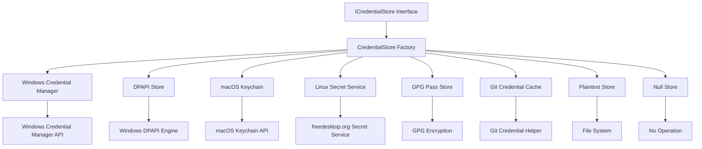
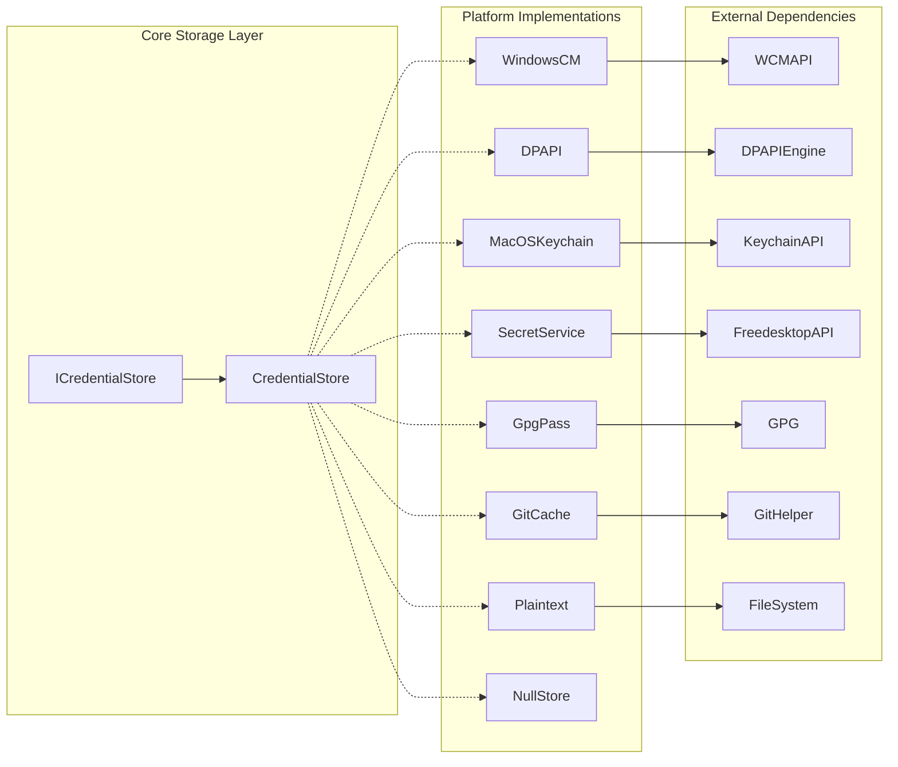
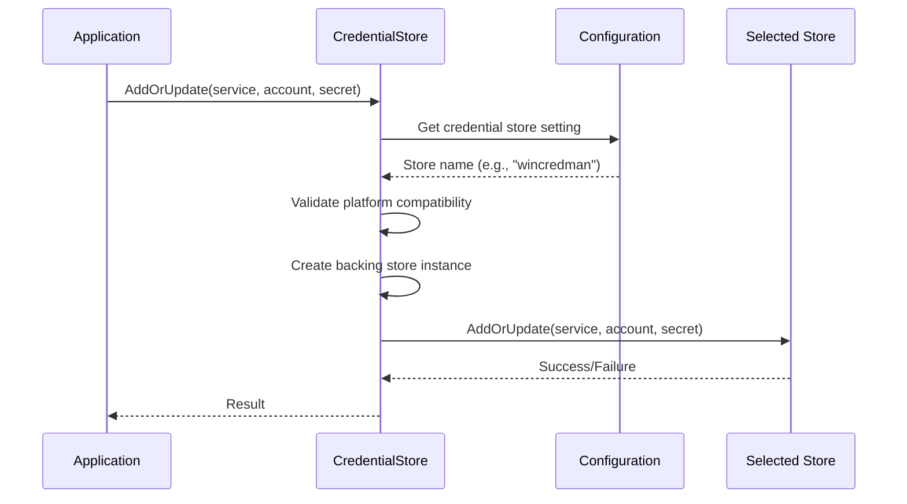
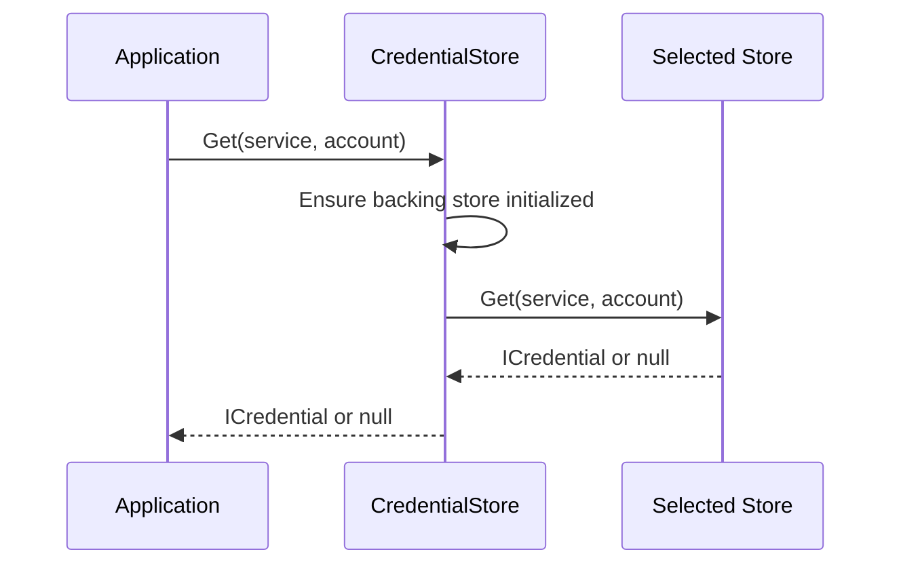

# Credential Storage Module

The Credential Storage module provides a unified, secure, and platform-agnostic interface for storing and managing Git credentials across different operating systems and storage backends. It serves as the central credential management system for Git Credential Manager, abstracting the complexity of various platform-specific credential storage mechanisms.

## Overview

The Credential Storage module implements a flexible architecture that supports multiple storage backends, allowing users to choose the most appropriate credential storage method based on their security requirements, platform capabilities, and operational constraints. The module provides seamless integration with platform-native credential stores while maintaining a consistent API across all implementations.

### Key Features

- **Multi-platform Support**: Native integration with Windows Credential Manager, macOS Keychain, and Linux Secret Service
- **Flexible Storage Options**: Support for encrypted, plaintext, cache-based, and custom storage backends
- **Security-first Design**: Platform-specific security validation and permission management
- **Configuration-driven**: Runtime selection of storage backend via environment variables or Git configuration
- **Namespace Support**: Isolated credential storage for different applications or environments

## Architecture

### Core Components



### Component Relationships



## Storage Backends

### Platform-Native Stores

#### Windows Credential Manager
- **Platform**: Windows only
- **Security**: High - Uses Windows Credential Manager API with user-level encryption
- **Limitations**: Not available over network/SSH sessions
- **Use Case**: Default choice for Windows environments with interactive sessions

#### macOS Keychain
- **Platform**: macOS only  
- **Security**: High - Integrates with macOS Keychain system
- **Use Case**: Default choice for macOS environments

#### Linux Secret Service
- **Platform**: Linux with graphical interface
- **Security**: High - Uses freedesktop.org Secret Service specification
- **Requirements**: Requires D-Bus and graphical session
- **Use Case**: Default choice for Linux desktop environments

### Alternative Storage Options

#### DPAPI Store (Windows)
- **Platform**: Windows only
- **Security**: Medium-High - Uses Windows DPAPI for file encryption
- **Storage**: Encrypted files in user directory
- **Use Case**: Suitable for headless Windows environments

#### GPG Pass Store
- **Platform**: POSIX systems (Linux, macOS, WSL)
- **Security**: High - Uses GPG encryption with GNU pass compatibility
- **Requirements**: GPG and pass utility
- **Use Case**: Command-line environments requiring strong encryption

#### Git Credential Cache
- **Platform**: Non-Windows systems
- **Security**: Low-Medium - In-memory storage with timeout
- **Storage**: Git's built-in credential cache helper
- **Use Case**: Temporary credential storage for short-lived operations

#### Plaintext Store
- **Platform**: All platforms
- **Security**: Low - Unencrypted text files
- **Storage**: Plain text files in user directory
- **Use Case**: Development/testing environments only (NOT recommended for production)

#### Null Store
- **Platform**: All platforms
- **Security**: N/A - No storage
- **Use Case**: Disabling internal storage when external helpers are preferred

## Data Flow

### Credential Storage Process



### Credential Retrieval Process



## Configuration

### Environment Variables

- `GCM_CREDENTIAL_STORE`: Override the default credential store selection
- `GCM_DPAPI_STORE_PATH`: Custom path for DPAPI store
- `GCM_PLAINTEXT_STORE_PATH`: Custom path for plaintext store
- `GCM_GPG_PASS_STORE_PATH`: Custom path for GPG pass store
- `GCM_CRED_CACHE_OPTIONS`: Options for Git credential cache

### Git Configuration

```ini
[credential]
    credentialStore = wincredman  # Windows Credential Manager
    credentialStore = dpapi       # DPAPI protected files
    credentialStore = keychain    # macOS Keychain
    credentialStore = secretservice # Linux Secret Service
    credentialStore = gpg         # GPG pass store
    credentialStore = cache       # Git credential cache
    credentialStore = plaintext   # Plain text files
    credentialStore = none        # Disable storage
```

## Security Considerations

### Platform Validation

The Credential Storage module performs comprehensive platform validation to ensure selected storage backends are compatible with the current environment:

- **Windows Credential Manager**: Validates Windows platform and interactive session availability
- **DPAPI**: Validates Windows platform and configures encrypted file storage
- **macOS Keychain**: Validates macOS platform
- **Secret Service**: Validates Linux platform and desktop session availability
- **GPG Pass**: Validates POSIX platform, GPG installation, and TTY configuration
- **Git Cache**: Validates non-Windows platform for Unix socket support

### Permission Management

For POSIX platforms, the module implements strict permission controls:

- Store root directories are created with `0700` permissions (owner-only access)
- Credential files inherit restrictive permissions from parent directories
- Platform-specific security validation is performed before store initialization

### Encryption Standards

Different storage backends implement appropriate encryption standards:

- **Windows Credential Manager**: Windows DPAPI with user-specific encryption keys
- **DPAPI Store**: File-level encryption using Windows DPAPI
- **macOS Keychain**: System-level keychain encryption
- **Secret Service**: Implementation-dependent encryption via Secret Service providers
- **GPG Pass**: GPG public-key encryption with user-specified key pairs

## Integration Points

### Session Management Integration

The Credential Storage module integrates with the [Session Management](Session%20Management%20Integration.md) system to:

- Detect desktop vs. headless sessions
- Configure appropriate storage backends for session types
- Validate TTY availability for interactive authentication

### Settings Integration

Configuration is managed through the [Configuration and Settings](Configuration%20and%20Settings.md) system:

- Runtime store selection via settings
- Namespace configuration for credential isolation
- Custom store path configuration

### Git Integration

The module integrates with [Git Integration](Git%20Integration.md) components:

- Git credential cache helper integration
- Git configuration system integration
- Git remote and service URL handling

## Error Handling

The Credential Storage module implements comprehensive error handling:

- **Platform Incompatibility**: Clear error messages with platform-specific guidance
- **Missing Dependencies**: Detailed instructions for installing required components
- **Permission Issues**: Platform-specific permission troubleshooting
- **Configuration Errors**: Helpful error messages with available options

## Performance Considerations

### Store Selection Impact

Different storage backends have varying performance characteristics:

- **Platform-Native Stores**: Fast access with system-level optimization
- **File-Based Stores**: Performance dependent on file system I/O
- **Network-Dependent Stores**: May have latency for remote operations
- **Cache Stores**: Optimized for frequent access patterns

### Lazy Initialization

The CredentialStore class implements lazy initialization to minimize overhead:

- Backing store creation deferred until first access
- Platform validation performed only when needed
- Configuration parsing optimized for repeated access

## Platform-Specific Notes

### Windows
- Default store: Windows Credential Manager
- Alternative: DPAPI for headless scenarios
- Network session limitations for Credential Manager

### macOS
- Default store: macOS Keychain
- GPG Pass available for command-line preferences
- Full integration with macOS security system

### Linux
- Default store: Secret Service (requires GUI)
- Fallback options: GPG Pass or Git Cache
- Desktop session detection for store selection

## Best Practices

1. **Use Platform Defaults**: Leverage platform-native stores for optimal security
2. **Configure Appropriately**: Select storage backends based on environment constraints
3. **Validate Configuration**: Test credential storage in target deployment environments
4. **Monitor Security**: Regular review of stored credentials and access patterns
5. **Document Choices**: Maintain clear documentation of credential storage configuration

## Related Documentation

- [Authentication System](Authentication%20System.md) - Credential storage integration with authentication flows
- [Cross-Platform Support](Cross-Platform%20Support.md) - Platform-specific implementation details
- [Configuration Service](Configuration%20Service.md) - Configuration management for credential stores
- [Diagnostics](Diagnostics.md) - Credential store diagnostic capabilities