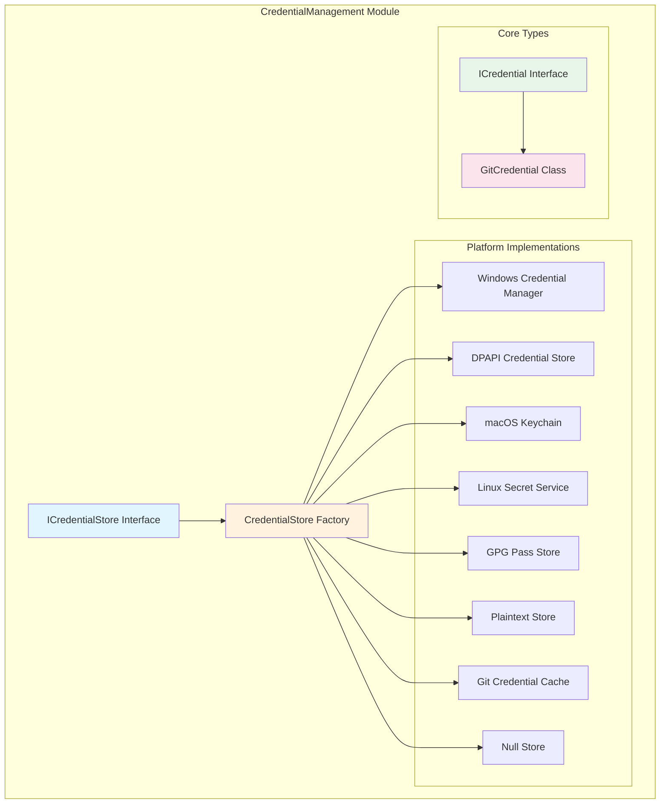
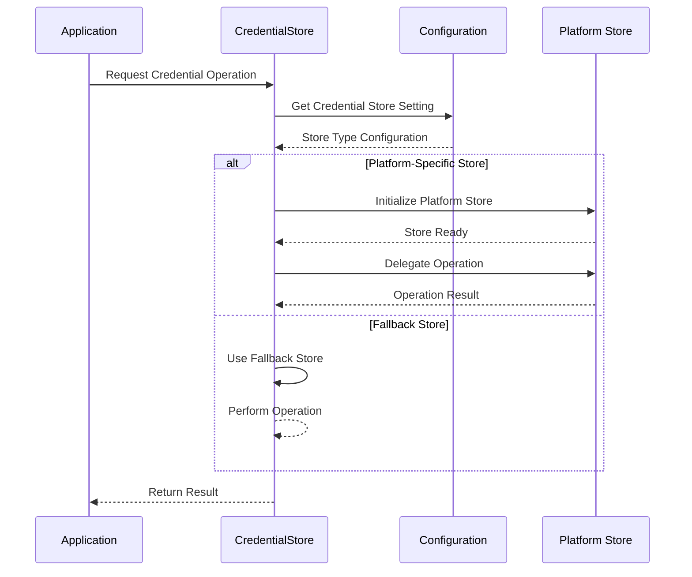
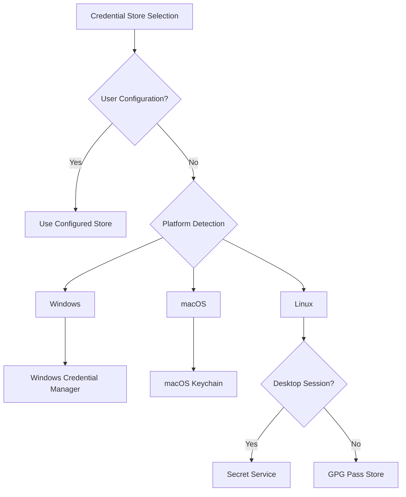

# CredentialManagement Module Documentation

## Introduction

The CredentialManagement module is a core component of the Git Credential Manager (GCM) that provides secure storage and retrieval of authentication credentials across multiple platforms. This module serves as the foundation for managing Git credentials, supporting various storage backends and ensuring credentials are securely persisted according to platform-specific security standards.

The module abstracts the complexity of different credential storage mechanisms across Windows, macOS, and Linux platforms, providing a unified interface for credential operations while leveraging each platform's native security features.

## Architecture Overview

The CredentialManagement module follows a layered architecture with clear separation of concerns:



## Core Components

### ICredential Interface
The fundamental contract for credential objects, defining the basic properties required for authentication:

- **Account**: The username or account identifier
- **Password**: The secret/password associated with the account

### GitCredential Class
The concrete implementation of `ICredential` that represents a standard username/password credential pair used by Git for authentication.

### ICredentialStore Interface
Defines the contract for credential storage operations:

- **GetAccounts**: Retrieve all accounts for a given service
- **Get**: Retrieve a specific credential by service and account
- **AddOrUpdate**: Store or update a credential
- **Remove**: Delete a credential

### CredentialStore Class
The main factory class that manages platform-specific credential store selection and instantiation. It acts as a facade that delegates operations to the appropriate platform-specific implementation.

## Platform-Specific Implementations

### Windows Platform

#### Windows Credential Manager
- **Purpose**: Integrates with Windows Credential Manager (CredMan)
- **Security**: Uses Windows DPAPI for encryption
- **Features**: 
  - Supports credential persistence across sessions
  - Handles URI-based credential matching
  - Namespace support for credential isolation
- **Limitations**: Not available over network/SSH sessions

#### DPAPI Credential Store
- **Purpose**: File-based credential storage using Windows DPAPI
- **Security**: DPAPI encryption with user-specific keys
- **Use Case**: Alternative when Credential Manager is unavailable

### macOS Platform

#### macOS Keychain
- **Purpose**: Integrates with macOS Keychain Services
- **Security**: Hardware-backed encryption with Keychain access controls
- **Features**:
  - Supports keychain item locking/unlocking
  - Namespace isolation
  - Native macOS security integration

### Linux Platform

#### Secret Service (freedesktop.org)
- **Purpose**: Integrates with freedesktop.org Secret Service API
- **Security**: Depends on Secret Service implementation (typically GNOME Keyring or KWallet)
- **Requirements**: Graphical interface required
- **Features**: Standardized credential storage across Linux desktop environments

#### GPG Pass Store
- **Purpose**: Integration with GNU pass (password-store.org)
- **Security**: GPG encryption with user-managed keys
- **Requirements**: GPG and pass initialization
- **Use Case**: Command-line friendly, headless environment support

### Cross-Platform Options

#### Git Credential Cache
- **Purpose**: In-memory credential storage
- **Security**: No persistence (memory-only)
- **Use Case**: Short-term credential caching
- **Limitations**: Not available on Windows due to Unix socket dependency

#### Plaintext Store
- **Purpose**: Unencrypted file-based storage
- **Security**: No encryption (UNSECURE)
- **Use Case**: Development/testing environments only
- **Warning**: Credentials stored in plain text

#### Null Store
- **Purpose**: Disables credential storage
- **Use Case**: When credential persistence is not desired

## Data Flow Architecture



## Configuration and Store Selection

The CredentialStore automatically selects the appropriate storage backend based on:

1. **Explicit Configuration**: User-specified credential store via environment variables or Git configuration
2. **Platform Defaults**: Automatic selection based on the operating system
3. **Capability Detection**: Runtime validation of store availability and requirements

### Configuration Hierarchy



## Security Considerations

### Encryption and Protection
- **Windows**: DPAPI encryption with user-specific keys
- **macOS**: Keychain Services with hardware-backed encryption
- **Linux**: Depends on Secret Service implementation
- **GPG Pass**: GPG encryption with user-managed keys

### Access Control
- Platform-specific access controls and permissions
- Namespace isolation for multi-tenant scenarios
- Session-based access restrictions

### Security Warnings
- Plaintext store should only be used in development environments
- Credential cache provides no persistence protection
- Network/SSH sessions may limit available stores

## Integration with Other Modules

The CredentialManagement module integrates with several other GCM modules:

### Authentication Module
- Provides credential storage for various authentication methods
- Supports [Basic Authentication](Authentication.md#basic-authentication), [OAuth](Authentication.md#oauth-authentication), and [Microsoft Authentication](Authentication.md#microsoft-authentication)

### Commands Module
- Used by [GetCommand](Commands.md#get-command) to retrieve stored credentials
- Used by [StoreCommand](Commands.md#store-command) to persist credentials
- Used by [EraseCommand](Commands.md#erase-command) to remove credentials

### Platform Module
- Leverages platform-specific services through the [Platform](Platform.md) module
- Uses [FileSystem](Platform.md#filesystem) for file-based stores
- Integrates with [SessionManager](Platform.md#session-manager) for session detection

### Configuration Module
- Store selection configured through [ConfigurationService](Configuration.md#configuration-service)
- Settings managed through [Settings](Configuration.md#settings) system

## Error Handling and Diagnostics

The module implements comprehensive error handling:

- **Platform Validation**: Ensures store compatibility with the current platform
- **Capability Detection**: Validates store availability and requirements
- **Graceful Fallback**: Falls back to alternative stores when primary stores are unavailable
- **Detailed Error Messages**: Provides actionable error messages with documentation links

### Diagnostic Support
- Integration with [Diagnostic](Diagnostics.md) module for troubleshooting
- Platform-specific validation and error reporting
- Configuration validation and recommendations

## Usage Examples

### Basic Credential Operations

```csharp
// Get the credential store
ICredentialStore store = new CredentialStore(context);

// Store a credential
store.AddOrUpdate("https://github.com", "username", "password");

// Retrieve a credential
ICredential cred = store.Get("https://github.com", "username");

// Remove a credential
bool removed = store.Remove("https://github.com", "username");
```

### Store Selection

```csharp
// The store is automatically selected based on platform and configuration
// Users can override via environment variables or Git config:
// GCM_CREDENTIAL_STORE=windowsCredentialManager
// git config --global credential.credentialStore macos-keychain
```

## Best Practices

1. **Use Platform Defaults**: Let the module automatically select the most secure available store
2. **Namespace Isolation**: Use namespaces when managing credentials for multiple applications
3. **Error Handling**: Always handle store initialization errors gracefully
4. **Security Review**: Regularly review stored credentials and access patterns
5. **Documentation**: Refer to platform-specific documentation for security implications

## References

- [Authentication Module](Authentication.md) - Credential usage in authentication flows
- [Commands Module](Commands.md) - Command implementations using credential storage
- [Platform Module](Platform.md) - Platform-specific services and capabilities
- [Configuration Module](Configuration.md) - Store configuration and settings
- [Diagnostics Module](Diagnostics.md) - Troubleshooting and diagnostic support

For more information about credential store options and configuration, see the [official GCM documentation](https://github.com/GitCredentialManager/git-credential-manager/blob/main/docs/credstores.md).