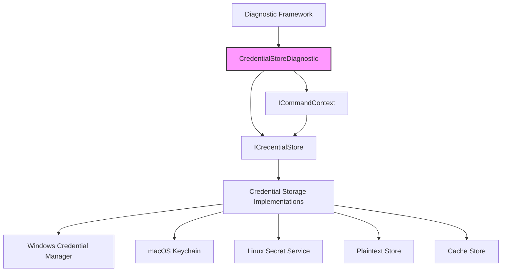
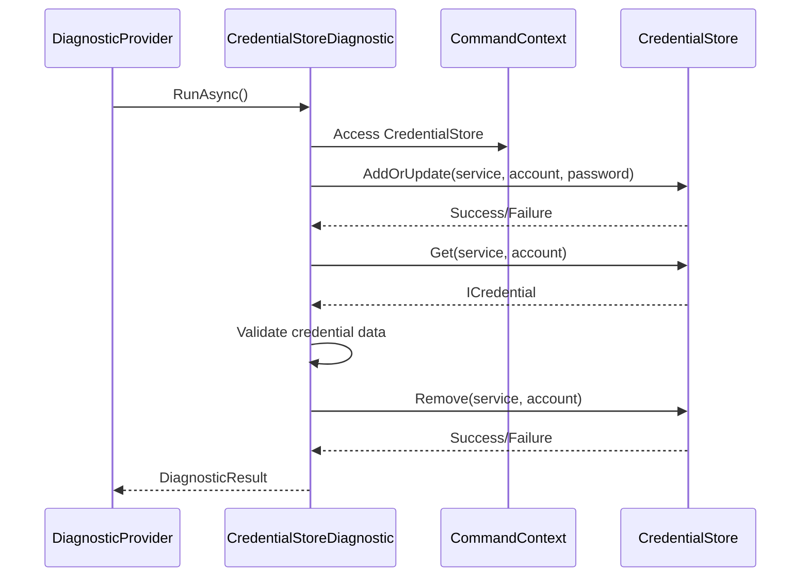
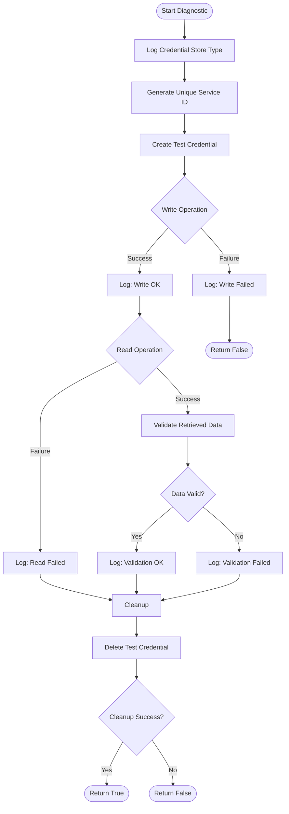
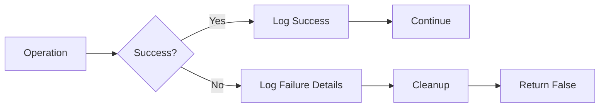
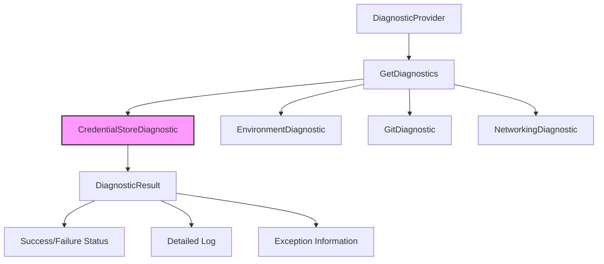

# CredentialStoreDiagnostic Module

## Overview

The CredentialStoreDiagnostic module is a diagnostic component within the Git Credential Manager's diagnostics framework. It provides comprehensive testing and validation of the credential storage system to ensure credentials can be securely stored, retrieved, and deleted. This diagnostic is essential for troubleshooting authentication issues and verifying the integrity of the credential management infrastructure.

## Purpose and Core Functionality

The CredentialStoreDiagnostic serves as a critical validation tool that:

- **Validates Credential Store Operations**: Tests the complete lifecycle of credential operations (create, read, delete)
- **Ensures Data Integrity**: Verifies that stored credentials are retrieved accurately without corruption
- **Diagnoses Storage Issues**: Identifies problems with credential storage implementations across different platforms
- **Supports Troubleshooting**: Provides detailed logging for authentication-related debugging

## Architecture and Component Relationships

### Component Hierarchy



### Integration with Diagnostic Framework



## Core Components

### CredentialStoreDiagnostic Class

The `CredentialStoreDiagnostic` class inherits from the base `Diagnostic` class and implements credential storage validation logic:

```csharp
public class CredentialStoreDiagnostic : Diagnostic
{
    public CredentialStoreDiagnostic(ICommandContext commandContext)
        : base("Credential storage", commandContext)
    { }
    
    protected override Task<bool> RunInternalAsync(StringBuilder log, IList<string> additionalFiles)
    {
        // Validation logic implementation
    }
}
```

**Key Responsibilities:**
- Generates unique test credentials to avoid conflicts
- Performs complete CRUD operations on the credential store
- Validates data integrity between stored and retrieved credentials
- Ensures proper cleanup of test data
- Provides detailed logging for each operation

## Diagnostic Process Flow



## Dependencies and Interactions

### Required Dependencies

1. **ICommandContext**: Provides access to the credential store and system context
2. **ICredentialStore**: The credential storage interface being tested
3. **ICredential**: Represents credential data structure
4. **Diagnostic Base Class**: Provides diagnostic framework integration

### Related Components

- **[CommandContext](CommandContext.md)**: Provides the execution context and access to credential stores
- **[CredentialStore](CredentialStore.md)**: The interface being validated by this diagnostic
- **[Diagnostic](Diagnostic.md)**: Base class providing diagnostic framework functionality
- **[EnvironmentDiagnostic](EnvironmentDiagnostic.md)**: Related diagnostic for environment validation

## Platform-Specific Considerations

The CredentialStoreDiagnostic works across different platform implementations:

### Windows Platform
- Tests [Windows Credential Manager](WindowsCredentialManager.md) integration
- Validates DPAPI-protected storage operations

### macOS Platform  
- Tests [macOS Keychain](MacOSKeychain.md) integration
- Validates keychain access and security

### Linux Platform
- Tests [Secret Service](SecretServiceCollection.md) integration
- Validates D-Bus communication with secret service

## Error Handling and Logging

The diagnostic implements comprehensive error handling:



**Logging Categories:**
- **Information**: Credential store type identification
- **Success**: Successful operations (write, read, delete)
- **Error**: Failed operations with detailed error information
- **Validation**: Data integrity validation results

## Usage Scenarios

### Troubleshooting Authentication Issues
When users experience authentication problems, the CredentialStoreDiagnostic helps identify:
- Credential store accessibility issues
- Data corruption in stored credentials
- Platform-specific storage problems
- Permission and access right issues

### System Validation
During system setup or maintenance:
- Verify credential store functionality after configuration changes
- Validate storage integrity after system updates
- Test new credential store implementations

### Development and Testing
For developers working on credential-related features:
- Validate new credential store implementations
- Test cross-platform compatibility
- Verify credential operation reliability

## Security Considerations

### Test Data Security
- Uses GUID-based unique service identifiers to avoid conflicts
- Implements proper cleanup of test credentials
- Never uses real user credentials for testing
- Follows secure coding practices for credential handling

### Privacy Protection
- Test credentials contain no real user data
- Diagnostic logs don't expose sensitive information
- Cleanup operations ensure no test data remains

## Performance Characteristics

- **Execution Time**: Typically completes in milliseconds
- **Resource Usage**: Minimal memory and CPU overhead
- **Cleanup Guarantee**: Implements try-finally pattern for resource cleanup
- **Concurrency**: Safe for concurrent execution in multi-user environments

## Integration with Diagnostic Framework

The CredentialStoreDiagnostic integrates with the broader diagnostic system:



## Future Enhancements

Potential improvements to the CredentialStoreDiagnostic module:

1. **Extended Validation**: Add tests for bulk operations and performance metrics
2. **Security Validation**: Include encryption and security feature validation
3. **Cross-Platform Testing**: Enhanced validation of platform-specific features
4. **Performance Benchmarking**: Add timing and performance measurement capabilities
5. **Configuration Validation**: Test credential store configuration options

## Conclusion

The CredentialStoreDiagnostic module is a crucial component of the Git Credential Manager's diagnostic framework, providing essential validation of credential storage operations. Its comprehensive testing approach ensures the reliability and integrity of credential management across different platforms and storage implementations, making it an invaluable tool for troubleshooting authentication issues and maintaining system reliability.