# Cross-Platform Support Module

## Overview

The Cross-Platform Support module provides the foundational infrastructure for Git Credential Manager to operate consistently across different operating systems (Windows, macOS, and Linux). This module abstracts platform-specific functionality through a unified interface, enabling the application to leverage native OS capabilities while maintaining a consistent API surface.

## Purpose

The primary purpose of this module is to:
- Provide platform-agnostic abstractions for system-level operations
- Implement OS-specific functionality for file systems, credential storage, terminal operations, and system integration
- Ensure consistent behavior across different operating environments
- Enable native integration with platform-specific security and UI features

## Architecture

```mermaid
graph TB
    subgraph "Cross-Platform Support Module"
        subgraph "Platform Abstractions"
            IFileSystem[IFileSystem Interface]
            IEnvironment[IEnvironment Interface]
            ITerminal[ITerminal Interface]
            ICredentialStore[ICredentialStore Interface]
            ISystemPrompts[ISystemPrompts Interface]
        end
        
        subgraph "Windows Implementation"
            WindowsFileSystem[WindowsFileSystem]
            WindowsEnvironment[WindowsEnvironment]
            WindowsTerminal[WindowsTerminal]
            WindowsCredentialManager[WindowsCredentialManager]
            DpapiCredentialStore[DpapiCredentialStore]
            WindowsSystemPrompts[WindowsSystemPrompts]
            WindowsSessionManager[WindowsSessionManager]
            WindowsProcessManager[WindowsProcessManager]
        end
        
        subgraph "macOS Implementation"
            MacOSFileSystem[MacOSFileSystem]
            MacOSEnvironment[MacOSEnvironment]
            MacOSTerminal[MacOSTerminal]
            MacOSKeychain[MacOSKeychain]
            MacOSSessionManager[MacOSSessionManager]
            MacOSPreferences[MacOSPreferences]
            MacOSSettings[MacOSSettings]
        end
        
        subgraph "Linux Implementation"
            LinuxFileSystem[LinuxFileSystem]
            LinuxSessionManager[LinuxSessionManager]
            LinuxTerminal[LinuxTerminal]
            SecretServiceCollection[SecretServiceCollection]
            SecretServiceCredential[SecretServiceCredential]
        end
        
        subgraph "POSIX Implementation"
            PosixEnvironment[PosixEnvironment]
            GpgPassCredentialStore[GpgPassCredentialStore]
        end
    end
    
    %% Abstraction relationships
    IFileSystem --> WindowsFileSystem
    IFileSystem --> MacOSFileSystem
    IFileSystem --> LinuxFileSystem
    
    IEnvironment --> WindowsEnvironment
    IEnvironment --> MacOSEnvironment
    IEnvironment --> PosixEnvironment
    
    ITerminal --> WindowsTerminal
    ITerminal --> MacOSTerminal
    ITerminal --> LinuxTerminal
    
    ICredentialStore --> WindowsCredentialManager
    ICredentialStore --> DpapiCredentialStore
    ICredentialStore --> MacOSKeychain
    ICredentialStore --> SecretServiceCollection
    ICredentialStore --> GpgPassCredentialStore
    
    ISystemPrompts --> WindowsSystemPrompts
    
    %% Inheritance relationships
    MacOSFileSystem -.-> PosixFileSystem
    MacOSEnvironment -.-> PosixEnvironment
    MacOSTerminal -.-> PosixTerminal
    MacOSSessionManager -.-> PosixSessionManager
    LinuxFileSystem -.-> PosixFileSystem
    LinuxTerminal -.-> PosixTerminal
    LinuxSessionManager -.-> PosixSessionManager
```

## Core Components

### Platform Abstractions

The module defines several key interfaces that provide platform-agnostic abstractions:

- **[IFileSystem](Cross-Platform Support.md#filesystem-abstraction)**: Abstracts file system operations including path resolution, file manipulation, and directory operations
- **[IEnvironment](Cross-Platform Support.md#environment-abstraction)**: Provides access to environment variables and system configuration
- **[ITerminal](Cross-Platform Support.md#terminal-abstraction)**: Handles console input/output operations with support for secure password input
- **[ICredentialStore](Cross-Platform Support.md#credential-storage-abstraction)**: Defines the interface for secure credential storage and retrieval
- **[ISystemPrompts](Cross-Platform Support.md#system-prompts-abstraction)**: Enables native system UI dialogs for credential collection

### Platform-Specific Implementations

#### Windows Platform
The Windows implementation leverages native Windows APIs and services:
- **Windows Credential Manager**: Integration with Windows Credential Manager for secure credential storage
- **DPAPI Protection**: Data Protection API for encrypting sensitive data at rest
- **Console API**: Direct Windows Console API for terminal operations
- **Registry Integration**: Windows Registry for system configuration
- **WSL Support**: Windows Subsystem for Linux process management

For detailed information about Windows platform components, see [Windows Platform Components](Windows Platform Components.md).

#### macOS Platform
The macOS implementation utilizes native macOS frameworks:
- **Keychain Services**: Integration with macOS Keychain for credential management
- **Core Foundation**: Native macOS APIs for system integration
- **Terminal Control**: POSIX terminal control with macOS-specific enhancements
- **System Preferences**: Integration with macOS system preferences

For detailed information about macOS platform components, see [macOS Platform Components](macOS Platform Components.md).

#### Linux Platform
The Linux implementation provides desktop environment integration:
- **Secret Service API**: Freedesktop.org Secret Service API for credential storage
- **D-Bus Integration**: System bus communication for credential services
- **POSIX Compliance**: Standard POSIX APIs for file system and terminal operations
- **GPG Pass**: Support for GPG-encrypted password stores

For detailed information about Linux platform components, see [Linux Platform Components](Linux Platform Components.md).

#### POSIX Platform
The POSIX implementation provides common functionality for Unix-like systems:
- **Environment Management**: Standard POSIX environment variable handling
- **GPG Integration**: Support for GPG-encrypted credential storage
- **Process Management**: POSIX-compliant process and signal handling

For detailed information about POSIX platform components, see [POSIX Platform Components](POSIX Platform Components.md).

## Key Features

### 1. Unified File System Operations
The module provides consistent file system operations across platforms, handling platform-specific path resolution, symbolic link handling, and case sensitivity rules.

### 2. Secure Credential Storage
Each platform implementation leverages the most appropriate native credential storage mechanism:
- Windows: Credential Manager with DPAPI encryption
- macOS: Keychain Services
- Linux: Secret Service API (GNOME Keyring, KWallet, etc.)

### 3. Native UI Integration
Platform-specific system prompts and dialogs for credential collection, ensuring native look and feel on each operating system.

### 4. Terminal and Console Support
Cross-platform terminal operations with support for:
- Secure password input (echo suppression)
- Console encoding and character handling
- Terminal capability detection

### 5. Session Management
Desktop session detection to determine UI capabilities and appropriate interaction modes.

## Integration Points

The Cross-Platform Support module serves as the foundation for all other modules in the Git Credential Manager:

- **[Core Application Framework](Core Application Framework.md)**: Uses platform abstractions for configuration, I/O, and tracing
- **[Authentication System](Authentication System.md)**: Leverages credential storage and system prompts
- **[Git Integration](Git Integration.md)**: Utilizes file system and process management abstractions
- **[Credential Management](Credential Management.md)**: Built on top of platform-specific credential stores

## Platform Detection and Selection

The module automatically detects the current operating system and instantiates the appropriate platform-specific implementations. This detection occurs at application startup and is transparent to the consuming code.

## Error Handling and Diagnostics

Each platform implementation includes comprehensive error handling and diagnostic capabilities, with platform-specific error codes translated to common exception types for consistent error reporting across platforms.

## Security Considerations

The module implements security best practices for each platform:
- Secure credential storage using OS-native encryption
- Memory protection for sensitive data
- Secure deletion of temporary files
- Proper permission handling for credential stores

## Extensibility

The modular architecture allows for easy addition of new platform support by implementing the core interfaces and following the established patterns for platform-specific functionality.