# Diagnostics Module Documentation

## Overview

The Diagnostics module provides comprehensive system health checking and troubleshooting capabilities for the Git Credential Manager (GCM). It offers a pluggable architecture for running various diagnostic tests to verify system configuration, connectivity, and component functionality.

## Purpose

The primary purposes of the Diagnostics module are:
- **System Health Verification**: Validate that all system components are functioning correctly
- **Troubleshooting Support**: Provide detailed diagnostic information to help resolve issues
- **Environment Assessment**: Check system configuration, network connectivity, and dependencies
- **Credential Store Validation**: Verify credential storage and retrieval mechanisms
- **Platform-Specific Testing**: Run platform-appropriate diagnostics for different operating systems

## Architecture

### Core Architecture Diagram


### Component Relationships

```mermaid
classDiagram
    class IDiagnosticProvider {
        <<interface>>
        +GetDiagnostics() IEnumerable~IDiagnostic~
    }
    
    class IDiagnostic {
        <<interface>>
        +Name: string
        +CanRun(): bool
        +RunAsync(): Task~DiagnosticResult~
    }
    
    class Diagnostic {
        <<abstract>>
        #CommandContext: ICommandContext
        +Name: string
        +CanRun(): bool
        +RunAsync(): Task~DiagnosticResult~
        #RunInternalAsync(StringBuilder, IList~string~): Task~bool~
    }
    
    class DiagnosticResult {
        +IsSuccess: bool
        +Exception: Exception
        +DiagnosticLog: string
        +AdditionalFiles: ICollection~string~
    }
    
    IDiagnostic <|-- Diagnostic : implements
    Diagnostic ..> DiagnosticResult : produces
    IDiagnosticProvider ..> IDiagnostic : provides
    
    class EnvironmentDiagnostic {
        +EnvironmentDiagnostic(ICommandContext)
        #RunInternalAsync(StringBuilder, IList~string~): Task~bool~
    }
    
    class FileSystemDiagnostic {
        +FileSystemDiagnostic(ICommandContext)
        #RunInternalAsync(StringBuilder, IList~string~): Task~bool~
    }
    
    class GitDiagnostic {
        +GitDiagnostic(ICommandContext)
        #RunInternalAsync(StringBuilder, IList~string~): Task~bool~
    }
    
    class CredentialStoreDiagnostic {
        +CredentialStoreDiagnostic(ICommandContext)
        #RunInternalAsync(StringBuilder, IList~string~): Task~bool~
    }
    
    class NetworkingDiagnostic {
        +NetworkingDiagnostic(ICommandContext)
        #RunInternalAsync(StringBuilder, IList~string~): Task~bool~
    }
    
    class MicrosoftAuthenticationDiagnostic {
        +MicrosoftAuthenticationDiagnostic(ICommandContext)
        #RunInternalAsync(StringBuilder, IList~string~): Task~bool~
    }
    
    class GitHubApiDiagnostic {
        +GitHubApiDiagnostic(IGitHubRestApi, ICommandContext)
        #RunInternalAsync(StringBuilder, IList~string~): Task~bool~
    }
    
    Diagnostic <|-- EnvironmentDiagnostic : inherits
    Diagnostic <|-- FileSystemDiagnostic : inherits
    Diagnostic <|-- GitDiagnostic : inherits
    Diagnostic <|-- CredentialStoreDiagnostic : inherits
    Diagnostic <|-- NetworkingDiagnostic : inherits
    Diagnostic <|-- MicrosoftAuthenticationDiagnostic : inherits
    Diagnostic <|-- GitHubApiDiagnostic : inherits
```



## Core Components

### IDiagnosticProvider Interface
The `IDiagnosticProvider` interface defines the contract for providing diagnostic tests. It allows for dynamic discovery and registration of diagnostic components.

### IDiagnostic Interface
The `IDiagnostic` interface represents a single diagnostic test with:
- **Name**: Human-readable identifier for the diagnostic
- **CanRun()**: Determines if the diagnostic can execute in the current environment
- **RunAsync()**: Executes the diagnostic and returns results

### Diagnostic Base Class
The abstract `Diagnostic` class provides common functionality:
- **Command Context**: Access to system services and configuration
- **Result Handling**: Standardized result formatting and error handling
- **Logging**: Built-in logging mechanism for diagnostic output

### DiagnosticResult Class
Contains the results of a diagnostic execution:
- **IsSuccess**: Boolean indicating success/failure
- **Exception**: Any exception that occurred during execution
- **DiagnosticLog**: Detailed log output from the diagnostic
- **AdditionalFiles**: List of additional files generated during execution

## Sub-modules

### Core Diagnostics
These diagnostics test fundamental system components:

- **[EnvironmentDiagnostic](EnvironmentDiagnostic.md)**: Validates system environment variables and platform information
- **[FileSystemDiagnostic](FileSystemDiagnostic.md)**: Tests file system operations and permissions
- **[GitDiagnostic](GitDiagnostic.md)**: Verifies Git installation and configuration
- **[CredentialStoreDiagnostic](CredentialStoreDiagnostic.md)**: Tests credential storage and retrieval
- **[NetworkingDiagnostic](NetworkingDiagnostic.md)**: Validates network connectivity and HTTP functionality
- **[MicrosoftAuthenticationDiagnostic](MicrosoftAuthenticationDiagnostic.md)**: Tests Microsoft authentication components

### Provider-Specific Diagnostics
These diagnostics test integration with specific Git hosting providers:

- **[GitHubApiDiagnostic](GitHubApiDiagnostic.md)**: Validates GitHub API connectivity and functionality

## Detailed Sub-module Documentation

For detailed information about each diagnostic component, refer to the following documentation:

- [EnvironmentDiagnostic.md](EnvironmentDiagnostic.md) - System environment validation
- [FileSystemDiagnostic.md](FileSystemDiagnostic.md) - File system operations testing
- [GitDiagnostic.md](GitDiagnostic.md) - Git installation and configuration verification
- [CredentialStoreDiagnostic.md](CredentialStoreDiagnostic.md) - Credential storage mechanism testing
- [NetworkingDiagnostic.md](NetworkingDiagnostic.md) - Network connectivity and HTTP stack validation
- [MicrosoftAuthenticationDiagnostic.md](MicrosoftAuthenticationDiagnostic.md) - Microsoft authentication component testing
- [GitHubApiDiagnostic.md](GitHubApiDiagnostic.md) - GitHub API connectivity validation

## Integration with Other Modules

The Diagnostics module integrates with several other system modules:

### Core Application Framework
- Uses [ICommandContext](CoreApplicationFramework.md#command-context) for accessing system services
- Leverages [Trace](CoreApplicationFramework.md#tracing-and-diagnostics) components for logging

### Credential Management
- Tests [ICredentialStore](CredentialManagement.md#credential-storage) implementations
- Validates credential operations across different storage backends

### Authentication System
- Tests [Microsoft Authentication](AuthenticationSystem.md#microsoft-authentication) components
- Validates authentication flow and token cache operations

### Git Integration
- Uses [IGit](GitIntegration.md#gitprocess) interface to test Git functionality
- Validates Git configuration and repository detection

### Cross-Platform Support
- Platform-specific diagnostics adapt to [Windows](CrossPlatformSupport.md#windows-platform-components), [macOS](CrossPlatformSupport.md#macos-platform-components), and [Linux](CrossPlatformSupport.md#linux-platform-components) environments
- Tests platform-specific credential storage mechanisms

## Usage Patterns

### Running Diagnostics
```csharp
// Get diagnostic provider
IDiagnosticProvider provider = GetDiagnosticProvider();

// Run all diagnostics
foreach (IDiagnostic diagnostic in provider.GetDiagnostics())
{
    if (diagnostic.CanRun())
    {
        DiagnosticResult result = await diagnostic.RunAsync();
        ProcessResult(result);
    }
}
```

### Implementing Custom Diagnostics
```csharp
public class CustomDiagnostic : Diagnostic
{
    public CustomDiagnostic(ICommandContext commandContext)
        : base("Custom Diagnostic", commandContext)
    { }

    protected override async Task<bool> RunInternalAsync(
        StringBuilder log, 
        IList<string> additionalFiles)
    {
        // Custom diagnostic logic here
        log.AppendLine("Running custom diagnostic...");
        return true;
    }
}
```

## Error Handling

The Diagnostics module implements comprehensive error handling:
- **Exception Capture**: All exceptions during diagnostic execution are captured and reported
- **Graceful Degradation**: Individual diagnostic failures don't affect other diagnostics
- **Detailed Logging**: Comprehensive logging helps identify root causes of issues
- **Result Classification**: Clear success/failure indication with detailed error information

## Extensibility

The modular design allows for easy extension:
- **New Diagnostics**: Implement `IDiagnostic` or inherit from `Diagnostic`
- **Custom Providers**: Implement `IDiagnosticProvider` for dynamic diagnostic discovery
- **Provider Integration**: Add provider-specific diagnostics for new Git hosting services
- **Platform Support**: Extend diagnostics for new platforms or environments

## Security Considerations

- **Credential Safety**: Test credentials are generated with unique identifiers to avoid conflicts
- **Data Sanitization**: Diagnostic logs are sanitized to prevent sensitive data exposure
- **Temporary Files**: All temporary files are properly cleaned up after diagnostics
- **Network Security**: Network diagnostics use standard security protocols and validate SSL/TLS

## Performance Considerations

- **Async Execution**: All diagnostics run asynchronously to avoid blocking
- **Resource Cleanup**: Proper disposal of resources (HTTP clients, file handles, etc.)
- **Timeout Handling**: Network operations include appropriate timeouts
- **Memory Management**: Efficient handling of large diagnostic outputs