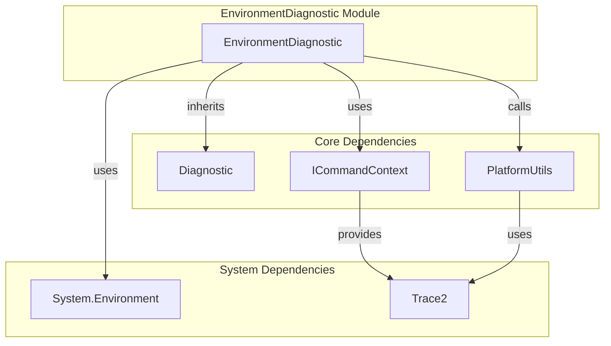
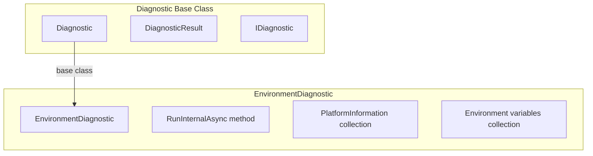
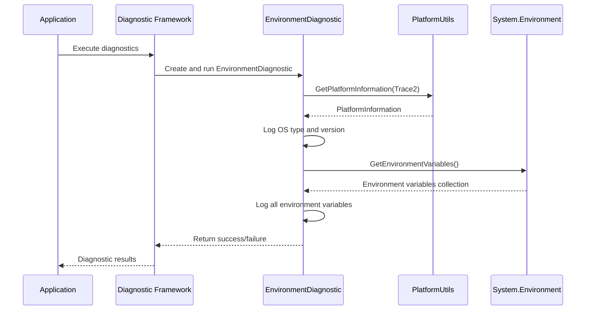
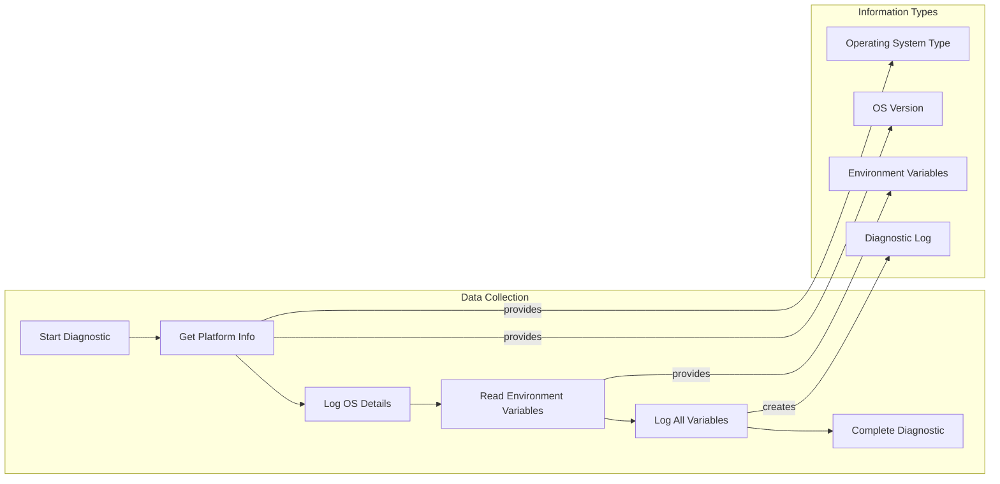

# EnvironmentDiagnostic Module Documentation

## Overview

The EnvironmentDiagnostic module is a diagnostic component within the Git Credential Manager's diagnostics framework. It provides system environment analysis capabilities, collecting and reporting platform information and environment variables to aid in troubleshooting and system configuration validation.

## Purpose

The EnvironmentDiagnostic module serves as a diagnostic tool that:
- Collects platform-specific operating system information
- Gathers and reports all environment variables
- Provides essential system context for debugging authentication and credential management issues
- Integrates with the broader diagnostic framework to support comprehensive system health checks

## Architecture

### Component Structure



### Inheritance Hierarchy



## Core Components

### EnvironmentDiagnostic Class

The `EnvironmentDiagnostic` class is the primary component that implements environment analysis functionality.

**Key Features:**
- Inherits from the `Diagnostic` base class
- Implements asynchronous diagnostic execution
- Collects platform information using `PlatformUtils`
- Retrieves and logs all system environment variables
- Returns diagnostic results through the standard diagnostic interface

**Constructor:**
```csharp
public EnvironmentDiagnostic(ICommandContext commandContext)
```

**Main Method:**
```csharp
protected override Task<bool> RunInternalAsync(StringBuilder log, IList<string> additionalFiles)
```

## Data Flow

### Diagnostic Execution Flow



### Information Collection Process



## Integration Points

### Framework Integration

The EnvironmentDiagnostic integrates with several core frameworks:

1. **Diagnostic Framework**: Inherits from `Diagnostic` base class and implements the standard diagnostic interface
2. **Command Context**: Uses `ICommandContext` for accessing system services and tracing
3. **Platform Utilities**: Leverages `PlatformUtils` for cross-platform information gathering
4. **Trace System**: Integrates with the Trace2 system for diagnostic logging

### Dependencies

**Core Dependencies:**
- `Diagnostic` - Base class providing diagnostic framework integration
- `ICommandContext` - Provides access to system services and tracing
- `PlatformUtils` - Cross-platform utility for gathering system information

**System Dependencies:**
- `System.Environment` - .NET Framework class for accessing environment variables
- `System.Text.StringBuilder` - For efficient log string building
- `System.Collections.Generic` - For collection management

## Usage Patterns

### Typical Usage

The EnvironmentDiagnostic is typically used as part of a comprehensive diagnostic suite:

```csharp
// Example usage pattern (not in actual code)
var diagnostic = new EnvironmentDiagnostic(commandContext);
var result = await diagnostic.RunAsync();
```

### Diagnostic Output

The diagnostic generates a log containing:
- Operating system type (Windows, macOS, Linux)
- Operating system version
- Complete list of environment variables (key=value pairs)

## Platform Considerations

### Cross-Platform Support

The EnvironmentDiagnostic leverages the `PlatformUtils` class to ensure consistent behavior across different operating systems:

- **Windows**: Uses Windows-specific platform detection
- **macOS**: Uses macOS-specific platform detection  
- **Linux**: Uses Linux-specific platform detection

### Environment Variable Handling

The diagnostic captures all environment variables available to the process, which may include:
- System-defined variables
- User-defined variables
- Process-specific variables
- Security-sensitive information (which should be handled carefully in diagnostic outputs)

## Security Considerations

### Data Sensitivity

The EnvironmentDiagnostic module handles potentially sensitive information:
- Environment variables may contain credentials, tokens, or other sensitive data
- Diagnostic logs should be handled securely and shared appropriately
- Consider implementing filtering mechanisms for sensitive environment variables

### Best Practices

- Review diagnostic logs before sharing
- Implement environment variable filtering if needed
- Ensure proper access controls on diagnostic output
- Consider the security implications of capturing full environment state

## Related Documentation

For more information about related components, see:

- [Diagnostic Framework](DiagnosticFramework.md) - Overview of the diagnostic system
- [PlatformUtils](PlatformUtils.md) - Cross-platform utility functions
- [CommandContext](CommandContext.md) - Command execution context
- [Trace2 System](Trace2.md) - Tracing and logging infrastructure

## Troubleshooting

### Common Issues

1. **Permission Errors**: The diagnostic may fail if it cannot access certain environment variables due to permission restrictions
2. **Large Environment**: Systems with many environment variables may generate large diagnostic logs
3. **Platform Detection**: Ensure `PlatformUtils` is properly configured for the target platform

### Diagnostic Failures

If the EnvironmentDiagnostic fails:
1. Check that `ICommandContext` is properly initialized
2. Verify that `PlatformUtils` is functioning correctly
3. Ensure the process has appropriate permissions to read environment variables
4. Check the Trace2 logs for detailed error information