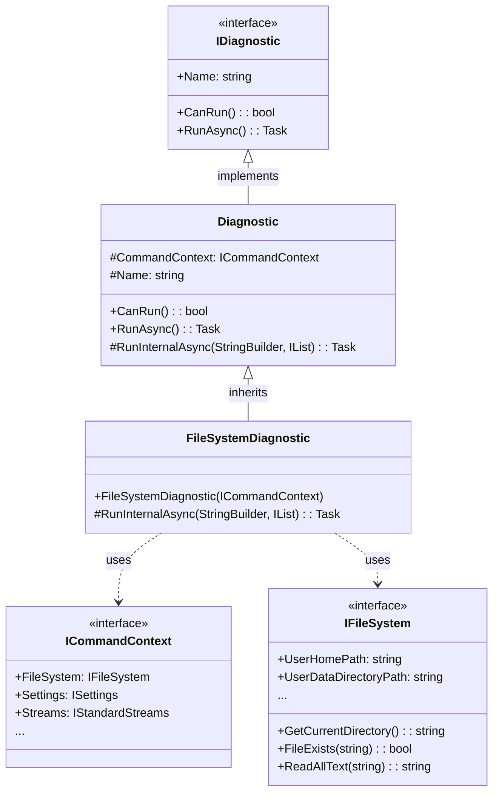
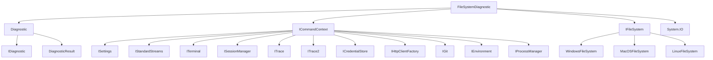
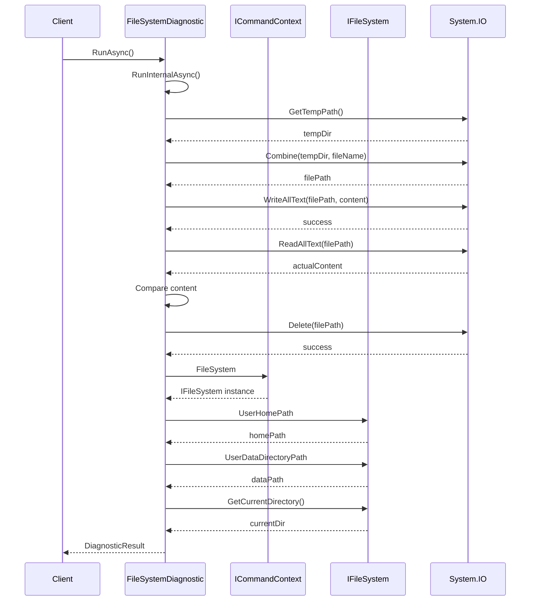

# FileSystemDiagnostic Module

## Introduction

The FileSystemDiagnostic module is a diagnostic component within the Git Credential Manager (GCM) system that validates the health and functionality of the file system operations. It ensures that basic file I/O operations work correctly and that the file system abstraction layer is properly configured, which is critical for credential storage and retrieval operations.

## Overview

FileSystemDiagnostic inherits from the base `Diagnostic` class and implements file system validation tests to ensure:
- Basic file read/write operations function correctly
- Temporary file creation and deletion work as expected
- The file system abstraction layer is properly configured
- Critical file system paths are accessible

## Architecture

### Component Structure



### Module Dependencies



## Core Components

### FileSystemDiagnostic Class

The `FileSystemDiagnostic` class is the main component that implements file system validation logic. It performs comprehensive tests to ensure the file system is functioning correctly.

**Key Features:**
- Validates basic file I/O operations (read/write/delete)
- Tests temporary file creation and cleanup
- Verifies file system abstraction layer configuration
- Reports critical file system paths and accessibility

**Constructor:**
```csharp
public FileSystemDiagnostic(ICommandContext commandContext)
```

**Main Method:**
```csharp
protected override Task<bool> RunInternalAsync(StringBuilder log, IList<string> additionalFiles)
```

## Diagnostic Process Flow



## Validation Tests

### 1. Temporary Directory Validation
- **Purpose**: Verify the system temporary directory is accessible
- **Test**: Retrieves and logs the temporary directory path
- **Failure Impact**: Indicates system-level file system issues

### 2. Basic File I/O Operations
- **Purpose**: Validate fundamental file operations work correctly
- **Tests**:
  - File creation with unique name
  - Content writing to file
  - Content reading from file
  - Data integrity verification
  - File deletion and cleanup
- **Failure Impact**: Prevents credential storage and retrieval operations

### 3. File System Abstraction Validation
- **Purpose**: Ensure the file system abstraction layer is properly configured
- **Tests**:
  - User home path accessibility
  - User data directory path accessibility
  - Current directory retrieval
- **Failure Impact**: Indicates configuration issues with platform-specific file system implementations

## Integration with Diagnostic Framework

The FileSystemDiagnostic integrates with the broader diagnostic framework through:

1. **Base Diagnostic Class**: Inherits common diagnostic functionality
2. **Command Context**: Accesses file system and other services
3. **Diagnostic Results**: Returns structured results with logs and status

```mermaid
graph LR
    subgraph "Diagnostic Framework"
        IDiagnostic
        Diagnostic
        DiagnosticResult
    end
    
    subgraph "FileSystemDiagnostic"
        FileSystemDiagnostic
        FileSystemTests
        PathValidation
    end
    
    subgraph "System Services"
        ICommandContext
        IFileSystem
        System.IO
    end
    
    IDiagnostic --> Diagnostic
    Diagnostic --> FileSystemDiagnostic
    FileSystemDiagnostic --> ICommandContext
    FileSystemDiagnostic --> System.IO
    ICommandContext --> IFileSystem
    FileSystemDiagnostic --> DiagnosticResult
```

## Platform Considerations

The FileSystemDiagnostic works across different platforms through the file system abstraction layer:

- **Windows**: Uses `WindowsFileSystem` implementation
- **macOS**: Uses `MacOSFileSystem` implementation  
- **Linux**: Uses `LinuxFileSystem` implementation

Each platform-specific implementation handles:
- Path conventions and separators
- File permissions and security
- Platform-specific file system features
- Credential storage locations

## Error Handling

The diagnostic implements comprehensive error handling:

1. **File Operation Failures**: Catches and logs file I/O exceptions
2. **Permission Issues**: Detects and reports permission-related problems
3. **Path Access Issues**: Identifies inaccessible directories
4. **Data Corruption**: Validates file content integrity

## Usage Scenarios

### Primary Use Cases
1. **System Health Checks**: Part of comprehensive system diagnostics
2. **Troubleshooting**: Identifies file system-related credential issues
3. **Installation Validation**: Ensures proper GCM installation
4. **Platform Compatibility**: Verifies cross-platform functionality

### Integration Points
- **DiagnoseCommand**: Invoked through the diagnostic command system
- **Automated Diagnostics**: Part of automated health checks
- **Manual Troubleshooting**: Used for manual diagnostic operations

## Related Documentation

- [Diagnostic Framework](DiagnosticFramework.md) - Overview of the diagnostic system
- [File System Abstraction](FileSystem.md) - File system interface and implementations
- [Command Context](CommandContext.md) - Command execution context
- [Cross-Platform Support](CrossPlatformSupport.md) - Platform-specific implementations

## Summary

The FileSystemDiagnostic module provides essential validation of file system operations within the Git Credential Manager. By testing basic I/O operations and validating the file system abstraction layer, it ensures that credential storage and retrieval operations can function correctly across all supported platforms. The module's integration with the diagnostic framework makes it a crucial component for system health monitoring and troubleshooting.