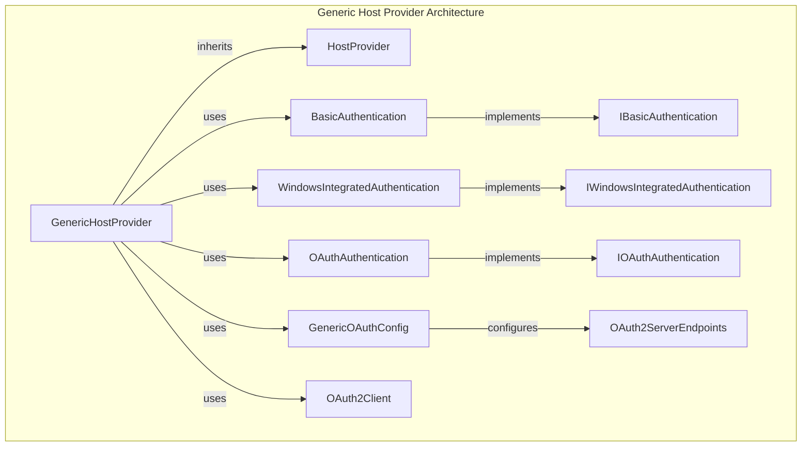
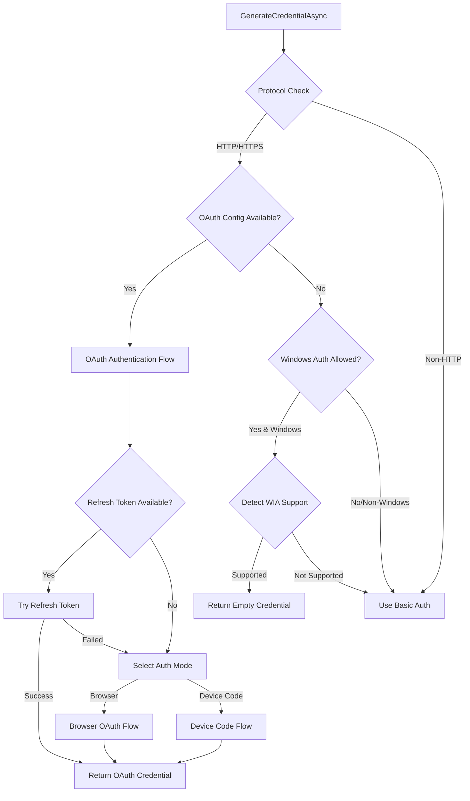
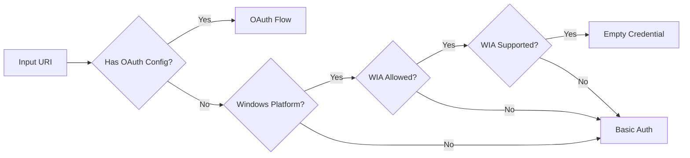
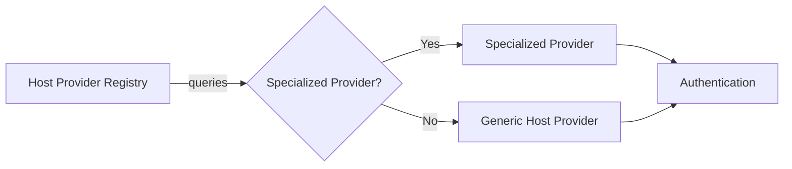

# Generic Host Provider Module

## Introduction

The Generic Host Provider is a versatile authentication module within the Git Credential Manager (GCM) that serves as the fallback provider for Git hosting services that don't have dedicated, specialized providers. It implements a comprehensive authentication strategy supporting multiple authentication methods including OAuth 2.0, Basic Authentication, and Windows Integrated Authentication, making it suitable for a wide range of Git hosting scenarios.

## Purpose and Core Functionality

The Generic Host Provider acts as the universal authentication handler in the GCM ecosystem, designed to:

- **Universal Support**: Handle authentication for any Git remote that uses standard protocols (HTTP, HTTPS, SMTP, IMAP, etc.)
- **Multi-Method Authentication**: Support OAuth 2.0, Basic Authentication, and Windows Integrated Authentication
- **Fallback Mechanism**: Serve as the default provider when no specialized provider is available
- **Protocol Agnostic**: Work with various Git hosting services regardless of their specific implementation

## Architecture Overview

### Component Structure



### Authentication Flow Architecture



## Core Components

### GenericHostProvider Class

The main provider implementation that orchestrates authentication across multiple methods:

```csharp
public class GenericHostProvider : HostProvider
{
    // Authentication components
    private readonly IBasicAuthentication _basicAuth;
    private readonly IWindowsIntegratedAuthentication _winAuth;
    private readonly IOAuthAuthentication _oauth;
    
    // Provider identification
    public override string Id => "generic";
    public override string Name => "Generic";
    
    // Supported authentication authorities
    public override IEnumerable<string> SupportedAuthorityIds =>
        EnumerableExtensions.ConcatMany(
            BasicAuthentication.AuthorityIds,
            WindowsIntegratedAuthentication.AuthorityIds
        );
}
```

### Key Features

#### 1. Universal Protocol Support
- Supports all Git protocols (HTTP, HTTPS, SMTP, IMAP, etc.)
- Protocol-agnostic authentication handling
- HTTP remote warning system for security awareness

#### 2. OAuth 2.0 Configuration
- Generic OAuth configuration support via `GenericOAuthConfig`
- Pre-configured support for Gitea hosting services
- Configurable endpoints, client credentials, and scopes
- Refresh token management with automatic renewal

#### 3. Multi-Modal Authentication
- **Browser-based OAuth**: Interactive web browser authentication
- **Device Code OAuth**: Device code flow for headless scenarios
- **Basic Authentication**: Username/password prompts
- **Windows Integrated Authentication**: Automatic Windows domain authentication

#### 4. Intelligent Authentication Selection
The provider uses a sophisticated decision tree to select the optimal authentication method:



## Authentication Methods

### OAuth 2.0 Authentication

The Generic Host Provider implements a complete OAuth 2.0 flow with the following features:

#### Configuration System
```csharp
public class GenericOAuthConfig
{
    public OAuth2ServerEndpoints Endpoints { get; set; }
    public string ClientId { get; set; }
    public string ClientSecret { get; set; }
    public Uri RedirectUri { get; set; }
    public string[] Scopes { get; set; }
    public bool UseAuthHeader { get; set; }
    public string DefaultUserName { get; set; }
}
```

#### OAuth Flow Process
1. **Refresh Token Check**: Attempts to use existing refresh tokens
2. **Authentication Mode Selection**: Browser vs Device Code based on environment
3. **Token Acquisition**: Interactive authentication via chosen method
4. **Token Storage**: Secure storage of access and refresh tokens

#### Refresh Token Management
- Unique service naming to avoid conflicts (`refresh_token.{host}`)
- Automatic refresh token rotation
- Fallback to interactive flow on refresh failure

### Windows Integrated Authentication

Automatic detection and utilization of Windows domain authentication:

#### Detection Process
```csharp
private async Task<bool> GetIsSupportedAsync(Uri uri)
{
    // HTTP HEAD request to check WWW-Authenticate headers
    // Looks for "Negotiate" or "NTLM" authentication schemes
}
```

#### Implementation Details
- Platform-specific (Windows only)
- Configurable via `GCM_ALLOW_WINDOWSAUTH` setting
- Legacy authority compatibility (`basic` authority disables WIA)
- Returns empty credentials to signal Git to use WIA

### Basic Authentication

Traditional username/password authentication with multiple UI modes:

#### UI Modes
- **GUI Mode**: Avalonia-based credential dialog
- **Terminal Mode**: Command-line prompts
- **Helper Mode**: External helper application integration

#### Security Features
- Password masking in terminal mode
- Secure credential storage integration
- User interaction validation

## Integration Points

### Host Provider Registry Integration

The Generic Host Provider integrates with the [Host Provider Registry](Host%20Provider%20Registry.md) as the fallback provider:



### Credential Store Integration

Seamless integration with the [Credential Management](Credential%20Management.md) system:
- Service-based credential storage
- Refresh token isolation
- Cross-platform credential persistence

### Settings and Configuration

Leverages the [Configuration and Settings](Core%20Application%20Framework.md#configuration-and-settings) framework:
- Environment variable configuration
- Git configuration integration
- OAuth endpoint customization

## Configuration Options

### Environment Variables

| Variable | Description | Example |
|----------|-------------|---------|
| `GCM_OAUTH_AUTHZ_ENDPOINT` | OAuth authorization endpoint | `https://git.example.com/oauth/authorize` |
| `GCM_OAUTH_TOKEN_ENDPOINT` | OAuth token endpoint | `https://git.example.com/oauth/token` |
| `GCM_OAUTH_DEVICE_ENDPOINT` | OAuth device authorization endpoint | `https://git.example.com/oauth/device` |
| `GCM_OAUTH_CLIENT_ID` | OAuth client ID | `your-client-id` |
| `GCM_OAUTH_CLIENT_SECRET` | OAuth client secret | `your-client-secret` |
| `GCM_OAUTH_REDIRECT_URI` | OAuth redirect URI | `http://127.0.0.1` |
| `GCM_OAUTH_SCOPES` | OAuth scopes (space-separated) | `read write admin` |
| `GCM_OAUTH_USEHTTPPATH` | Use HTTP path in OAuth requests | `true` |
| `GCM_OAUTH_DEFAULT_USERNAME` | Default OAuth username | `oauth-user` |
| `GCM_ALLOW_WINDOWSAUTH` | Enable Windows Integrated Authentication | `true` |
| `GCM_ALLOW_UNSAFE` | Allow HTTP remotes without warning | `true` |

### Git Configuration

```ini
[credential]
    oauthAuthzEndpoint = https://git.example.com/oauth/authorize
    oauthTokenEndpoint = https://git.example.com/oauth/token
    oauthDeviceEndpoint = https://git.example.com/oauth/device
    oauthClientId = your-client-id
    oauthClientSecret = your-client-secret
    oauthRedirectUri = http://127.0.0.1
    oauthScopes = read write admin
    oauthUseHttpPath = true
    oauthDefaultUserName = oauth-user
```

## Security Considerations

### HTTP Warning System
The provider implements a warning system for HTTP remotes to promote secure practices:
```csharp
if (!Context.Settings.AllowUnsafeRemotes &&
    StringComparer.OrdinalIgnoreCase.Equals(input.Protocol, "http"))
{
    Context.Streams.Error.WriteLine(
        "warning: use of unencrypted HTTP remote URLs is not recommended; " +
        $"see {Constants.HelpUrls.GcmUnsafeRemotes} for more information.");
}
```

### OAuth Security Features
- **PKCE Support**: Proof Key for Code Exchange for OAuth flows
- **State Parameter**: CSRF protection in OAuth flows
- **Secure Token Storage**: Encrypted credential storage
- **Token Refresh**: Automatic token rotation

### Windows Integrated Authentication Security
- Automatic domain authentication
- No credential storage required
- Kerberos/NTLM protocol support

## Error Handling and Diagnostics

### OAuth Error Handling
Comprehensive error handling for OAuth flows:
- Refresh token expiration
- Authorization server errors
- Network connectivity issues
- User cancellation

### Diagnostic Integration
Integration with the [Tracing and Diagnostics](Core%20Application%20Framework.md#tracing-and-diagnostics) system:
- Detailed OAuth flow tracing
- Authentication method selection logging
- Error condition reporting

## Usage Examples

### Basic Usage
```bash
# Configure Git to use GCM
git config --global credential.helper manager

# Clone from generic Git server
git clone https://git.example.com/repo.git
```

### OAuth Configuration
```bash
# Set OAuth endpoints
export GCM_OAUTH_AUTHZ_ENDPOINT="https://git.example.com/oauth/authorize"
export GCM_OAUTH_TOKEN_ENDPOINT="https://git.example.com/oauth/token"
export GCM_OAUTH_CLIENT_ID="your-client-id"
export GCM_OAUTH_CLIENT_SECRET="your-client-secret"

# Clone with OAuth
git clone https://git.example.com/repo.git
```

### Windows Integrated Authentication
```bash
# Enable Windows Integrated Authentication
export GCM_ALLOW_WINDOWSAUTH=true

# Clone from Windows domain server
git clone https://git.company.com/repo.git
```

## Platform Support

### Cross-Platform Compatibility
- **Windows**: Full feature support including WIA
- **macOS**: OAuth and Basic Authentication
- **Linux**: OAuth and Basic Authentication

### UI Framework Integration
- Avalonia-based GUI components
- Terminal-based prompts
- Helper application support

## Dependencies

### Core Dependencies
- [Core Application Framework](Core%20Application%20Framework.md)
- [Authentication System](Authentication%20System.md)
- [Credential Management](Credential%20Management.md)
- [Host Provider Framework](Host%20Provider%20Framework.md)

### External Dependencies
- System.Net.Http for HTTP operations
- OAuth2Client for OAuth flows
- Platform-specific authentication APIs

## Extensibility

The Generic Host Provider is designed for extensibility:
- **Custom OAuth Configurations**: Support for any OAuth 2.0 compliant server
- **Authentication Method Plugins**: Extensible authentication method system
- **UI Customization**: Configurable prompt mechanisms
- **Platform Integration**: Native platform authentication integration

## Performance Considerations

### Caching Strategy
- OAuth refresh token caching
- Windows Integrated Authentication detection caching
- Credential store optimization

### Network Efficiency
- HTTP HEAD requests for WIA detection
- OAuth token refresh optimization
- Minimal network round trips

## Troubleshooting

### Common Issues

1. **OAuth Configuration Errors**
   - Verify endpoint URLs are correct
   - Check client ID and secret validity
   - Ensure redirect URI matches server configuration

2. **Windows Integrated Authentication Failures**
   - Verify domain connectivity
   - Check WIA support on target server
   - Ensure proper Kerberos/NTLM configuration

3. **Basic Authentication Issues**
   - Verify credential correctness
   - Check for special characters in credentials
   - Ensure proper URL encoding

### Diagnostic Commands
```bash
# Enable debug tracing
export GCM_TRACE=1
export GCM_TRACE2=1

# Test authentication
git credential fill
protocol=https
host=git.example.com

# Check provider selection
git credential-manager diagnose
```

## Future Enhancements

### Planned Features
- **OIDC Support**: OpenID Connect integration
- **SAML Support**: Security Assertion Markup Language
- **Multi-Factor Authentication**: Enhanced security options
- **Smart Card Authentication**: Hardware token support

### API Evolution
- Enhanced OAuth 2.1 support
- PKCE enforcement
- Token introspection
- Dynamic client registration

The Generic Host Provider represents a comprehensive authentication solution that balances flexibility, security, and ease of use, making it an essential component of the Git Credential Manager ecosystem for supporting diverse Git hosting environments.