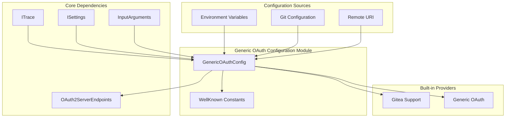
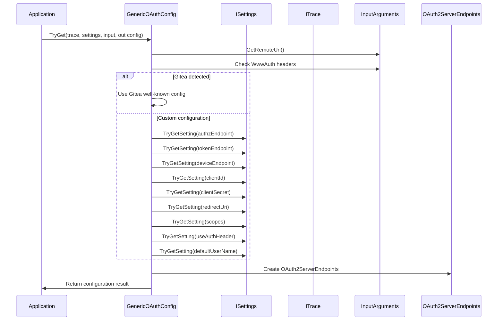
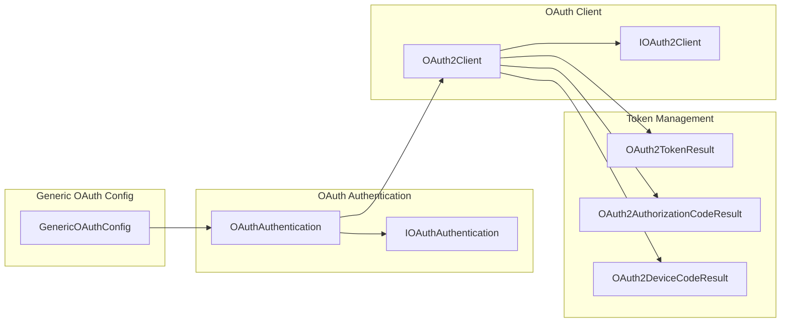

# Generic OAuth Configuration Module

## Introduction

The Generic OAuth Configuration module provides a flexible and extensible way to configure OAuth 2.0 authentication for various Git hosting providers. It serves as a centralized configuration system that can adapt to different OAuth implementations, including built-in support for Gitea and custom OAuth configurations through environment variables and Git configuration settings.

This module is part of the Host Provider Framework and acts as a bridge between the core authentication system and provider-specific OAuth implementations, enabling seamless integration with any OAuth-compliant service.

## Architecture

### Component Overview



### Configuration Flow



## Core Components

### GenericOAuthConfig Class

The `GenericOAuthConfig` class is the main configuration container that holds all OAuth 2.0 parameters needed for authentication flows.

#### Key Properties

- **Endpoints**: OAuth2ServerEndpoints containing authorization, token, and device authorization endpoints
- **ClientId**: OAuth client identifier
- **ClientSecret**: OAuth client secret (optional for some flows)
- **RedirectUri**: URI for OAuth callback (defaults to http://127.0.0.1)
- **Scopes**: Array of requested OAuth scopes
- **UseAuthHeader**: Whether to use HTTP Authorization header (defaults to true)
- **DefaultUserName**: Default username for OAuth authentication (defaults to "OAUTH_USER")
- **SupportsDeviceCode**: Computed property indicating device code flow support

#### Configuration Method

```csharp
public static bool TryGet(ITrace trace, ISettings settings, InputArguments input, out GenericOAuthConfig config)
```

This static method attempts to create a valid OAuth configuration by:

1. **Provider Detection**: Checks for known providers (Gitea) via WWW-Authenticate headers
2. **Endpoint Configuration**: Retrieves OAuth endpoints from settings
3. **Client Configuration**: Sets up client ID, secret, and redirect URI
4. **Flow Configuration**: Configures scopes and authentication methods
5. **Validation**: Ensures required endpoints are present and valid

### Built-in Provider Support

#### Gitea Integration

The module includes built-in support for Gitea instances, automatically detecting them via WWW-Authenticate headers and using pre-configured OAuth settings:

- **Client ID**: `e90ee53c-94e2-48ac-9358-a874fb9e0662` (well-known Gitea client)
- **Authorization Endpoint**: `/login/oauth/authorize`
- **Token Endpoint**: `/login/oauth/access_token`
- **Redirect URI**: `http://127.0.0.1`

### Configuration Sources

The module supports configuration through multiple sources, with the following precedence:

1. **Environment Variables** (highest priority)
2. **Git Configuration** (repository and global)
3. **Built-in Defaults** (lowest priority)

#### Supported Configuration Keys

| Environment Variable | Git Configuration Key | Description |
|---------------------|----------------------|-------------|
| `GCM_OAUTH_AUTHORIZE_ENDPOINT` | `oauthAuthzEndpoint` | OAuth authorization endpoint URL |
| `GCM_OAUTH_TOKEN_ENDPOINT` | `oauthTokenEndpoint` | OAuth token endpoint URL |
| `GCM_OAUTH_DEVICE_ENDPOINT` | `oauthDeviceEndpoint` | OAuth device authorization endpoint URL |
| `GCM_OAUTH_CLIENT_ID` | `oauthClientId` | OAuth client identifier |
| `GCM_OAUTH_CLIENT_SECRET` | `oauthClientSecret` | OAuth client secret |
| `GCM_OAUTH_REDIRECT_URI` | `oauthRedirectUri` | OAuth redirect/callback URI |
| `GCM_OAUTH_SCOPES` | `oauthScopes` | Space-separated OAuth scopes |
| `GCM_OAUTH_CLIENT_AUTH_HEADER` | `oauthClientAuthHeader` | Use HTTP Authorization header |
| `GCM_OAUTH_DEFAULT_USERNAME` | `oauthDefaultUserName` | Default username for OAuth |

## Integration with Authentication System

### OAuth Authentication Flow



### Host Provider Integration

The Generic OAuth Configuration module integrates with the Host Provider Framework through the [Generic Host Provider](Generic%20Host%20Provider.md), enabling OAuth authentication for any Git hosting service that supports OAuth 2.0.

## Usage Examples

### Basic Configuration

```ini
# Git configuration
[credential]
    oauthAuthzEndpoint = /oauth/authorize
    oauthTokenEndpoint = /oauth/token
    oauthClientId = your-client-id
    oauthScopes = repo read:user
```

### Environment Variable Configuration

```bash
export GCM_OAUTH_AUTHORIZE_ENDPOINT="https://git.example.com/oauth/authorize"
export GCM_OAUTH_TOKEN_ENDPOINT="https://git.example.com/oauth/token"
export GCM_OAUTH_CLIENT_ID="your-client-id"
export GCM_OAUTH_CLIENT_SECRET="your-client-secret"
export GCM_OAUTH_SCOPES="repo read:user write:repo"
```

### Gitea Auto-Detection

No configuration needed - the module automatically detects Gitea instances and uses appropriate OAuth settings.

## Error Handling

The module implements comprehensive validation and error handling:

- **Missing Endpoints**: Returns false if authorization or token endpoints are missing
- **Invalid URIs**: Validates all endpoint URIs and logs warnings for invalid values
- **Configuration Conflicts**: Respects precedence order between configuration sources
- **Trace Logging**: Provides detailed trace information for debugging configuration issues

## Dependencies

### Core Dependencies

- **[ITrace](Core%20Application%20Framework.md#tracing-and-diagnostics)**: For diagnostic logging
- **[ISettings](Core%20Application%20Framework.md#configuration-and-settings)**: For configuration retrieval
- **[InputArguments](Core%20Application%20Framework.md#application-management)**: For remote URI and authentication context
- **[OAuth2ServerEndpoints](Authentication%20System.md#oauth-authentication)**: For OAuth endpoint management

### Related Modules

- **[Authentication System](Authentication%20System.md)**: Core OAuth authentication implementation
- **[Generic Host Provider](Generic%20Host%20Provider.md)**: Integration with host provider framework
- **[Host Provider Registry](Host%20Provider%20Framework.md#host-provider-registry)**: Provider registration and discovery

## Security Considerations

### Best Practices

1. **Client Secret Protection**: Store client secrets securely using appropriate credential stores
2. **Redirect URI Validation**: Ensure redirect URIs are properly configured and validated
3. **Scope Minimization**: Request only necessary OAuth scopes
4. **HTTPS Enforcement**: Use HTTPS endpoints for production deployments

### Default Security Settings

- Authorization header usage is enabled by default
- Local redirect URI defaults to `http://127.0.0.1` for loopback-only access
- Empty scope array when no scopes are specified

## Extensibility

The module is designed for extensibility:

- **Custom Providers**: Support for any OAuth 2.0 compliant service
- **Configuration Flexibility**: Multiple configuration sources with clear precedence
- **Provider Detection**: Extensible pattern for adding new built-in providers
- **Flow Support**: Supports both authorization code and device code flows

## Platform Compatibility

The Generic OAuth Configuration module is platform-agnostic and works across:

- **Windows**: Full functionality with system browser integration
- **macOS**: Native browser and keychain integration
- **Linux**: Browser and secret service integration

Platform-specific OAuth implementations are handled by the underlying [Authentication System](Authentication%20System.md) and [Cross-Platform Support](Core%20Application%20Framework.md#cross-platform-support) modules.