# Git Integration Module

## Overview

The Git Integration module serves as the core interface between Git Credential Manager and Git itself. It provides essential functionality for interacting with Git repositories, managing Git configuration, and handling Git-specific operations required for credential management workflows.

## Purpose

This module acts as the bridge between Git operations and credential management, enabling:
- Git repository detection and interaction
- Git configuration management and parsing
- Git remote enumeration and analysis
- Git process execution and communication
- Git version compatibility handling
- GPG operations for encrypted credential storage

## Architecture

```mermaid
graph TB
    subgraph "Git Integration Module"
        IGit[IGit Interface]
        GitProcess[GitProcess Implementation]
        GitRemote[GitRemote Model]
        IGitConfig[IGitConfiguration Interface]
        GitProcessConfig[GitProcessConfiguration]
        GitConfigEntry[GitConfigurationEntry]
        GitConfigKeyComparer[GitConfigurationKeyComparer]
        GitVersion[GitVersion]
        GitStreamReader[GitStreamReader]
        IGpg[IGpg Interface]
        Gpg[Gpg Implementation]
        GitCommands[Git Commands]
    end

    subgraph "Core Framework Dependencies"
        ITrace[ITrace]
        ITrace2[ITrace2]
        IProcessManager[IProcessManager]
        ChildProcess[ChildProcess]
        ISessionManager[ISessionManager]
    end

    subgraph "Command Integration"
        GetCommand[GetCommand]
        StoreCommand[StoreCommand]
        EraseCommand[EraseCommand]
        ConfigureCommand[ConfigureCommand]
        UnconfigureCommand[UnconfigureCommand]
        DiagnoseCommand[DiagnoseCommand]
    end

    IGit --> GitProcess
    IGitConfig --> GitProcessConfig
    IGpg --> Gpg
    
    GitProcess --> ITrace
    GitProcess --> ITrace2
    GitProcess --> IProcessManager
    GitProcess --> ChildProcess
    
    GitProcessConfig --> ITrace
    GitProcessConfig --> GitProcess
    
    Gpg --> ISessionManager
    Gpg --> IProcessManager
    Gpg --> ITrace2
    
    GitCommands --> GetCommand
    GitCommands --> StoreCommand
    GitCommands --> EraseCommand
    GitCommands --> ConfigureCommand
    GitCommands --> UnconfigureCommand
    GitCommands --> DiagnoseCommand
```



## Core Components

### Git Process Management
- **[GitProcess](GitProcess.md)**: Main implementation of IGit interface for executing Git commands
- **[IGit](GitProcess.md)**: Interface defining Git operations and repository interaction
- **[GitRemote](GitProcess.md)**: Model representing Git remote configurations
- **[GitVersion](GitVersion.md)**: Version handling and compatibility management

### Git Configuration Management
- **[IGitConfiguration](GitConfiguration.md)**: Interface for Git configuration operations
- **[GitProcessConfiguration](GitConfiguration.md)**: Implementation using Git process execution
- **[GitConfigurationEntry](GitConfigurationEntry.md)**: Model for configuration key-value pairs
- **[GitConfigurationKeyComparer](GitConfigurationKeyComparer.md)**: Specialized string comparer for Git config keys

### Stream and I/O Handling
- **[GitStreamReader](GitStreamReader.md)**: Custom StreamReader for Git-compatible line reading

### GPG Integration
- **[IGpg](Gpg.md)**: Interface for GPG encryption/decryption operations
- **[Gpg](Gpg.md)**: GPG implementation for credential encryption

### Git Commands
- **[GetCommand](GitCommands.md)**: Retrieves credentials from host providers
- **[StoreCommand](GitCommands.md)**: Stores credentials in secure storage
- **[EraseCommand](GitCommands.md)**: Removes credentials from storage
- **[ConfigureCommand](GitCommands.md)**: Configures Git settings
- **[UnconfigureCommand](GitCommands.md)**: Removes Git configuration
- **[DiagnoseCommand](GitCommands.md)**: Runs diagnostic tests

## Key Features

### Repository Detection
The module provides automatic Git repository detection, allowing credential operations to be scoped to the correct repository context. This includes determining repository paths and validating Git installation.

### Configuration Management
Comprehensive Git configuration management supporting:
- Multiple configuration levels (system, global, local)
- Type-safe configuration values (raw, boolean, path)
- Multi-valued configuration entries
- Regular expression-based configuration queries

### Remote Analysis
Automatic enumeration and parsing of Git remotes, providing essential information for credential provider selection and authentication workflows.

### Version Compatibility
Intelligent Git version detection and compatibility handling, ensuring operations work correctly across different Git versions with appropriate feature support.

### Process Communication
Robust Git process execution with proper stream handling, error management, and support for Git's helper protocol for credential operations.

## Integration Points

### Host Provider Integration
The Git Integration module works closely with [Host Provider Framework](Host%20Provider%20Framework.md) to:
- Provide repository context for credential operations
- Execute Git commands for authentication workflows
- Manage Git configuration for credential storage

### Credential Management Integration
Integration with [Credential Management](Credential%20Management.md) enables:
- Secure credential storage and retrieval
- GPG-based credential encryption
- Git credential helper protocol implementation

### Cross-Platform Support
Leverages [Cross-Platform Support](Cross-Platform%20Support.md) for:
- Platform-specific Git executable location
- Environment variable management
- Process execution across different operating systems

## Usage Patterns

### Basic Git Operations
```csharp
// Create Git instance
IGit git = new GitProcess(trace, trace2, processManager, gitPath);

// Check if inside repository
if (git.IsInsideRepository())
{
    // Get repository path
    string repoPath = git.GetCurrentRepository();
    
    // Enumerate remotes
    foreach (var remote in git.GetRemotes())
    {
        Console.WriteLine($"Remote: {remote.Name} - {remote.FetchUrl}");
    }
}
```

### Configuration Management
```csharp
// Get configuration
IGitConfiguration config = git.GetConfiguration();

// Read configuration values
if (config.TryGet(GitConfigurationLevel.Global, GitConfigurationType.Raw, "user.name", out string userName))
{
    Console.WriteLine($"Git user: {userName}");
}

// Set configuration
config.Set(GitConfigurationLevel.Global, "user.email", "user@example.com");
```

### GPG Operations
```csharp
// Decrypt credential file
IGpg gpg = new Gpg(gpgPath, sessionManager, processManager, trace2);
string decrypted = gpg.DecryptFile(encryptedFilePath);

// Encrypt sensitive data
gpg.EncryptFile(outputPath, recipientId, sensitiveData);
```

## Error Handling

The module implements comprehensive error handling for Git operations:
- **GitException**: Custom exception for Git-specific errors
- **Process exit code handling**: Proper interpretation of Git exit codes
- **Stream error management**: Robust handling of I/O errors
- **Configuration validation**: Validation of Git configuration operations

## Performance Considerations

- **Process caching**: Git version information is cached to avoid repeated process execution
- **Stream optimization**: Efficient stream reading with proper buffering
- **Configuration enumeration**: Optimized configuration parsing with minimal process calls
- **Lazy initialization**: Components are initialized only when needed

## Security Features

- **Secure process execution**: Proper argument escaping and environment management
- **GPG integration**: Support for encrypted credential storage
- **Path validation**: Secure handling of file paths and Git executables
- **Environment isolation**: Proper environment variable management for Git processes

## Dependencies

- **Core Application Framework**: For tracing, process management, and basic services
- **Cross-Platform Support**: For platform-specific Git executable management
- **Authentication System**: For credential-related Git operations
- **Host Provider Framework**: For repository-aware credential operations