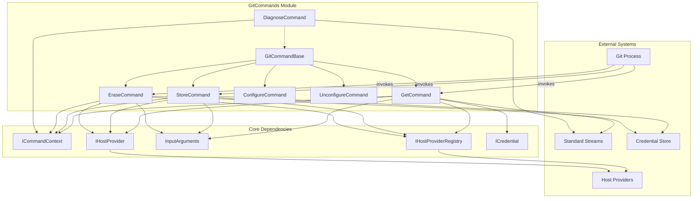
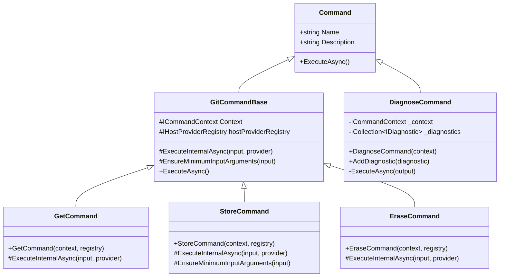
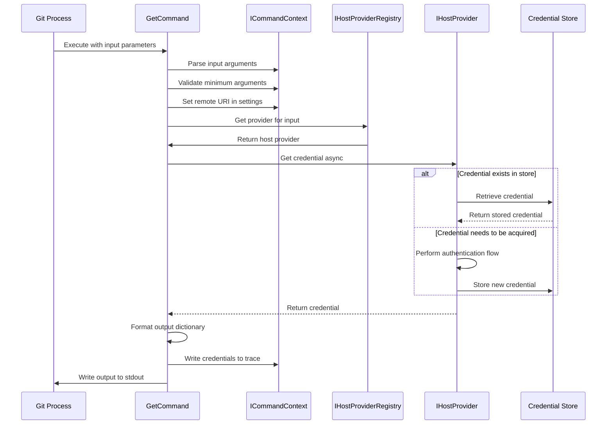
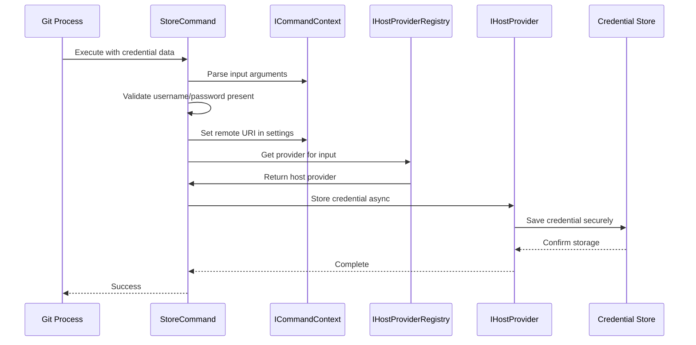
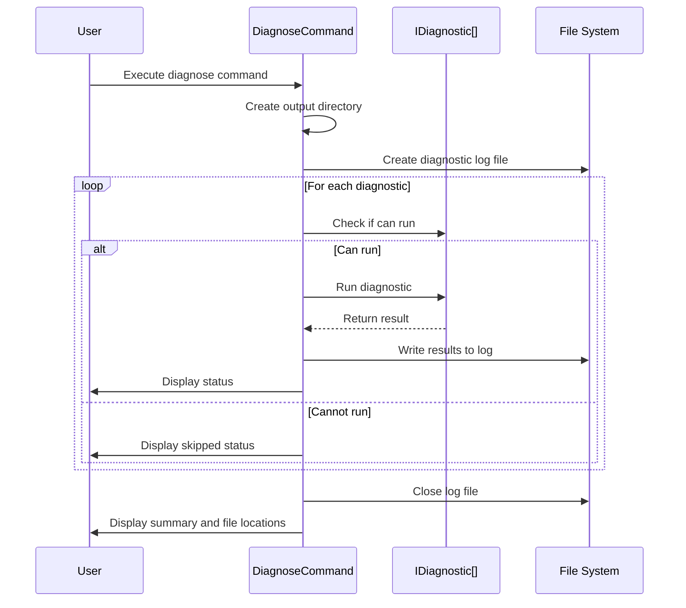

# GitCommands Module Documentation

## Overview

The GitCommands module is the core command processing layer of the Git Credential Manager (GCM). It implements the Git credential protocol by providing a set of commands that Git invokes to manage authentication credentials. This module serves as the primary interface between Git and the credential management system, handling credential acquisition, storage, retrieval, and deletion operations.

## Purpose and Core Functionality

The GitCommands module implements the standard Git credential helper protocol, which consists of four primary operations:

- **get**: Retrieve stored credentials or acquire new ones
- **store**: Save credentials to the secure credential store
- **erase**: Remove credentials from the secure credential store
- **configure/unconfigure**: Set up or remove Git configuration for credential management
- **diagnose**: Run diagnostic tests to troubleshoot credential management issues

These commands are invoked by Git automatically during authentication flows, making this module critical for seamless Git operations with remote repositories.

## Architecture

### Component Structure



### Command Hierarchy



## Data Flow

### Credential Acquisition Flow (GetCommand)



### Credential Storage Flow (StoreCommand)



### Diagnostic Flow (DiagnoseCommand)



## Component Details

### GitCommandBase
The abstract base class for all Git credential commands. Provides common functionality including:
- Input argument parsing and validation
- Host provider resolution
- Command context management
- Standard Git credential protocol handling

### GetCommand
Implements the `get` operation to retrieve or acquire credentials:
- Requests credentials from the appropriate host provider
- Formats output according to Git credential protocol
- Handles both stored and newly acquired credentials
- Provides secure tracing with password redaction

### StoreCommand
Implements the `store` operation to save credentials:
- Validates required input arguments (username/password)
- Delegates to host provider for secure storage
- Ensures credentials are stored in platform-specific secure stores

### EraseCommand
Implements the `erase` operation to remove credentials:
- Delegates to host provider for credential removal
- Ensures complete cleanup from secure stores
- Handles missing credentials gracefully

### DiagnoseCommand
Provides comprehensive diagnostic capabilities:
- Runs multiple diagnostic tests in sequence
- Generates detailed log files for troubleshooting
- Tests environment, file system, networking, Git, and credential store
- Provides colored console output for easy status identification
- Creates timestamped diagnostic reports

## Integration with Other Modules

### Dependency on Core Framework
The GitCommands module heavily relies on the [Core Application Framework](CoreApplicationFramework.md) for:
- **Command Context**: Provides execution context, settings, and I/O streams
- **Host Provider Registry**: Resolves appropriate providers for different Git hosts
- **Input Arguments**: Parses and validates Git credential protocol input
- **Tracing**: Provides diagnostic and debugging capabilities

### Integration with Host Providers
Commands interact with various host providers through the [Host Provider Framework](HostProviderFramework.md):
- **GitHub Provider**: Handles GitHub-specific authentication flows
- **GitLab Provider**: Manages GitLab authentication and API interactions
- **Bitbucket Provider**: Supports both cloud and data center Bitbucket instances
- **Azure Repos Provider**: Integrates with Azure DevOps Services

### Credential Management Integration
Works closely with the [Credential Management](CredentialManagement.md) module for:
- Secure credential storage and retrieval
- Platform-specific credential store integration
- Session management and credential lifecycle

## Security Considerations

### Input Validation
- All input arguments are validated for minimum required fields
- Protocol and host fields are checked for null/empty values
- Username and password validation ensures data integrity

### Secure Output Handling
- Passwords are redacted in trace logs
- Sensitive data is never logged in plain text
- Output is formatted according to Git credential protocol standards

### Credential Storage
- Credentials are always stored in platform-secure stores (Windows Credential Manager, macOS Keychain, Linux Secret Service)
- Never stored in plain text or insecure locations
- Proper cleanup on credential erasure

## Error Handling

### Exception Management
- Uses `Trace2InvalidOperationException` for input validation errors
- Provides detailed error messages for debugging
- Maintains command execution flow integrity

### Diagnostic Support
- Comprehensive diagnostic logging for troubleshooting
- Separate diagnostic command for system health checks
- Detailed exception information in diagnostic reports

## Usage Examples

### Git Configuration
```bash
# Configure Git to use GCM
git config --global credential.helper manager

# Set up diagnostic logging
git config --global credential.writelog true
```

### Manual Command Execution
```bash
# Test credential retrieval
echo -e "protocol=https\nhost=github.com" | git-credential-manager get

# Store credentials manually
echo -e "protocol=https\nhost=github.com\nusername=user\npassword=pass" | git-credential-manager store

# Run diagnostics
git-credential-manager diagnose --output ./diagnostic-logs
```

## Platform Considerations

### Cross-Platform Support
The GitCommands module works across all supported platforms through the [Cross-Platform Support](CrossPlatformSupport.md) module:
- **Windows**: Integrates with Windows Credential Manager and system prompts
- **macOS**: Uses macOS Keychain for secure storage
- **Linux**: Supports Secret Service API and GPG-based storage

### Terminal Integration
Provides appropriate terminal interaction through the [I/O and Communication](CoreApplicationFramework.md#io-and-communication) components, ensuring proper user prompts and feedback across different terminal environments.

## Performance Considerations

### Asynchronous Operations
All command operations are implemented asynchronously to prevent blocking Git operations and maintain responsive user experiences.

### Provider Caching
The host provider registry caches provider instances to minimize resolution overhead during repeated credential operations.

### Efficient I/O
Stream-based I/O operations minimize memory usage and handle large credential sets efficiently.

## Future Enhancements

### Potential Improvements
- Enhanced diagnostic capabilities with network connectivity testing
- Performance metrics collection for credential operations
- Extended configuration options for advanced scenarios
- Integration with cloud-based identity providers

### Extensibility Points
- Custom diagnostic providers can be added to the diagnose command
- New credential commands can be implemented by extending GitCommandBase
- Additional host providers can be integrated through the registry system