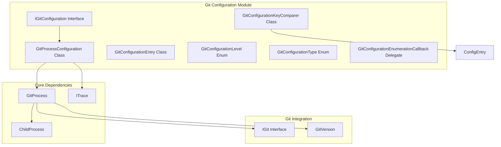

# Git Configuration Module Documentation

## Introduction

The Git Configuration module provides comprehensive management of Git configuration settings through a managed interface. It abstracts the complexity of Git's configuration system while providing type-safe access to configuration values across different configuration levels.

## Architecture Overview

The Git Configuration module implements a layered architecture that provides both high-level and low-level access to Git configuration operations.



## Core Components

### IGitConfiguration Interface
The primary interface that defines the contract for Git configuration operations. It provides methods for reading, writing, and enumerating configuration values across different configuration levels.

### GitProcessConfiguration Class
The main implementation of IGitConfiguration that uses Git process execution to perform configuration operations. It handles the complexity of Git command-line arguments and output parsing.

### GitConfigurationEntry Class
A simple data model representing a single Git configuration entry with key-value pairs.

### GitConfigurationKeyComparer Class
A specialized string comparer that understands Git configuration key syntax, including section, scope, and property components with appropriate case sensitivity rules.

## Key Features

### Multi-Level Configuration Support
The module supports all Git configuration levels:
- **System**: System-wide configuration affecting all users
- **Global**: User-specific configuration
- **Local**: Repository-specific configuration
- **All**: Search across all levels

### Type-Safe Configuration Access
Support for different Git configuration types:
- **Raw**: String values as stored
- **Bool**: Boolean values with Git's canonicalization
- **Path**: File path values with proper expansion

### Advanced Configuration Operations
- **Enumeration**: Iterate through all configuration entries
- **Multi-valued entries**: Support for configuration variables with multiple values
- **Regular expression matching**: Query configuration using regex patterns
- **Atomic operations**: Safe configuration modification with proper error handling

## Configuration Key Format

Git configuration keys follow the format: `section[.scope].property`

- **Section**: The configuration section (e.g., "user", "core", "credential")
- **Scope**: Optional scope for configuration (case-sensitive)
- **Property**: The specific property name (case-insensitive)

Examples:
- `user.name` - User's name
- `user.email` - User's email
- `credential.https://example.com.provider` - Credential provider for specific host
- `core.autocrlf` - Auto CRLF conversion setting

## Usage Patterns

### Basic Configuration Access
```csharp
// Get configuration from Git instance
IGitConfiguration config = git.GetConfiguration();

// Read simple configuration values
if (config.TryGet(GitConfigurationLevel.Global, GitConfigurationType.Raw, "user.name", out string userName))
{
    Console.WriteLine($"Git user: {userName}");
}

// Read boolean configuration
if (config.TryGet(GitConfigurationLevel.Local, GitConfigurationType.Bool, "core.autocrlf", out string autoCrlf))
{
    Console.WriteLine($"Auto CRLF: {autoCrlf}");
}
```

### Configuration Enumeration
```csharp
// Enumerate all configuration entries
config.Enumerate(GitConfigurationLevel.Global, entry =>
{
    Console.WriteLine($"{entry.Key} = {entry.Value}");
    return true; // Continue enumeration
});

// Enumerate specific section
config.Enumerate(GitConfigurationLevel.Global, "user", null, entry =>
{
    Console.WriteLine($"User config: {entry.Key} = {entry.Value}");
    return true;
});
```

### Multi-valued Configuration
```csharp
// Get all values for multi-valued entry
IEnumerable<string> values = config.GetAll(GitConfigurationLevel.Local, GitConfigurationType.Raw, "remote.origin.fetch");
foreach (string value in values)
{
    Console.WriteLine($"Fetch refspec: {value}");
}

// Set multi-valued entry with regex matching
config.ReplaceAll(GitConfigurationLevel.Local, "remote\\..*\\.url", "old-url", "new-url");
```

### Configuration Modification
```csharp
// Set configuration value
config.Set(GitConfigurationLevel.Global, "user.email", "user@example.com");

// Add new value to multi-valued entry
config.Add(GitConfigurationLevel.Local, "remote.origin.fetch", "+refs/heads/*:refs/remotes/origin/*");

// Remove configuration
config.Unset(GitConfigurationLevel.Global, "user.email");

// Remove multiple values matching regex
config.UnsetAll(GitConfigurationLevel.Local, "remote.origin.fetch", "old-pattern");
```

## Error Handling

The module implements comprehensive error handling:

### Git Process Errors
- **Exit code interpretation**: Proper handling of Git configuration command exit codes
- **Error message extraction**: Capture and reporting of Git error messages
- **Exception translation**: Conversion of Git errors to meaningful exceptions

### Configuration Validation
- **Key validation**: Validation of configuration key formats
- **Value validation**: Type-specific value validation
- **Level validation**: Ensuring appropriate configuration levels for operations

### Common Error Scenarios
- **Configuration not found**: Graceful handling of missing configuration entries
- **Permission errors**: Proper handling of file system permission issues
- **Invalid syntax**: Detection and reporting of malformed configuration
- **Git version compatibility**: Handling of version-specific features

## Performance Optimization

### Process Efficiency
- **Minimal process calls**: Batch operations where possible
- **Output streaming**: Efficient parsing of Git command output
- **Result caching**: Caching of frequently accessed configuration values

### Memory Management
- **Streaming enumeration**: Memory-efficient enumeration of large configurations
- **String interning**: Efficient string comparison for configuration keys
- **Lazy initialization**: Components initialized only when needed

## Security Considerations

### Safe Process Execution
- **Argument escaping**: Proper escaping of configuration values and keys
- **Environment isolation**: Controlled environment variable exposure
- **Path validation**: Secure handling of file paths in configuration

### Configuration Security
- **Sensitive data handling**: Special handling for credential-related configuration
- **Access control**: Respect for Git's configuration file permissions
- **Audit trail**: Tracing of configuration modifications

## Integration with Other Modules

### Git Process Integration
The Git Configuration module integrates closely with the [GitProcess](GitProcess.md) module:
- Uses GitProcess for executing configuration commands
- Leverages GitProcess's error handling and tracing
- Shares process management infrastructure

### Credential Management Integration
Integration with [Credential Management](Credential%20Management.md) for:
- Reading credential-related Git configuration
- Setting up credential helper configuration
- Managing credential store preferences

### Cross-Platform Support
Works with [Cross-Platform Support](Cross-Platform%20Support.md) for:
- Platform-specific Git executable location
- File system path handling
- Environment variable management

## Version Compatibility

The module handles Git version differences:
- **Feature detection**: Automatic detection of Git version capabilities
- **Command adaptation**: Adjustment of command-line arguments based on version
- **Backward compatibility**: Support for older Git versions
- **Forward compatibility**: Graceful handling of newer Git features

## Testing and Diagnostics

### Configuration Validation
- **Syntax validation**: Validation of configuration key syntax
- **Value validation**: Type-specific value validation
- **Integration testing**: End-to-end testing with real Git repositories

### Diagnostic Support
- **Configuration dumping**: Export of current configuration for debugging
- **Error reporting**: Detailed error information for troubleshooting
- **Performance metrics**: Timing and performance monitoring

## Best Practices

### Configuration Access
- Use appropriate configuration levels to avoid unintended side effects
- Prefer `TryGet` methods over `Get` to handle missing configuration gracefully
- Use type-specific methods for proper value canonicalization

### Performance Optimization
- Cache frequently accessed configuration values
- Use enumeration callbacks for memory-efficient processing
- Batch configuration operations when possible

### Error Handling
- Always check return values from configuration operations
- Handle Git process exceptions appropriately
- Provide meaningful error messages to users