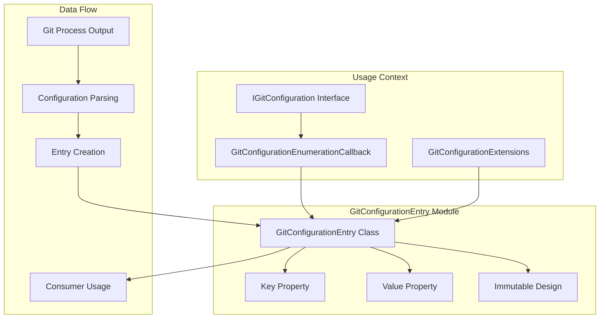

# GitConfigurationEntry Module Documentation

## Introduction

The GitConfigurationEntry module provides a simple yet essential data model for representing Git configuration entries as key-value pairs. It serves as the fundamental building block for configuration management within the Git Credential Manager.

## Architecture Overview

The GitConfigurationEntry module implements a minimal but effective design pattern for immutable configuration data representation.



## Core Components

### GitConfigurationEntry Class
A simple data transfer object (DTO) that represents a single Git configuration entry with immutable key-value semantics.

### Key Property
The configuration key string that follows Git's configuration key format: `section[.scope].property`

### Value Property
The configuration value string that represents the actual setting value.

### Immutable Design
The class is designed to be immutable, ensuring thread safety and predictable behavior in concurrent scenarios.

## Key Features

### Immutable Data Structure
- **Thread safety**: Safe for concurrent access without synchronization
- **Predictable behavior**: Values cannot be modified after creation
- **Functional approach**: Supports functional programming patterns

### Git Configuration Format Support
- **Key format**: Supports Git's standard key format with sections and properties
- **Value storage**: Handles any string value that Git can store
- **Null safety**: Proper handling of null values

### Lightweight Design
- **Minimal overhead**: No unnecessary functionality or dependencies
- **Simple constructor**: Straightforward object creation
- **Property access**: Direct property access without methods

## Usage Patterns

### Basic Usage
```csharp
// Create configuration entry
var entry = new GitConfigurationEntry("user.name", "John Doe");

// Access properties
string key = entry.Key;   // "user.name"
string value = entry.Value; // "John Doe"
```

### Enumeration Usage
```csharp
// In configuration enumeration callback
config.Enumerate(GitConfigurationLevel.Global, entry =>
{
    Console.WriteLine($"Key: {entry.Key}, Value: {entry.Value}");
    return true; // Continue enumeration
});
```

### Collection Usage
```csharp
// Store multiple entries
var entries = new List<GitConfigurationEntry>
{
    new GitConfigurationEntry("user.name", "John Doe"),
    new GitConfigurationEntry("user.email", "john@example.com"),
    new GitConfigurationEntry("core.autocrlf", "true")
};

// Process entries
foreach (var entry in entries)
{
    Console.WriteLine($"{entry.Key} = {entry.Value}");
}
```

### Filtering Usage
```csharp
// Filter entries by key pattern
var userEntries = entries.Where(entry => entry.Key.StartsWith("user."));

// Filter entries by value
var enabledEntries = entries.Where(entry => entry.Value == "true");
```

## Integration with Git Configuration

### Configuration Enumeration
```csharp
// Enumerate configuration with entry objects
config.Enumerate(GitConfigurationLevel.Global, entry =>
{
    // Process each configuration entry
    ProcessConfigurationEntry(entry);
    return true;
});
```

### Configuration Parsing
```csharp
// Parse Git configuration output
string configOutput = GetGitConfigOutput();
string[] lines = configOutput.Split('\0');

foreach (string line in lines)
{
    if (string.IsNullOrEmpty(line)) continue;
    
    string[] parts = line.Split('\n', 2);
    if (parts.Length == 2)
    {
        var entry = new GitConfigurationEntry(parts[0], parts[1]);
        ProcessEntry(entry);
    }
}
```

## Error Handling

### Construction Validation
```csharp
// Handle potential null values
string key = GetConfigurationKey();
string value = GetConfigurationValue();

// Safe construction
var entry = new GitConfigurationEntry(key ?? string.Empty, value ?? string.Empty);
```

### Entry Validation
```csharp
// Validate entry before processing
bool IsValidEntry(GitConfigurationEntry entry)
{
    return !string.IsNullOrEmpty(entry.Key) && 
           entry.Value != null; // Value can be empty but not null
}
```

## Performance Characteristics

### Memory Efficiency
- **Minimal allocation**: Only two string references
- **No additional overhead**: No extra fields or methods
- **String interning**: Can benefit from string interning for repeated keys

### Access Performance
- **Direct field access**: Properties are simple getters
- **No computation**: No calculations or transformations
- **Cache-friendly**: Small size makes it cache-efficient

## Thread Safety

### Immutable Guarantees
- **Read-only properties**: No setters available
- **No internal state**: No mutable internal fields
- **Safe publication**: Immutable objects are safely published

### Concurrent Usage
```csharp
// Safe for concurrent access
var entry = new GitConfigurationEntry("core.autocrlf", "true");

// Multiple threads can safely read
Parallel.ForEach(operations, op =>
{
    string key = entry.Key;
    string value = entry.Value;
    ProcessConfiguration(key, value);
});
```

## Testing Considerations

### Unit Testing
```csharp
[Test]
public void GitConfigurationEntry_ShouldStoreKeyAndValue()
{
    // Arrange
    string key = "user.name";
    string value = "Test User";
    
    // Act
    var entry = new GitConfigurationEntry(key, value);
    
    // Assert
    Assert.AreEqual(key, entry.Key);
    Assert.AreEqual(value, entry.Value);
}

[Test]
public void GitConfigurationEntry_ShouldHandleEmptyValues()
{
    // Arrange & Act
    var entry = new GitConfigurationEntry("core.autocrlf", string.Empty);
    
    // Assert
    Assert.AreEqual("core.autocrlf", entry.Key);
    Assert.AreEqual(string.Empty, entry.Value);
}
```

### Integration Testing
```csharp
[Test]
public void ConfigurationEnumeration_ShouldReturnValidEntries()
{
    // Arrange
    var entries = new List<GitConfigurationEntry>();
    
    // Act
    config.Enumerate(GitConfigurationLevel.Global, entry =>
    {
        entries.Add(entry);
        return true;
    });
    
    // Assert
    Assert.IsTrue(entries.Count > 0);
    foreach (var entry in entries)
    {
        Assert.IsNotNull(entry.Key);
        Assert.IsNotNull(entry.Value);
    }
}
```

## Best Practices

### Entry Creation
- Always validate input data before creating entries
- Handle null values appropriately
- Use meaningful variable names for clarity

### Entry Usage
- Prefer direct property access over wrapper methods
- Use LINQ for filtering and transformation operations
- Consider entry immutability in design decisions

### Memory Management
- Reuse entry objects when possible
- Be mindful of string allocations in tight loops
- Consider string interning for frequently used keys

## Integration with Other Components

### GitConfiguration Integration
The GitConfigurationEntry works seamlessly with [Git Configuration](GitConfiguration.md) to:
- Provide data transfer for configuration operations
- Enable type-safe configuration access
- Support configuration enumeration patterns

### GitProcess Integration
Integration with [GitProcess](GitProcess.md) for:
- Configuration parsing from Git process output
- Entry creation from Git command results
- Error handling for configuration operations

### Configuration Extensions
Works with GitConfigurationExtensions to provide:
- High-level configuration access methods
- Section and property filtering
- Type-safe configuration value access

## Design Rationale

### Simplicity Over Complexity
The GitConfigurationEntry is intentionally simple, providing only the essential functionality needed for configuration data representation. This design choice ensures:

- **Minimal overhead**: No unnecessary features or complexity
- **Maximum compatibility**: Works in any .NET environment
- **Easy testing**: Simple to unit test and mock
- **Clear semantics**: Unambiguous behavior and usage

### Immutability Benefits
The immutable design provides several advantages:

- **Thread safety**: Safe for concurrent use without synchronization
- **Predictable behavior**: Values cannot change after creation
- **Functional compatibility**: Works well with functional programming patterns
- **Caching friendly**: Can be safely cached and shared

### Performance Considerations
The lightweight design optimizes for:

- **Memory efficiency**: Minimal memory footprint
- **Access speed**: Direct property access
- **GC pressure**: Minimal garbage collection impact
- **Cache locality**: Small size improves cache performance