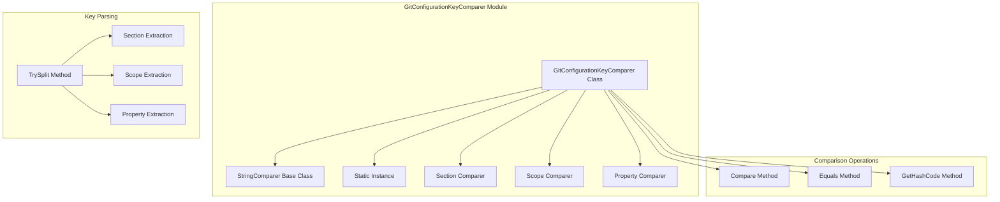

# GitConfigurationKeyComparer Module Documentation

## Introduction

The GitConfigurationKeyComparer module provides specialized string comparison logic for Git configuration keys. It implements a custom StringComparer that understands Git's unique configuration key format with proper case sensitivity rules for different key components.

## Architecture Overview

The GitConfigurationKeyComparer module implements a sophisticated comparison system that handles Git's configuration key syntax with component-aware case sensitivity.



## Core Components

### GitConfigurationKeyComparer Class
A specialized StringComparer that implements Git-specific comparison logic for configuration keys.

### Static Instance
A thread-safe singleton instance (`GitConfigurationKeyComparer.Instance`) that should be used for all Git configuration key comparisons.

### Component Comparers
Specialized comparers for different key components:
- **SectionComparer**: Case-insensitive comparison for section names
- **ScopeComparer**: Case-sensitive comparison for scope names
- **PropertyComparer**: Case-insensitive comparison for property names

## Key Features

### Git Key Format Understanding
Supports Git's configuration key format: `section[.scope].property`

- **Section**: The main configuration section (e.g., "user", "core", "credential")
- **Scope**: Optional scope component (case-sensitive)
- **Property**: The property name within the section

### Component-Aware Case Sensitivity
- **Section and Property**: Case-insensitive comparison
- **Scope**: Case-sensitive comparison (critical for URLs and identifiers)
- **Consistent behavior**: Same rules across all comparison operations

### Robust Key Parsing
- **Fault tolerance**: Graceful handling of malformed keys
- **Null safety**: Proper handling of null input strings
- **Partial parsing**: Extract available components even from incomplete keys

## Git Configuration Key Format

### Standard Format
```
section[.scope].property
```

### Examples
```
user.name                    # Section: user, Property: name
core.autocrlf               # Section: core, Property: autocrlf
credential.https://example.com.provider
# Section: credential, Scope: https://example.com, Property: provider
remote.origin.url           # Section: remote, Scope: origin, Property: url
branch.main.merge           # Section: branch, Scope: main, Property: merge
```

### Component Breakdown
```csharp
// Key: "credential.https://example.com.provider"
// Section: "credential" (case-insensitive)
// Scope: "https://example.com" (case-sensitive)
// Property: "provider" (case-insensitive)
```

## Usage Patterns

### Basic Comparison
```csharp
// Use the singleton instance
var comparer = GitConfigurationKeyComparer.Instance;

// Compare two configuration keys
string key1 = "user.name";
string key2 = "user.NAME";

bool areEqual = comparer.Equals(key1, key2); // true (case-insensitive)
```

### Scope-Sensitive Comparison
```csharp
// Scope comparison is case-sensitive
string key1 = "credential.https://example.com.provider";
string key2 = "credential.HTTPS://EXAMPLE.COM.provider";

bool areEqual = comparer.Equals(key1, key2); // false (scope differs)
```

### Key Component Extraction
```csharp
// Extract components from key
string key = "credential.https://example.com.provider";

if (GitConfigurationKeyComparer.TrySplit(key, out string section, out string scope, out string property))
{
    Console.WriteLine($"Section: {section}");   // "credential"
    Console.WriteLine($"Scope: {scope}");       // "https://example.com"
    Console.WriteLine($"Property: {property}"); // "provider"
}
```

### Dictionary Usage
```csharp
// Create dictionary with Git key comparer
var configDict = new Dictionary<string, string>(GitConfigurationKeyComparer.Instance);

// Keys will be compared using Git rules
configDict["user.name"] = "John Doe";
configDict["user.NAME"] = "Jane Doe"; // This will overwrite the previous entry

Console.WriteLine(configDict["user.name"]); // "Jane Doe"
```

### Sorting Configuration Entries
```csharp
// Sort configuration entries by key
var entries = new List<GitConfigurationEntry>
{
    new GitConfigurationEntry("user.email", "user@example.com"),
    new GitConfigurationEntry("core.autocrlf", "true"),
    new GitConfigurationEntry("user.name", "John Doe")
};

// Sort using Git key comparison
entries.Sort((a, b) => GitConfigurationKeyComparer.Instance.Compare(a.Key, b.Key));
```

## Comparison Logic Details

### Compare Method Algorithm
1. Parse both keys into components (section, scope, property)
2. Compare sections using case-insensitive comparison
3. Compare properties using case-insensitive comparison
4. Compare scopes using case-sensitive comparison
5. Return the first non-zero comparison result

### Equals Method Logic
```csharp
public override bool Equals(string x, string y)
{
    // Handle reference equality and null cases
    if (ReferenceEquals(x, y)) return true;
    if (x is null || y is null) return false;
    
    // Parse both keys
    TrySplit(x, out string xSection, out string xScope, out string xProperty);
    TrySplit(y, out string ySection, out string yScope, out string yProperty);
    
    // Compare components with appropriate case sensitivity
    return OrdinalIgnoreCase.Equals(xSection, ySection) &&
           OrdinalIgnoreCase.Equals(xProperty, yProperty) &&
           Ordinal.Equals(xScope, yScope);
}
```

### GetHashCode Implementation
```csharp
public override int GetHashCode(string obj)
{
    TrySplit(obj, out string section, out string scope, out string property);
    
    // Combine hash codes with appropriate comparers
    int code = OrdinalIgnoreCase.GetHashCode(section) ^
               OrdinalIgnoreCase.GetHashCode(property);
    
    // Include scope if present
    return scope is null
        ? code
        : code ^ Ordinal.GetHashCode(scope);
}
```

## Key Parsing Implementation

### TrySplit Method
```csharp
public static bool TrySplit(string str, out string section, out string scope, out string property)
{
    section = null;
    scope = null;
    property = null;
    
    if (string.IsNullOrWhiteSpace(str))
    {
        return false;
    }
    
    // Extract section (before first dot)
    section = str.TruncateFromIndexOf('.');
    
    // Extract property (after last dot)
    property = str.TrimUntilLastIndexOf('.');
    
    // Extract scope (between first and last dot)
    int scopeLength = str.Length - (section.Length + property.Length + 2);
    scope = scopeLength > 0 ? str.Substring(section.Length + 1, scopeLength) : null;
    
    return true;
}
```

## Error Handling

### Null Input Handling
```csharp
// Safe handling of null inputs
string nullKey = null;
string validKey = "user.name";

// Comparison with null
bool result = comparer.Equals(nullKey, validKey); // false
int compare = comparer.Compare(nullKey, validKey); // -1
```

### Malformed Key Handling
```csharp
// Handle keys without dots
string simpleKey = "autocrlf";
string fullKey = "core.autocrlf";

// Will parse simple key appropriately
if (GitConfigurationKeyComparer.TrySplit(simpleKey, out string section, out string scope, out string property))
{
    // section: "autocrlf", scope: null, property: ""
}
```

### Empty String Handling
```csharp
// Handle empty strings
string emptyKey = "";
bool canSplit = GitConfigurationKeyComparer.TrySplit(emptyKey, out string section, out string scope, out string property);
// canSplit: false
```

## Performance Characteristics

### Comparison Performance
- **Efficient parsing**: Minimal string operations for key parsing
- **Early termination**: Comparison stops at first difference
- **Cached comparers**: Reuses StringComparer instances
- **Minimal allocations**: Avoids unnecessary string creation

### Hash Code Performance
- **Consistent hashing**: Same keys produce same hash codes
- **Efficient computation**: Uses optimized StringComparer hash methods
- **Distribution**: Good hash distribution for dictionary performance

## Thread Safety

### Singleton Safety
The static `Instance` property is thread-safe and can be used concurrently:
```csharp
// Safe for concurrent use
Parallel.ForEach(keys, key =>
{
    var comparer = GitConfigurationKeyComparer.Instance;
    bool contains = dict.ContainsKey(key, comparer);
    // Process result
});
```

### Stateless Design
The comparer is stateless, making all operations thread-safe:
- No internal state modifications
- No instance variables
- Pure function implementations

## Testing Considerations

### Unit Testing
```csharp
[Test]
public void Equals_ShouldBeCaseInsensitiveForSectionAndProperty()
{
    // Arrange
    var comparer = GitConfigurationKeyComparer.Instance;
    string key1 = "user.name";
    string key2 = "USER.NAME";
    
    // Act & Assert
    Assert.IsTrue(comparer.Equals(key1, key2));
}

[Test]
public void Equals_ShouldBeCaseSensitiveForScope()
{
    // Arrange
    var comparer = GitConfigurationKeyComparer.Instance;
    string key1 = "credential.https://example.com.provider";
    string key2 = "credential.HTTPS://EXAMPLE.COM.provider";
    
    // Act & Assert
    Assert.IsFalse(comparer.Equals(key1, key2));
}
```

### Integration Testing
```csharp
[Test]
public void Dictionary_ShouldRespectGitKeyComparisonRules()
{
    // Arrange
    var dict = new Dictionary<string, string>(GitConfigurationKeyComparer.Instance);
    dict["user.name"] = "value1";
    
    // Act
    dict["USER.name"] = "value2"; // Should overwrite due to case-insensitive comparison
    
    // Assert
    Assert.AreEqual(1, dict.Count);
    Assert.AreEqual("value2", dict["user.name"]);
}
```

## Best Practices

### Usage Guidelines
- Always use the singleton `Instance` property
- Handle null inputs appropriately
- Understand case sensitivity rules for different components

### Performance Optimization
- Cache the comparer instance when used repeatedly
- Use TrySplit for component extraction instead of manual parsing
- Consider hash code performance for large dictionaries

### Error Prevention
- Validate keys before comparison when possible
- Handle malformed keys gracefully
- Test with edge cases (empty strings, null values)

## Integration with Other Modules

### Git Configuration Integration
The GitConfigurationKeyComparer integrates with [Git Configuration](GitConfiguration.md) to:
- Provide proper key comparison for configuration operations
- Enable consistent key ordering and searching
- Support dictionary-based configuration storage

### Git Process Integration
Works with [GitProcess](GitProcess.md) for:
- Configuration key validation
- Command-line argument generation
- Output parsing and key extraction

### Cross-Module Usage
Used throughout the system for:
- Configuration key normalization
- Consistent key comparison across modules
- Dictionary and collection operations

## Design Rationale

### Git-Specific Design
The comparer is specifically designed for Git configuration keys rather than general string comparison:
- Understands Git's key format and semantics
- Implements Git's case sensitivity rules
- Optimized for common Git configuration patterns

### Performance vs. Correctness
The design prioritizes correctness while maintaining good performance:
- Accurate implementation of Git's comparison rules
- Efficient algorithms for common operations
- Minimal overhead for simple comparisons

### Extensibility Considerations
While currently focused on Git configuration keys, the design allows for:
- Future key format extensions
- Additional comparison rules
- Integration with other Git data structures