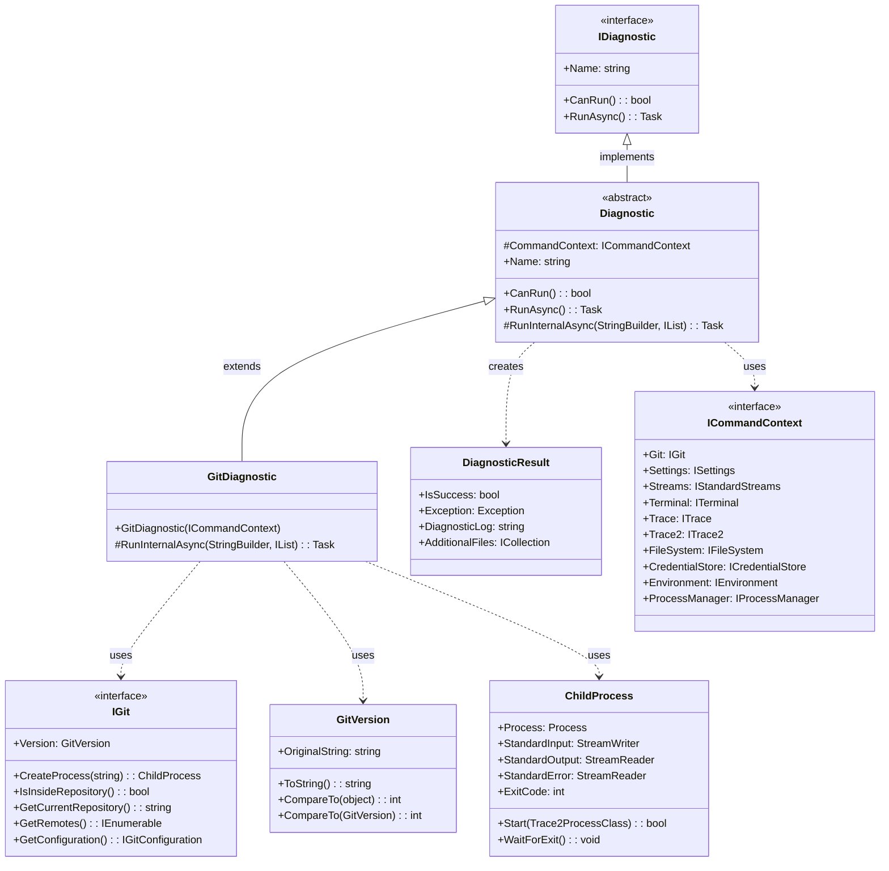
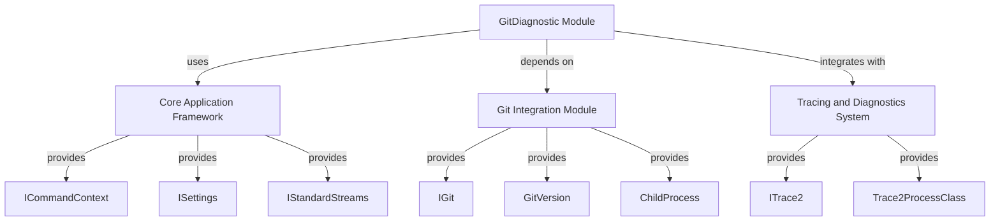
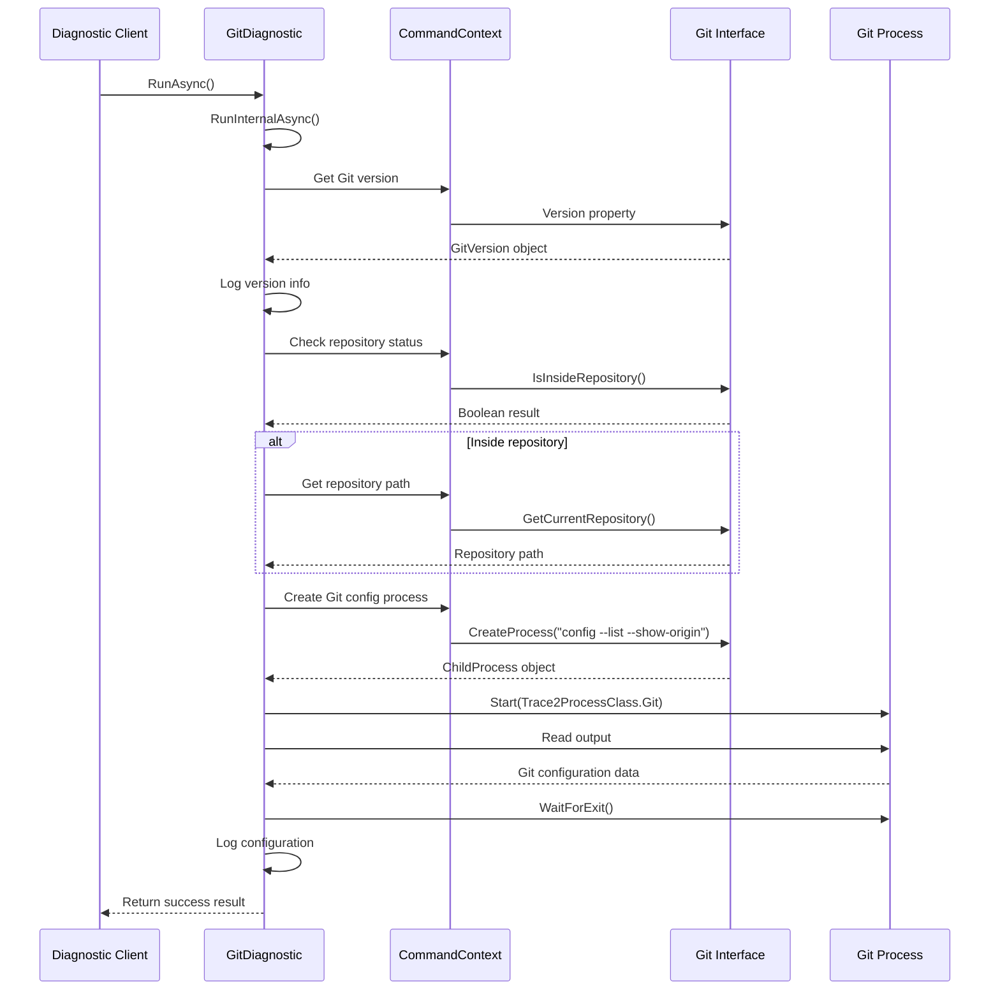
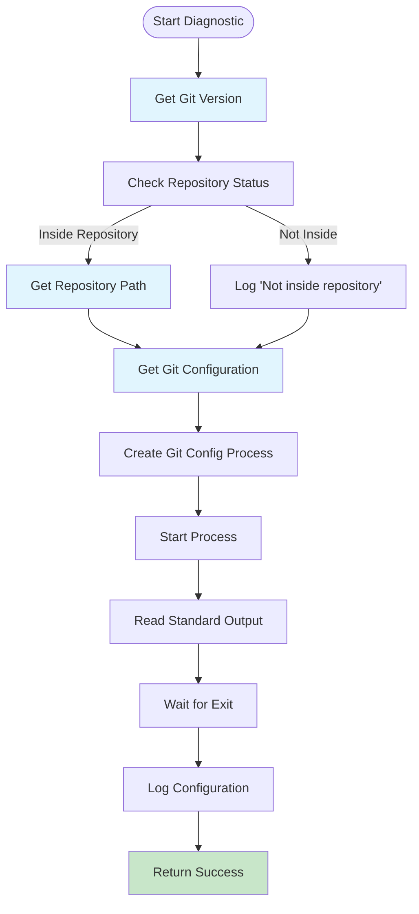

# GitDiagnostic Module Documentation

## Introduction

The GitDiagnostic module is a specialized diagnostic component within the Git Credential Manager's diagnostics framework. It provides comprehensive analysis and reporting of Git-related configuration, version information, and repository status. This module is essential for troubleshooting Git integration issues and ensuring proper Git Credential Manager functionality.

## Module Overview

The GitDiagnostic module extends the base `Diagnostic` class and implements the `IDiagnostic` interface to provide Git-specific diagnostic capabilities. It analyzes Git installation status, version information, repository configuration, and Git configuration settings to help identify potential issues with Git operations and credential management.

## Architecture

### Component Structure

### Module Dependencies

## Core Functionality

### Diagnostic Process Flow

### Data Collection Process

## Key Components

### GitDiagnostic Class

The `GitDiagnostic` class is the main component that implements Git-specific diagnostic functionality:

- **Purpose**: Analyzes Git installation and configuration status
- **Inheritance**: Extends the abstract `Diagnostic` class
- **Constructor**: Takes `ICommandContext` as dependency injection
- **Main Method**: `RunInternalAsync()` performs the actual diagnostic operations

### Diagnostic Operations

The GitDiagnostic performs four main diagnostic operations:

1. **Git Version Detection**
   - Retrieves the Git version using `CommandContext.Git.Version`
   - Logs the original version string for debugging purposes
   - Validates Git installation availability

2. **Repository Status Check**
   - Determines if the current directory is inside a Git repository
   - Uses `CommandContext.Git.IsInsideRepository()`
   - Optionally retrieves repository path if inside a repository

3. **Git Configuration Analysis**
   - Executes `git config --list --show-origin` command
   - Captures complete Git configuration with file origins
   - Helps identify configuration conflicts or issues

4. **Process Management**
   - Creates and manages Git child processes safely
   - Implements proper stream reading to avoid deadlocks
   - Integrates with TRACE2 logging system

## Integration Points

### Command Context Integration

The GitDiagnostic relies heavily on the `ICommandContext` interface, which provides:

- **Git Interface**: Access to Git operations and version information
- **Settings**: Configuration and preferences
- **Tracing**: Logging and diagnostic capabilities
- **Environment**: Process and system environment access

### TRACE2 Integration

The module integrates with the TRACE2 tracing system:

- Uses `Trace2ProcessClass.Git` for Git process classification
- Enables detailed process lifecycle tracking
- Supports performance monitoring and debugging

### Error Handling

The diagnostic implements robust error handling:

- **Process Safety**: Proper stream reading to prevent deadlocks
- **Exception Management**: Base class handles exceptions gracefully
- **Result Reporting**: Returns structured `DiagnosticResult` objects

## Usage Scenarios

### Troubleshooting Git Integration Issues

The GitDiagnostic is particularly useful for:

- **Version Compatibility**: Verifying Git version compatibility
- **Configuration Problems**: Identifying Git configuration issues
- **Repository Detection**: Confirming proper repository recognition
- **Process Execution**: Validating Git command execution

### System Health Checks

Regular diagnostic runs can help:

- **Proactive Monitoring**: Detect issues before they impact users
- **Configuration Auditing**: Review Git configuration changes
- **Performance Analysis**: Monitor Git operation performance
- **Compliance Verification**: Ensure proper Git setup

## Related Documentation

For more information about related modules, see:

- [Core Application Framework](CoreApplicationFramework.md) - Base framework components
- [Git Integration](GitIntegration.md) - Git operations and process management
- [Diagnostics Framework](DiagnosticsFramework.md) - Overall diagnostic system architecture
- [Tracing and Diagnostics](TracingAndDiagnostics.md) - TRACE2 integration and logging

## Best Practices

### Performance Considerations

- **Stream Reading**: Always read output streams before waiting for process exit to prevent deadlocks
- **Resource Management**: Properly dispose of process resources
- **Async Operations**: Use asynchronous methods for I/O operations

### Security Considerations

- **Command Injection**: Validate all Git command arguments
- **Output Sanitization**: Handle Git configuration output carefully
- **Process Isolation**: Run Git processes with appropriate security context

### Maintenance Guidelines

- **Version Compatibility**: Keep Git version parsing logic updated
- **Error Messages**: Provide clear, actionable error messages
- **Logging**: Include sufficient detail for troubleshooting without exposing sensitive data