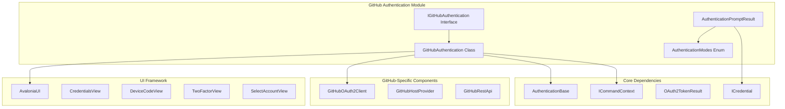
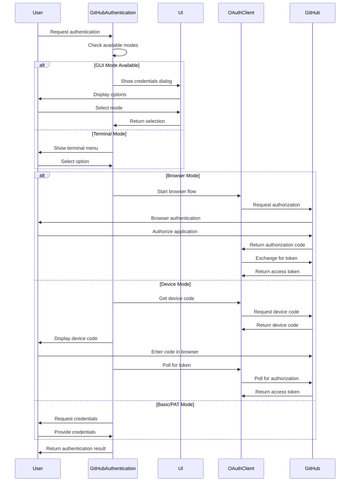
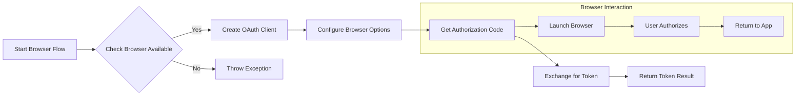
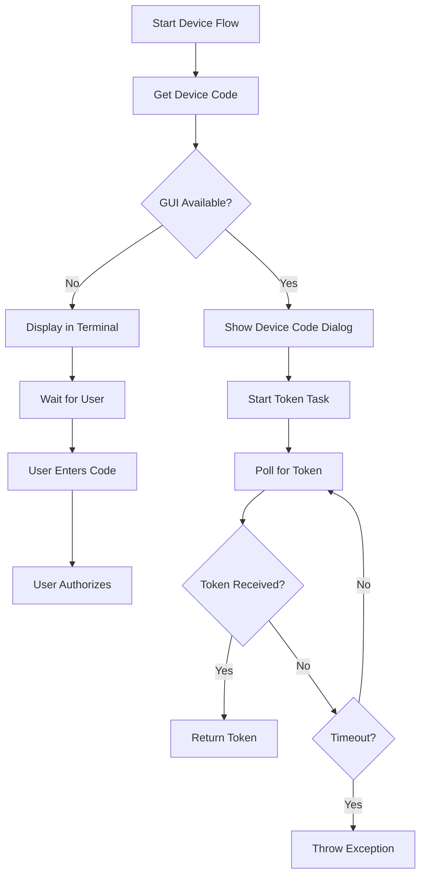
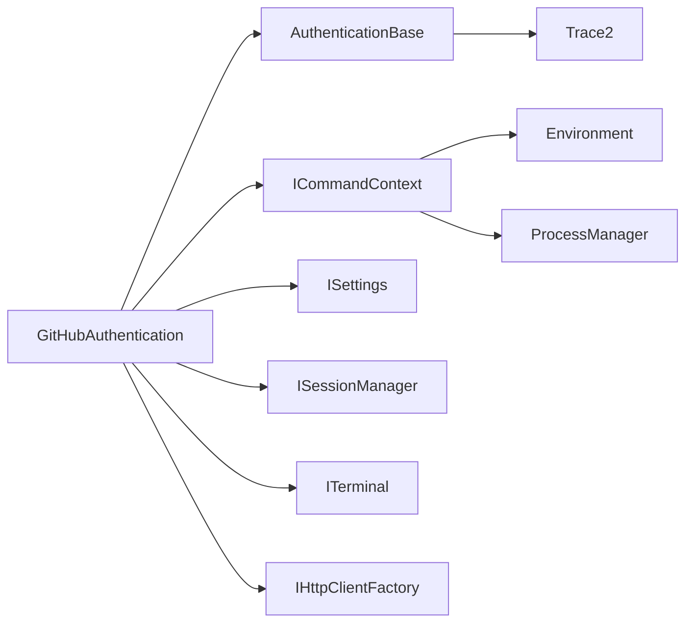

# GitHub Authentication Module

## Introduction

The GitHub Authentication module provides comprehensive authentication capabilities for GitHub repositories, supporting multiple authentication methods including OAuth, personal access tokens, basic authentication, and browser-based authentication. This module serves as the primary authentication interface between Git Credential Manager and GitHub services, handling both GitHub.com and GitHub Enterprise Server instances.

## Architecture Overview

The GitHub Authentication module is built on top of the Core Authentication framework and integrates with GitHub-specific OAuth2 client implementations. It provides a unified interface for authentication while supporting multiple user interaction modes including GUI prompts, terminal-based prompts, and helper applications.



## Core Components

### IGitHubAuthentication Interface

The primary interface defining the contract for GitHub authentication operations:

- **SelectAccountAsync**: Allows users to select from existing accounts
- **GetAuthenticationAsync**: Main authentication method supporting multiple modes
- **GetTwoFactorCodeAsync**: Handles two-factor authentication
- **GetOAuthTokenViaBrowserAsync**: Browser-based OAuth authentication
- **GetOAuthTokenViaDeviceCodeAsync**: Device code OAuth authentication

### GitHubAuthentication Class

The main implementation providing GitHub-specific authentication logic with support for:

- Multiple authentication modes (Basic, Browser, PAT, Device)
- GUI and terminal-based user interaction
- Helper application integration
- Enterprise GitHub support
- Two-factor authentication

### AuthenticationPromptResult

Encapsulates the result of authentication prompts, containing:
- Selected authentication mode
- Optional credential information

### AuthenticationModes Enum

Defines available authentication methods:
- **Basic**: Username/password authentication
- **Browser**: Web browser OAuth flow
- **Pat**: Personal Access Token
- **Device**: Device code OAuth flow

## Authentication Flows

### Multi-Mode Authentication Process



### OAuth Browser Flow



### Device Code Flow



## User Interaction Modes

The module supports three distinct user interaction modes:

### GUI Mode (Avalonia UI)
- **CredentialsView**: Main authentication dialog
- **DeviceCodeView**: Device code display
- **TwoFactorView**: 2FA code entry
- **SelectAccountView**: Account selection

### Terminal Mode
- Menu-driven selection
- Interactive prompts
- Secret input handling

### Helper Application Mode
- External authentication helper
- Process communication
- JSON-based response format

## Integration Points

### Core Framework Dependencies



### GitHub-Specific Components

- **GitHubOAuth2Client**: Handles OAuth2 protocol implementation
- **GitHubHostProvider**: Provides GitHub-specific configuration
- **GitHubRestApi**: REST API interactions

### UI Framework Integration

- **AvaloniaUI**: Cross-platform UI framework
- **ViewModels**: MVVM pattern implementation
- **Views**: XAML-based UI components

## Configuration and Settings

The module respects various configuration options:

- **GUI Prompts**: `IsGuiPromptsEnabled` setting
- **Terminal Prompts**: `IsTerminalPromptsEnabled` setting
- **Web Browser**: `IsWebBrowserAvailable` session capability
- **Authentication Helper**: External helper command configuration
- **Enterprise URLs**: GitHub Enterprise Server support

## Error Handling

The module implements comprehensive error handling:

- **User Cancellation**: Graceful handling of cancelled operations
- **Network Errors**: HTTP client error handling
- **OAuth Errors**: OAuth2 protocol error responses
- **Configuration Errors**: Invalid settings detection
- **Platform Errors**: Desktop session availability

## Security Considerations

- **Credential Storage**: Integration with credential stores
- **Secure Input**: Password/token masking in UI
- **HTTPS Enforcement**: All OAuth flows use HTTPS
- **Token Management**: Proper token lifecycle handling
- **Scope Management**: OAuth scope validation

## Platform Support

The module provides consistent behavior across platforms:

- **Windows**: Full GUI and terminal support
- **macOS**: Native UI integration
- **Linux**: Terminal and GUI support
- **Cross-Platform**: Avalonia UI for consistent experience

## Dependencies

### Direct Dependencies
- [Core Authentication](Authentication.md)
- [Core OAuth](OAuth.md)
- [GitHub OAuth2 Client](GitHub%20OAuth2%20Client.md)
- [UI Framework](UI%20Framework.md)

### Indirect Dependencies
- [Core Framework](Core%20Framework.md)
- [Settings Management](Settings.md)
- [HTTP Client](HTTP%20Client.md)
- [Terminal Management](Terminal.md)

## Usage Examples

### Basic Authentication
```csharp
var auth = new GitHubAuthentication(context);
var result = await auth.GetAuthenticationAsync(
    targetUri: new Uri("https://github.com"),
    userName: null,
    modes: AuthenticationModes.Basic | AuthenticationModes.Browser
);
```

### OAuth Browser Flow
```csharp
var tokenResult = await auth.GetOAuthTokenViaBrowserAsync(
    targetUri: new Uri("https://github.com"),
    scopes: new[] { "repo", "user" },
    loginHint: "user@example.com"
);
```

### Device Code Flow
```csharp
var tokenResult = await auth.GetOAuthTokenViaDeviceCodeAsync(
    targetUri: new Uri("https://github.com"),
    scopes: new[] { "repo", "user" }
);
```

## Extension Points

The module provides several extension points:

- **Custom UI**: Replace Avalonia UI with custom implementation
- **Helper Applications**: External authentication processes
- **OAuth Clients**: Custom OAuth2 client implementations
- **Credential Stores**: Integration with different storage backends

## Performance Considerations

- **HTTP Client Reuse**: Single HttpClient instance per authentication
- **Async Operations**: All I/O operations are asynchronous
- **Cancellation Support**: Proper cancellation token handling
- **Resource Cleanup**: IDisposable implementation for cleanup

## Monitoring and Diagnostics

The module integrates with the tracing system:

- **Trace2 Integration**: Detailed operation tracing
- **Error Reporting**: Structured error information
- **Performance Metrics**: Operation timing information
- **Debug Logging**: Detailed debug information

This comprehensive authentication module provides a robust foundation for GitHub authentication across different scenarios while maintaining security, usability, and platform compatibility.