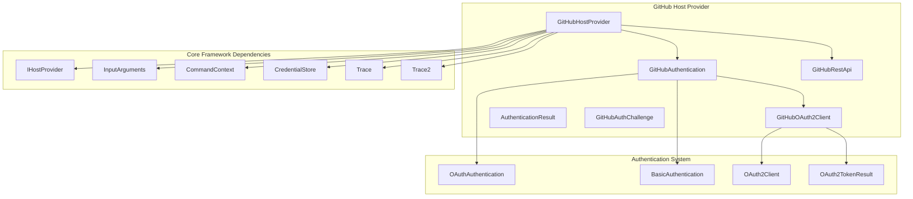
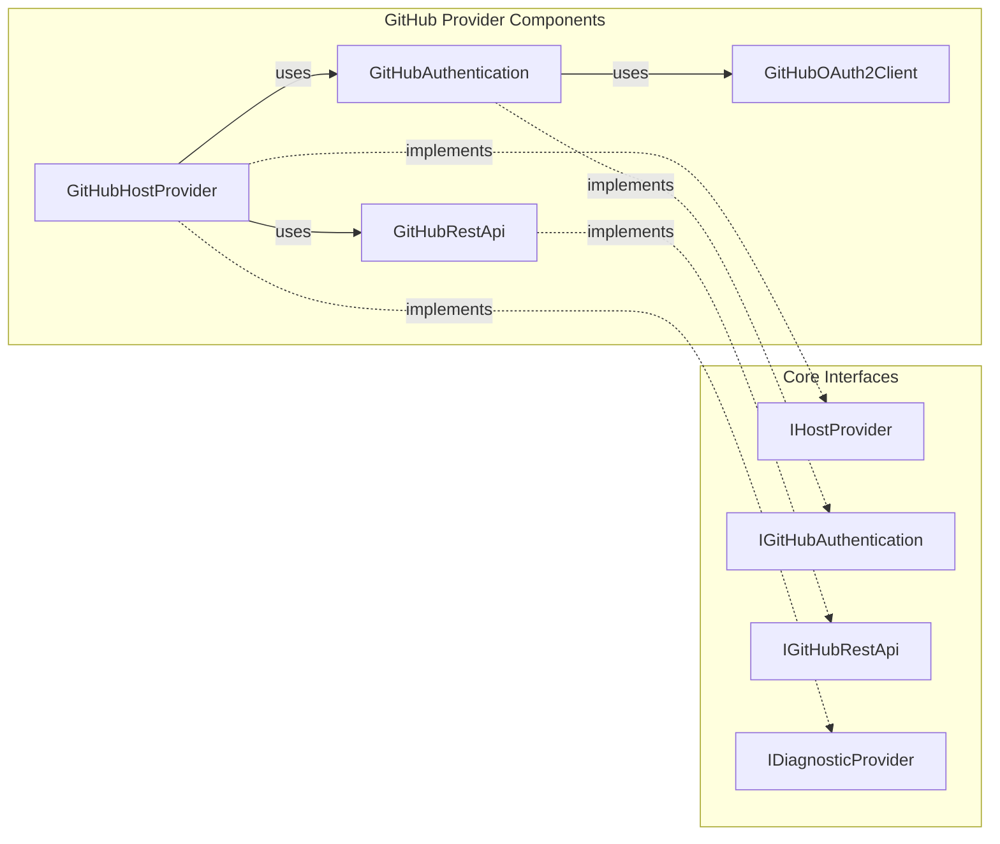
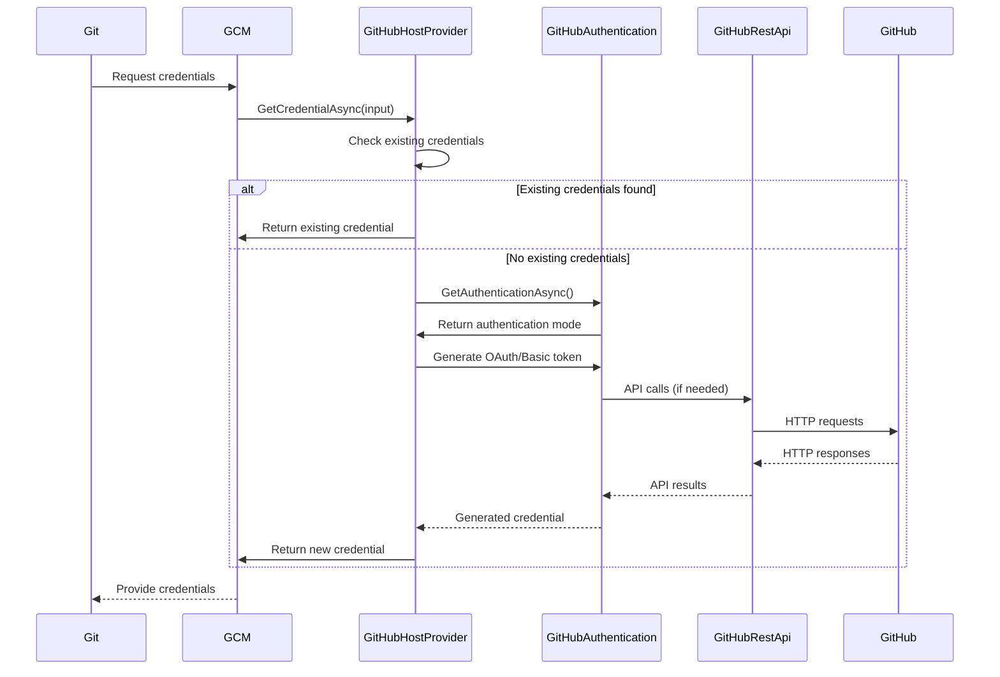
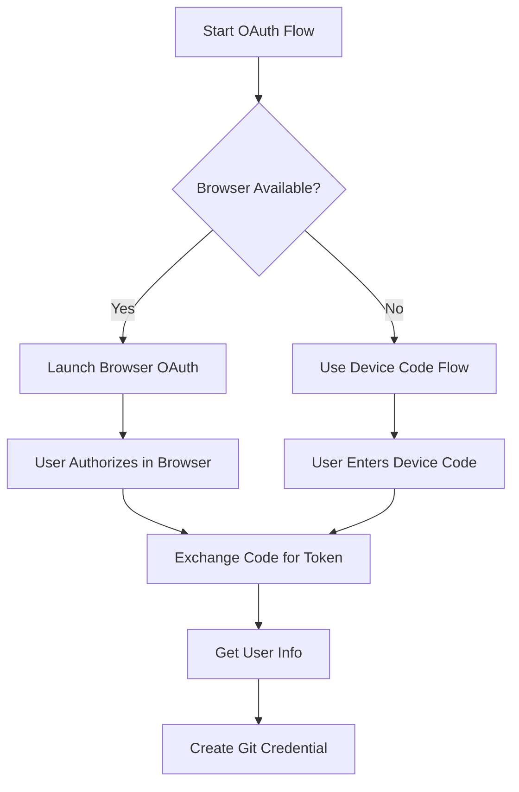
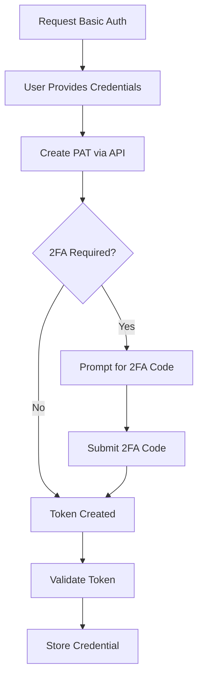

# GitHub Host Provider Module

## Introduction

The GitHub Host Provider module is a specialized component of the Git Credential Manager that handles authentication and credential management for GitHub repositories. It serves as the primary interface between Git operations and GitHub's authentication systems, supporting both GitHub.com and GitHub Enterprise Server instances.

This module implements the `IHostProvider` interface and provides comprehensive authentication support including OAuth, personal access tokens, basic authentication, and two-factor authentication. It also includes diagnostic capabilities and intelligent account management features.

## Architecture Overview



## Component Relationships



## Data Flow Architecture



## Core Components

### GitHubHostProvider

The main provider class that orchestrates GitHub authentication operations. It implements the `IHostProvider` interface and provides the following key functionality:

- **Host Detection**: Identifies GitHub and GitHub Enterprise hosts from URLs
- **Credential Management**: Retrieves, stores, and erases credentials
- **Authentication Orchestration**: Coordinates different authentication methods
- **Account Filtering**: Intelligently filters available accounts based on domain hints
- **Diagnostic Support**: Provides diagnostic information for troubleshooting

#### Key Methods

```csharp
public bool IsSupported(InputArguments input)
public async Task<ICredential> GetCredentialAsync(InputArguments input)
public async Task StoreCredentialAsync(InputArguments input)
public async Task EraseCredentialAsync(InputArguments input)
```

### GitHubAuthentication

Handles the user authentication flow and UI interactions. Supports multiple authentication modes:

- **OAuth Browser Flow**: Opens browser for GitHub OAuth authentication
- **Device Code Flow**: Provides device code for authentication on limited devices
- **Personal Access Token**: Direct token input from users
- **Basic Authentication**: Username/password authentication (deprecated on GitHub.com)
- **Two-Factor Authentication**: Handles 2FA challenges

### GitHubRestApi

Provides REST API communication with GitHub services:

- **Personal Access Token Creation**: Creates PATs via GitHub API
- **User Information Retrieval**: Fetches user details from API
- **Meta Information**: Retrieves server configuration and capabilities
- **Authentication Validation**: Validates credentials against GitHub API

## Authentication Flows

### OAuth Authentication Process



### Personal Access Token Generation



## Configuration and Settings

The module supports various configuration options through environment variables and Git configuration:

### Authentication Modes
- `GCM_GITHUB_AUTHMODES`: Override supported authentication modes
- `GCM_GITHUB_ACCOUNTFILTERING`: Enable/disable account filtering
- `GCM_GITHUB_AUTH_HELPER`: Custom authentication helper command

### Security Settings
- `GCM_ALLOW_UNSAFE_REMOTES`: Allow HTTP connections (not recommended)
- OAuth scopes for repository, gist, and workflow access

## Host Detection Logic

The provider identifies GitHub hosts using the following patterns:

1. **GitHub.com**: `github.com` and `gist.github.com`
2. **GitHub Enterprise**: `github.domain.tld` and `gist.github.domain.tld`
3. **Subdomain Support**: Handles GitHub instances with subdomains
4. **Protocol Detection**: Supports both HTTP and HTTPS (HTTPS recommended)

## Account Management

### Account Filtering

The module implements intelligent account filtering based on:
- **Domain Hints**: Uses WWW-Authenticate headers to filter relevant accounts
- **Enterprise URLs**: Differentiates between GitHub.com and Enterprise accounts
- **User Preferences**: Respects user settings for account filtering

### Multi-Account Support

When multiple accounts are available:
1. **Single Account**: Automatically selects the only available account
2. **Multiple Accounts**: Prompts user to select from available accounts
3. **Account Addition**: Allows users to add new accounts when needed

## Error Handling and Diagnostics

### Diagnostic Capabilities

The module provides comprehensive diagnostics through:
- **API Connectivity Tests**: Verifies GitHub API accessibility
- **Authentication Validation**: Tests credential validity
- **Network Diagnostics**: Checks network connectivity and proxy settings
- **Configuration Validation**: Validates settings and environment

### Error Scenarios

Common error scenarios and handling:
- **Invalid Credentials**: Prompts for re-authentication
- **Network Issues**: Provides detailed error messages and retry guidance
- **2FA Failures**: Handles various 2FA methods and failures
- **OAuth Failures**: Graceful fallback to alternative authentication methods

## Security Considerations

### Credential Storage
- **Secure Storage**: Uses OS-specific credential stores (Windows Credential Manager, macOS Keychain, Linux Secret Service)
- **Encryption**: Credentials are encrypted at rest
- **Access Control**: Respects OS-level access controls

### Authentication Security
- **HTTPS Enforcement**: Recommends HTTPS for all communications
- **Token Scoping**: Uses minimal required OAuth scopes
- **2FA Support**: Encourages and supports two-factor authentication
- **Token Expiration**: Handles token refresh and expiration gracefully

## Integration Points

### Git Integration
The module integrates with Git through:
- [Git Integration Module](Git%20Integration.md) for repository operations
- [Credential Management Module](Credential%20Management.md) for secure storage
- [Configuration Service](Configuration%20Service.md) for settings management

### Platform Support
Cross-platform support through:
- [Cross-Platform Support Module](Cross-Platform%20Support.md) for OS-specific implementations
- Platform-specific UI components for authentication prompts
- Native credential store integration

### UI Framework Integration
User interface support via:
- [UI Framework Module](UI%20Framework.md) for desktop applications
- Platform-specific authentication dialogs
- Terminal-based prompts for headless environments

## Performance Considerations

### Caching Strategies
- **Credential Caching**: Avoids redundant authentication requests
- **API Response Caching**: Caches non-critical API responses
- **Account Information**: Caches user account details

### Network Optimization
- **Connection Pooling**: Reuses HTTP connections
- **Timeout Configuration**: Configurable request timeouts
- **Retry Logic**: Implements exponential backoff for failed requests

## Extensibility

The module supports extensibility through:
- **Custom Authentication Helpers**: External authentication processes
- **Plugin Architecture**: Extensible provider registration
- **Configuration Overrides**: Environment-based customization
- **Diagnostic Providers**: Pluggable diagnostic components

## Dependencies

### Core Dependencies
- [Core Application Framework](Core%20Application%20Framework.md) for base functionality
- [Authentication System](Authentication%20System.md) for OAuth and basic authentication
- [Host Provider Framework](Host%20Provider%20Framework.md) for provider registration

### External Dependencies
- HTTP client for API communications
- JSON serialization for API data
- Platform-specific UI frameworks
- OS credential storage APIs

This comprehensive documentation provides developers and maintainers with a complete understanding of the GitHub Host Provider module's architecture, functionality, and integration points within the larger Git Credential Manager ecosystem.