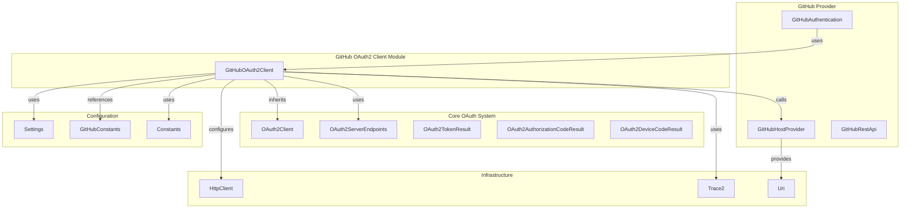
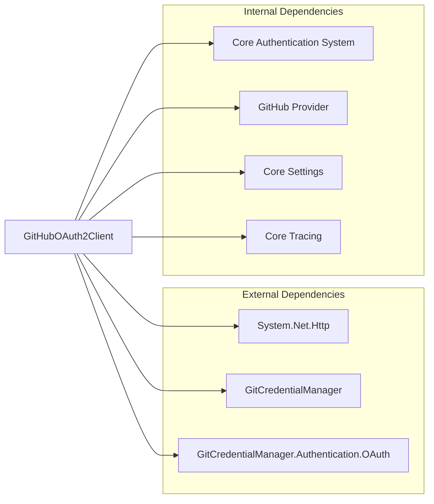
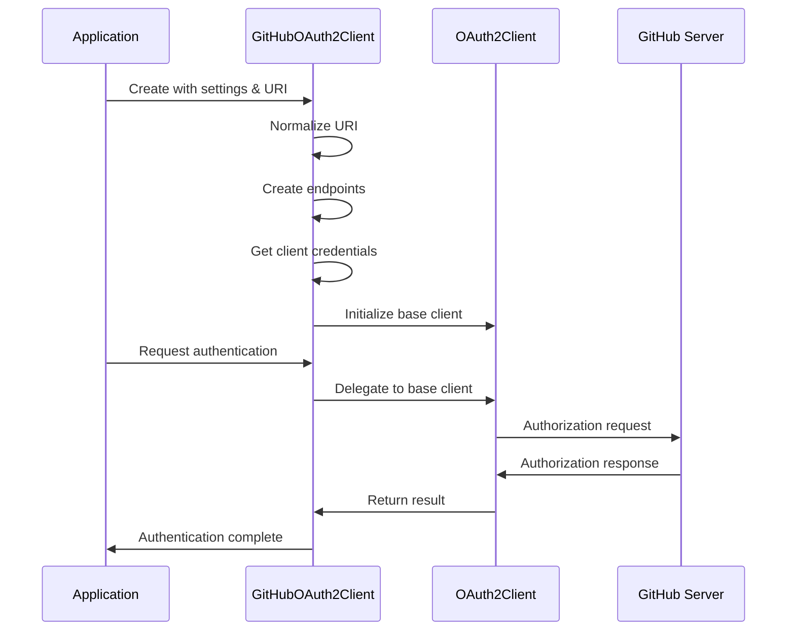
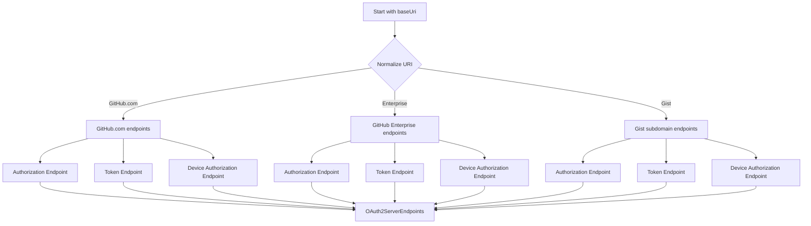

# GitHub OAuth2 Client Module

## Introduction

The GitHub OAuth2 Client module provides specialized OAuth 2.0 authentication capabilities for GitHub services within the Git Credential Manager. This module extends the base OAuth2Client functionality to handle GitHub-specific authentication requirements, including support for GitHub.com, GitHub Enterprise Server, and Gist subdomains.

## Overview

The GitHubOAuth2Client class serves as the primary implementation for handling OAuth 2.0 authentication flows with GitHub services. It encapsulates GitHub-specific configuration, endpoint management, and authentication logic while leveraging the core OAuth2Client infrastructure from the shared authentication system.

## Architecture

### Component Structure



### Dependencies



## Core Components

### GitHubOAuth2Client

The `GitHubOAuth2Client` class is the primary component that extends the base `OAuth2Client` with GitHub-specific functionality:

#### Key Responsibilities
- **Endpoint Configuration**: Dynamically creates OAuth2 server endpoints based on the target GitHub URI
- **Client Configuration**: Manages OAuth client credentials with support for developer overrides
- **Redirect URI Management**: Handles different redirect URIs for GitHub.com vs GitHub Enterprise
- **URI Normalization**: Supports Gist subdomains and other GitHub service variations

#### Constructor Parameters
- `HttpClient httpClient`: HTTP client for making OAuth requests
- `ISettings settings`: Configuration settings provider
- `Uri baseUri`: Base URI of the GitHub instance
- `ITrace2 trace2`: Tracing component for diagnostics

## Authentication Flow

### OAuth 2.0 Flow Process



### Endpoint Configuration



## Configuration Management

### Client Credential Resolution

The module supports multiple levels of configuration for OAuth client credentials:

1. **Developer Overrides**: Environment variables or Git configuration settings
2. **Default Values**: Built-in GitHub application credentials
3. **Dynamic Selection**: Different credentials for GitHub.com vs Enterprise

### Supported Configuration Keys

- `GCM_DEV_GITHUB_OAUTHCLIENTID`: Override OAuth client ID
- `GCM_DEV_GITHUB_OAUTHREDIRECTURI`: Override redirect URI
- `GCM_DEV_GITHUB_OAUTHCLIENTSECRET`: Override client secret
- Git configuration: `credential.gitHubDevOAuthClientId`
- Git configuration: `credential.gitHubDevOAuthRedirectUri`
- Git configuration: `credential.gitHubDevOAuthClientSecret`

## Integration Points

### GitHub Host Provider Integration

The GitHubOAuth2Client works closely with the [GitHub Host Provider](GitHub%20Host%20Provider.md) for:
- URI normalization
- GitHub.com detection
- Service endpoint resolution

### Authentication System Integration

Integrates with the broader [OAuth Authentication](OAuth%20Authentication.md) system through:
- Base OAuth2Client inheritance
- Standard OAuth2 token handling
- Device code flow support

### Settings Integration

Leverages the [Core Settings](Core%20Settings.md) system for:
- Configuration retrieval
- Developer override support
- Environment variable access

## Error Handling

The module relies on the base OAuth2Client for error handling, which provides:
- HTTP error processing
- OAuth2 error response parsing
- Retry logic for transient failures
- Detailed error reporting via Trace2

## Security Considerations

### Credential Management
- Client secrets are handled through secure configuration
- Developer overrides allow for custom application registration
- No hardcoded credentials in production code

### URI Validation
- All URIs are validated before use
- HTTPS enforcement for OAuth endpoints
- Proper URI normalization to prevent security issues

## Usage Examples

### Basic Usage

```csharp
// Create HTTP client
using var httpClient = new HttpClient();

// Get settings
var settings = new Settings();

// Create trace component
var trace2 = new Trace2();

// Create GitHub OAuth2 client
var gitHubUri = new Uri("https://github.com");
var oauthClient = new GitHubOAuth2Client(httpClient, settings, gitHubUri, trace2);

// Use for authentication (delegated to base OAuth2Client)
var result = await oauthClient.GetAuthorizationCodeAsync(/* parameters */);
```

### Enterprise GitHub Usage

```csharp
// Works with GitHub Enterprise Server
var enterpriseUri = new Uri("https://github.company.com");
var enterpriseOauthClient = new GitHubOAuth2Client(httpClient, settings, enterpriseUri, trace2);
```

## Testing and Development

### Developer Overrides

Developers can override default OAuth credentials for testing:

```bash
# Set environment variables
export GCM_DEV_GITHUB_OAUTHCLIENTID="your-client-id"
export GCM_DEV_GITHUB_OAUTHREDIRECTURI="http://localhost:8080/callback"
export GCM_DEV_GITHUB_OAUTHCLIENTSECRET="your-client-secret"

# Or use Git configuration
git config --global credential.gitHubDevOAuthClientId "your-client-id"
git config --global credential.gitHubDevOAuthRedirectUri "http://localhost:8080/callback"
git config --global credential.gitHubDevOAuthClientSecret "your-client-secret"
```

## Related Documentation

- [OAuth Authentication](OAuth%20Authentication.md) - Core OAuth2 authentication system
- [GitHub Host Provider](GitHub%20Host%20Provider.md) - GitHub service discovery and URI handling
- [Core Settings](Core%20Settings.md) - Configuration management system
- [Core Tracing](Core%20Tracing.md) - Diagnostic and logging infrastructure