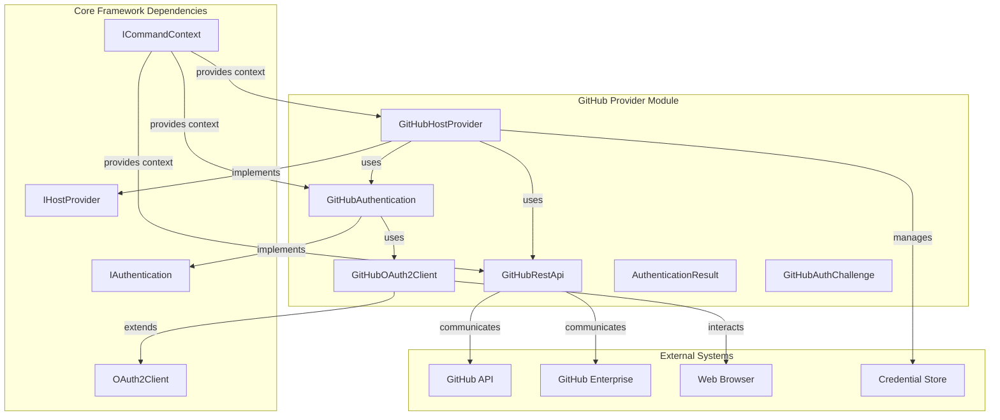
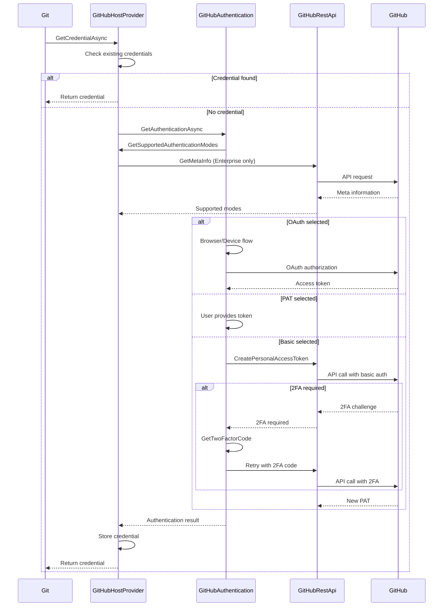

# GitHub Provider Module

## Overview

The GitHub Provider module is a specialized authentication provider for GitHub and GitHub Enterprise repositories within the Git Credential Manager system. It handles credential management, authentication flows, and API interactions specifically tailored for GitHub's authentication requirements.

## Purpose

This module serves as the primary interface between Git operations and GitHub's authentication systems, providing:

- **Multi-modal Authentication**: Support for OAuth, Personal Access Tokens (PAT), Basic Authentication, and Device Code flows
- **GitHub Enterprise Support**: Full compatibility with both GitHub.com and GitHub Enterprise Server instances
- **Account Management**: Intelligent account selection and filtering for multi-account scenarios
- **Security Enforcement**: HTTPS-only communication policies and secure credential storage
- **SSO/SAML Support**: Enterprise account filtering and domain-based authentication

## Architecture

## Core Components

### 1. GitHubHostProvider
The main provider class that implements the `IHostProvider` interface. It orchestrates credential operations and determines supported authentication methods based on the target GitHub instance.

**Key Responsibilities:**
- Detect GitHub.com vs GitHub Enterprise instances
- Determine supported authentication modes
- Manage credential lifecycle (get, store, erase)
- Handle account filtering and selection
- Enforce security policies (HTTPS-only)

**Detailed Documentation:** [GitHub Host Provider](GitHub%20Host%20Provider.md)

### 2. GitHubAuthentication
Handles all user authentication interactions, supporting both GUI and terminal-based prompts.

**Key Responsibilities:**
- Multi-modal authentication prompting
- OAuth browser and device code flows
- Two-factor authentication handling
- Account selection for multi-account scenarios
- Helper process integration

**Detailed Documentation:** [GitHub Authentication](GitHub%20Authentication.md)

### 3. GitHubOAuth2Client
Specialized OAuth2 client for GitHub's authentication endpoints.

**Key Responsibilities:**
- OAuth2 authorization code flow
- Device code authentication
- GitHub-specific OAuth parameter handling
- Enterprise vs GitHub.com endpoint management

**Detailed Documentation:** [GitHub OAuth2 Client](GitHub%20OAuth2%20Client.md)

### 4. GitHubRestApi
Provides REST API communication with GitHub services.

**Key Responsibilities:**
- Personal access token creation
- User information retrieval
- GitHub Enterprise metadata queries
- API endpoint normalization

**Detailed Documentation:** [GitHub REST API](GitHub%20REST%20API.md)

### 5. AuthenticationResult
Structured result types for GitHub authentication operations.

### 6. GitHubAuthChallenge
Handles WWW-Authenticate header parsing for enterprise domain filtering.

## Authentication Flows

## Integration Points

### Core Framework Integration
- **IHostProvider**: Main provider interface implementation
- **ICommandContext**: Dependency injection container
- **ICredentialStore**: Credential persistence
- **ISettings**: Configuration management

### Authentication System Integration
- **OAuth2Client**: Base OAuth functionality
- **IOAuth2WebBrowser**: Browser integration
- **AuthenticationBase**: Common authentication patterns

### UI Framework Integration
- **AvaloniaUI**: Cross-platform GUI support
- **TerminalMenu**: Command-line interface
- **Helper processes**: External authentication helpers

## Security Features

### HTTPS Enforcement
The provider enforces HTTPS-only communication for GitHub.com and provides clear error messages for HTTP attempts.

### Credential Security
- Secure credential storage using platform-specific credential managers
- No plaintext password storage (PATs only)
- Automatic credential validation before storage

### Enterprise Security
- Domain-based account filtering for Enterprise Managed Users (EMU)
- SAML/SSO integration support
- Enterprise-specific authentication mode detection

## Configuration

### Environment Variables
- `GCM_GITHUB_ACCOUNT_FILTERING`: Enable/disable account filtering
- `GCM_GITHUB_AUTH_HELPER`: Custom authentication helper path
- `GCM_GITHUB_AUTHMODES`: Override supported authentication modes

### Git Configuration
- `credential.github.accountFiltering`: Account filtering setting
- `credential.github.authHelper`: Authentication helper configuration
- `credential.github.authModes`: Authentication modes override

## Error Handling

The module implements comprehensive error handling with:
- Specific exceptions for authentication failures
- Detailed trace logging for debugging
- User-friendly error messages
- Graceful fallbacks for network issues

## Platform Support

The GitHub Provider supports all platforms through:
- Cross-platform UI framework (Avalonia)
- Platform-specific credential stores
- Terminal-based fallbacks
- Helper process integration

## Related Documentation

- [Core Application Framework](Core%20Application%20Framework.md) - Base framework components
- [Authentication System](Authentication%20System.md) - Authentication infrastructure
- [Host Provider Framework](Host%20Provider%20Framework.md) - Provider architecture
- [GitHub UI Components](GitHub%20UI%20Components.md) - User interface elements