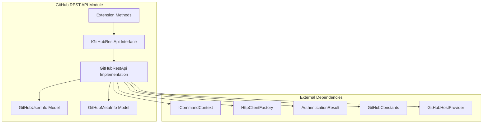
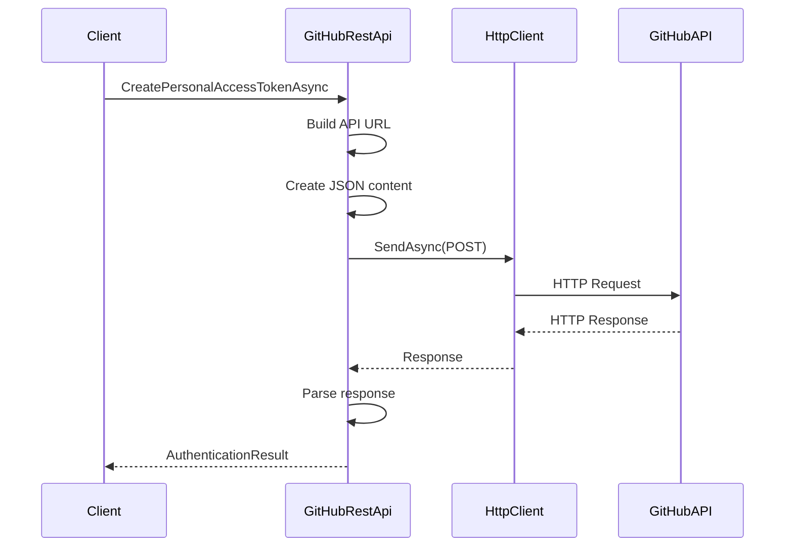
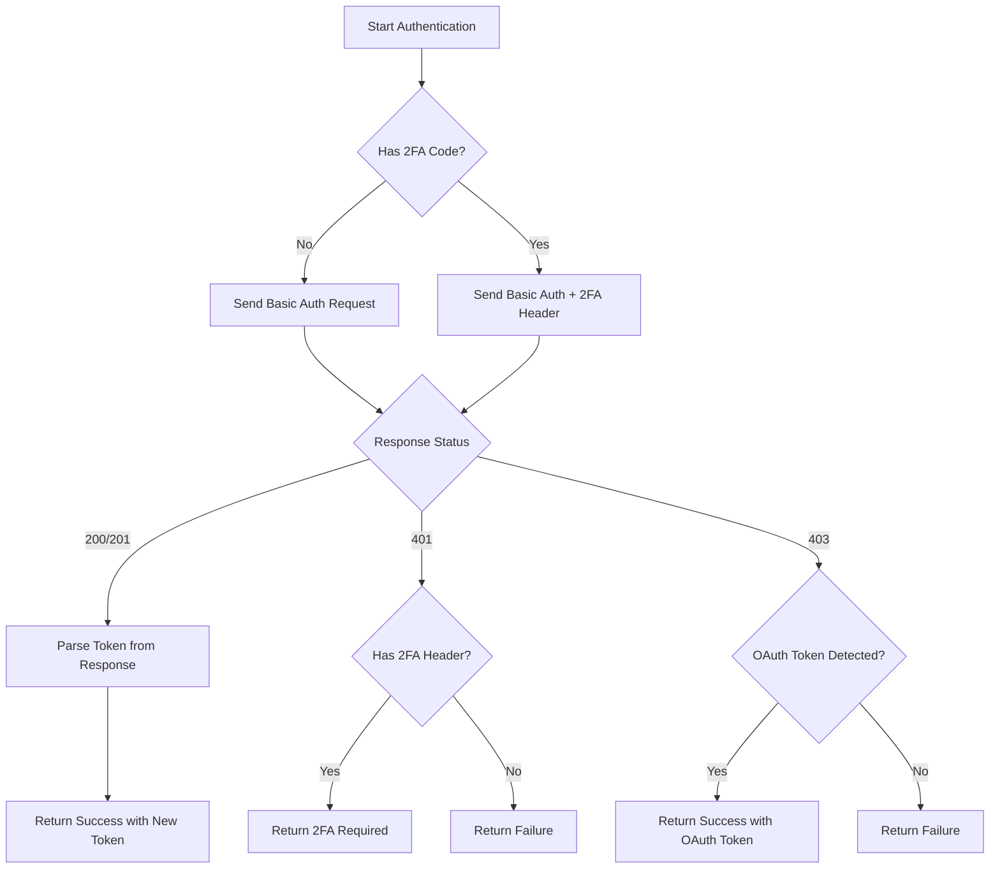
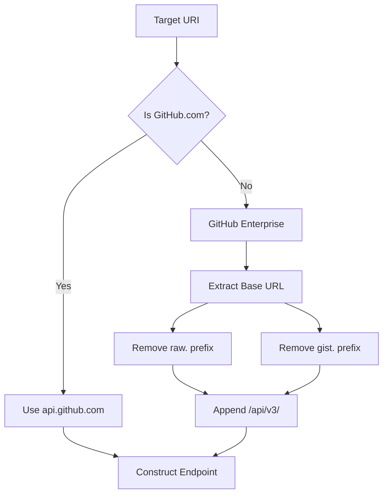
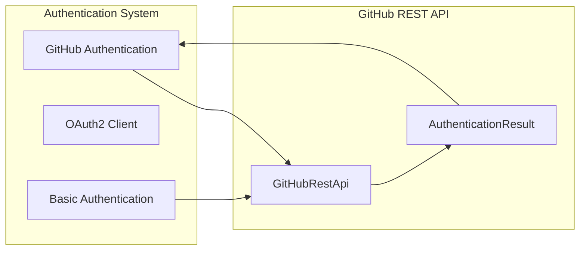

# GitHub REST API Module

## Introduction

The GitHub REST API module provides a comprehensive interface for interacting with GitHub's REST API endpoints. This module handles authentication, user information retrieval, and meta information queries for both GitHub.com and GitHub Enterprise Server instances. It serves as the primary communication layer between the Git Credential Manager and GitHub's API services.

## Architecture Overview

The GitHub REST API module is built around a clean interface-based architecture that separates concerns and provides testability. The module integrates with the broader GitHub provider ecosystem while maintaining independence from specific authentication mechanisms.



## Core Components

### IGitHubRestApi Interface

The `IGitHubRestApi` interface defines the contract for all GitHub REST API operations. It provides three primary methods:

- `CreatePersonalAccessTokenAsync`: Creates personal access tokens for authentication
- `GetUserInfoAsync`: Retrieves user information using an access token
- `GetMetaInfoAsync`: Fetches GitHub instance metadata

### GitHubRestApi Implementation

The `GitHubRestApi` class implements the interface and provides the actual HTTP communication logic. Key features include:

- **Timeout Management**: 15-second request timeout for all API calls
- **Authentication Handling**: Support for Basic and Bearer token authentication
- **Error Processing**: Comprehensive error handling for various HTTP status codes
- **URL Construction**: Intelligent API endpoint URL building for GitHub.com and Enterprise instances

### Data Models

#### GitHubUserInfo
Represents basic user information returned from the GitHub API:
```csharp
public class GitHubUserInfo
{
    [JsonPropertyName("login")]
    public string Login { get; set; }
}
```

#### GitHubMetaInfo
Contains metadata about the GitHub instance:
```csharp
public class GitHubMetaInfo
{
    [JsonPropertyName("installed_version")]
    public string InstalledVersion { get; set; }
    
    [JsonPropertyName("verifiable_password_authentication")]
    public bool VerifiablePasswordAuthentication { get; set; }
}
```

## Data Flow Architecture



## Authentication Flow

The module handles multiple authentication scenarios:



## API Endpoint Management

The module intelligently constructs API endpoints based on the target URI:



## Integration with Authentication System

The GitHub REST API module integrates seamlessly with the broader [Authentication System](Authentication System.md):



## Error Handling Strategy

The module implements comprehensive error handling for various scenarios:

### HTTP Status Code Handling
- **200/201**: Success - Parse token from response
- **401**: Unauthorized - Check for 2FA requirements
- **403**: Forbidden - Detect if OAuth token was used instead of password
- **Other**: General failure

### Two-Factor Authentication Support
The module detects when 2FA is required and returns appropriate result types:
- `TwoFactorApp`: Application-based 2FA required
- `TwoFactorSms`: SMS-based 2FA required

### OAuth Token Detection
When a 403 response is received, the module checks if an OAuth token was mistakenly used as the password. If detected, it treats this as a successful authentication since the token is already valid.

## Extension Methods

The module provides extension methods for convenient API usage:

```csharp
public static Task<AuthenticationResult> CreatePersonalTokenAsync(
    this IGitHubRestApi api,
    Uri targetUri,
    ICredential credentials,
    string authenticationCode,
    IEnumerable<string> scopes)
```

This extension method allows calling the API with `ICredential` objects instead of separate username/password parameters.

## Performance Considerations

- **Connection Reuse**: Uses a shared `HttpClient` instance for connection pooling
- **Timeout Control**: 15-second timeout prevents indefinite hanging
- **Async Operations**: All API calls are asynchronous to prevent blocking
- **Resource Management**: Implements `IDisposable` for proper cleanup

## Security Features

- **Secure Transport**: All communication uses HTTPS
- **Authentication Headers**: Proper handling of Basic and Bearer authentication
- **Token Validation**: Validates tokens before returning them
- **Error Sanitization**: Careful handling of authentication failures to prevent information leakage

## Dependencies

The module relies on several core components:

- **[Core Application Framework](Core Application Framework.md)**: Provides `ICommandContext` for logging and HTTP client factory
- **[Authentication System](Authentication System.md)**: Shares `AuthenticationResult` types and authentication constants
- **[GitHub Provider](GitHub Provider.md)**: Uses `GitHubHostProvider` for URL determination

## Usage Examples

### Creating a Personal Access Token
```csharp
var api = new GitHubRestApi(context);
var result = await api.CreatePersonalAccessTokenAsync(
    targetUri: new Uri("https://github.com"),
    username: "user",
    password: "pass",
    authenticationCode: null,
    scopes: new[] { "repo", "user" }
);
```

### Retrieving User Information
```csharp
var userInfo = await api.GetUserInfoAsync(
    targetUri: new Uri("https://github.com"),
    accessToken: "token"
);
```

### Getting Meta Information
```csharp
var metaInfo = await api.GetMetaInfoAsync(
    targetUri: new Uri("https://github.enterprise.com")
);
```

## Testing Considerations

The module is designed for testability:
- Interface-based design allows for easy mocking
- Internal methods are exposed for unit testing
- HTTP client is injected via factory pattern
- Trace logging provides visibility into operations

## Future Enhancements

Potential areas for enhancement include:
- Support for additional GitHub API endpoints
- Rate limiting awareness and handling
- Caching mechanisms for frequently accessed data
- GraphQL API support alongside REST API