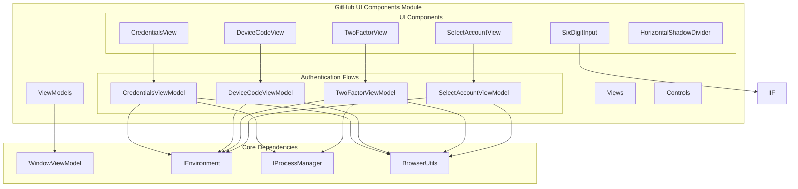
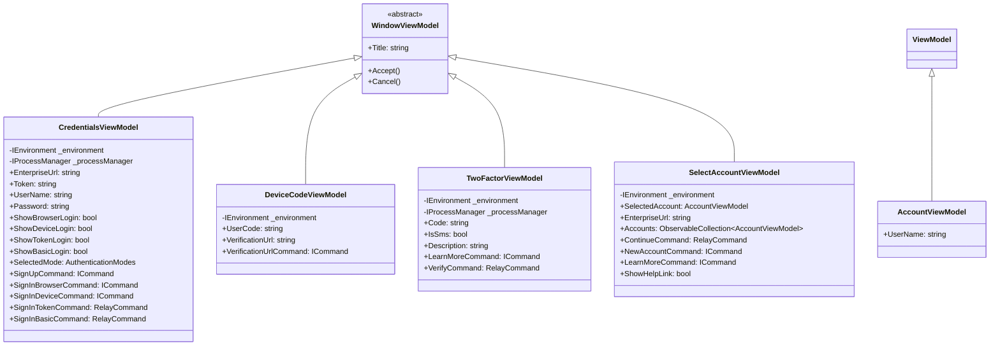
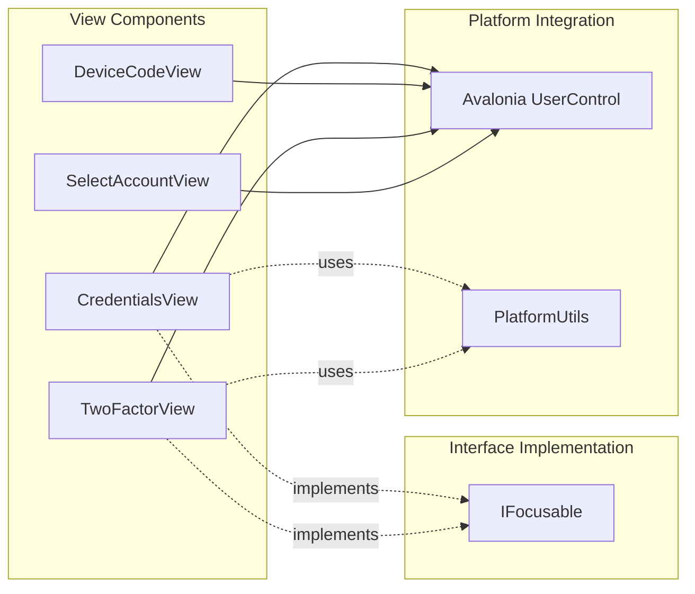
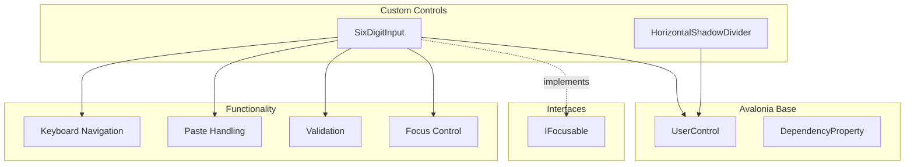
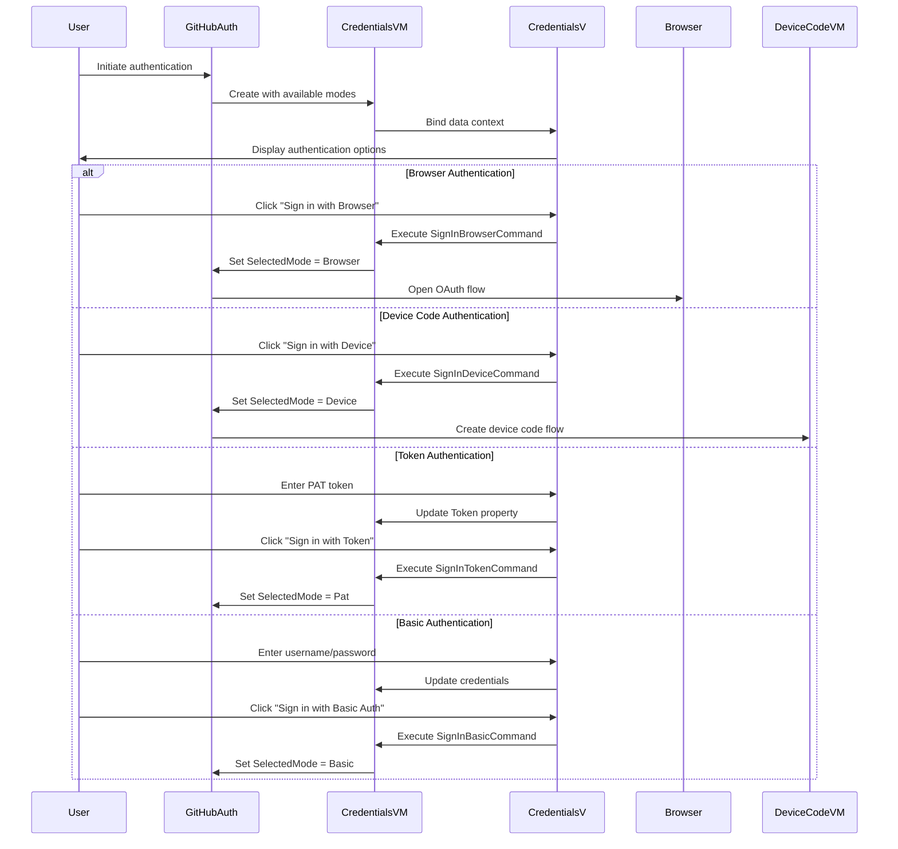
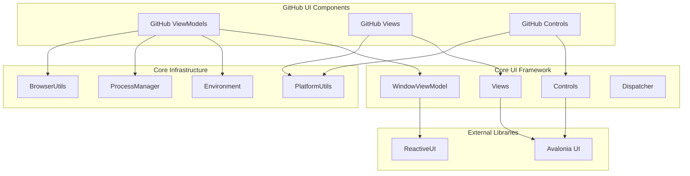
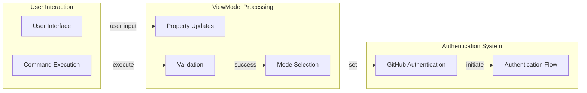
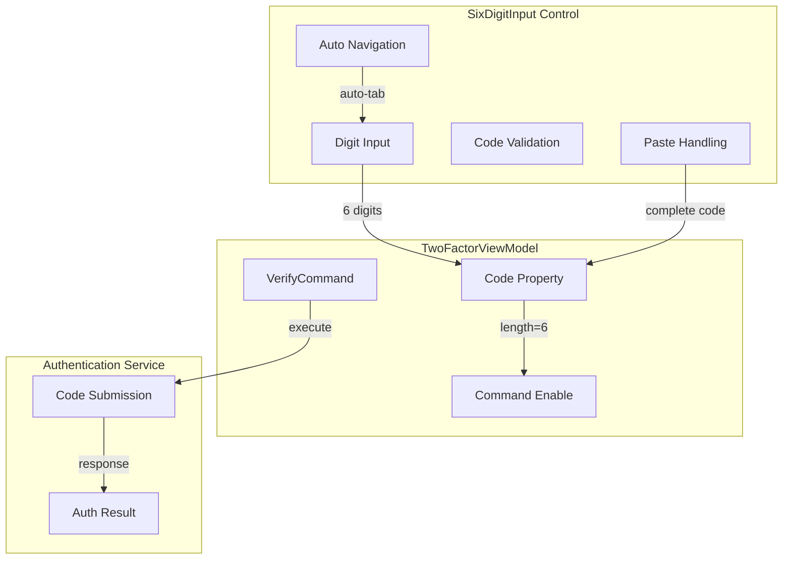

# GitHub UI Components Module

## Introduction

The GitHub UI Components module provides specialized user interface components for GitHub authentication and account management within the Git Credential Manager (GCM) system. This module extends the core UI framework with GitHub-specific views, view models, and custom controls designed to handle various authentication scenarios including OAuth, device code flow, two-factor authentication, and account selection.

## Architecture Overview

The GitHub UI Components module follows the Model-View-ViewModel (MVVM) pattern and integrates with the Avalonia UI framework. It provides a cohesive set of components that handle the complete GitHub authentication user experience.



## Component Architecture

### ViewModels Layer

The ViewModels layer implements the business logic for GitHub authentication scenarios:



### Views Layer

The Views layer provides the visual representation and user interaction handling:



### Controls Layer

Custom controls provide specialized UI elements for GitHub-specific interactions:



## Authentication Flow Integration

The GitHub UI Components integrate with the broader authentication system:



## Key Features

### Multi-Modal Authentication Support

The CredentialsViewModel supports four authentication modes:
- **Browser OAuth**: Redirects to GitHub's web-based OAuth flow
- **Device Code**: Provides device code for authentication on another device
- **Personal Access Token**: Direct token-based authentication
- **Basic Authentication**: Username/password credentials

### Two-Factor Authentication

The TwoFactorViewModel handles both SMS and authenticator app-based 2FA:
- Six-digit code input with validation
- Context-aware descriptions based on 2FA method
- Help link integration for user assistance

### Account Selection

The SelectAccountViewModel manages multiple GitHub accounts:
- Account list presentation with selection
- New account creation option
- Enterprise URL support for GitHub Enterprise instances

### Custom Input Controls

The SixDigitInput control provides specialized 2FA code entry:
- Automatic tab navigation between digit fields
- Paste support for complete codes
- Keyboard filtering for numeric input only
- Cross-platform focus management

## Dependencies

The GitHub UI Components module depends on several core systems:



## Data Flow

### Authentication Mode Selection



### Two-Factor Code Entry



## Platform Considerations

The GitHub UI Components include platform-specific workarounds and optimizations:

### macOS Focus Management
Due to platform limitations, certain focus operations are disabled on macOS to prevent UI issues.

### Cross-Platform Browser Integration
Browser opening functionality adapts to platform-specific URL handling mechanisms.

### Input Validation
Keyboard input filtering ensures consistent behavior across Windows, macOS, and Linux platforms.

## Integration Points

### Host Provider Integration
The UI components integrate with the [GitHub Provider](GitHub Provider.md) module to provide authentication services.

### Core UI Framework
Components extend the base classes provided by the [UI Framework](UI Framework.md) module.

### Authentication System
UI flows coordinate with the [Authentication System](Authentication System.md) for credential validation and storage.

## Usage Patterns

### Basic Authentication Flow
```csharp
// Create credentials view model
var vm = new CredentialsViewModel(environment, processManager);

// Configure available authentication modes
vm.ShowBrowserLogin = true;
vm.ShowTokenLogin = true;
vm.ShowBasicLogin = true;

// Handle authentication result
if (vm.ShowDialog() == true)
{
    var selectedMode = vm.SelectedMode;
    // Process authentication based on selected mode
}
```

### Two-Factor Authentication
```csharp
// Create 2FA view model
var vm = new TwoFactorViewModel(environment, processManager);
vm.IsSms = false; // or true for SMS

// Get user input
if (vm.ShowDialog() == true)
{
    var code = vm.Code;
    // Submit 2FA code
}
```

### Account Selection
```csharp
// Create account selection view model
var accounts = new[] { "user1", "user2", "user3" };
var vm = new SelectAccountViewModel(environment, accounts);

// Handle selection
if (vm.ShowDialog() == true)
{
    var selectedAccount = vm.SelectedAccount;
    if (selectedAccount == null)
    {
        // New account flow
    }
    else
    {
        // Existing account flow
    }
}
```

## Error Handling

The GitHub UI Components implement comprehensive error handling:

- **Input Validation**: Real-time validation of user inputs with visual feedback
- **Command Validation**: Enable/disable commands based on input validity
- **Platform Error Handling**: Graceful handling of platform-specific issues
- **Browser Integration**: Fallback mechanisms for browser opening failures

## Security Considerations

- **Credential Masking**: Password and token inputs are masked in the UI
- **Secure Storage**: Credentials are passed to secure storage systems, not persisted in UI components
- **Input Sanitization**: All user inputs are validated and sanitized before processing
- **Browser Security**: OAuth flows use system default browsers for security

## Testing

The module supports comprehensive testing through:

- **Mock Dependencies**: All external dependencies are interface-based for easy mocking
- **Designer Support**: ViewModels include parameterless constructors for XAML designer support
- **Platform Testing**: Platform-specific code paths can be tested with appropriate mocks
- **UI Automation**: Custom controls support UI automation for testing frameworks