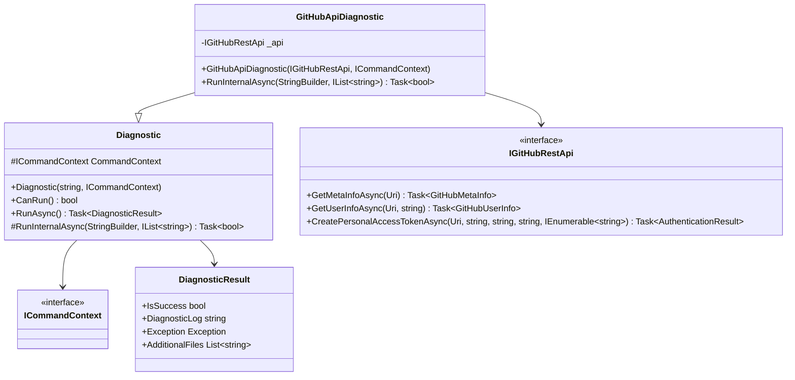
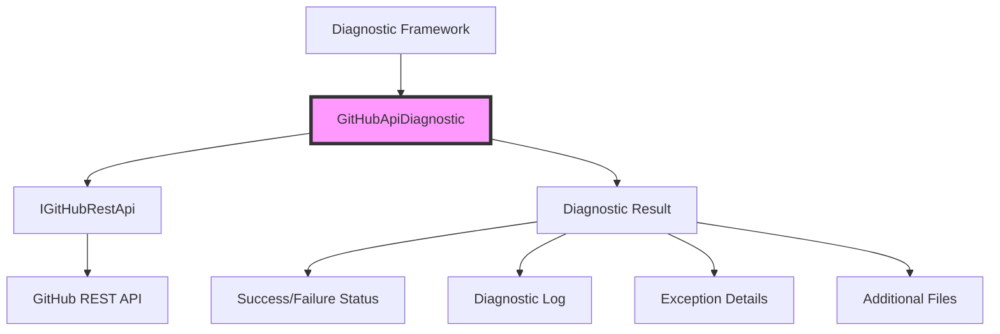
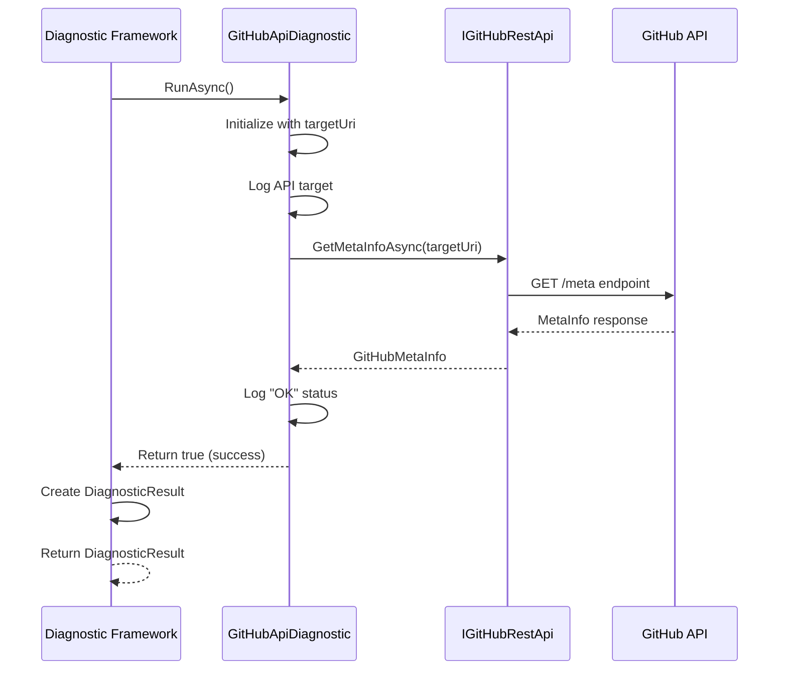
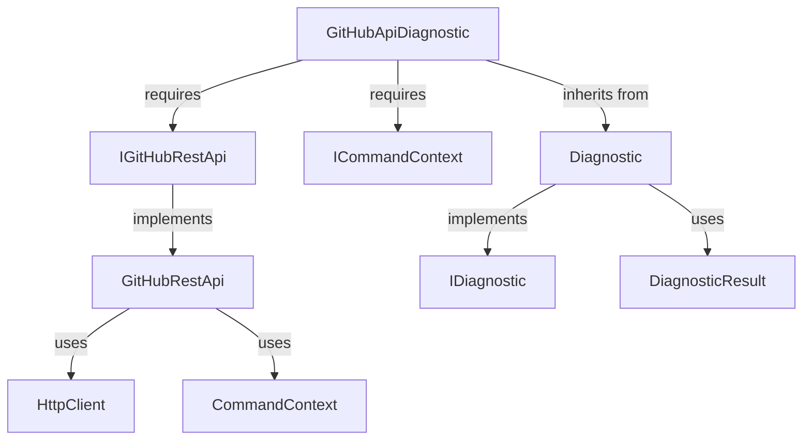
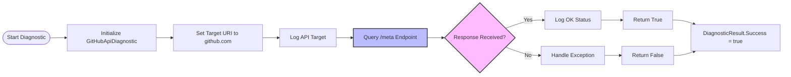

# GitHubApiDiagnostic Module Documentation

## Overview

The GitHubApiDiagnostic module provides diagnostic capabilities specifically designed to test connectivity and functionality of GitHub's REST API endpoints. This diagnostic tool is essential for troubleshooting GitHub authentication and API access issues within the Git Credential Manager ecosystem.

## Purpose and Core Functionality

The GitHubApiDiagnostic serves as a specialized diagnostic component that:

- **Validates GitHub API connectivity** by testing the `/meta` endpoint
- **Provides network diagnostics** for GitHub.com and GitHub Enterprise Server instances
- **Integrates with the diagnostic framework** to deliver standardized diagnostic results
- **Supports troubleshooting** of GitHub authentication and API access issues

## Architecture and Component Relationships

### Core Component Structure

### Integration with Diagnostic Framework

### Data Flow Architecture

## Component Details

### GitHubApiDiagnostic Class

**Namespace**: `GitHub.Diagnostics`  
**Inheritance**: `Diagnostic` (abstract base class)  
**Purpose**: Specialized diagnostic for GitHub API connectivity testing

#### Key Properties
- `_api` (IGitHubRestApi): Reference to the GitHub REST API client
- `Name`: Inherited from base class, set to "GitHub API"

#### Key Methods
- `RunInternalAsync(StringBuilder log, IList<string> additionalFiles)`: Core diagnostic execution logic
  - Creates target URI for `https://github.com`
  - Logs the API target being used
  - Queries the `/meta` endpoint to validate connectivity
  - Returns success status based on API response

### Dependencies and Integration Points

#### Required Dependencies

#### Integration with GitHub Provider Module
The GitHubApiDiagnostic integrates closely with the [GitHub Provider Module](GitHubProvider.md) components:

- **IGitHubRestApi**: Shared interface for GitHub REST API operations
- **GitHubRestApi**: Concrete implementation providing API access
- **Authentication mechanisms**: Leverages existing GitHub authentication infrastructure

## Process Flow

### Diagnostic Execution Flow

### Error Handling and Reporting

The diagnostic implements robust error handling through the inherited `Diagnostic` base class:

1. **Exception Capture**: Any exceptions during `RunInternalAsync` are caught and stored in the `DiagnosticResult`
2. **Logging**: All operations are logged to the diagnostic log for troubleshooting
3. **Status Reporting**: Success/failure status is clearly communicated through the `DiagnosticResult`

## Usage Scenarios

### Primary Use Cases

1. **Network Connectivity Testing**: Validates that the GitHub API is accessible from the current environment
2. **Authentication Troubleshooting**: Helps diagnose issues with GitHub authentication flows
3. **Enterprise Server Validation**: Tests connectivity to GitHub Enterprise Server instances
4. **Diagnostic Reporting**: Provides standardized diagnostic output for support scenarios

### Integration Points

The GitHubApiDiagnostic is typically invoked through the diagnostic framework as part of:
- Comprehensive system diagnostics
- GitHub-specific troubleshooting workflows
- Authentication failure analysis
- Network connectivity validation

## Configuration and Settings

The diagnostic leverages existing configuration from:
- **Command Context**: Provides trace logging and HTTP client factory
- **GitHub REST API**: Inherits timeout settings (15-second request timeout)
- **Network Configuration**: Uses proxy settings from the core framework

## Platform Support

The GitHubApiDiagnostic supports all platforms where the Git Credential Manager operates:
- Windows
- macOS  
- Linux

Platform-specific considerations are handled by the underlying `IGitHubRestApi` implementation and cross-platform HTTP client infrastructure.

## Related Documentation

- [GitHub Provider Module](GitHubProvider.md) - Core GitHub integration components
- [Diagnostics Framework](Diagnostics.md) - General diagnostic framework documentation
- [GitHub REST API](GitHubRestApi.md) - Detailed GitHub API implementation
- [Authentication System](Authentication.md) - Authentication infrastructure overview