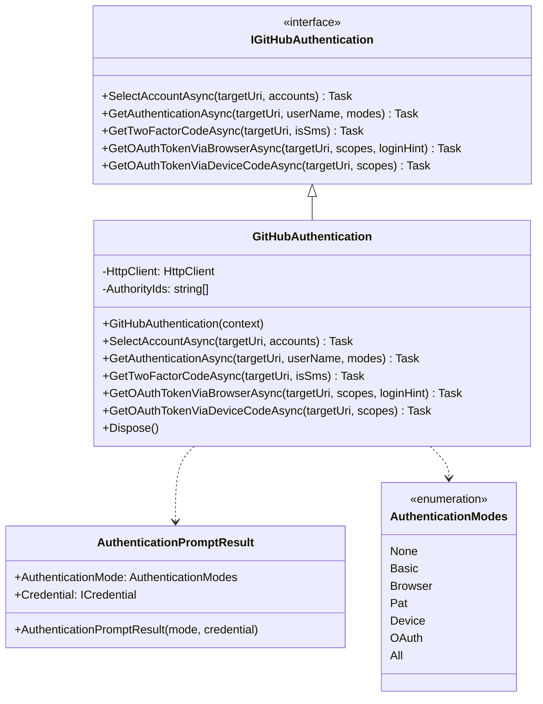
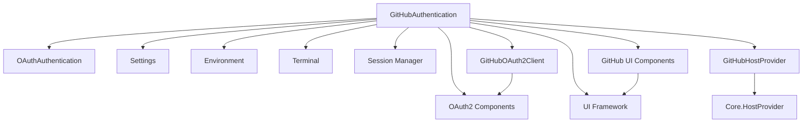
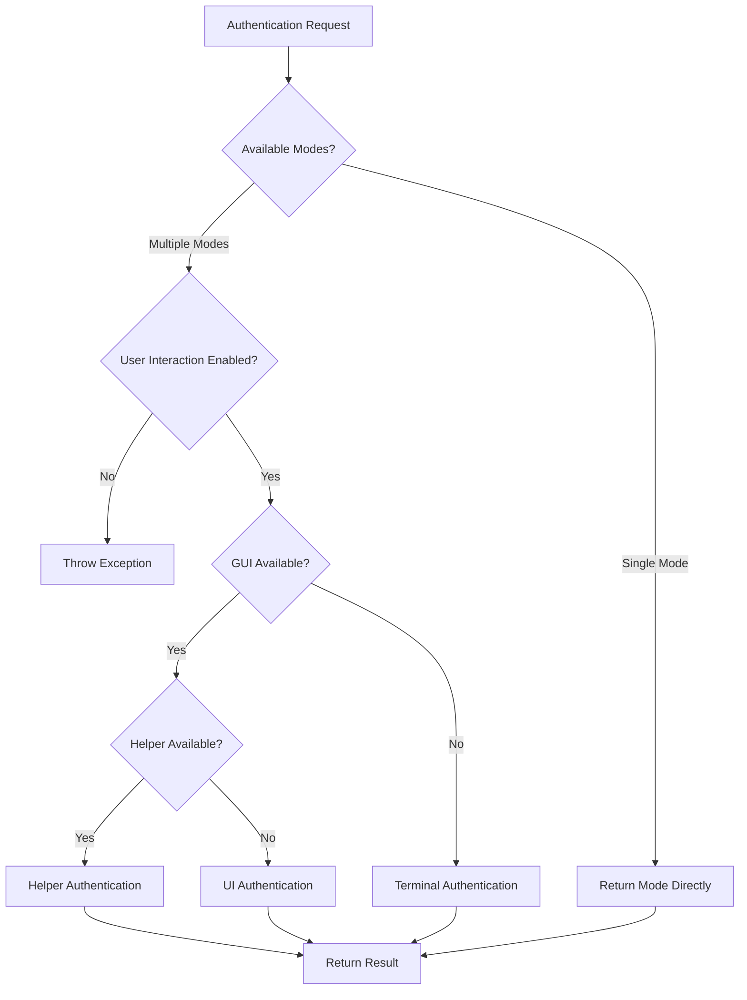
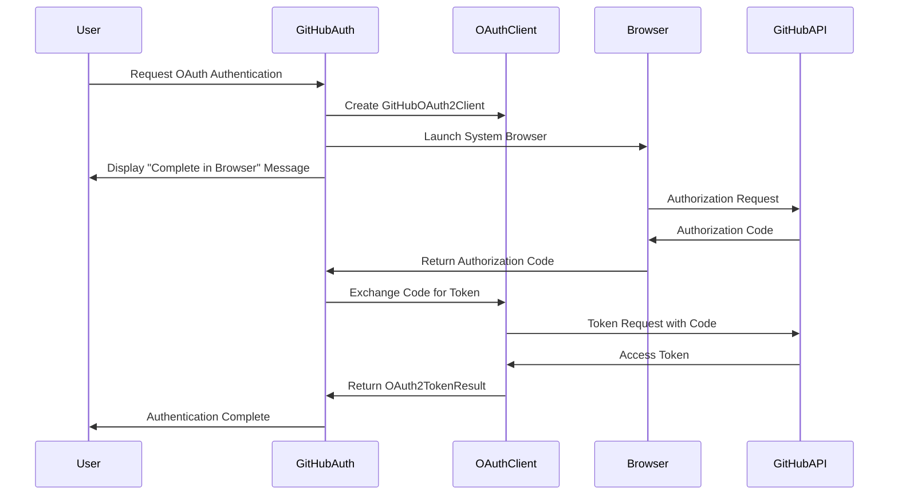
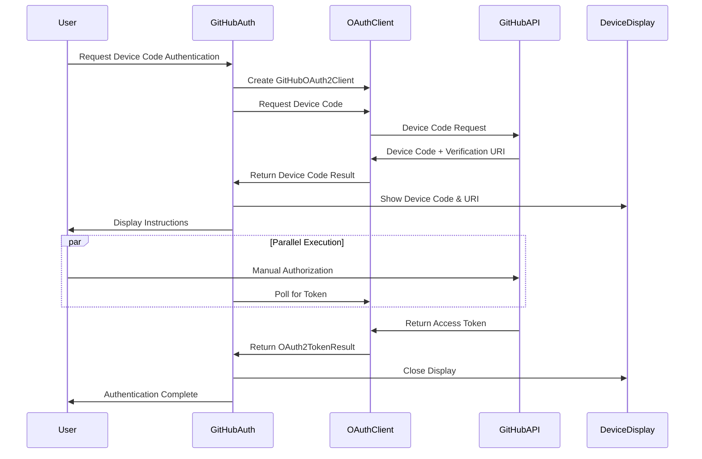

# GitHubAuthentication Module Documentation

## Overview

The GitHubAuthentication module provides comprehensive authentication capabilities for GitHub repositories, supporting multiple authentication methods including OAuth2, personal access tokens, basic authentication, and two-factor authentication. It serves as the primary authentication interface for GitHub operations within the Git Credential Manager ecosystem.

## Purpose and Core Functionality

The module is designed to:
- Handle various GitHub authentication scenarios (OAuth2 browser flow, device code flow, personal access tokens, basic auth)
- Provide user-friendly authentication prompts via GUI, terminal, or helper applications
- Support two-factor authentication for enhanced security
- Manage account selection for multi-account scenarios
- Integrate seamlessly with Git operations requiring authentication

## Architecture

### Component Structure



### Module Dependencies



## Core Components

### IGitHubAuthentication Interface
The primary interface defining the contract for GitHub authentication operations:

- **SelectAccountAsync**: Presents account selection for multi-account scenarios
- **GetAuthenticationAsync**: Main authentication method supporting multiple modes
- **GetTwoFactorCodeAsync**: Handles two-factor authentication code collection
- **GetOAuthTokenViaBrowserAsync**: Implements OAuth2 browser flow
- **GetOAuthTokenViaDeviceCodeAsync**: Implements OAuth2 device code flow

### AuthenticationPromptResult
Encapsulates the result of authentication prompts:
- **AuthenticationMode**: The selected authentication method
- **Credential**: Optional credential object (for non-OAuth methods)

### GitHubAuthentication Class
The main implementation providing:
- Multi-modal authentication support (Basic, OAuth, PAT, Device Code)
- Adaptive UI selection (GUI, Terminal, Helper application)
- Two-factor authentication handling
- OAuth2 flow management
- Resource cleanup via IDisposable

## Authentication Flows

### Authentication Mode Selection



### OAuth2 Browser Flow



### Device Code Flow



## User Interface Adaptation

The module adapts to different environments and user preferences:

### GUI Mode (Desktop Sessions)
- **Avalonia UI**: Modern cross-platform UI framework
- **Helper Applications**: External authentication helpers
- **Rich User Experience**: Full-featured dialogs and forms

### Terminal Mode (SSH/Headless)
- **Interactive Prompts**: Command-line input collection
- **Menu Selection**: Terminal-based option selection
- **Minimal Dependencies**: No GUI requirements

### Helper Application Mode
- **External Tools**: Pluggable authentication helpers
- **Process Communication**: Standard input/output protocols
- **Flexible Integration**: Custom authentication implementations

## Integration Points

### Core Dependencies
- **[CommandContext](Core.md)**: Provides execution context and services
- **[OAuth2Client](OAuth2.md)**: Handles OAuth2 protocol implementation
- **[GitHubHostProvider](GitHubHostProvider.md)**: GitHub-specific host integration
- **[ICredentialStore](CredentialManagement.md)**: Credential persistence

### Platform Integration
- **Windows**: DPAPI credential storage, Windows Credential Manager
- **macOS**: Keychain integration, native dialogs
- **Linux**: Secret Service, GPG pass store

## Security Considerations

### Authentication Security
- **Secure Storage**: Platform-specific encrypted credential storage
- **Token Management**: OAuth tokens with proper expiration handling
- **Input Validation**: Sanitization of user inputs and URLs
- **HTTPS Enforcement**: All OAuth flows use secure connections

### Two-Factor Authentication
- **TOTP Support**: Time-based one-time passwords
- **SMS Support**: SMS-delivered authentication codes
- **Fallback Mechanisms**: Multiple 2FA method support

## Error Handling

### Exception Types
- **Trace2Exception**: Traced errors with diagnostic information
- **InvalidOperationException**: Invalid authentication state
- **ArgumentException**: Invalid parameter validation
- **HttpRequestException**: Network-related failures

### User Experience
- **Graceful Degradation**: Fallback to alternative authentication methods
- **Clear Error Messages**: User-friendly error descriptions
- **Retry Mechanisms**: Automatic retry for transient failures

## Configuration

### Environment Variables
- `GCM_GITHUB_AUTH_HELPER`: Specifies authentication helper command
- `GCM_GUI_PROMPT`: Controls GUI prompt preference
- `GCM_TERMINAL_PROMPT`: Controls terminal prompt preference

### Git Configuration
- `credential.github.authHelper`: Repository-specific helper configuration
- `credential.github.provider`: Authentication provider selection

## Usage Examples

### Basic Authentication
```csharp
var auth = new GitHubAuthentication(context);
var result = await auth.GetAuthenticationAsync(
    targetUri: new Uri("https://github.com"),
    userName: null,
    modes: AuthenticationModes.Basic | AuthenticationModes.Pat
);
```

### OAuth2 Browser Flow
```csharp
var tokenResult = await auth.GetOAuthTokenViaBrowserAsync(
    targetUri: new Uri("https://github.com"),
    scopes: new[] { "repo", "user" },
    loginHint: "user@example.com"
);
```

### Device Code Flow
```csharp
var tokenResult = await auth.GetOAuthTokenViaDeviceCodeAsync(
    targetUri: new Uri("https://github.com"),
    scopes: new[] { "repo", "user" }
);
```

## Related Documentation

- [Core Authentication Framework](Core.Authentication.md)
- [OAuth2 Implementation](OAuth2.md)
- [GitHub Host Provider](GitHubHostProvider.md)
- [Credential Management](CredentialManagement.md)
- [UI Framework](Core.UI.md)
- [Platform Integration](Platform.md)