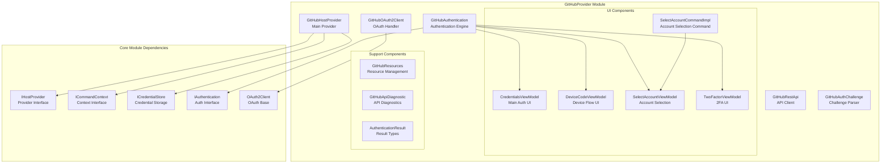
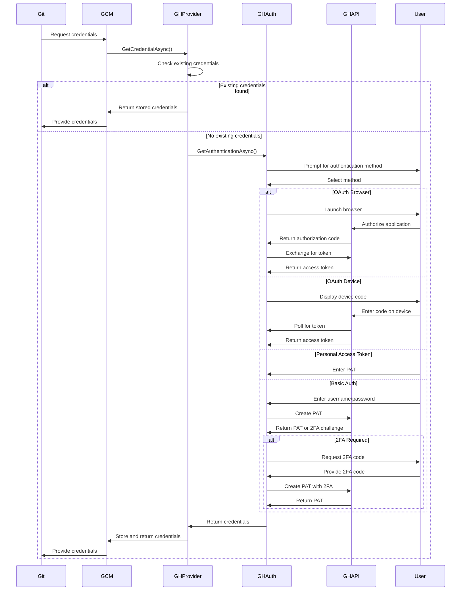

# GitHubProvider Module Documentation

## Overview

The GitHubProvider module is a comprehensive authentication and credential management system specifically designed for GitHub and GitHub Enterprise Server instances. It serves as a specialized host provider within the Git Credential Manager ecosystem, offering seamless integration with GitHub's authentication mechanisms and providing a unified interface for credential storage, retrieval, and management.

## Purpose and Core Functionality

The GitHubProvider module serves as the primary interface between Git operations and GitHub's authentication systems. It handles the complete lifecycle of GitHub credentials, from initial authentication through various methods (OAuth, Personal Access Tokens, Basic Authentication) to secure storage and subsequent retrieval. The module is designed to support both GitHub.com and GitHub Enterprise Server instances, providing a consistent authentication experience across different GitHub deployments.

The module's core functionality encompasses authentication flow management, credential storage and retrieval, multi-factor authentication support, and user interface interactions. It implements sophisticated account management features, including account selection for users with multiple GitHub accounts, domain-based filtering for Enterprise Managed Users (EMU), and automatic credential validation and refresh mechanisms.

## Architecture Overview

The GitHubProvider module follows a layered architecture pattern with clear separation of concerns across authentication, API communication, user interface, and credential management components. The architecture is built upon the foundation provided by the Core module, extending its capabilities with GitHub-specific functionality.

The architecture centers around the GitHubHostProvider, which implements the IHostProvider interface from the Core module. This provider acts as the main entry point and orchestrates all GitHub-specific operations. The authentication engine (GitHubAuthentication) handles the various authentication methods supported by GitHub, while the REST API client (GitHubRestApi) manages communication with GitHub's API endpoints.

The OAuth2 client (GitHubOAuth2Client) extends the base OAuth2Client from the Core module with GitHub-specific configurations, including proper endpoint management and client credential handling. The authentication challenge parser (GitHubAuthChallenge) processes WWW-Authenticate headers to extract domain hints for Enterprise Managed Users, enabling intelligent account filtering.

The user interface layer provides multiple view models and corresponding views for different authentication scenarios. The CredentialsViewModel handles the main authentication interface, supporting multiple authentication modes (browser, device, token, basic). The DeviceCodeViewModel manages the device flow authentication process, while the SelectAccountViewModel enables users to choose from multiple stored accounts. The TwoFactorViewModel handles two-factor authentication challenges.

## Sub-modules and Components

### GitHubHostProvider
The GitHubHostProvider is the central component that implements the IHostProvider interface and orchestrates all GitHub-specific credential operations. It determines whether a given URI is supported, manages credential retrieval and storage, and coordinates authentication flows. The provider includes sophisticated logic for handling both GitHub.com and GitHub Enterprise Server instances, with different authentication strategies for each.

### [GitHubAuthentication](GitHubAuthentication.md)
The GitHubAuthentication component implements the IGitHubAuthentication interface and serves as the primary authentication engine. It supports multiple authentication methods including OAuth via browser, OAuth via device code, personal access tokens, and basic authentication. The component handles user interaction through both graphical interfaces and terminal prompts, adapting to the available environment.

### [GitHubRestApi](GitHubRestApi.md)
The GitHubRestApi component provides a specialized HTTP client for GitHub's REST API, handling authentication, personal access token creation, user information retrieval, and server metadata queries. It implements proper error handling for various HTTP status codes and supports both GitHub.com and GitHub Enterprise Server API endpoints.

### GitHubOAuth2Client
The GitHubOAuth2Client extends the base OAuth2Client with GitHub-specific configurations, including proper endpoint URLs, client credentials, and redirect URI management. It supports both the standard OAuth authorization code flow and the device authorization grant flow.

### [GitHubUI](GitHubUI.md)
The UI layer provides comprehensive authentication interfaces through multiple view models and views. These components handle user interaction for authentication selection, account management, device code display, and two-factor authentication challenges. The UI components support both Avalonia-based graphical interfaces and terminal-based prompts.

## Integration with Core Module

The GitHubProvider module builds extensively upon the Core module's infrastructure, utilizing its authentication frameworks, credential storage mechanisms, and platform abstractions. The integration follows a dependency injection pattern where the Core module provides essential services through interfaces.

The module leverages the Core's OAuth2 implementation through inheritance, extending the base OAuth2Client with GitHub-specific behavior. It utilizes the Core's credential storage system through the ICredentialStore interface, ensuring secure and consistent credential management across all host providers. The authentication base classes from the Core module provide common functionality for user interaction and helper process management.

Platform-specific implementations from the Core module enable the GitHubProvider to function consistently across Windows, macOS, and Linux environments. The module integrates with the Core's diagnostic framework, providing GitHub-specific diagnostic capabilities for troubleshooting authentication issues.

## Authentication Flow Architecture

The authentication flow architecture implements a sophisticated multi-method approach that adapts to different scenarios and user preferences. The system supports four primary authentication methods: OAuth via web browser, OAuth via device code, personal access tokens, and basic authentication with automatic PAT conversion.

The authentication flow begins when Git requests credentials for a GitHub repository. The GitHubHostProvider first checks for existing credentials in the secure store. If found, these are returned immediately. If no credentials exist, the provider initiates an authentication flow based on the supported methods for the target GitHub instance.

For GitHub.com, the system primarily offers OAuth and personal access token authentication, while GitHub Enterprise Server instances may support additional methods based on server configuration. The authentication engine presents available options to the user through the appropriate interface (graphical or terminal) and processes the selected method.

OAuth flows involve external browser interaction or device code presentation, with the system handling the complete authorization code exchange process. Personal access token authentication allows users to directly input existing tokens, while basic authentication automatically converts username/password combinations to personal access tokens through GitHub's API.

## Credential Management and Storage

The credential management system implements a secure, multi-layered approach to storing and retrieving GitHub credentials. The system integrates with platform-specific credential stores, utilizing Windows Credential Manager on Windows, macOS Keychain on macOS, and Secret Service on Linux distributions.

Credentials are stored with service names derived from the GitHub instance URL, ensuring proper isolation between different GitHub deployments. The system supports multiple accounts per service, enabling users to maintain separate credentials for different GitHub accounts. Account filtering mechanisms help users select appropriate credentials based on domain hints and Enterprise Managed User configurations.

The storage system implements automatic credential validation, ensuring stored credentials remain valid before returning them to Git operations. Invalid credentials trigger re-authentication flows, maintaining seamless user experience while ensuring security.

## Multi-Account Support and Account Filtering

The GitHubProvider implements sophisticated multi-account support, allowing users to maintain and switch between multiple GitHub accounts seamlessly. The system stores credentials for multiple accounts and provides intelligent account selection mechanisms based on various criteria.

Account filtering utilizes information from WWW-Authenticate headers to present only relevant accounts to users. For Enterprise Managed Users, the system parses domain hints to filter accounts based on enterprise membership. This prevents confusion and ensures users select appropriate credentials for their current context.

The account selection interface provides both graphical and terminal-based options, displaying available accounts with relevant metadata and allowing users to add new accounts or select existing ones. The system remembers user preferences and can automatically select appropriate accounts based on repository URLs and enterprise configurations.

## Enterprise Server Support

The GitHubProvider includes comprehensive support for GitHub Enterprise Server instances, adapting its behavior based on server capabilities and configurations. The system detects Enterprise Server instances through URL analysis and configures appropriate authentication methods based on server version and settings.

Enterprise Server support includes detection of available authentication methods through the server's meta endpoint, enabling appropriate authentication options based on server configuration. The system handles the unique aspects of Enterprise Server authentication, including potential basic authentication support and version-specific OAuth capabilities.

The provider implements special handling for Enterprise Server URLs, including support for subdomains and custom domains. It properly constructs API endpoints for Enterprise Server instances and handles the different authentication flows supported by various Enterprise Server versions.

## Security and Compliance Features

The GitHubProvider implements multiple security features to ensure credential safety and compliance with security best practices. All credentials are stored in platform-specific secure stores with appropriate encryption and access controls. The system never stores credentials in plain text and implements proper cleanup procedures for temporary data.

The module enforces HTTPS connections for all GitHub operations, preventing credential transmission over unencrypted channels. It implements certificate validation and supports enterprise certificate authorities for Enterprise Server deployments. The system includes protections against credential leakage and implements proper error handling to prevent sensitive information exposure.

Authentication flows include protection against common attacks, including CSRF protection for OAuth flows and proper validation of redirect URIs. The system implements rate limiting and retry logic to prevent abuse while maintaining reliability.

## Diagnostic and Troubleshooting Capabilities

The GitHubProvider includes comprehensive diagnostic capabilities to assist with troubleshooting authentication issues. The GitHubApiDiagnostic component tests connectivity to GitHub API endpoints and validates server responses, providing detailed diagnostic information for support scenarios.

The diagnostic system integrates with the Core module's diagnostic framework, providing GitHub-specific tests and validations. It can detect common issues such as network connectivity problems, authentication failures, and server configuration issues.

The system provides detailed logging and tracing capabilities, enabling administrators and support personnel to diagnose complex authentication problems. Trace information includes detailed flow tracking, API request/response logging, and error condition analysis.

## User Experience and Interface Design

The GitHubProvider emphasizes user experience through adaptive interface design that adjusts to different environments and user preferences. The system automatically selects appropriate interface modes based on available display capabilities, desktop session availability, and user settings.

Graphical interfaces provide rich authentication experiences with clear instructions, progress indicators, and helpful links. The system includes context-sensitive help and guidance, directing users to relevant documentation and support resources. Terminal-based interfaces offer equivalent functionality with clear prompts and instructions.

The interface design accommodates various authentication scenarios, from simple personal access token entry to complex multi-factor authentication flows. The system provides appropriate feedback throughout authentication processes and handles errors gracefully with clear explanations and recovery options.

## References to Related Modules

The GitHubProvider module integrates closely with several other modules in the system:

- **[Core Module](Core.md)**: Provides the foundational authentication frameworks, credential storage mechanisms, and platform abstractions that the GitHubProvider builds upon
- **[OAuth2 Module](OAuth2.md)**: Supplies the base OAuth2 implementation that GitHubOAuth2Client extends with GitHub-specific configurations
- **[Authentication Module](Authentication.md)**: Offers common authentication interfaces and base classes that GitHubAuthentication implements
- **[UI Module](UI.md)**: Provides the underlying UI framework and controls used by GitHub's authentication interfaces

These modules work together to provide a comprehensive authentication solution that handles the complexities of GitHub's various authentication methods while maintaining consistency with the overall system architecture.