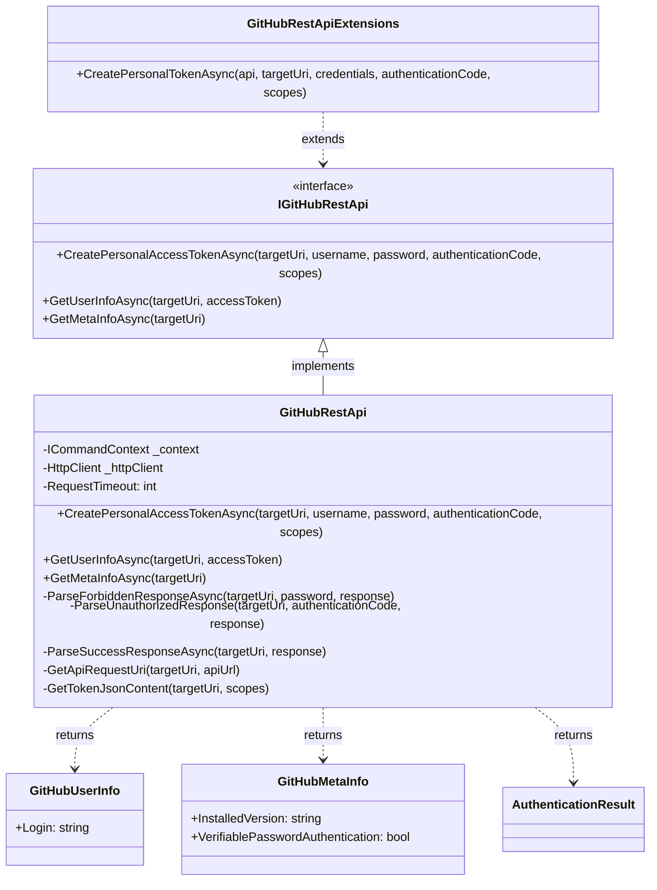
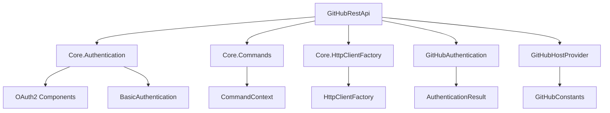
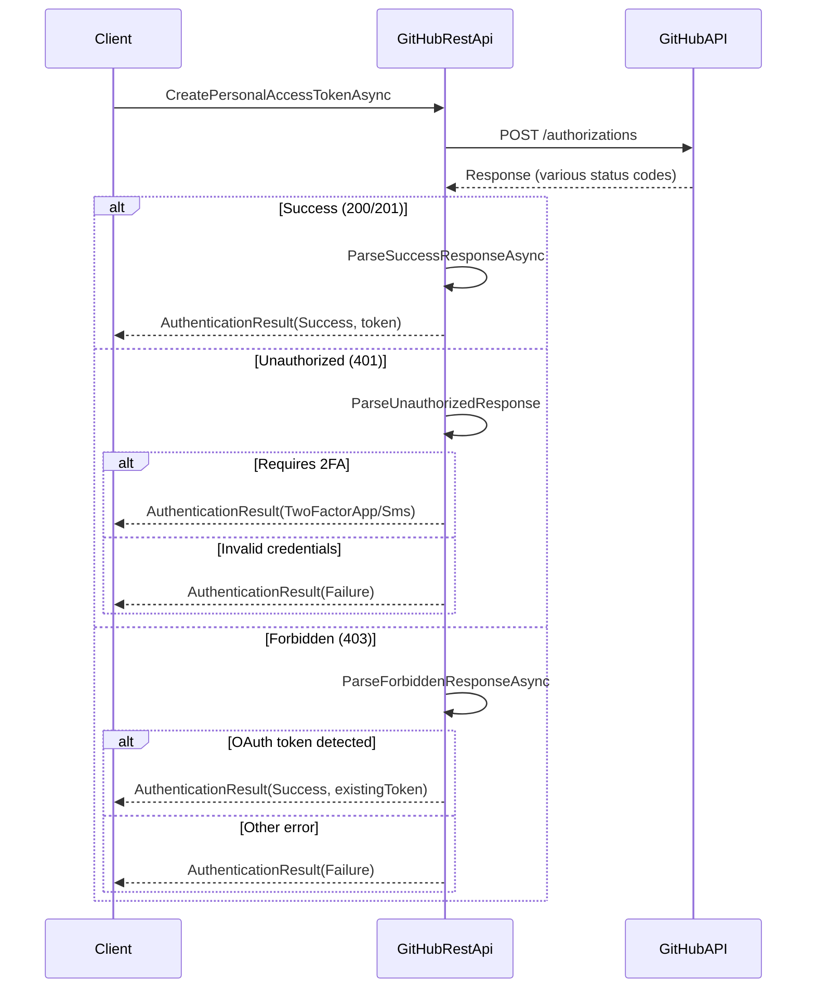
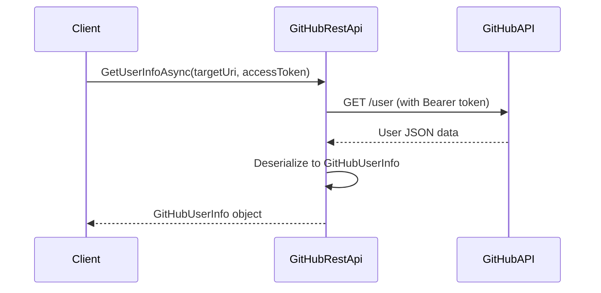
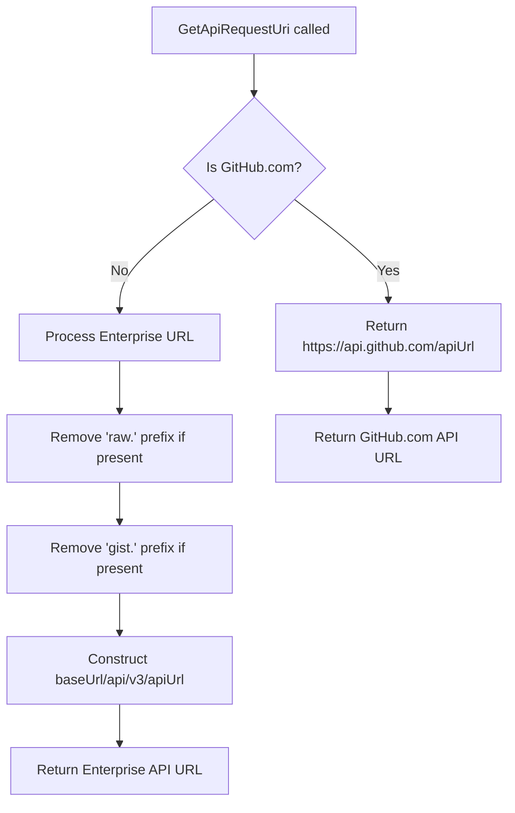

# GitHubRestApi Module Documentation

## Overview

The GitHubRestApi module provides a comprehensive interface for interacting with GitHub's REST API, enabling authentication, user information retrieval, and metadata access. This module serves as the core communication layer between the Git Credential Manager and GitHub's API services, supporting both GitHub.com and GitHub Enterprise environments.

## Purpose and Core Functionality

The GitHubRestApi module is designed to:

- **Authenticate users** with GitHub through personal access token creation
- **Retrieve user information** from GitHub accounts
- **Access GitHub instance metadata** for configuration and compatibility checks
- **Support multiple GitHub environments** including GitHub.com and GitHub Enterprise
- **Handle various authentication scenarios** including two-factor authentication
- **Provide secure HTTP communication** with proper timeout and header management

## Architecture

### Component Structure



### Module Dependencies



## Core Components

### IGitHubRestApi Interface

The primary interface defining the contract for GitHub REST API operations:

- **CreatePersonalAccessTokenAsync**: Creates personal access tokens for GitHub authentication
- **GetUserInfoAsync**: Retrieves user information using an access token
- **GetMetaInfoAsync**: Fetches GitHub instance metadata and configuration

### GitHubRestApi Class

The main implementation providing HTTP communication with GitHub's REST API:

#### Key Properties
- **RequestTimeout**: 15-second timeout for all HTTP requests
- **HttpClient**: Lazy-initialized HTTP client with proper headers and configuration

#### Core Methods

##### CreatePersonalAccessTokenAsync
Creates personal access tokens through GitHub's authorizations API:
- Supports basic authentication with username/password
- Handles two-factor authentication codes
- Processes various response scenarios (success, unauthorized, forbidden)
- Returns appropriate authentication results

##### GetUserInfoAsync
Retrieves authenticated user information:
- Uses bearer token authentication
- Returns user login information
- Handles HTTP error responses appropriately

##### GetMetaInfoAsync
Fetches GitHub instance metadata:
- Retrieves version and authentication configuration
- Useful for compatibility checks
- Works with both GitHub.com and Enterprise instances

### Data Transfer Objects

#### GitHubUserInfo
```csharp
public class GitHubUserInfo
{
    [JsonPropertyName("login")]
    public string Login { get; set; }
}
```

#### GitHubMetaInfo
```csharp
public class GitHubMetaInfo
{
    [JsonPropertyName("installed_version")]
    public string InstalledVersion { get; set; }
    
    [JsonPropertyName("verifiable_password_authentication")]
    public bool VerifiablePasswordAuthentication { get; set; }
}
```

## Data Flow

### Authentication Flow



### User Information Retrieval



## API Endpoint Management

### GitHub.com vs Enterprise URL Construction

The module intelligently constructs API URLs based on the target URI:



## Error Handling and Response Processing

### Authentication Response Handling

The module implements sophisticated response parsing for different authentication scenarios:

1. **Success Responses (200/201)**: Extracts the personal access token from JSON response
2. **Unauthorized (401)**: 
   - Checks for two-factor authentication requirements
   - Determines if app-based or SMS-based 2FA is needed
3. **Forbidden (403)**:
   - Detects if an OAuth token was supplied instead of password
   - Returns success with the existing token if valid

### HTTP Client Configuration

- **Timeout**: 15-second request timeout
- **Headers**: Accept header set to GitHub API requirements
- **Authentication**: Supports both Basic and Bearer token authentication
- **Tracing**: Comprehensive request/response logging

## Integration with Git Credential Manager

### Dependency Injection

The module integrates with the Core module's dependency injection system:

```csharp
public GitHubRestApi(ICommandContext context)
{
    EnsureArgument.NotNull(context, nameof(context));
    _context = context;
}
```

### HttpClient Factory

Leverages the Core.HttpClientFactory for HTTP client creation:

```csharp
private HttpClient HttpClient
{
    get
    {
        if (_httpClient is null)
        {
            _httpClient = _context.HttpClientFactory.CreateClient();
            _httpClient.Timeout = TimeSpan.FromMilliseconds(RequestTimeout);
            _httpClient.DefaultRequestHeaders.Accept.Add(
                new MediaTypeWithQualityHeaderValue(GitHubConstants.GitHubApiAcceptsHeaderValue));
        }
        return _httpClient;
    }
}
```

## Security Considerations

### Authentication Security
- Supports multiple authentication methods (Basic, Bearer, OAuth)
- Handles two-factor authentication securely
- Implements proper credential validation
- Uses HTTPS for all API communications

### Data Protection
- Personal access tokens are securely processed and returned
- No sensitive data is logged or cached
- Proper disposal of HTTP clients and resources

## Extension Methods

The module provides convenient extension methods for easier integration:

```csharp
public static Task<AuthenticationResult> CreatePersonalTokenAsync(
    this IGitHubRestApi api,
    Uri targetUri,
    ICredential credentials,
    string authenticationCode,
    IEnumerable<string> scopes)
```

This extension method allows using `ICredential` objects directly instead of separate username/password parameters.

## Related Documentation

- [GitHubAuthentication Module](GitHubAuthentication.md) - Authentication logic and result handling
- [GitHubHostProvider Module](GitHubHostProvider.md) - GitHub-specific host provider implementation
- [Core.HttpClientFactory Module](Core.HttpClientFactory.md) - HTTP client factory pattern implementation
- [Core.Authentication Module](Core.Authentication.md) - Core authentication interfaces and utilities

## Usage Examples

### Creating a Personal Access Token

```csharp
var api = new GitHubRestApi(commandContext);
var result = await api.CreatePersonalAccessTokenAsync(
    targetUri: new Uri("https://github.com"),
    username: "user@example.com",
    password: "password",
    authenticationCode: null,
    scopes: new[] { "repo", "user" }
);

if (result.Type == GitHubAuthenticationResultType.Success)
{
    var token = result.Token;
    // Use the token for subsequent API calls
}
```

### Retrieving User Information

```csharp
var userInfo = await api.GetUserInfoAsync(
    targetUri: new Uri("https://github.com"),
    accessToken: "ghp_xxxxxxxxxxxx"
);

Console.WriteLine($"Authenticated as: {userInfo.Login}");
```

### Getting GitHub Instance Metadata

```csharp
var metaInfo = await api.GetMetaInfoAsync(
    targetUri: new Uri("https://github.company.com")
);

Console.WriteLine($"GitHub Enterprise version: {metaInfo.InstalledVersion}");
Console.WriteLine($"Password authentication enabled: {metaInfo.VerifiablePasswordAuthentication}");
```