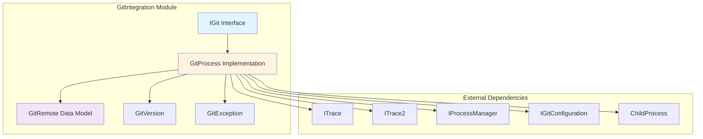
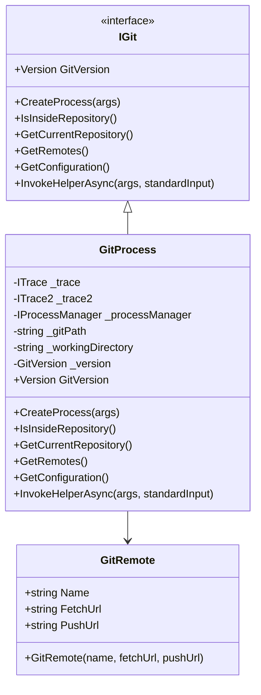
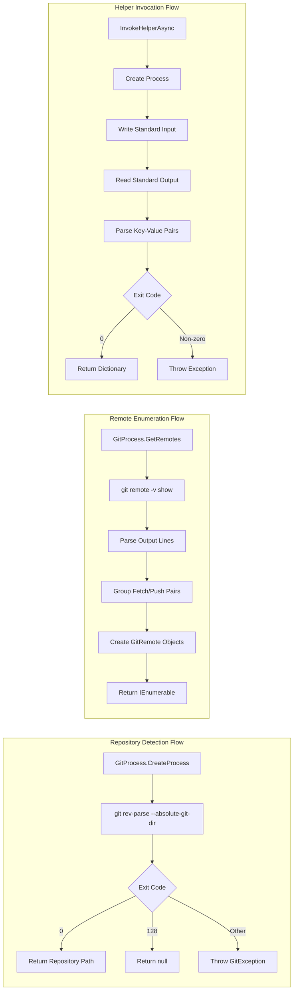
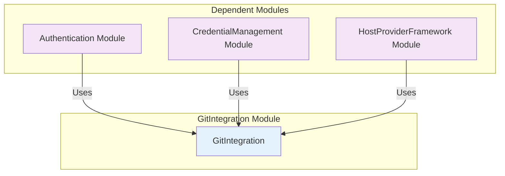
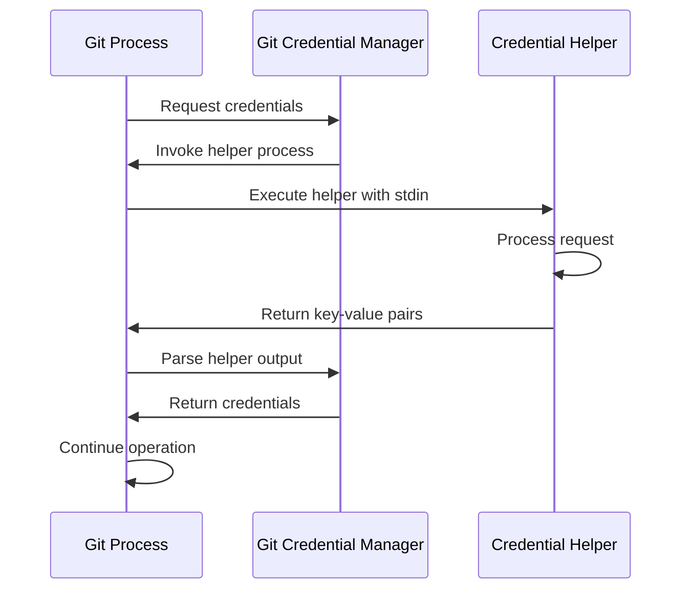

# GitIntegration Module Documentation

## Introduction

The GitIntegration module provides the core functionality for interacting with Git repositories and processes within the Git Credential Manager (GCM) system. This module serves as the bridge between the credential management system and Git itself, enabling seamless authentication operations across different Git hosting platforms.

The module is responsible for Git process management, repository detection, remote enumeration, configuration access, and helper process invocation - forming the foundation upon which all Git-related credential operations are built.

## Architecture Overview

The GitIntegration module implements a layered architecture that abstracts Git operations while providing robust error handling and cross-platform compatibility. The design follows the dependency inversion principle, with clear interfaces separating concerns between Git operations, process management, and configuration handling.



## Core Components

### IGit Interface

The `IGit` interface defines the contract for all Git operations within the system. It provides a comprehensive set of methods for repository interaction, process creation, and configuration management.

**Key Responsibilities:**
- Git process creation and management
- Repository detection and path resolution
- Remote enumeration and URL extraction
- Configuration access
- Helper process invocation for credential operations

**Interface Definition:**
```csharp
public interface IGit
{
    GitVersion Version { get; }
    ChildProcess CreateProcess(string args);
    bool IsInsideRepository();
    string GetCurrentRepository();
    IEnumerable<GitRemote> GetRemotes();
    IGitConfiguration GetConfiguration();
    Task<IDictionary<string, string>> InvokeHelperAsync(string args, IDictionary<string, string> standardInput);
}
```

### GitProcess Implementation

The `GitProcess` class serves as the primary implementation of the `IGit` interface, providing concrete functionality for Git operations. It encapsulates Git executable management, process lifecycle control, and error handling.

**Key Features:**
- **Lazy Version Loading**: Git version is determined on first access and cached for subsequent use
- **Repository Detection**: Determines if the current working directory is within a Git repository
- **Remote Enumeration**: Parses Git remote information including fetch and push URLs
- **Helper Process Management**: Handles Git's stdin/stdout protocol for credential helpers
- **Comprehensive Error Handling**: Provides detailed error information including Git's stderr output

**Process Management:**
The implementation leverages the `IProcessManager` interface to create and manage Git processes, ensuring consistent behavior across different platforms and execution environments.

### GitRemote Data Model

The `GitRemote` class represents a Git remote configuration with separate fetch and push URLs. This model accurately reflects Git's remote system where fetch and push operations can target different URLs.



## Data Flow Architecture

The GitIntegration module processes data through several distinct flows, each optimized for specific Git operations:



## Integration with Other Modules

The GitIntegration module serves as a foundational component that other modules depend upon for Git-related operations:

### Authentication Module Integration
The [Authentication](Authentication.md) module relies on GitIntegration for:
- Repository context detection
- Remote URL extraction for authentication decisions
- Git configuration access for authentication settings

### CredentialManagement Module Integration
The [CredentialManagement](CredentialManagement.md) module uses GitIntegration for:
- Helper process invocation for credential storage/retrieval
- Repository-specific credential operations
- Git configuration integration

### HostProviderFramework Integration
The [HostProviderFramework](HostProviderFramework.md) module depends on GitIntegration for:
- Remote URL parsing and host identification
- Repository context for host provider selection
- Git configuration access for provider-specific settings



## Error Handling and Diagnostics

The GitIntegration module implements comprehensive error handling through the `GitException` class and integrates with the system's tracing infrastructure.

### GitException
The `GitException` class provides detailed error information including:
- **Message**: High-level error description
- **GitErrorMessage**: Raw Git stderr output
- **ExitCode**: Git process exit code

### Error Scenarios
The module handles several common error scenarios:
- **Repository Not Found**: Exit code 128 with specific error message patterns
- **Process Execution Failure**: Process start failures and timeout handling
- **Parse Errors**: Invalid Git output format handling
- **Helper Process Errors**: Credential helper communication failures

### Integration with Diagnostics
The module integrates with the [Diagnostics](Core.md#diagnostics) system through:
- Trace output for debugging Git operations
- Error context preservation for diagnostic reporting
- Performance metrics for Git process execution

## Process Flow for Credential Operations

The GitIntegration module plays a crucial role in credential operations by facilitating communication between Git and credential helpers:



## Platform Compatibility

The GitIntegration module is designed for cross-platform compatibility:

- **Windows**: Uses Windows-specific process management and path handling
- **macOS**: Integrates with macOS process management and file system operations
- **Linux**: Supports Linux process management and file system conventions

The module abstracts platform differences through the `IProcessManager` interface, ensuring consistent behavior across all supported platforms.

## Performance Considerations

The GitIntegration module implements several performance optimizations:

### Lazy Loading
- Git version is determined only when first accessed and cached for subsequent use
- Repository information is cached to avoid repeated Git process invocations

### Process Management
- Efficient process creation and disposal
- Stream-based output processing to handle large Git outputs
- Proper resource cleanup to prevent process leaks

### Error Handling Performance
- Early exit conditions for common error scenarios
- Minimal overhead for successful operations
- Efficient error message parsing and exception creation

## Security Considerations

The GitIntegration module handles security-sensitive operations:

### Credential Helper Security
- Secure stdin/stdout communication with credential helpers
- Proper process isolation for credential operations
- No credential logging or exposure in trace output

### Repository Access
- Safe repository path resolution
- Proper working directory handling
- Secure process execution with appropriate permissions

### Error Security
- Sanitization of error messages to prevent information leakage
- Secure handling of Git stderr output
- Proper exception handling to avoid credential exposure

## Testing and Quality Assurance

The GitIntegration module is designed for testability:

### Interface-Based Design
- `IGit` interface enables easy mocking for unit tests
- Dependency injection for all external dependencies
- Clear separation of concerns for isolated testing

### Error Scenario Coverage
- Comprehensive error handling for all Git exit codes
- Edge case handling for malformed Git output
- Network and file system error scenarios

### Integration Testing
- Real Git process integration tests
- Cross-platform compatibility verification
- Performance regression testing

## Future Enhancements

The GitIntegration module is designed to accommodate future enhancements:

### Git Protocol Evolution
- Support for new Git helper protocols
- Enhanced credential helper communication
- Git configuration management improvements

### Performance Optimization
- Caching strategies for frequently accessed Git information
- Parallel processing for multiple Git operations
- Optimized process creation and management

### Platform Support
- Enhanced platform-specific optimizations
- New platform support as Git expands
- Improved cross-platform compatibility

## Conclusion

The GitIntegration module serves as the cornerstone of the Git Credential Manager system, providing robust and reliable Git interaction capabilities. Its well-designed architecture, comprehensive error handling, and cross-platform compatibility make it an essential component for secure Git credential management across all supported Git hosting platforms.

The module's integration with other system components creates a cohesive ecosystem that seamlessly handles Git authentication while maintaining security, performance, and reliability standards required for enterprise-grade credential management.