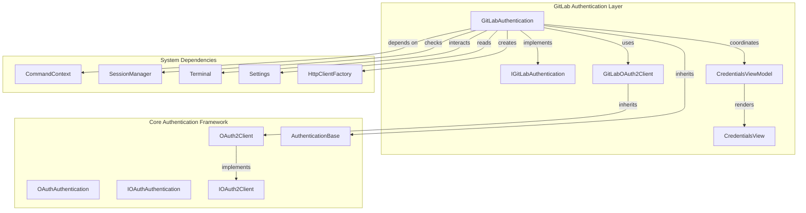
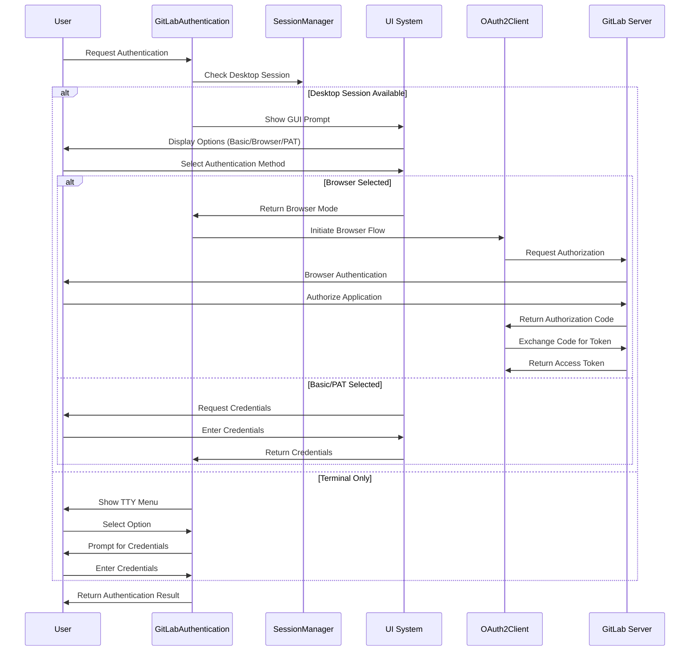
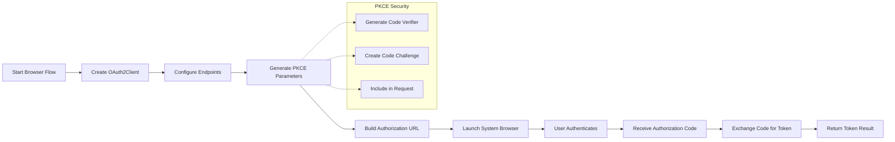
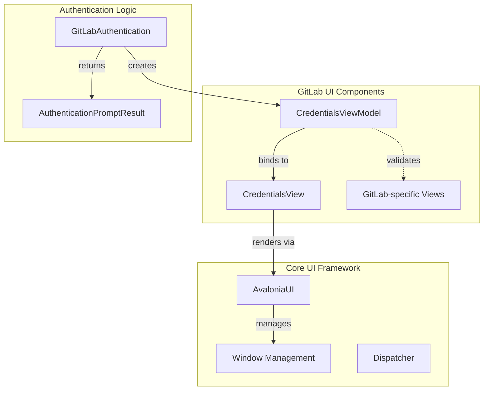
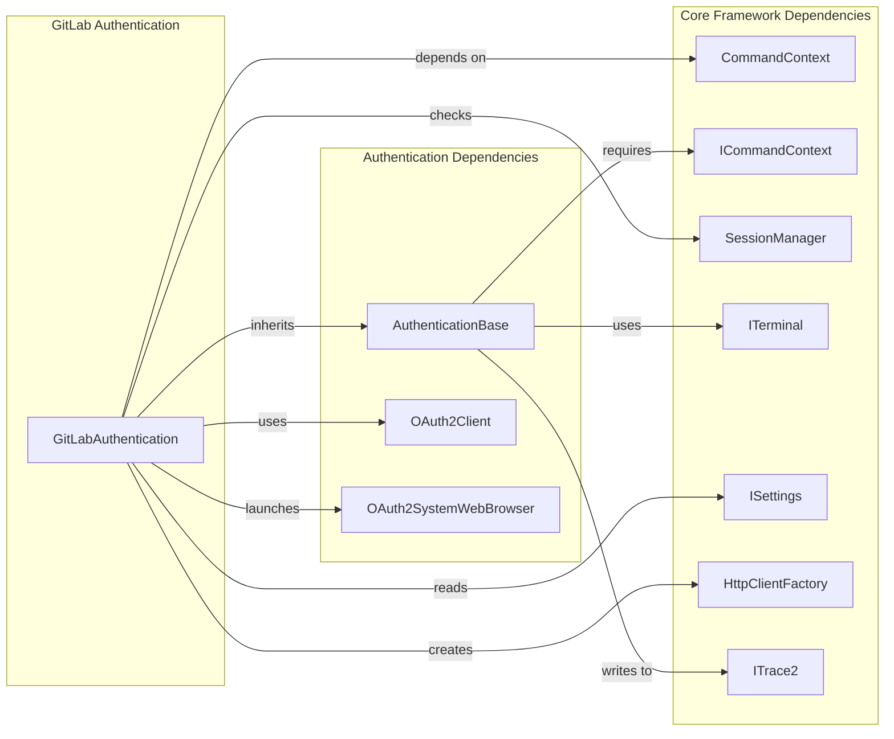
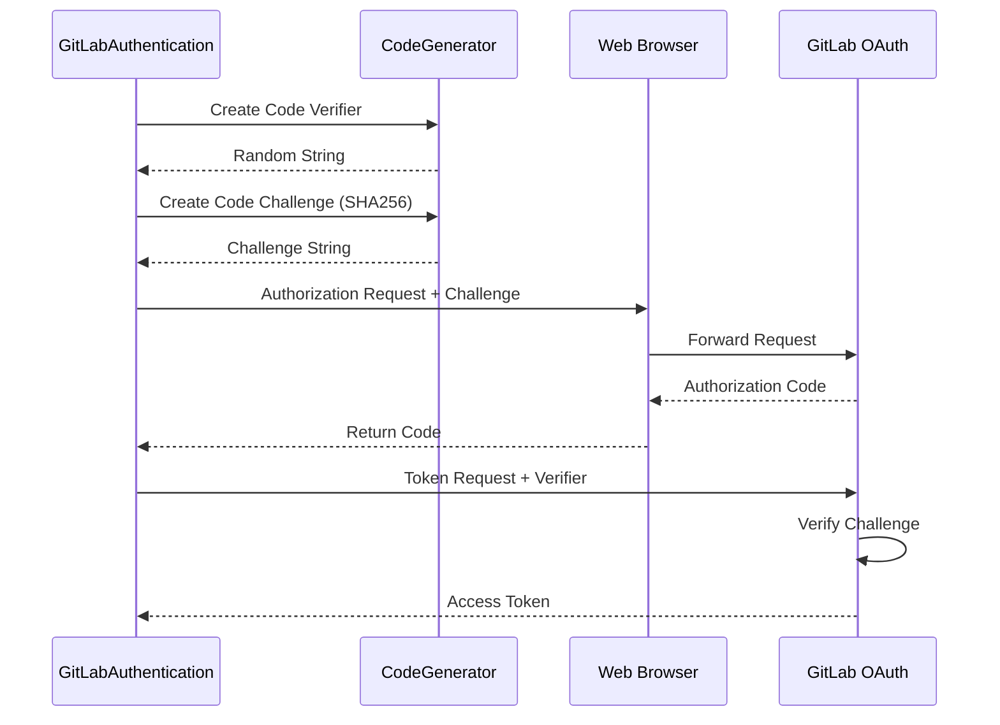
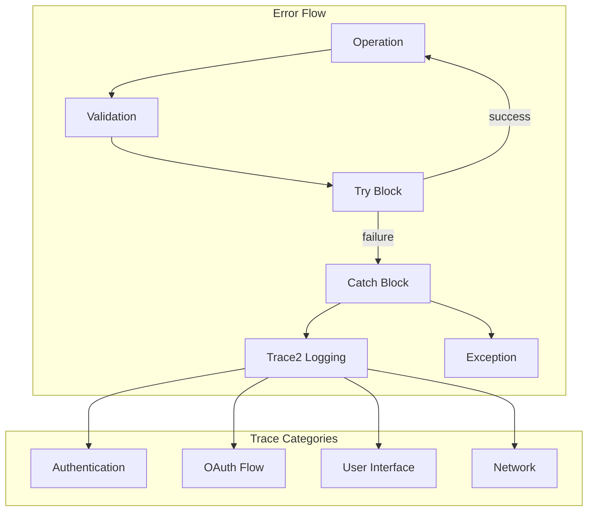

# GitLab Authentication Module

## Introduction

The GitLab Authentication module provides comprehensive authentication capabilities for GitLab repositories within the Git Credential Manager ecosystem. It implements multiple authentication methods including OAuth 2.0 browser flow, personal access tokens (PAT), and basic authentication, offering flexible and secure authentication options for GitLab users.

This module serves as the authentication gateway for GitLab operations, handling user credential acquisition, token management, and authentication flow orchestration while maintaining compatibility with Git Credential Manager's unified authentication framework.

## Architecture Overview

The GitLab Authentication module is built on a layered architecture that integrates with the broader authentication system while providing GitLab-specific implementations:



## Core Components

### GitLabAuthentication Class

The `GitLabAuthentication` class is the primary entry point for GitLab authentication operations. It inherits from `AuthenticationBase` and implements the `IGitLabAuthentication` interface, providing a unified API for all GitLab authentication methods.

**Key Responsibilities:**
- Authentication method selection and orchestration
- User interface coordination (GUI, TTY, helper applications)
- OAuth 2.0 browser flow implementation
- Token refresh operations
- Credential validation and packaging

**Authentication Modes Supported:**
- **Basic Authentication**: Username/password credentials
- **Browser Authentication**: OAuth 2.0 authorization code flow
- **Personal Access Token (PAT)**: Token-based authentication

### IGitLabAuthentication Interface

Defines the contract for GitLab authentication operations:

```csharp
public interface IGitLabAuthentication : IDisposable
{
    Task<AuthenticationPromptResult> GetAuthenticationAsync(Uri targetUri, string userName, AuthenticationModes modes);
    Task<OAuth2TokenResult> GetOAuthTokenViaBrowserAsync(Uri targetUri, IEnumerable<string> scopes);
    Task<OAuth2TokenResult> GetOAuthTokenViaRefresh(Uri targetUri, string refreshToken);
}
```

### GitLabOAuth2Client

Extends the base `OAuth2Client` class with GitLab-specific OAuth 2.0 implementation. Handles GitLab's OAuth endpoints, client configuration, and token acquisition processes.

## Authentication Flow Architecture

### Multi-Modal Authentication Flow



### OAuth 2.0 Browser Flow Implementation



## User Interface Integration

### GUI Authentication Interface

The module integrates with the Avalonia UI framework to provide rich graphical authentication experiences:



### Terminal-Based Authentication

For headless environments, the module provides terminal-based authentication with interactive menus and secure password prompting.

## Integration with Core Systems

### Dependency Relationships



### Settings and Configuration Integration

The module integrates with the settings system to support configuration-based behavior:

- **GUI Prompts**: Controlled via `ISettings.IsGuiPromptsEnabled`
- **Authentication Helpers**: Configurable via Git configuration and environment variables
- **OAuth Settings**: Client ID, redirect URI, and other OAuth parameters
- **Developer Overrides**: Support for development environment customization

## Security Implementation

### PKCE (Proof Key for Code Exchange)

The OAuth 2.0 implementation uses PKCE to enhance security:



### Credential Handling

- **Secure Storage**: Integration with platform-specific credential stores
- **Memory Management**: Proper cleanup of sensitive data
- **Transport Security**: HTTPS enforcement for all OAuth communications
- **Token Refresh**: Automatic token refresh using secure refresh tokens

## Error Handling and Diagnostics

### Exception Management

The module implements comprehensive error handling with trace2 integration:

- **User Cancellation**: Graceful handling of authentication cancellation
- **Network Errors**: Retry logic and timeout management
- **OAuth Errors**: Detailed error parsing and reporting
- **Validation Errors**: Input validation and sanitization

### Diagnostic Integration



## Platform Compatibility

### Cross-Platform Support

The module supports multiple authentication methods across different platforms:

| Platform | GUI Support | Browser Support | TTY Support |
|----------|-------------|-----------------|-------------|
| Windows | ✓ (WPF/Avalonia) | ✓ | ✓ |
| macOS | ✓ (Avalonia) | ✓ | ✓ |
| Linux | ✓ (Avalonia) | ✓ | ✓ |

### Session Detection

Automatic detection of desktop sessions to determine available authentication methods:

```csharp
if (!Context.SessionManager.IsDesktopSession)
{
    modes = modes & ~AuthenticationModes.Browser;
}
```

## Usage Patterns

### Basic Authentication Flow

```csharp
var gitLabAuth = new GitLabAuthentication(commandContext);
var result = await gitLabAuth.GetAuthenticationAsync(
    targetUri: new Uri("https://gitlab.com"),
    userName: null,
    modes: AuthenticationModes.All
);
```

### OAuth Token Acquisition

```csharp
var tokenResult = await gitLabAuth.GetOAuthTokenViaBrowserAsync(
    targetUri: new Uri("https://gitlab.com"),
    scopes: new[] { "read_user", "read_repository", "write_repository" }
);
```

### Token Refresh

```csharp
var refreshedToken = await gitLabAuth.GetOAuthTokenViaRefresh(
    targetUri: new Uri("https://gitlab.com"),
    refreshToken: storedRefreshToken
);
```

## Related Documentation

- [Core Authentication Framework](Core%20Authentication%20Framework.md) - Base authentication classes and interfaces
- [OAuth Authentication](OAuth%20Authentication.md) - OAuth 2.0 implementation details
- [GitLab Provider](GitLab%20Provider.md) - GitLab host provider integration
- [UI Framework](UI%20Framework.md) - User interface components and patterns
- [Cross-Platform Support](Cross-Platform%20Support.md) - Platform-specific implementations

## Summary

The GitLab Authentication module provides a robust, secure, and user-friendly authentication system for GitLab repositories. Its multi-modal approach ensures compatibility across different environments while maintaining security best practices. The modular architecture allows for easy extension and maintenance while providing consistent user experiences across GUI, browser, and terminal interfaces.