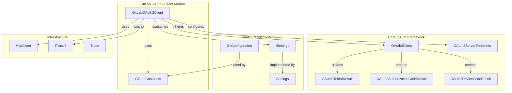
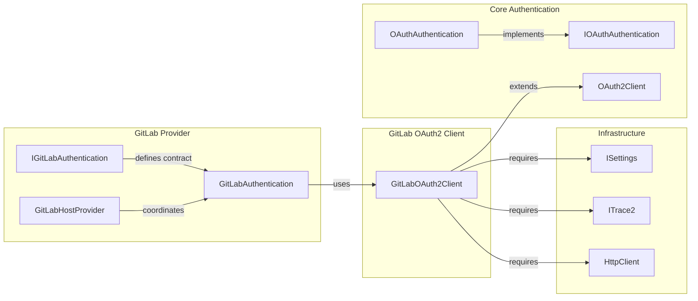
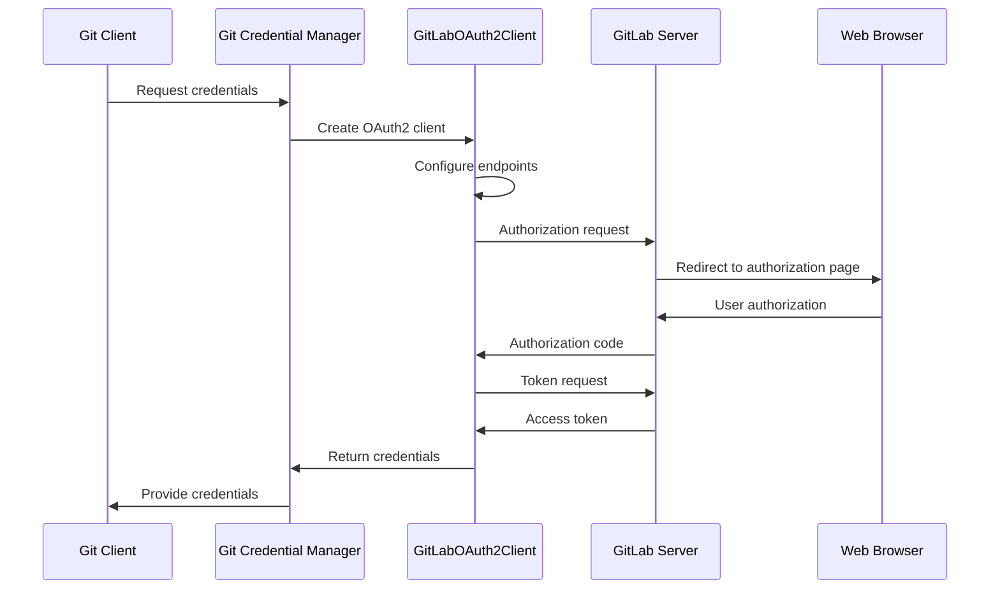
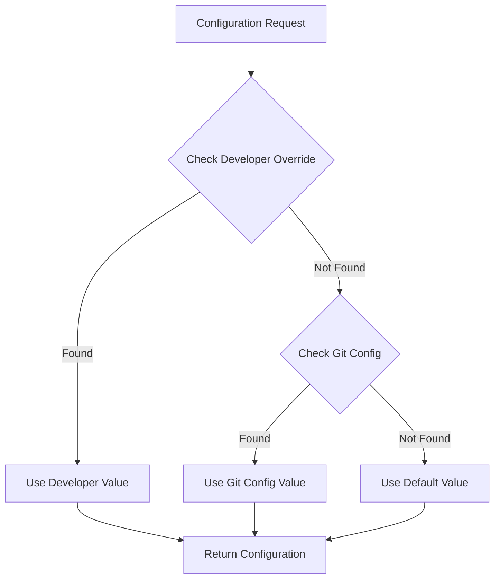

# GitLab OAuth2 Client Module Documentation

## Introduction

The GitLab OAuth2 Client module provides OAuth 2.0 authentication capabilities for GitLab repositories within the Git Credential Manager ecosystem. This module implements a specialized OAuth2 client that handles the authentication flow between Git clients and GitLab instances, supporting both cloud-hosted GitLab.com and self-managed GitLab installations.

The module extends the base OAuth2Client functionality to provide GitLab-specific configurations, endpoints, and authentication parameters, ensuring seamless integration with GitLab's OAuth 2.0 implementation while maintaining compatibility with the broader authentication framework.

## Architecture Overview

### Component Structure



### Module Dependencies



## Core Components

### GitLabOAuth2Client

The `GitLabOAuth2Client` class is the primary component of this module, extending the base `OAuth2Client` to provide GitLab-specific OAuth 2.0 functionality.

**Key Responsibilities:**
- Configure GitLab-specific OAuth 2.0 endpoints
- Manage client credentials and redirect URIs
- Handle developer overrides for testing scenarios
- Integrate with the GitLab authentication flow

**Constructor Parameters:**
- `HttpClient httpClient`: HTTP client for making OAuth requests
- `ISettings settings`: Configuration settings provider
- `Uri baseUri`: Base URI of the GitLab instance
- `ITrace2 trace2`: Tracing and logging interface

### Configuration Management

The module supports flexible configuration through multiple sources:

1. **Environment Variables**: Developer overrides for testing
2. **Git Configuration**: Repository-level settings
3. **Default Values**: Production-ready defaults

**Supported Configuration Options:**
- OAuth Client ID (with developer override support)
- OAuth Client Secret (when required)
- Redirect URI (with developer override support)

## Data Flow

### OAuth 2.0 Authentication Flow



### Configuration Resolution Flow



## Integration Points

### GitLab Authentication Module

The GitLab OAuth2 Client integrates closely with the [GitLab Authentication](GitLab%20Authentication.md) module, which provides the higher-level authentication logic and user interface components.

**Integration Pattern:**
- `GitLabAuthentication` creates and configures `GitLabOAuth2Client` instances
- Authentication results are processed and cached by the authentication module
- UI components in the authentication module handle user interaction

### Core OAuth Framework

The module leverages the shared [OAuth Authentication](OAuth%20Authentication.md) framework for common OAuth 2.0 functionality:

**Shared Components:**
- `OAuth2Client`: Base class providing core OAuth 2.0 implementation
- `OAuth2ServerEndpoints`: Endpoint configuration management
- `OAuth2TokenResult`: Token response handling
- `OAuth2AuthorizationCodeResult`: Authorization code management

### Settings and Configuration

Integration with the [Configuration and Settings](Core%20Application%20Framework.md#configuration-and-settings) system provides flexible configuration management:

- Environment variable overrides for development scenarios
- Git configuration integration for repository-specific settings
- Settings validation and type safety

## Error Handling and Diagnostics

### Trace Integration

The module integrates with the [Tracing and Diagnostics](Core%20Application%20Framework.md#tracing-and-diagnostics) system to provide comprehensive logging:

- OAuth flow step tracking via `ITrace2`
- Error condition logging
- Performance metrics collection
- Debug information for troubleshooting

### Error Scenarios

Common error conditions handled by the module:

1. **Invalid Configuration**: Missing or malformed client credentials
2. **Network Errors**: HTTP request failures during OAuth flow
3. **OAuth Errors**: Invalid authorization codes or token responses
4. **Redirect URI Mismatches**: Configuration inconsistencies

## Security Considerations

### Credential Management

The module follows security best practices:

- Client secrets are optional for GitLab OAuth (PKCE support)
- Developer overrides are clearly marked and logged
- No sensitive data is logged or cached persistently
- HTTPS is enforced for all OAuth communications

### Configuration Security

- Environment variables are checked first to allow secure deployment
- Git configuration values are validated before use
- Default values use secure, production-ready settings

## Usage Examples

### Basic Usage

```csharp
// Create HTTP client
var httpClient = new HttpClient();

// Get settings from configuration
var settings = new Settings();

// Define GitLab instance URI
var gitLabUri = new Uri("https://gitlab.com");

// Create trace interface
var trace2 = new Trace2();

// Create GitLab OAuth2 client
var gitLabClient = new GitLabOAuth2Client(
    httpClient,
    settings,
    gitLabUri,
    trace2
);

// Use the client for OAuth operations
var authCodeResult = await gitLabClient.GetAuthorizationCodeAsync();
```

### Configuration Override Example

```bash
# Set developer override for testing
export GCM_GITLAB_DEV_OAUTH_CLIENT_ID="your-test-client-id"
export GCM_GITLAB_DEV_OAUTH_REDIRECT_URI="http://localhost:8080/callback"
```

## Testing and Development

### Developer Overrides

The module supports developer overrides for testing scenarios:

- `GCM_GITLAB_DEV_OAUTH_CLIENT_ID`: Override default client ID
- `GCM_GITLAB_DEV_OAUTH_CLIENT_SECRET`: Override client secret
- `GCM_GITLAB_DEV_OAUTH_REDIRECT_URI`: Override redirect URI

### Mock Integration

For unit testing, the module can be mocked by:

- Providing mock `ISettings` implementations
- Using test HTTP clients with predefined responses
- Mocking the `ITrace2` interface for log verification

## Related Documentation

- [GitLab Authentication](GitLab%20Authentication.md) - Higher-level authentication logic
- [OAuth Authentication](OAuth%20Authentication.md) - Core OAuth framework
- [Core Application Framework](Core%20Application%20Framework.md) - Settings and configuration
- [GitLab Provider](GitLab%20Provider.md) - Overall GitLab integration

## Summary

The GitLab OAuth2 Client module provides a robust, configurable, and secure OAuth 2.0 implementation specifically tailored for GitLab integration. By extending the core OAuth framework with GitLab-specific configurations and supporting flexible deployment scenarios through comprehensive configuration management, the module enables seamless authentication experiences for GitLab repositories across different deployment models and use cases.