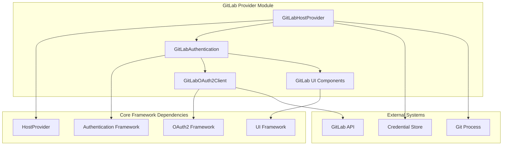
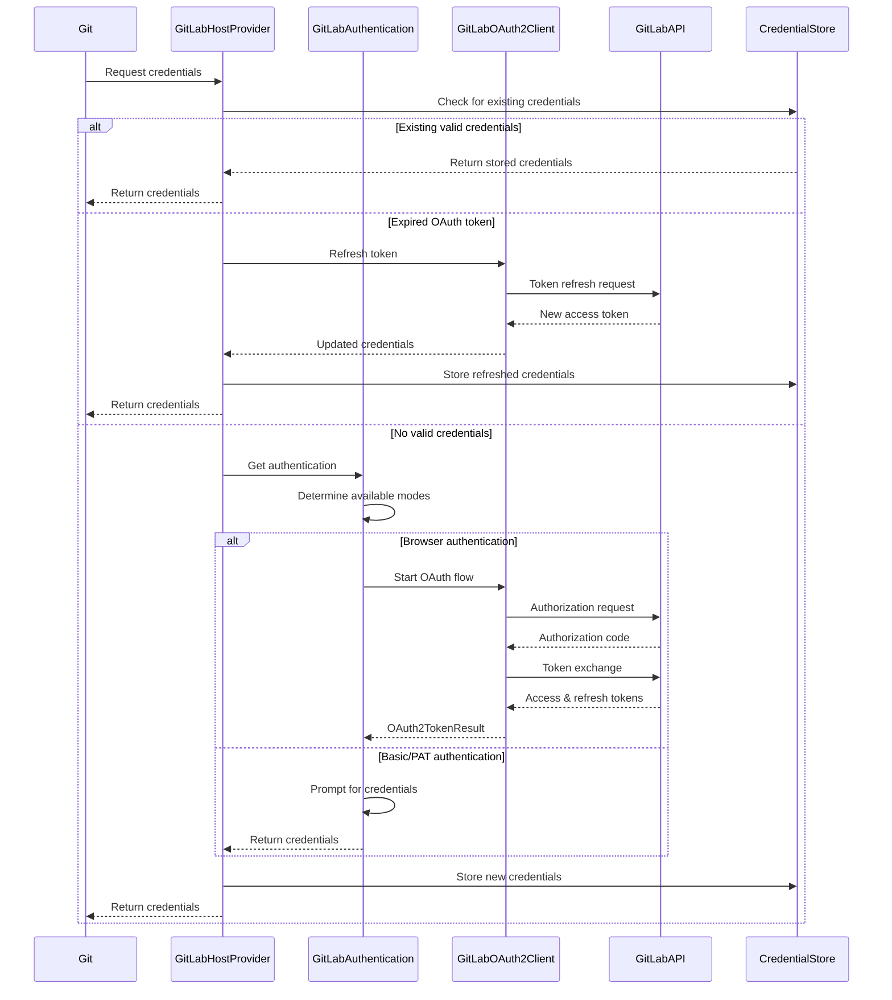

# GitLab Provider Module Documentation

## Overview

The GitLab Provider module is a specialized authentication provider for GitLab repositories within the Git Credential Manager ecosystem. It handles secure credential management, authentication flows, and OAuth2 token management for GitLab-hosted Git repositories.

## Purpose

The GitLab Provider serves as the bridge between Git operations and GitLab's authentication systems, providing:

- **Multi-modal Authentication**: Support for Basic Authentication, Personal Access Tokens (PAT), and OAuth2 browser-based authentication
- **Automatic Token Refresh**: Seamless OAuth2 token refresh without user intervention
- **GitLab-specific Logic**: Tailored support for GitLab.com and self-hosted GitLab instances
- **Secure Credential Storage**: Integration with platform-specific credential stores

## Architecture

## Core Components

### 1. GitLabHostProvider
The main provider class that implements the `HostProvider` interface. It orchestrates credential generation, validation, and storage for GitLab repositories.

**Key Responsibilities:**
- Repository URL validation and GitLab instance detection
- Authentication mode selection and configuration
- OAuth2 token lifecycle management
- Credential storage and retrieval

### 2. GitLabAuthentication
Handles the authentication flow and user interaction for GitLab credentials.

**Key Responsibilities:**
- Multi-modal authentication prompt management
- OAuth2 browser-based authentication orchestration
- Terminal-based authentication fallback
- Helper application integration

**Detailed Documentation**: [GitLab Authentication](GitLab%20Authentication.md)

### 3. GitLabOAuth2Client
Specialized OAuth2 client for GitLab's authentication endpoints.

**Key Responsibilities:**
- GitLab-specific OAuth2 endpoint configuration
- Authorization code and token exchange
- Token refresh operations
- Developer override support for testing

**Detailed Documentation**: [GitLab OAuth2 Client](GitLab%20OAuth2%20Client.md)

### 4. GitLab UI Components
Platform-specific user interface components for credential collection.

**Key Responsibilities:**
- Graphical credential prompt dialogs
- Browser authentication window management
- User experience customization for GitLab branding

**Detailed Documentation**: [GitLab UI Components](GitLab%20UI%20Components.md)

## Authentication Flow

## Configuration and Settings

The GitLab Provider supports various configuration options through environment variables and Git configuration:

- **Authentication Modes**: Override supported authentication methods
- **OAuth Client Settings**: Custom OAuth2 client configuration
- **Helper Applications**: External authentication helper integration
- **Unsafe Remote Allowance**: HTTP protocol configuration

## Integration Points

### Core Framework Integration
- **Host Provider Registry**: Registration and discovery mechanism
- **Authentication Framework**: Base authentication classes and interfaces
- **OAuth2 Framework**: Standard OAuth2 client implementation
- **UI Framework**: Cross-platform user interface components

### Platform Integration
- **Credential Store**: Platform-specific secure storage
- **Session Manager**: Desktop session and browser availability detection
- **HTTP Client Factory**: Configured HTTP client instances
- **Trace System**: Diagnostic and debugging support

## Error Handling

The GitLab Provider implements comprehensive error handling for:
- Network connectivity issues
- Authentication failures
- OAuth2 token expiration
- Invalid configuration
- User cancellation

## Security Considerations

- **HTTPS Enforcement**: Default rejection of HTTP connections
- **Token Security**: Secure storage of OAuth2 tokens and refresh tokens
- **Scope Limitation**: Minimal OAuth2 scopes for repository access
- **Input Validation**: Comprehensive validation of user inputs and remote URLs

## Related Documentation

- [Core Application Framework](Core%20Application%20Framework.md)
- [Authentication System](Authentication%20System.md)
- [Host Provider Framework](Host%20Provider%20Framework.md)
- [GitHub Provider](GitHub%20Provider.md) - Similar provider implementation
- [Bitbucket Provider](Bitbucket%20Provider.md) - Alternative provider implementation