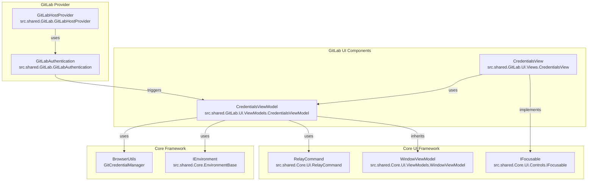
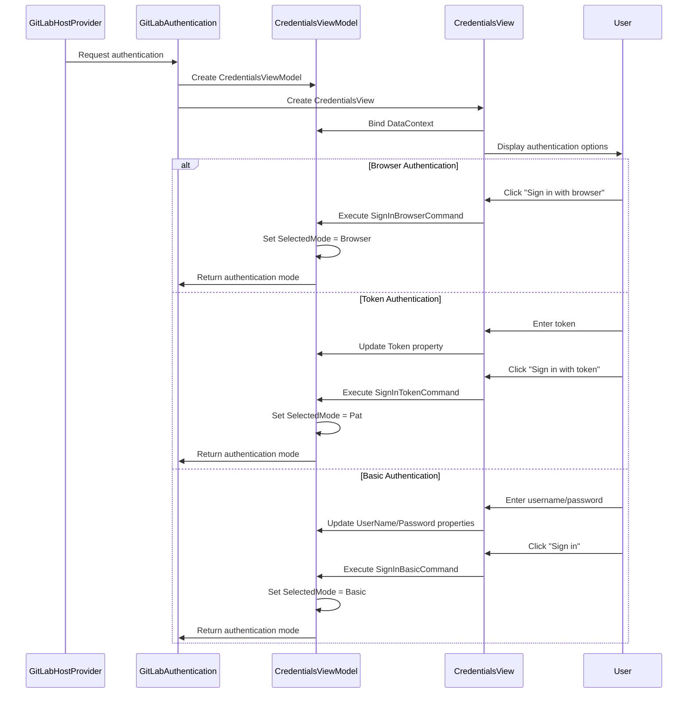
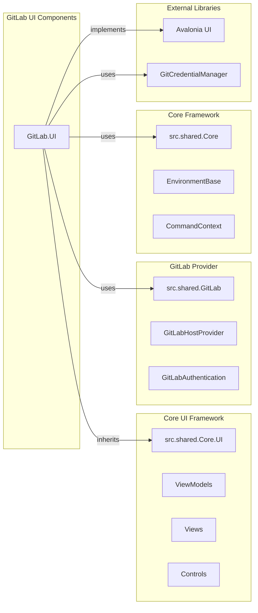
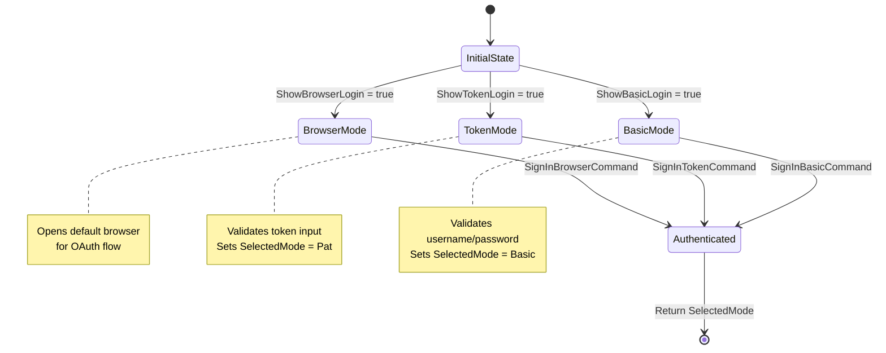
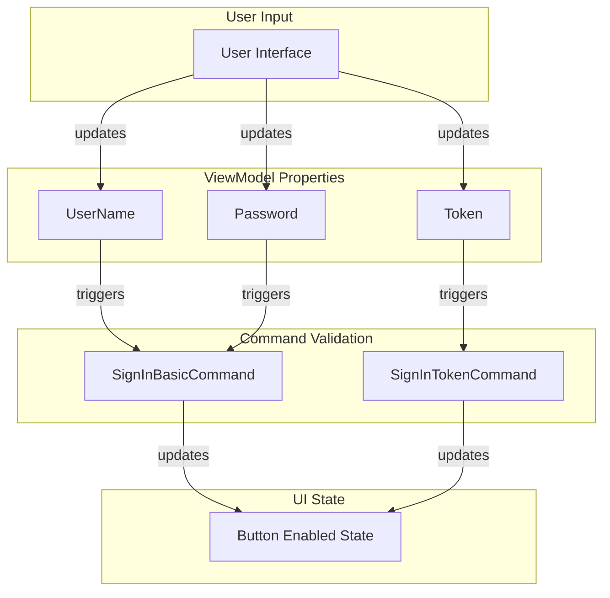
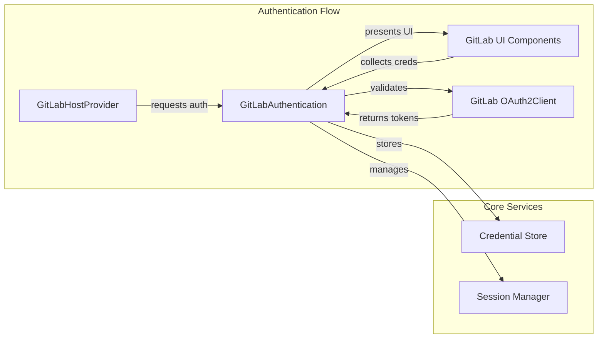

# GitLab UI Components Module

## Overview

The GitLab UI Components module provides the user interface components specifically designed for GitLab authentication within the Git Credential Manager (GCM) application. This module implements the presentation layer for GitLab credential collection, offering multiple authentication methods including browser-based OAuth, personal access tokens, and basic authentication.

## Purpose and Core Functionality

The GitLab UI Components module serves as the specialized UI layer for GitLab authentication scenarios, providing:

- **Multi-modal Authentication Interface**: Supports browser-based OAuth, personal access token, and basic username/password authentication methods
- **Platform-aware UI**: Handles platform-specific focus behaviors and UI interactions
- **Seamless Integration**: Works within the broader GCM authentication framework while providing GitLab-specific branding and workflows
- **User Experience Optimization**: Provides intuitive navigation between different authentication methods with smart focus management

## Architecture

### Component Structure

The GitLab UI Components module follows the Model-View-ViewModel (MVVM) pattern, separating presentation logic from UI controls while maintaining tight integration with the core GitLab provider functionality.

### Authentication Flow Integration

## Component Details

### CredentialsViewModel

The `CredentialsViewModel` class serves as the data context and business logic controller for the GitLab authentication interface:

**Key Responsibilities:**
- Manages authentication mode selection (Browser, PAT, Basic)
- Handles user input validation for different authentication methods
- Provides command bindings for UI interactions
- Manages property change notifications for dynamic UI updates

**Core Properties:**
- `Token`: Personal access token for token-based authentication
- `TokenUserName`: Username associated with the token
- `UserName`: Username for basic authentication
- `Password`: Password for basic authentication
- `Url`: GitLab instance URL
- `ShowBrowserLogin`, `ShowTokenLogin`, `ShowBasicLogin`: Control authentication method visibility
- `SelectedMode`: Stores the chosen authentication method

**Command Methods:**
- `SignUp()`: Opens GitLab signup page in default browser
- `SignInBrowser()`: Initiates browser-based OAuth flow
- `SignInToken()`: Processes token-based authentication
- `SignInBasic()`: Processes basic username/password authentication

### CredentialsView

The `CredentialsView` class implements the visual presentation layer:

**Key Responsibilities:**
- Renders the authentication interface using Avalonia UI framework
- Implements smart focus management for optimal user experience
- Handles platform-specific UI behaviors
- Provides accessibility support through focus management

**Focus Management Strategy:**
1. **Browser Login Priority**: When browser login is available, focuses on the browser login button
2. **Token Login**: Focuses on token input field when token login is active
3. **Basic Login**: Intelligently focuses on either username or password field based on completion state
4. **Platform Awareness**: Includes macOS-specific workarounds for focus issues

## Dependencies

### Direct Dependencies

### Integration Points

1. **GitLab Provider Integration**: Works with `GitLabHostProvider` and `GitLabAuthentication` to provide UI for authentication flows
2. **Core UI Framework**: Inherits from base classes like `WindowViewModel` and implements `IFocusable` interface
3. **Environment Services**: Uses `IEnvironment` for browser operations and platform detection
4. **Command Framework**: Leverages `RelayCommand` for UI command binding and execution

## Data Flow

### Authentication Mode Selection Flow

### Property Change Propagation

## Platform Considerations

### macOS Focus Workarounds
The module includes specific workarounds for macOS focus issues (referenced as issue #1293), which affect text input focus behavior in the Avalonia UI framework on macOS platforms.

### Cross-Platform Browser Integration
Uses `BrowserUtils.OpenDefaultBrowser()` for consistent cross-platform browser launching, ensuring reliable OAuth flow initiation across Windows, macOS, and Linux environments.

## Usage Patterns

### Typical Authentication Scenarios

1. **First-Time Authentication**: User is presented with all available authentication methods
2. **Token Refresh**: User may be prompted for token re-entry when existing tokens expire
3. **Multi-Factor Authentication**: Browser-based flow handles MFA through GitLab's web interface
4. **Enterprise GitLab**: Supports custom GitLab instances through URL configuration

### Integration with GitLab Provider

The UI components integrate seamlessly with the broader GitLab provider system:

## Security Considerations

### Input Validation
All user inputs are validated before acceptance, with appropriate error handling and user feedback mechanisms. The ViewModel implements `CanExecute` methods to ensure commands are only enabled when valid data is provided.

### Credential Handling
Credentials are processed through secure channels and stored using the system's credential storage mechanisms, never persisted in plain text. The module follows the principle of minimal data retention.

### Browser Integration
Browser-based authentication uses system default browsers with proper security context isolation, ensuring OAuth flows are conducted in a secure environment.

## Related Documentation

- [GitLab Provider](GitLab Provider.md) - Core GitLab provider implementation
- [UI Framework](UI Framework.md) - Base UI framework and shared components
- [Authentication System](Authentication System.md) - Authentication patterns and OAuth implementation
- [Core Application Framework](Core Application Framework.md) - Core framework services and utilities

## Summary

The GitLab UI Components module provides a specialized, user-friendly interface for GitLab authentication within the Git Credential Manager ecosystem. By leveraging the core UI framework while implementing GitLab-specific workflows and branding, it ensures a consistent and intuitive authentication experience for GitLab users across all supported platforms. The module's architecture supports multiple authentication methods while maintaining clean separation of concerns between presentation logic and business logic, making it both maintainable and extensible for future GitLab authentication enhancements.