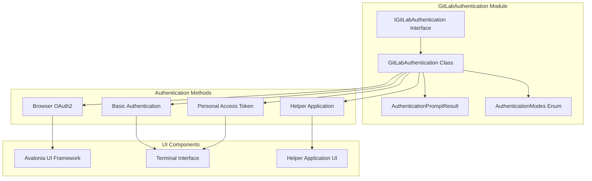
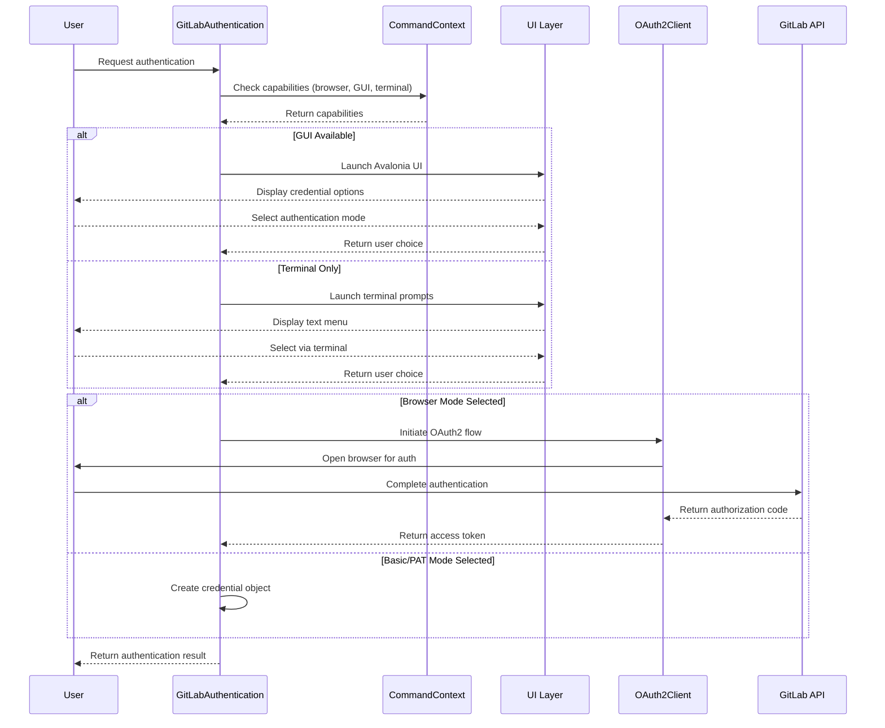

# GitLabAuthentication Module Documentation

## Introduction

The GitLabAuthentication module provides comprehensive authentication capabilities for GitLab repositories within the Git Credential Manager ecosystem. It implements multiple authentication methods including browser-based OAuth2, personal access tokens (PAT), and basic authentication, offering flexible authentication options for both interactive and non-interactive scenarios.

## Architecture Overview

The GitLabAuthentication module is built around a core authentication service that coordinates different authentication strategies based on user preferences, system capabilities, and security requirements.



## Core Components

### IGitLabAuthentication Interface
The primary interface defining the contract for GitLab authentication operations.

**Key Methods:**
- `GetAuthenticationAsync()`: Main authentication entry point supporting multiple modes
- `GetOAuthTokenViaBrowserAsync()`: Browser-based OAuth2 authentication
- `GetOAuthTokenViaRefresh()`: Token refresh using existing refresh tokens

### GitLabAuthentication Class
The main implementation that orchestrates authentication flows and provides platform-specific adaptations.

**Key Responsibilities:**
- Authentication mode selection and validation
- UI/UX coordination (GUI, terminal, helper applications)
- OAuth2 token management
- Platform capability detection

### AuthenticationPromptResult
Encapsulates the result of authentication prompts, including the selected authentication mode and associated credentials.

### AuthenticationModes Enum
Defines available authentication strategies:
- `Basic`: Username/password authentication
- `Browser`: OAuth2 browser-based flow
- `Pat`: Personal access token authentication
- `All`: Combination of all available modes

## Authentication Flow Architecture



## Component Dependencies

```mermaid
graph LR
    subgraph "GitLabAuthentication Dependencies"
        GitLabAuth[GitLabAuthentication]
        
        subgraph "Core Dependencies"
            AuthBase[AuthenticationBase]
            CmdContext[ICommandContext]
            Settings[ISettings]
            SessionManager[ISessionManager]
            Terminal[ITerminal]
            HttpFactory[IHttpClientFactory]
        end
        
        subgraph "OAuth Dependencies"
            OAuthClient[GitLabOAuth2Client]
            OAuthBrowser[OAuth2SystemWebBrowser]
            TokenResult[OAuth2TokenResult]
        end
        
        subgraph "UI Dependencies"
            AvaloniaUI[Avalonia UI]
            CredViewModel[CredentialsViewModel]
            CredView[CredentialsView]
        end
        
        subgraph "Platform Dependencies"
            Environment[IEnvironment]
            FileSystem[IFileSystem]
            ProcessManager[IProcessManager]
        end
    end
    
    GitLabAuth --> AuthBase
    GitLabAuth --> CmdContext
    GitLabAuth --> Settings
    GitLabAuth --> SessionManager
    GitLabAuth --> Terminal
    GitLabAuth --> HttpFactory
    GitLabAuth --> OAuthClient
    GitLabAuth --> OAuthBrowser
    GitLabAuth --> TokenResult
    GitLabAuth --> AvaloniaUI
    GitLabAuth --> CredViewModel
    GitLabAuth --> CredView
    GitLabAuth --> Environment
    GitLabAuth --> FileSystem
    GitLabAuth --> ProcessManager
```



## Authentication Process Flow

### 1. Authentication Mode Selection
The module evaluates available authentication modes based on:
- System capabilities (browser availability, GUI support)
- User preferences and settings
- Security requirements
- Platform constraints

### 2. User Interface Selection
Three UI pathways are supported:
- **Avalonia UI**: Modern cross-platform GUI for desktop environments
- **Terminal Interface**: Text-based prompts for headless environments
- **Helper Application**: External authentication helper programs

### 3. Credential Collection
Different collection strategies based on authentication mode:
- **Browser Mode**: OAuth2 flow with external browser
- **Basic Mode**: Username/password prompts
- **PAT Mode**: Personal access token collection

### 4. Token Management
OAuth2 tokens are managed through:
- Initial token acquisition via authorization code flow
- Token refresh using stored refresh tokens
- Secure token storage and retrieval

## Integration Points

### GitLabHostProvider Integration
The authentication module integrates with [GitLabHostProvider](GitLabHostProvider.md) to provide authentication services for GitLab-hosted repositories.

### OAuth2 Framework Integration
Leverages the shared [OAuth2](Core.md#oauth2) framework components:
- `OAuth2Client` for token management
- `OAuth2SystemWebBrowser` for browser integration
- `OAuth2TokenResult` for token representation

### UI Framework Integration
Integrates with the shared [UI](Core.md#ui) framework:
- `AvaloniaUi` for cross-platform GUI rendering
- `CredentialsViewModel` for UI state management
- `CredentialsView` for user interface presentation

## Security Considerations

### Credential Protection
- Credentials are handled securely through the [ICredential](Core.md#credentialmanagement) interface
- Passwords and tokens are collected via secure input methods
- Sensitive data is not logged or exposed in traces

### Browser Security
- OAuth2 flows use system default browsers for security
- PKCE (Proof Key for Code Exchange) is implemented for OAuth2
- State parameters are validated to prevent CSRF attacks

### Platform Security
- Respects platform-specific security policies
- Integrates with native credential stores where available
- Supports Windows DPAPI, macOS Keychain, and Linux Secret Service

## Error Handling

### Authentication Failures
- Graceful fallback between authentication modes
- Detailed error messages for troubleshooting
- Integration with diagnostic framework for issue resolution

### Network Issues
- Retry logic for transient network failures
- Timeout handling for OAuth2 flows
- Proxy support for corporate environments

### User Cancellation
- Proper handling of user cancellation requests
- Cleanup of partial authentication states
- Resource disposal and cleanup

## Configuration Options

### Environment Variables
- `GCM_GITLAB_AUTH_HELPER`: Specifies authentication helper command
- `GCM_GITLAB_AUTHMODES`: Restricts available authentication modes
- `GCM_INTERACTIVE`: Controls interactive authentication behavior

### Git Configuration
- `credential.gitLabAuthMode`: Default authentication mode
- `credential.gitLabHelper`: Authentication helper path
- `credential.guiPrompt`: GUI prompt preferences

### Runtime Settings
- Browser availability detection
- Desktop session detection
- Terminal capability assessment

## Platform Support

### Windows
- Full GUI support via Avalonia
- Windows Credential Manager integration
- DPAPI for credential protection

### macOS
- Native Keychain integration
- Full GUI support
- Terminal and GUI authentication modes

### Linux
- Secret Service integration
- Terminal-based authentication
- Limited GUI support depending on desktop environment

## Usage Examples

### Basic Authentication
```csharp
var auth = new GitLabAuthentication(context);
var result = await auth.GetAuthenticationAsync(
    targetUri: new Uri("https://gitlab.com"),
    userName: null,
    modes: AuthenticationModes.Basic | AuthenticationModes.Pat
);
```

### Browser OAuth2 Authentication
```csharp
var tokenResult = await auth.GetOAuthTokenViaBrowserAsync(
    targetUri: new Uri("https://gitlab.com"),
    scopes: new[] { "read_user", "read_repository" }
);
```

### Token Refresh
```csharp
var refreshedToken = await auth.GetOAuthTokenViaRefresh(
    targetUri: new Uri("https://gitlab.com"),
    refreshToken: storedRefreshToken
);
```

## Related Documentation

- [GitLabHostProvider](GitLabHostProvider.md) - GitLab host provider implementation
- [GitLabOAuth2Client](GitLabOAuth2Client.md) - OAuth2 client implementation
- [Core Authentication](Core.md#authentication) - Shared authentication framework
- [Core OAuth2](Core.md#oauth2) - OAuth2 framework components
- [Core UI](Core.md#ui) - UI framework components