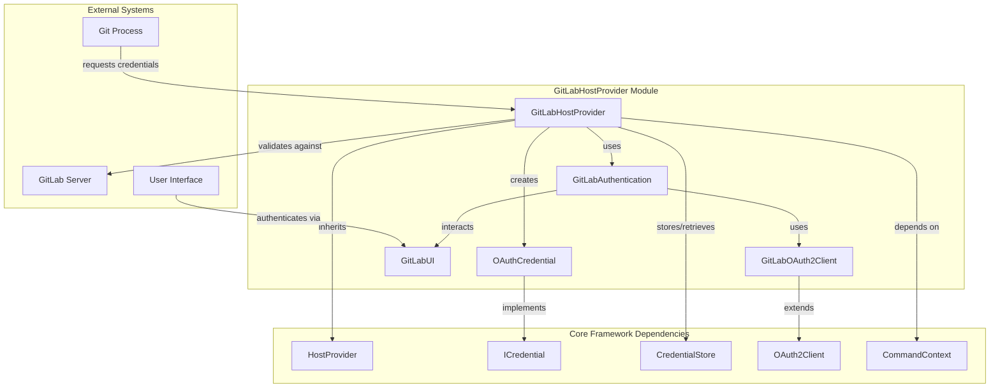
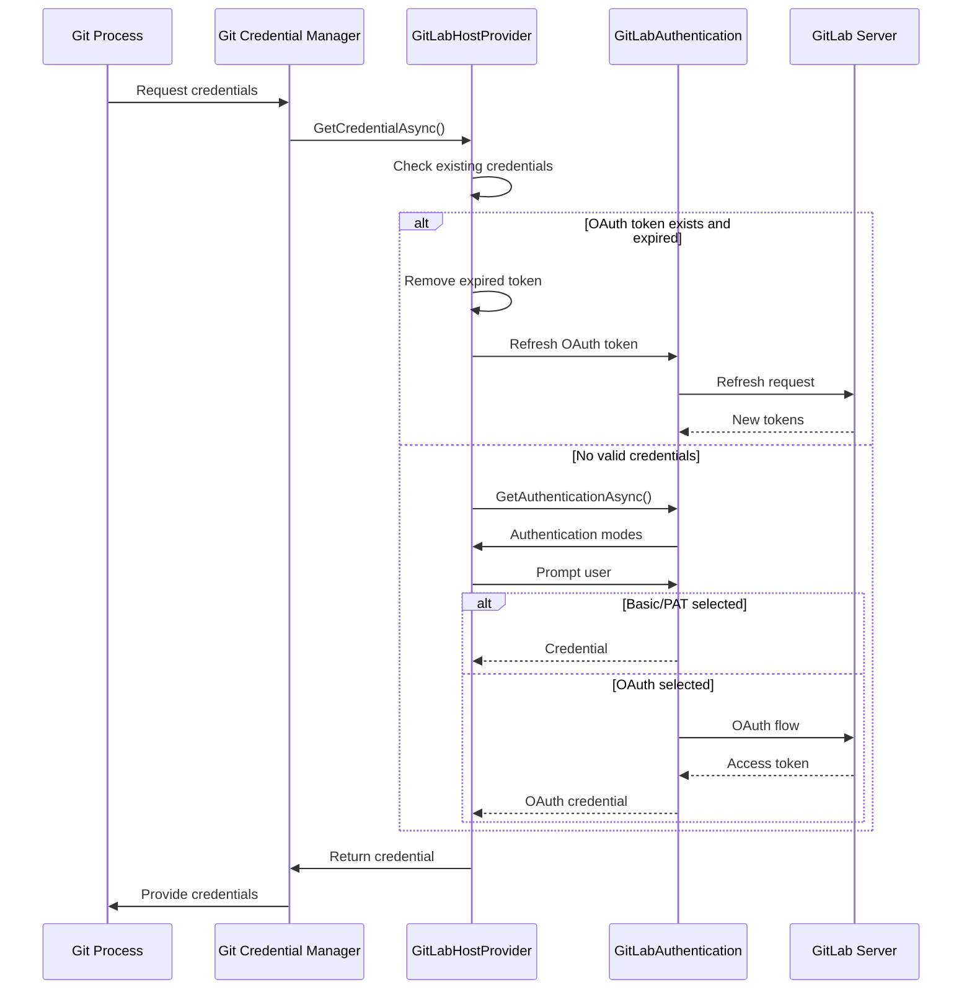
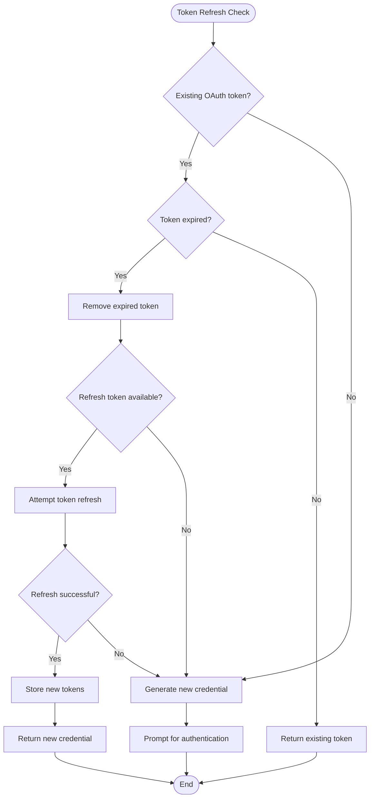

# GitLabHostProvider Module Documentation

## Introduction

The GitLabHostProvider module is a specialized credential provider for GitLab repositories within the Git Credential Manager (GCM) ecosystem. It handles authentication for GitLab-hosted Git repositories, supporting multiple authentication methods including Personal Access Tokens (PAT), Basic Authentication, and OAuth2 browser-based authentication. The module automatically detects GitLab instances, manages OAuth token lifecycle including refresh operations, and provides secure credential storage and retrieval.

## Architecture Overview

The GitLabHostProvider module follows a layered architecture pattern with clear separation of concerns:

## Core Components

### GitLabHostProvider
The main provider class that orchestrates GitLab authentication and credential management. It extends the base `HostProvider` class and implements GitLab-specific logic for:

- **Host Detection**: Identifies GitLab instances through URL patterns and HTTP headers
- **Authentication Mode Selection**: Determines supported authentication methods based on configuration and target URI
- **Credential Generation**: Creates appropriate credentials based on selected authentication mode
- **OAuth Token Management**: Handles OAuth token lifecycle including refresh operations
- **Credential Storage**: Manages secure storage and retrieval of credentials

### OAuthCredential
An internal credential implementation specifically for OAuth tokens. It:
- Uses "oauth2" as the account name (required by GitLab API)
- Stores both access and refresh tokens
- Implements the `ICredential` interface for compatibility with the credential store

## Authentication Flow

### Primary Authentication Process

### OAuth Token Refresh Process

## Authentication Modes

The module supports three authentication modes, selected based on configuration and target GitLab instance:

### 1. Basic Authentication
- Uses username/password credentials
- Always available for self-hosted instances
- Can be disabled via configuration

### 2. Personal Access Token (PAT)
- Uses GitLab personal access tokens
- Always available as fallback option
- Provides fine-grained permissions

### 3. OAuth Browser Authentication
- Browser-based OAuth2 flow
- Requires OAuth client configuration
- Provides automatic token refresh
- Uses scopes: `write_repository`, `read_repository`

## Configuration and Settings

### Environment Variables
- `GCM_GITLAB_AUTHMODES`: Override supported authentication modes
- `GCM_ALLOW_UNSAFE_REMOTES`: Allow HTTP connections (disabled by default)

### Git Configuration
- `credential.gitlab.authmodes`: Authentication modes override
- `credential.https://gitlab.example.com.provider`: Provider selection

### OAuth Configuration
- OAuth client ID configuration for self-hosted instances
- Default GitLab.com client ID detection
- Automatic OAuth endpoint discovery

## Security Features

### HTTPS Enforcement
- HTTP connections are rejected by default
- Clear error messages guide users to HTTPS
- Override option available for development environments

### Token Security
- OAuth tokens are validated before use
- Automatic cleanup of expired tokens
- Separate storage for access and refresh tokens
- Secure credential store integration

### Host Validation
- Multiple detection methods for GitLab instances
- Header-based validation (`X-Gitlab-Feature-Category`)
- URL pattern matching for standard installations

## Integration Points

### Core Framework Integration
The module integrates with the GCM Core framework through:
- [HostProvider](Core.md#hostprovider-framework) base class
- [ICredential](Core.md#credential-management) interface
- [CommandContext](Core.md#command-context) for dependencies
- [CredentialStore](Core.md#credential-management) for secure storage

### Authentication Integration
- [GitLabAuthentication](GitLabAuthentication.md) for authentication logic
- [GitLabOAuth2Client](GitLabOAuth2Client.md) for OAuth operations
- [OAuth2Client](Core.md#oauth2) base class for standard OAuth flow

### UI Integration
- [GitLabUI](GitLabUI.md) for user interaction
- Standard credential prompts
- OAuth device code flow support

## Error Handling

### Network Errors
- Timeout handling for OAuth token validation (15 seconds)
- Graceful fallback when refresh fails
- Clear error messages for connectivity issues

### Authentication Errors
- Detailed error messages for configuration issues
- Guidance for OAuth setup on self-hosted instances
- Automatic retry mechanisms for transient failures

### Security Errors
- Clear rejection of insecure protocols
- Helpful URLs for security documentation
- Safe handling of credential storage failures

## Performance Considerations

### Caching Strategy
- Credentials are cached in the secure store
- OAuth tokens are pre-validated before use
- Refresh tokens enable seamless re-authentication

### Network Optimization
- Minimal API calls for token validation
- Efficient OAuth token refresh process
- Background credential storage operations

### Resource Management
- Proper disposal of authentication components
- HttpClient reuse through factory pattern
- Efficient credential lookup mechanisms

## Platform Support

The GitLabHostProvider supports all platforms where GCM is available:
- **Windows**: Full feature support with Windows Credential Manager
- **macOS**: Full feature support with macOS Keychain
- **Linux**: Full feature support with Secret Service or GPG pass

## Troubleshooting

### Common Issues
1. **OAuth Configuration Missing**: Self-hosted instances require OAuth client configuration
2. **HTTP Rejection**: Ensure repository URLs use HTTPS
3. **Token Expiration**: Automatic refresh handles most cases
4. **Host Detection**: Check URL format and server headers

### Diagnostic Information
- Enable trace logging for detailed flow information
- Use `git credential-manager diagnose` for system checks
- Check OAuth client configuration for self-hosted instances

## Related Documentation

- [GitLabAuthentication](GitLabAuthentication.md) - Authentication implementation details
- [GitLabOAuth2Client](GitLabOAuth2Client.md) - OAuth2 client implementation
- [GitLabUI](GitLabUI.md) - User interface components
- [Core Authentication](Core.md#authentication) - Core authentication framework
- [Core OAuth2](Core.md#oauth2) - OAuth2 implementation details
- [HostProvider Framework](Core.md#hostprovider-framework) - Provider framework overview