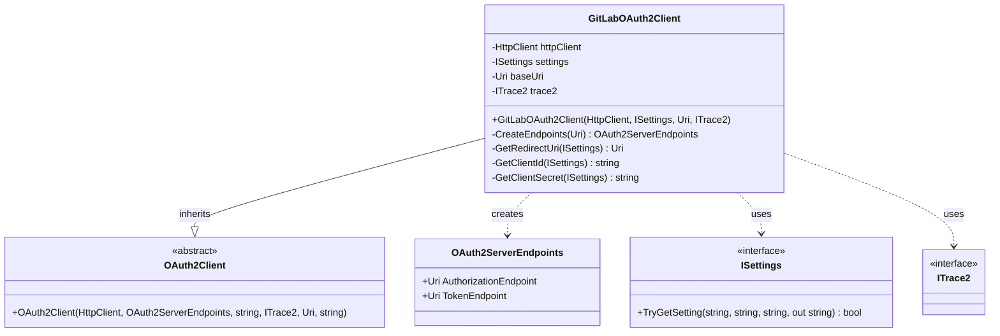
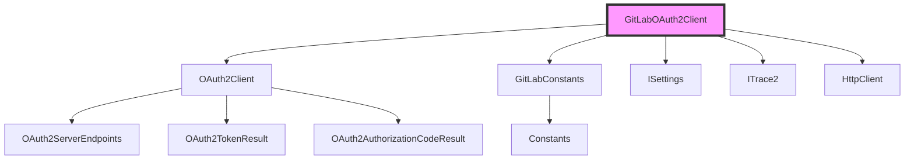
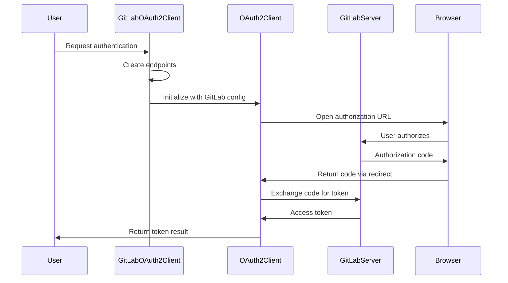
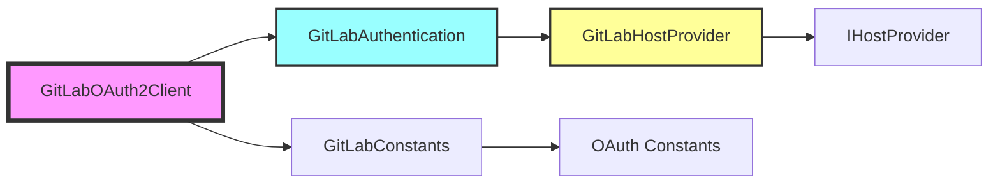

# GitLabOAuth2Client Module Documentation

## Introduction

The GitLabOAuth2Client module provides OAuth 2.0 authentication capabilities for GitLab repositories within the Git Credential Manager ecosystem. It extends the base OAuth2Client class to implement GitLab-specific OAuth 2.0 authentication flows, enabling secure authentication to GitLab instances (both cloud and self-hosted) without storing user credentials.

## Module Overview

The GitLabOAuth2Client is a specialized OAuth 2.0 client that handles authentication flows for GitLab services. It configures the appropriate OAuth endpoints, client credentials, and redirect URIs specific to GitLab's authentication requirements, while leveraging the robust OAuth 2.0 infrastructure provided by the Core module.

## Architecture

### Component Structure

### Module Dependencies

## Core Components

### GitLabOAuth2Client Class

The `GitLabOAuth2Client` class is the primary component of this module, extending the base `OAuth2Client` to provide GitLab-specific OAuth 2.0 functionality.

#### Key Features:
- **Endpoint Configuration**: Automatically configures GitLab OAuth endpoints based on the base URI
- **Client Credential Management**: Handles client ID and secret configuration with developer override support
- **Redirect URI Management**: Configures appropriate redirect URIs for the OAuth flow
- **Settings Integration**: Leverages the settings system for configuration overrides

#### Constructor Parameters:
- `HttpClient httpClient`: HTTP client for making OAuth requests
- `ISettings settings`: Settings provider for configuration values
- `Uri baseUri`: Base URI of the GitLab instance
- `ITrace2 trace2`: Trace writer for logging and diagnostics

## OAuth 2.0 Flow Implementation

### Authentication Flow

### Endpoint Configuration

The module automatically configures OAuth endpoints based on the GitLab instance URI:

- **Authorization Endpoint**: `{baseUri}/oauth/authorize`
- **Token Endpoint**: `{baseUri}/oauth/token`

### Configuration Management

The module supports configuration through multiple channels:

1. **Environment Variables**: Developer overrides for testing
2. **Git Configuration**: Repository-specific settings
3. **Default Values**: Production-ready defaults

#### Supported Configuration Options:

| Setting | Environment Variable | Git Config Key | Purpose |
|---------|---------------------|----------------|---------|
| Client ID | `GCM_DEV_GITLAB_OAUTH_CLIENTID` | `dev.gitlab.oauthClientId` | Override OAuth client ID |
| Client Secret | `GCM_DEV_GITLAB_OAUTH_CLIENTSECRET` | `dev.gitlab.oauthClientSecret` | Override OAuth client secret |
| Redirect URI | `GCM_DEV_GITLAB_OAUTH_REDIRECTURI` | `dev.gitlab.oauthRedirectUri` | Override redirect URI |

## Integration with GitLab Module

### Module Relationships

### Usage Context

The GitLabOAuth2Client is typically used within the GitLabAuthentication component, which orchestrates the authentication process and integrates with the GitLabHostProvider to provide comprehensive GitLab credential management.

## Security Considerations

### Best Practices

1. **Client Secret Handling**: The module supports optional client secrets, following GitLab's OAuth 2.0 implementation
2. **Redirect URI Validation**: Ensures proper redirect URI configuration for security
3. **Developer Overrides**: Provides secure development and testing capabilities
4. **Trace Logging**: Includes comprehensive tracing for debugging without exposing sensitive data

### Security Features

- **HTTPS Enforcement**: All OAuth communications use secure HTTP
- **State Parameter**: OAuth state validation to prevent CSRF attacks
- **Scope Management**: Proper OAuth scope configuration
- **Token Storage**: Secure token handling through the credential store

## Error Handling

The module inherits robust error handling from the base OAuth2Client, including:

- Network error handling
- OAuth protocol error processing
- Invalid configuration detection
- Graceful fallback mechanisms

## Testing and Development

### Developer Mode

The module supports developer mode through environment variables and Git configuration, enabling:

- Custom OAuth client registration
- Local development redirect URIs
- Testing with different GitLab instances

### Diagnostic Support

Integration with the diagnostic framework provides:

- OAuth endpoint validation
- Configuration verification
- Network connectivity testing
- Authentication flow debugging

## Related Documentation

- [OAuth2Client](OAuth2Client.md) - Base OAuth 2.0 client implementation
- [GitLabAuthentication](GitLabAuthentication.md) - GitLab authentication orchestration
- [GitLabHostProvider](GitLabHostProvider.md) - GitLab host provider implementation
- [OAuth2SystemWebBrowser](OAuth2SystemWebBrowser.md) - OAuth browser integration
- [Settings](Settings.md) - Configuration management system
- [Trace2](Trace2.md) - Diagnostic and tracing framework

## Conclusion

The GitLabOAuth2Client module provides a robust, secure, and configurable OAuth 2.0 implementation specifically designed for GitLab authentication. By extending the base OAuth2Client with GitLab-specific configurations and leveraging the comprehensive infrastructure of the Git Credential Manager, it enables seamless and secure authentication to GitLab repositories across different deployment scenarios.