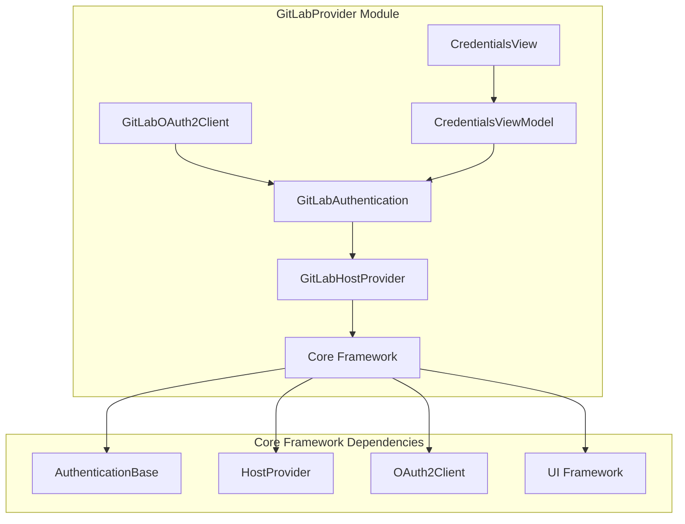
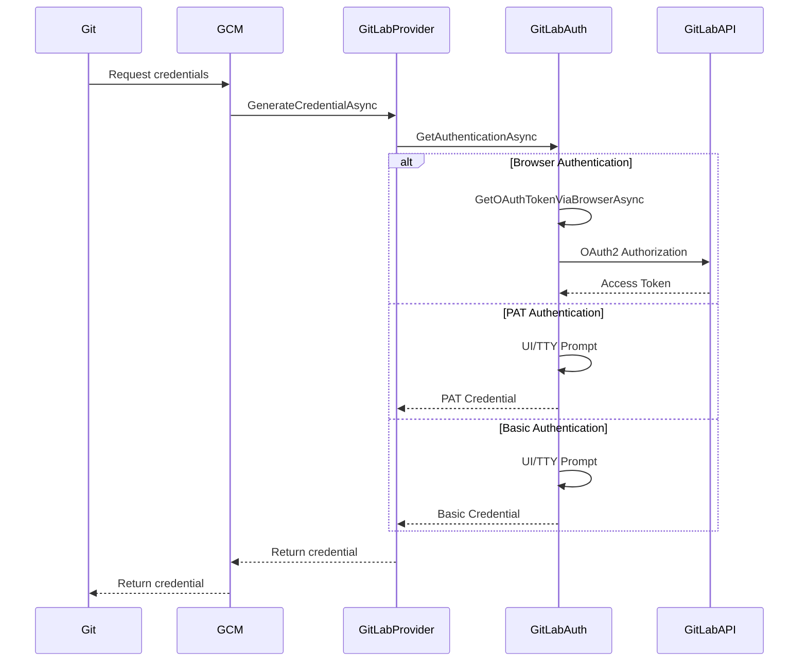

# GitLabProvider Module Documentation

## Overview

The GitLabProvider module is a Git credential manager provider specifically designed to handle authentication with GitLab repositories. It provides seamless integration with GitLab's authentication mechanisms, supporting multiple authentication methods including OAuth2, Personal Access Tokens (PAT), and basic authentication.

## Purpose

The primary purpose of the GitLabProvider module is to:
- Authenticate users with GitLab repositories during Git operations
- Manage and store GitLab credentials securely
- Support multiple authentication methods (OAuth2, PAT, Basic Auth)
- Handle OAuth token refresh and expiration
- Provide both GUI and command-line authentication interfaces

## Architecture

The GitLabProvider module follows a layered architecture pattern with clear separation of concerns:

## Core Components

### 1. GitLabAuthentication ([GitLabAuthentication.md](GitLabAuthentication.md))
The authentication service that handles user authentication requests and coordinates between different authentication methods. It provides:
- Multi-modal authentication (Basic, OAuth2, PAT)
- GUI and TTY authentication interfaces
- OAuth token acquisition and refresh
- Helper command integration

### 2. GitLabHostProvider ([GitLabHostProvider.md](GitLabHostProvider.md))
The main host provider that integrates with Git Credential Manager's provider framework. It provides:
- GitLab repository detection and support validation
- Credential generation and management
- OAuth token lifecycle management
- Integration with Git credential store

### 3. GitLabOAuth2Client ([GitLabOAuth2Client.md](GitLabOAuth2Client.md))
The OAuth2 client implementation specifically for GitLab's OAuth2 endpoints. It provides:
- GitLab-specific OAuth2 endpoint configuration
- Client ID and redirect URI management
- Token exchange and refresh functionality

### 4. UI Components ([GitLabUI.md](GitLabUI.md))
User interface components for authentication prompts including:
- Credentials view for authentication input
- View models for UI logic
- Support for multiple authentication modes in the UI

## Authentication Flow

## Authentication Methods

### 1. OAuth2 Browser Authentication
- Opens user's default web browser for GitLab authentication
- Supports OAuth2 authorization code flow
- Automatically refreshes expired tokens
- Stores both access and refresh tokens

### 2. Personal Access Token (PAT)
- Allows users to enter GitLab personal access tokens
- Provides username/token authentication
- Suitable for automation scenarios

### 3. Basic Authentication
- Traditional username/password authentication
- Suitable for GitLab instances with password authentication enabled

## Integration with Core Framework

The GitLabProvider module integrates with the shared Core framework components:

- **Authentication Framework**: Inherits from `AuthenticationBase` and implements `IHostProvider`
- **OAuth2 Framework**: Uses shared OAuth2 client infrastructure from Core
- **UI Framework**: Leverages Avalonia UI framework for cross-platform GUI
- **Credential Store**: Integrates with platform-specific credential stores
- **Configuration**: Uses shared configuration service for settings management

## Platform Support

The module supports all platforms that Git Credential Manager supports:
- Windows (with Windows Credential Manager integration)
- macOS (with macOS Keychain integration)
- Linux (with Secret Service or GPG pass store integration)

## Security Features

- Secure credential storage using platform-specific credential stores
- OAuth2 token encryption and secure storage
- Support for credential expiration and refresh
- Prevention of credential exposure in logs
- Secure helper command communication

## Configuration

The module supports various configuration options through:
- Environment variables
- Git configuration settings
- OAuth client configuration for self-hosted GitLab instances
- Authentication mode overrides

## Error Handling

Comprehensive error handling for:
- Network connectivity issues
- Authentication failures
- OAuth token expiration
- Invalid credentials
- Unsupported authentication modes

## Dependencies

- **Core Framework**: Shared authentication, UI, and platform services
- **OAuth2 Framework**: OAuth2 client implementation from Core
- **HTTP Client**: For GitLab API communication
- **Platform Services**: Credential storage and UI services

## Related Documentation

- [Core Framework Documentation](Core.md)
- [OAuth2 Framework Documentation](OAuth2.md)
- [Authentication Framework Documentation](Authentication.md)
- [UI Framework Documentation](UI.md)