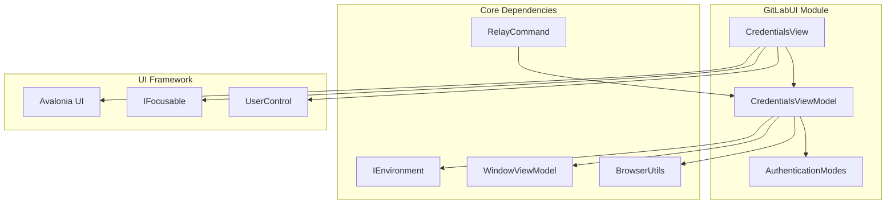
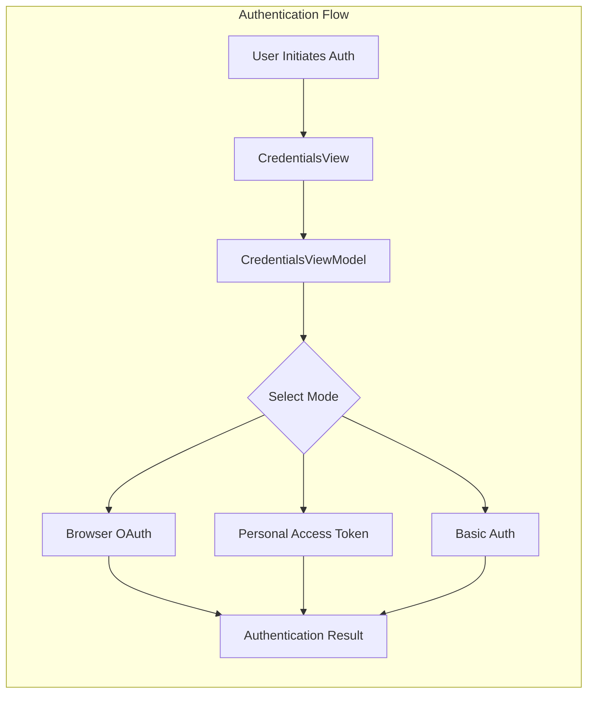
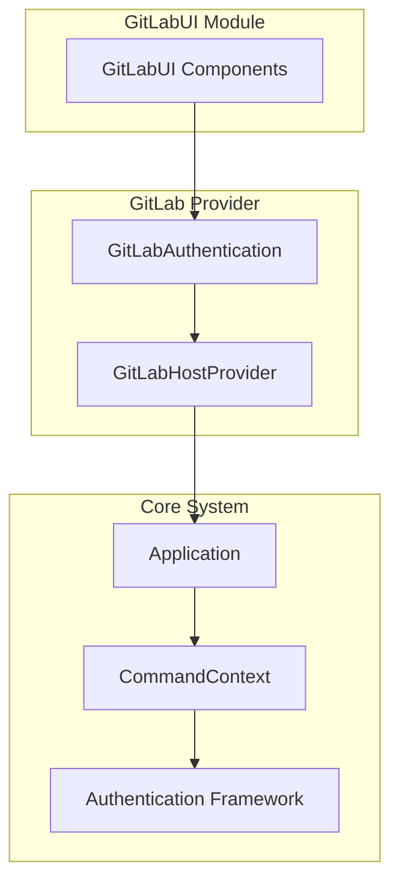
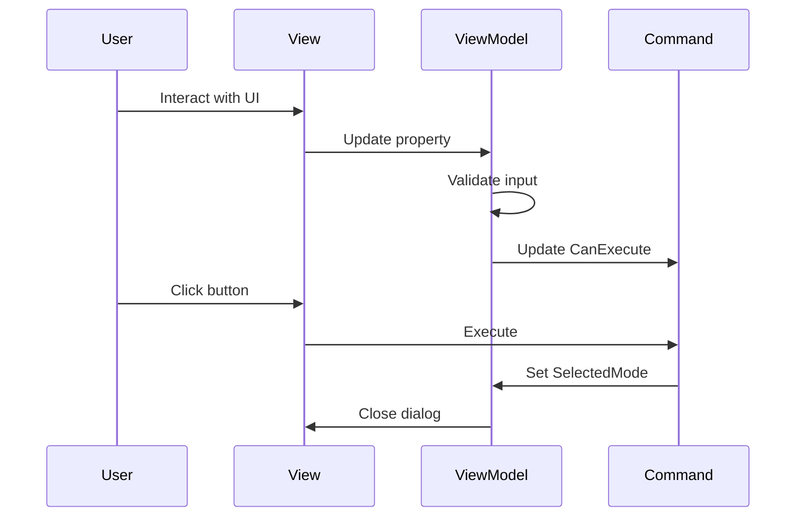
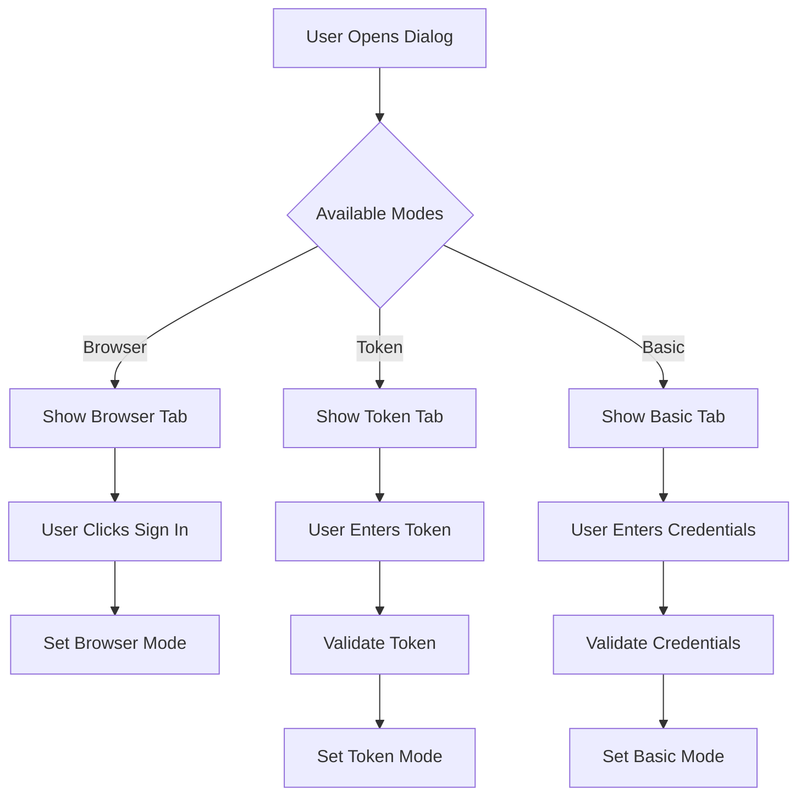

# GitLabUI Module Documentation

## Introduction

The GitLabUI module provides the user interface components for GitLab authentication within the Git Credential Manager (GCM) system. This module handles the presentation layer for GitLab credential collection, offering multiple authentication methods including browser-based OAuth, personal access tokens, and basic authentication.

## Module Overview

The GitLabUI module is a specialized UI component that integrates with the broader GitLab provider system to deliver a seamless authentication experience for GitLab repositories. It leverages the Avalonia UI framework to provide cross-platform dialog windows for credential collection.

## Architecture

### Component Structure

### Authentication Flow Architecture

## Core Components

### CredentialsViewModel

The `CredentialsViewModel` class serves as the primary view model for the GitLab authentication dialog. It manages the state and logic for credential collection across different authentication methods.

**Key Responsibilities:**
- Manages authentication mode selection (Browser, Token, Basic)
- Handles user input validation
- Coordinates with the environment for external operations
- Provides command bindings for UI interactions

**Properties:**
- `Token`: Personal access token input
- `TokenUserName`: Username for token authentication
- `UserName`: Basic authentication username
- `Password`: Basic authentication password
- `Url`: GitLab instance URL
- `ShowBrowserLogin`: Controls browser login visibility
- `ShowTokenLogin`: Controls token login visibility
- `ShowBasicLogin`: Controls basic auth visibility

**Commands:**
- `SignUpCommand`: Opens GitLab signup page
- `SignInBrowserCommand`: Initiates browser-based OAuth
- `SignInTokenCommand`: Processes token authentication
- `SignInBasicCommand`: Processes basic authentication

### CredentialsView

The `CredentialsView` class implements the visual interface for the GitLab authentication dialog, providing platform-specific focus management and user interaction handling.

**Key Features:**
- Implements `IFocusable` for proper focus management
- Provides platform-specific workarounds for macOS focus issues
- Automatically selects the best available authentication method
- Manages tab navigation between authentication modes

**Focus Management Strategy:**
1. Browser login (if available)
2. Token login (if browser unavailable)
3. Basic login (fallback option)

## Authentication Modes

### Browser Authentication
- **Method**: OAuth2 flow through system browser
- **Trigger**: `SignInBrowserCommand`
- **Result**: Sets `SelectedMode` to `AuthenticationModes.Browser`

### Personal Access Token Authentication
- **Method**: GitLab personal access token
- **Validation**: Requires non-empty token
- **Trigger**: `SignInTokenCommand`
- **Result**: Sets `SelectedMode` to `AuthenticationModes.Pat`

### Basic Authentication
- **Method**: Username and password
- **Validation**: Requires both username and password
- **Trigger**: `SignInBasicCommand`
- **Result**: Sets `SelectedMode` to `AuthenticationModes.Basic`

## Dependencies

### Core Module Dependencies
The GitLabUI module relies on several core components from the shared Core module:

- **[Core.UI](Core.md#ui-components)**: Base UI framework and controls
- **[Core.Environment](Core.md#platform-abstraction)**: Environment abstraction for browser operations
- **[Core.Commands](Core.md#command-framework)**: Command pattern implementation

### Integration Points

## UI/UX Design

### Dialog Layout
The authentication dialog presents multiple authentication options in a tabbed interface:

1. **Browser Tab**: OAuth authentication via external browser
2. **Token Tab**: Personal access token input
3. **Basic Tab**: Username/password authentication

### Platform Considerations
- **macOS**: Special focus handling due to platform-specific issues
- **Cross-platform**: Uses Avalonia for consistent UI across Windows, macOS, and Linux
- **Accessibility**: Proper focus management and keyboard navigation

## Data Flow

### User Input Flow

### Authentication Mode Selection

## Error Handling

The module implements several validation mechanisms:

- **Input Validation**: Real-time validation of user inputs
- **Command Validation**: CanExecute patterns prevent invalid operations
- **Platform Workarounds**: Special handling for known platform issues

## Extension Points

### Custom Authentication Modes
The modular design allows for future authentication method additions:

1. Extend `AuthenticationModes` enum
2. Add corresponding UI elements
3. Implement validation logic
4. Add command handlers

### UI Customization
- **Styling**: Avalonia styling system for visual customization
- **Layout**: XAML-based layout for easy modification
- **Localization**: Resource-based string management

## Security Considerations

### Credential Handling
- **No Persistent Storage**: UI does not store credentials
- **Memory Management**: Proper cleanup of sensitive data
- **Secure Transmission**: Credentials passed securely to authentication layer

### User Privacy
- **Browser Integration**: Uses system browser for OAuth to maintain security
- **Input Validation**: Prevents injection attacks
- **Focus Management**: Prevents credential exposure through focus handling

## Testing Considerations

### Unit Testing
- ViewModel logic can be tested independently
- Command execution can be mocked
- Property change notifications can be verified

### Integration Testing
- UI focus behavior across platforms
- Authentication mode selection
- Integration with GitLab provider system

## Performance Optimization

### UI Responsiveness
- **Async Operations**: Long-running operations are async
- **Property Change Optimization**: Efficient property notification
- **Command Caching**: RelayCommand implementation prevents unnecessary recreation

### Resource Management
- **Proper Disposal**: Cleanup of UI resources
- **Memory Efficiency**: Minimal memory footprint for dialog lifetime

## Future Enhancements

### Potential Improvements
1. **Biometric Authentication**: Integration with platform biometric APIs
2. **Credential Caching**: Optional secure credential storage
3. **Multi-Factor Authentication**: Support for GitLab MFA
4. **Enterprise Features**: Support for GitLab Enterprise-specific features

### Technology Updates
- **Avalonia Evolution**: Keep current with Avalonia framework updates
- **Platform Integration**: Enhanced integration with native platform features
- **Accessibility**: Improved accessibility support

## Related Documentation

- [GitLab Provider](GitLabProvider.md) - Core GitLab authentication logic
- [Core.UI](Core.md#ui-components) - Base UI framework components
- [Authentication Framework](Core.md#authentication) - Core authentication patterns
- [OAuth2 Implementation](Core.md#oauth2) - OAuth2 flow implementation details