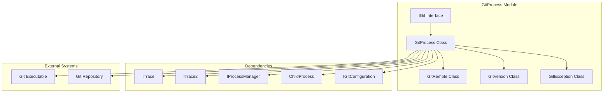
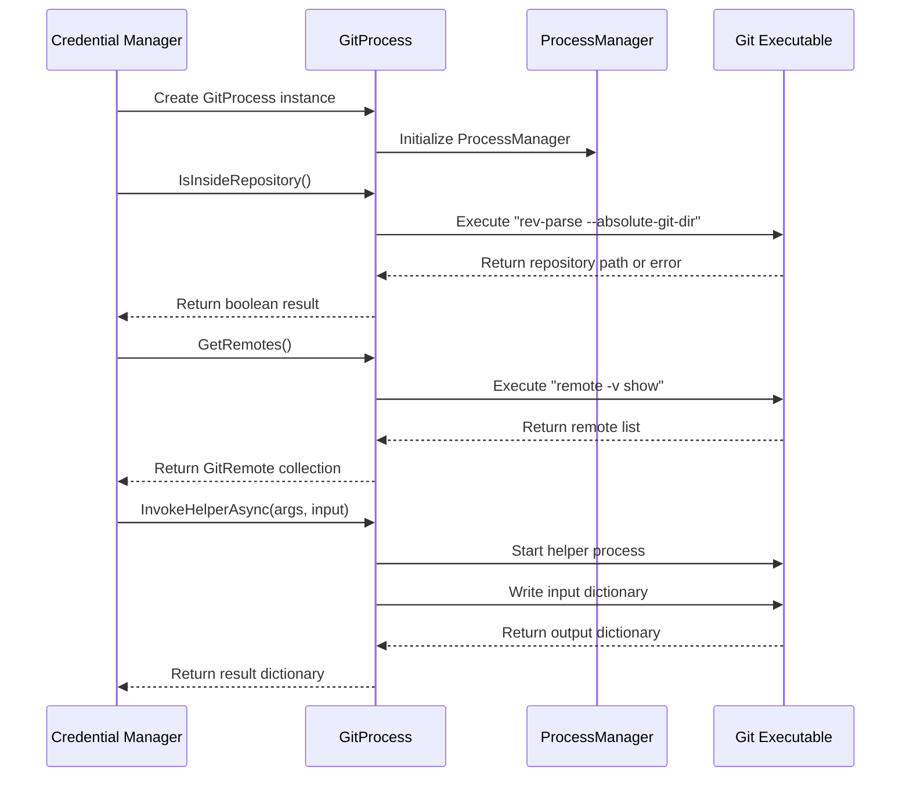
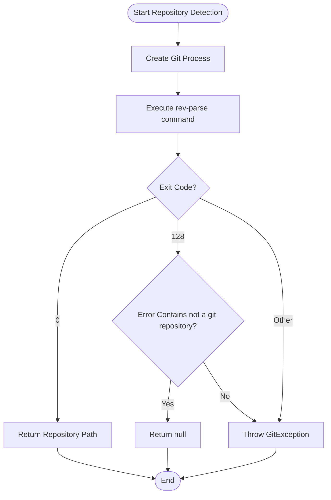
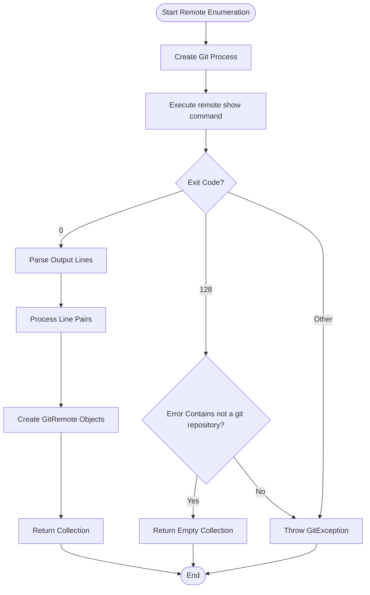
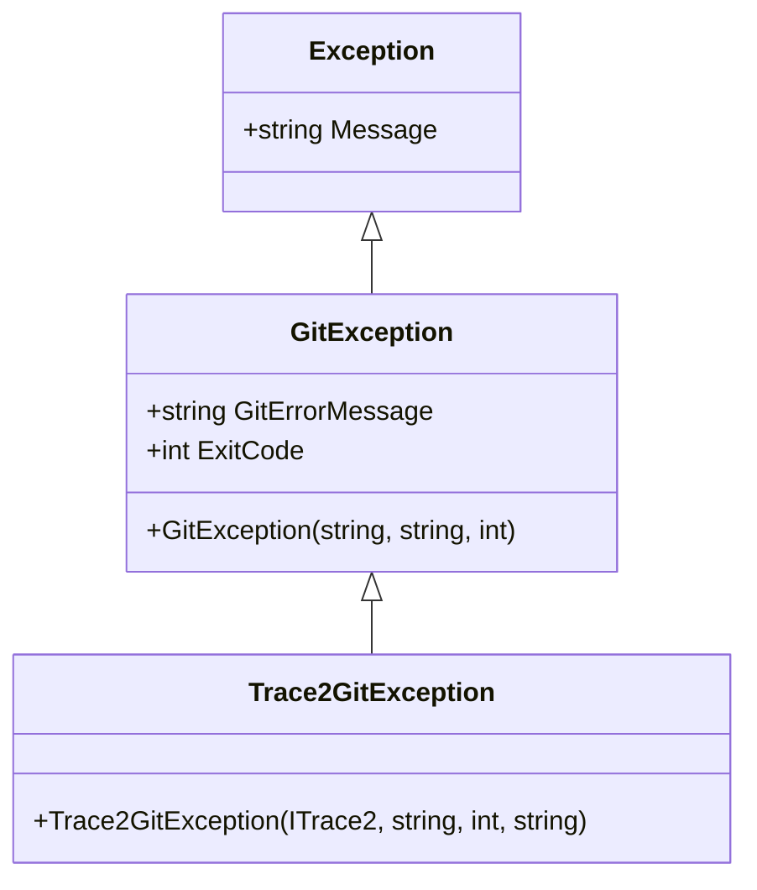

# GitProcess Module Documentation

## Introduction

The GitProcess module is a core component of the Git Credential Manager that provides a managed interface for interacting with Git processes. It serves as the primary bridge between the credential manager and Git operations, handling process creation, configuration management, and Git command execution.

## Architecture Overview

The GitProcess module implements a layered architecture that abstracts Git operations while providing comprehensive error handling and tracing capabilities.



## Core Components

### IGit Interface
The `IGit` interface defines the contract for Git operations, providing methods for:
- Process creation and management
- Repository detection and navigation
- Remote enumeration
- Configuration access
- Helper process invocation

### GitProcess Class
The `GitProcess` class is the primary implementation of `IGit`, offering:
- **Process Management**: Creates and manages Git child processes
- **Version Detection**: Automatically detects Git version on first use
- **Repository Operations**: Repository detection and remote enumeration
- **Configuration Access**: Provides access to Git configuration
- **Helper Invocation**: Supports Git's helper protocol for credential operations

### GitRemote Class
Represents a Git remote with:
- Remote name
- Fetch URL
- Push URL

### GitVersion Class
Provides version comparison capabilities for Git versions, supporting:
- Semantic version parsing
- Version comparison operations
- Equality and ordering operations

## Data Flow Architecture



## Process Flow

### Repository Detection Flow


### Remote Enumeration Flow


## Integration with Other Modules

### Authentication System Integration
The GitProcess module integrates with the [Authentication System](AuthenticationSystem.md) through:
- Helper process invocation for credential operations
- Configuration access for authentication settings
- Remote URL parsing for authentication decisions

### Configuration Management
Integrates with [Configuration Service](ConfigurationService.md) via:
- `IGitConfiguration` interface implementation
- Git configuration key-value access
- Repository and global configuration scopes

### Tracing and Diagnostics
Leverages the [Tracing and Diagnostics](TracingAndDiagnostics.md) module:
- `ITrace` for detailed operation logging
- `ITrace2` for structured tracing
- Process class tracking for debugging

## Error Handling

The module implements comprehensive error handling:



## Key Features

### 1. Process Management
- Creates managed Git processes with proper argument handling
- Supports working directory specification
- Integrates with process tracing

### 2. Repository Operations
- Detects Git repository presence
- Retrieves repository root path
- Enumerates configured remotes

### 3. Version Management
- Automatic Git version detection
- Version comparison capabilities
- Supports various Git version formats

### 4. Helper Protocol Support
- Implements Git's stdin/stdout helper protocol
- Supports key-value map communication
- Handles credential helper operations

### 5. Configuration Access
- Provides access to Git configuration
- Supports repository and global scopes
- Integrates with configuration system

## Usage Patterns

### Basic Repository Detection
```csharp
var git = new GitProcess(trace, trace2, processManager, gitPath);
if (git.IsInsideRepository())
{
    var repoPath = git.GetCurrentRepository();
    // Process repository
}
```

### Remote Enumeration
```csharp
var remotes = git.GetRemotes();
foreach (var remote in remotes)
{
    Console.WriteLine($"Remote: {remote.Name}, URL: {remote.FetchUrl}");
}
```

### Helper Process Invocation
```csharp
var input = new Dictionary<string, string>
{
    ["protocol"] = "https",
    ["host"] = "github.com"
};

var result = await git.InvokeHelperAsync("credential fill", input);
```

## Performance Considerations

- **Lazy Version Detection**: Git version is detected only when first accessed
- **Process Reuse**: Each operation creates a new process for isolation
- **Stream Handling**: Output is read completely before processing to avoid deadlocks
- **Error Caching**: Repository detection results are not cached to handle directory changes

## Security Considerations

- **Process Isolation**: Each Git operation runs in a separate process
- **Input Validation**: Arguments are validated before process creation
- **Error Sanitization**: Git error messages are properly handled
- **Working Directory**: Supports scoped operations to specific directories

## Dependencies

- [Core Application Framework](CoreApplicationFramework.md) - For tracing and process management
- [Configuration Service](ConfigurationService.md) - For configuration access
- [Cross-Platform Support](CrossPlatformSupport.md) - For platform-specific process handling

## Related Documentation

- [Git Integration](GitIntegration.md) - Overview of Git-related components
- [GitConfiguration](GitConfiguration.md) - Configuration management details
- [GitStreamReader](GitStreamReader.md) - Stream processing utilities
- [Process Management](ProcessManagement.md) - Process creation and management