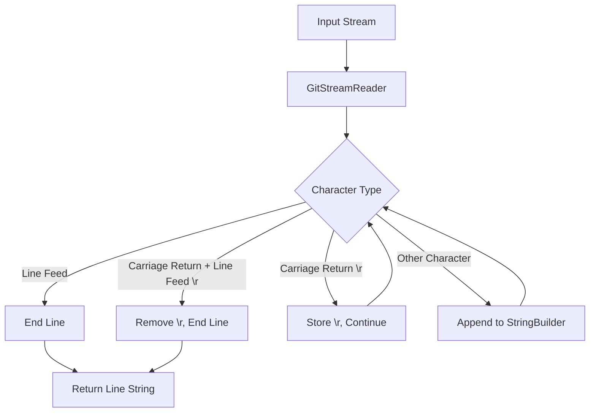
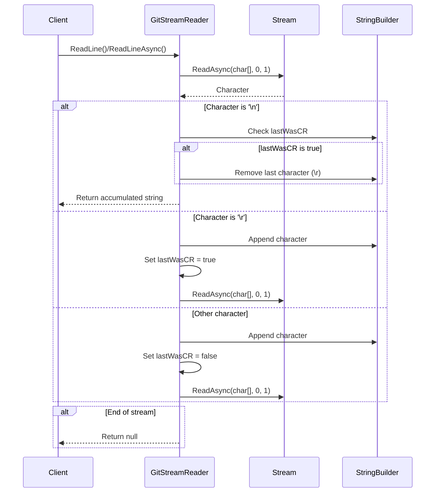
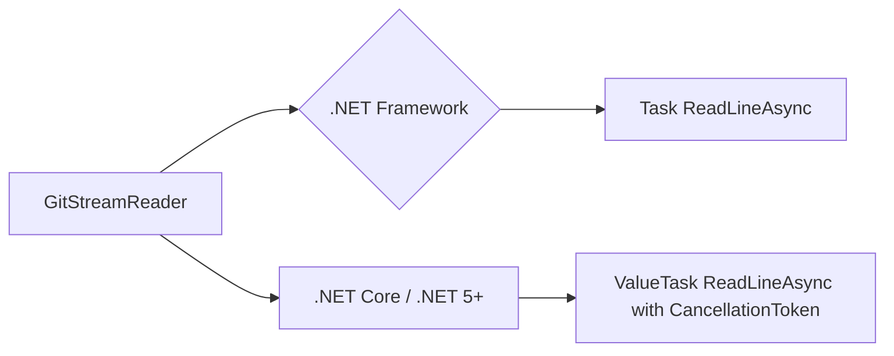

# GitStreamReader Module Documentation

## Introduction

The GitStreamReader module provides a specialized StreamReader implementation designed to handle Git's specific line-ending requirements. This component ensures consistent line reading behavior across different operating systems by treating only line-feed characters (`\n`) or carriage-return followed by line-feed (`\r\n`) as new-line delimiters, while ignoring lone carriage-return characters (`\r`).

## Architecture Overview

### Core Component

The module consists of a single core component:
- **GitStreamReader**: A custom StreamReader that overrides line reading behavior to match Git's expectations

### Design Philosophy

GitStreamReader addresses a specific compatibility issue where classic Macintosh OS (pre-OS X) used lone carriage-returns as line endings. Since Git doesn't support these legacy systems, the reader explicitly ignores lone carriage-returns, ensuring consistent behavior across modern platforms.

## Component Details

### GitStreamReader Class

```csharp
public class GitStreamReader : StreamReader
```

**Purpose**: Provides Git-compatible line reading from streams

**Key Features**:
- Overrides `ReadLine()` and `ReadLineAsync()` methods
- Treats only `\n` or `\r\n` as line endings
- Ignores lone `\r` characters
- Thread-safe asynchronous operations
- Cross-platform compatibility (.NET Framework and .NET Core/.NET 5+)

**Constructor**:
```csharp
public GitStreamReader(Stream stream, Encoding encoding)
```

**Methods**:
- `ReadLine()`: Synchronous line reading
- `ReadLineAsync()`: Asynchronous line reading with cancellation support

## Data Flow



## Process Flow



## Integration with Git Integration Module

The GitStreamReader is a foundational component within the [Git Integration](Git-Integration.md) module, specifically designed to work with Git processes that require precise control over line ending interpretation.

### Related Components

- **[GitProcess](Git-Integration.md#gitprocess)**: Uses GitStreamReader for reading Git command output
- **[IGit](Git-Integration.md#igit-interface)**: Interface that may utilize GitStreamReader for stream operations

## Platform Compatibility

The implementation includes conditional compilation for different .NET versions:



## Usage Context

GitStreamReader is typically used in scenarios where:
1. Reading Git process output that may contain mixed line endings
2. Processing Git configuration files across different platforms
3. Ensuring consistent line reading behavior regardless of the host operating system

## Thread Safety

The implementation is thread-safe for read operations, utilizing `ConfigureAwait(false)` for asynchronous operations to avoid deadlocks in UI applications.

## Performance Considerations

- Uses a single-character buffer for reading to handle line ending detection precisely
- Employs StringBuilder for efficient string accumulation
- Minimizes memory allocations by reusing the character buffer

## Error Handling

The component handles end-of-stream conditions gracefully:
- Returns `null` when no data is available
- Maintains consistent behavior between sync and async operations
- Preserves the original StreamReader's exception behavior for stream errors

## Dependencies

This module has minimal dependencies:
- **System.IO**: For Stream and StreamReader base functionality
- **System.Text**: For Encoding and StringBuilder
- **System.Threading**: For CancellationToken support
- **System.Threading.Tasks**: For async operations

## Future Considerations

The current implementation is optimized for Git's specific requirements. Any modifications should consider:
- Maintaining compatibility with existing Git processes
- Preserving the specific line ending behavior
- Ensuring cross-platform consistency
- Keeping the minimal dependency footprint