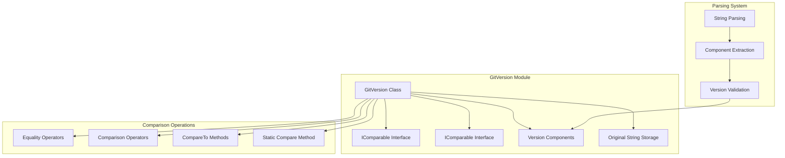

# GitVersion Module Documentation

## Introduction

The GitVersion module provides comprehensive version handling and compatibility management for Git operations within the Git Credential Manager. It implements semantic version comparison and parsing specifically tailored for Git version strings.

## Architecture Overview

The GitVersion module implements a robust version comparison system that handles Git's version format and provides compatibility checking capabilities.



## Core Components

### GitVersion Class
The main class that represents a Git version and provides comprehensive comparison capabilities. It implements both `IComparable` and `IComparable<GitVersion>` interfaces for flexible comparison scenarios.

### Version Component Management
Internal management of version components as a list of integers, allowing for versions with varying numbers of components (e.g., "2.30.0" vs "2.30.0.1").

### Original String Preservation
Maintains the original version string for display and debugging purposes while providing normalized comparison capabilities.

## Key Features

### Flexible Version Parsing
- **String-based construction**: Parse version from Git version output
- **Component-based construction**: Create version from individual components
- **Null handling**: Graceful handling of null or empty version strings
- **Partial parsing**: Handle versions with missing components

### Comprehensive Comparison
- **Full interface implementation**: Implements both IComparable interfaces
- **Operator overloading**: Provides all standard comparison operators
- **Null-safe comparisons**: Proper handling of null version objects
- **Component-wise comparison**: Intelligent comparison of version components

### Git-Specific Handling
- **Git version format**: Optimized for Git's version string format
- **Component normalization**: Handle versions with different component counts
- **String preservation**: Maintain original version string for display

## Version Format Support

### Standard Git Versions
```
2.30.0
2.30.1
2.31.0.rc0
2.31.0.rc1
2.31.0
```

### Complex Version Strings
```
2.30.0.windows.1
2.31.0.rc2.windows.1
2.31.0.GIT
```

### Parsing Behavior
The parser extracts only numeric components, stopping at the first non-numeric component:
- "2.30.0" → [2, 30, 0]
- "2.30.0.rc1" → [2, 30, 0]
- "2.30.0.windows.1" → [2, 30, 0]

## Usage Patterns

### Basic Version Creation
```csharp
// From Git version string
GitVersion version = new GitVersion("2.30.0");

// From components
GitVersion version = new GitVersion(2, 30, 0);

// From null (empty version)
GitVersion version = new GitVersion(null);
```

### Version Comparison
```csharp
GitVersion v1 = new GitVersion("2.30.0");
GitVersion v2 = new GitVersion("2.31.0");

// Direct comparison
if (v1 < v2)
{
    Console.WriteLine("v1 is older than v2");
}

// Using CompareTo
int result = v1.CompareTo(v2);
if (result < 0)
{
    Console.WriteLine("v1 is older than v2");
}
else if (result > 0)
{
    Console.WriteLine("v1 is newer than v2");
}
else
{
    Console.WriteLine("Versions are equal");
}
```

### Null-Safe Comparisons
```csharp
GitVersion version = new GitVersion("2.30.0");
GitVersion nullVersion = null;

// Safe comparison with null
if (version > nullVersion)
{
    Console.WriteLine("Version is greater than null");
}

// Static comparison method
int result = GitVersion.Compare(version, nullVersion);
// result will be 1 (version is greater than null)
```

### Version Requirements
```csharp
GitVersion currentVersion = new GitVersion("2.30.0");
GitVersion requiredVersion = new GitVersion("2.28.0");

// Check if current version meets requirements
if (currentVersion >= requiredVersion)
{
    Console.WriteLine("Version requirement satisfied");
}

// Feature-specific version checks
GitVersion featureVersion = new GitVersion("2.25.0");
if (currentVersion >= featureVersion)
{
    Console.WriteLine("Feature is supported");
}
```

## Comparison Algorithm

### Component-Wise Comparison
1. Compare components from left to right
2. If components differ, return comparison result
3. If one version has more components, compare remaining components to 0
4. If all components are equal, versions are equal

### Example Comparisons
```csharp
// Basic comparison
"2.30.0" vs "2.31.0" → "2.30.0" < "2.31.0"

// Different component counts
"2.30" vs "2.30.0" → Equal (missing components treated as 0)

// Complex comparison
"2.30.1" vs "2.30.0" → "2.30.1" > "2.30.0"
```

## Integration with Git Operations

### Version Detection
```csharp
// Get Git version from GitProcess
IGit git = new GitProcess(trace, trace2, processManager, gitPath);
GitVersion version = git.Version;

// Use version for feature detection
if (version >= new GitVersion("2.25.0"))
{
    // Use newer Git features
}
```

### Feature Compatibility
```csharp
// Define minimum versions for features
GitVersion ConfigTypeMinVersion = new GitVersion("2.18.0");
GitVersion currentVersion = git.Version;

// Check feature support
bool supportsConfigType = currentVersion >= ConfigTypeMinVersion;
```

## Error Handling

### Parsing Errors
- **Invalid strings**: Graceful handling of non-version strings
- **Empty strings**: Treated as empty versions
- **Partial parsing**: Use valid components even if string is malformed

### Comparison Errors
- **Null handling**: Proper null object handling in comparisons
- **Type mismatches**: Clear error messages for invalid comparisons
- **Component overflow**: Safe handling of large component values

## Performance Considerations

### Efficient Comparison
- **Component caching**: Parsed components are cached for efficient comparison
- **String interning**: Original string is preserved for display
- **Lazy parsing**: Components parsed only when needed

### Memory Usage
- **Minimal overhead**: Small memory footprint for version objects
- **String sharing**: Original strings can be shared across instances
- **Component optimization**: Efficient storage of version components

## Testing and Validation

### Version Parsing Tests
- **Standard formats**: Testing with common Git version strings
- **Edge cases**: Testing with malformed and edge-case strings
- **Compatibility**: Testing across different Git distributions

### Comparison Tests
- **Equality tests**: Comprehensive testing of equality operations
- **Ordering tests**: Validation of version ordering
- **Null handling**: Testing null object handling

## Best Practices

### Version Creation
- Use string constructor for Git version output
- Use component constructor for known versions
- Handle null/empty strings gracefully

### Version Comparison
- Use comparison operators for readability
- Use CompareTo for detailed comparison results
- Always consider null handling in comparisons

### Feature Detection
- Define minimum version constants for features
- Use version comparison for feature enablement
- Provide fallback behavior for older versions

## Integration with Other Modules

### GitProcess Integration
The GitVersion module integrates with [GitProcess](GitProcess.md) to:
- Provide version information for Git operations
- Enable version-specific feature support
- Handle compatibility across Git versions

### Configuration Integration
Works with [Git Configuration](GitConfiguration.md) for:
- Version-specific configuration handling
- Feature enablement based on version
- Command adaptation for different versions

### Cross-Platform Support
Integrates with [Cross-Platform Support](Cross-Platform%20Support.md) for:
- Platform-specific Git version handling
- Distribution-specific version formats
- Environment-specific version detection