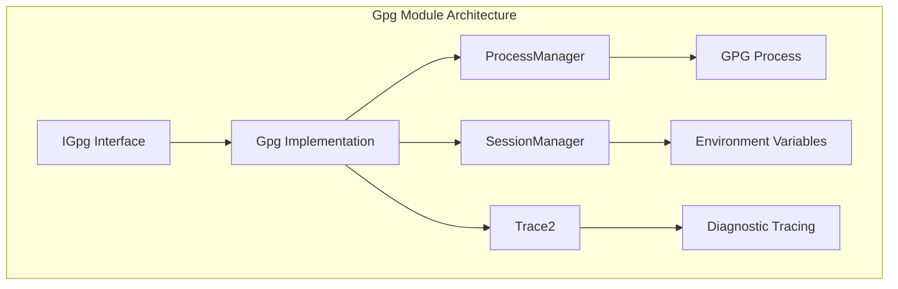
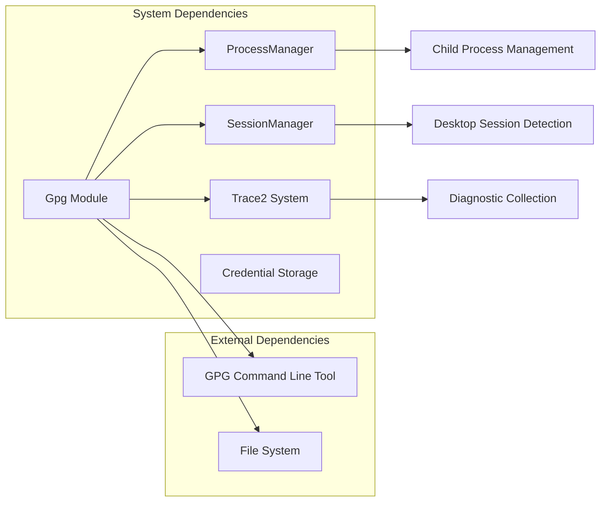
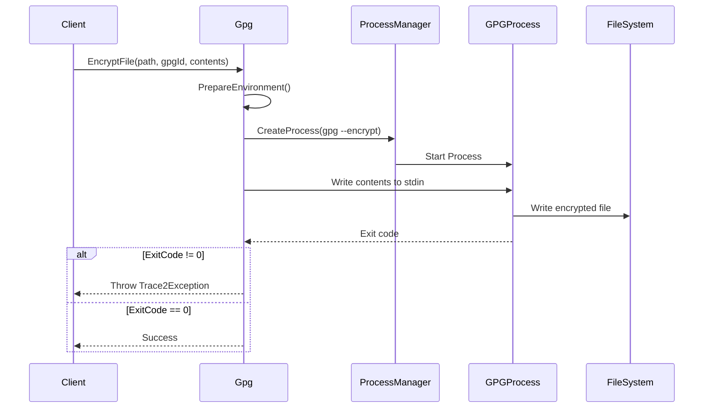
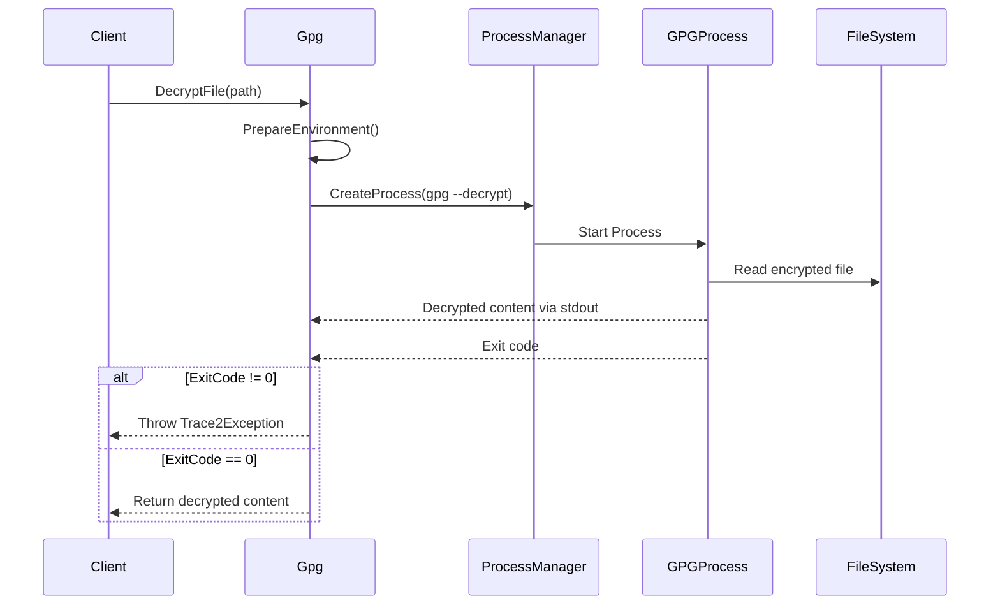
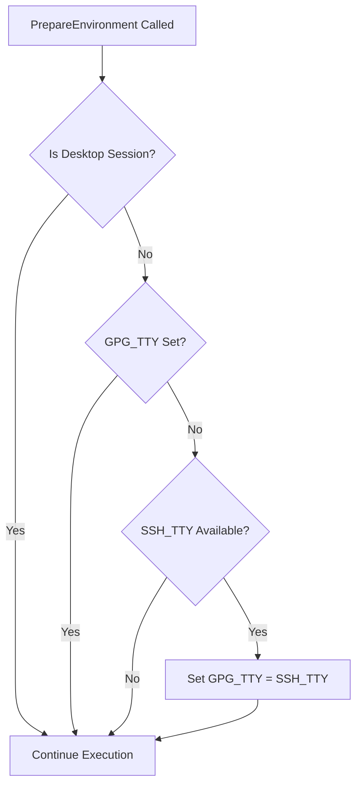
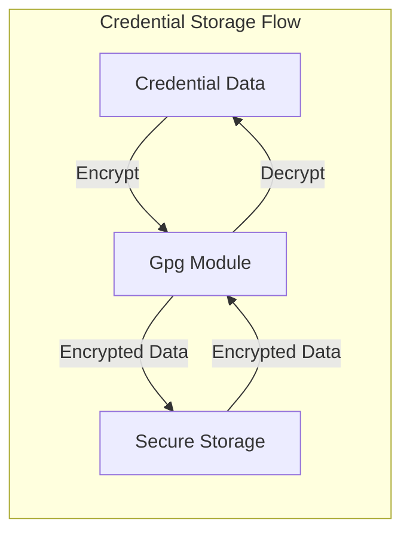
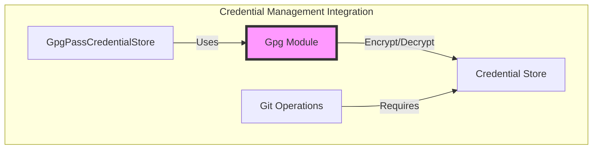

# Gpg Module Documentation

## Introduction

The Gpg module provides a secure interface for file encryption and decryption operations using GNU Privacy Guard (GPG). This module is a critical component of the Git Credential Manager's security infrastructure, enabling secure storage and retrieval of sensitive credential data through GPG encryption.

The module implements a clean abstraction layer over GPG command-line operations, providing both synchronous encryption and decryption capabilities with comprehensive error handling and diagnostic tracing. It is specifically designed to handle SSH session environments and integrates seamlessly with the broader credential management ecosystem.

## Architecture Overview

The Gpg module follows a simple but robust architecture with clear separation of concerns:

## Core Components

### IGpg Interface

The `IGpg` interface defines the contract for GPG operations within the system:

- **DecryptFile(string path)**: Decrypts a GPG-encrypted file and returns the plaintext content
- **EncryptFile(string path, string gpgId, string contents)**: Encrypts content using a specified GPG recipient ID and writes it to a file

This interface provides a simple, focused API that abstracts the complexity of GPG command-line operations.

### Gpg Implementation

The `Gpg` class implements the `IGpg` interface and provides the actual GPG functionality. Key characteristics:

- **Process-based execution**: Uses the GPG command-line tool through process invocation
- **Environment-aware**: Handles SSH session environments by setting appropriate GPG_TTY variables
- **Comprehensive error handling**: Provides detailed error messages with exit codes and output streams
- **Diagnostic integration**: Full integration with the Trace2 diagnostic system

## Dependencies and Integration

The Gpg module integrates with several core system components:

### Key Dependencies

- **[ProcessManager](ProcessManager.md)**: Manages the creation and execution of GPG child processes
- **[SessionManager](SessionManager.md)**: Provides session context information, particularly for SSH environments
- **[Trace2](Trace2.md)**: Enables comprehensive diagnostic tracing and error reporting
- **GPG Command Line Tool**: The underlying encryption/decryption engine

## Data Flow

### Encryption Process Flow

### Decryption Process Flow

## Environment Handling

The module includes sophisticated environment handling for SSH sessions:

This logic ensures that GPG operations work correctly in headless SSH environments by automatically configuring the GPG_TTY environment variable when necessary.

## Error Handling

The module implements comprehensive error handling with detailed diagnostic information:

- **Process startup failures**: Throws `Trace2Exception` with "Failed to start gpg" message
- **Non-zero exit codes**: Captures stdout, stderr, and exit code for detailed error reporting
- **Formatted error messages**: Provides structured error information including file path, exit code, and output streams
- **Trace2 integration**: All errors are properly traced through the diagnostic system

## Security Considerations

The Gpg module handles sensitive operations and implements several security measures:

1. **Process isolation**: GPG operations run in separate processes with controlled input/output
2. **Environment variable handling**: Secure management of GPG_TTY for SSH environments
3. **Error sanitization**: Careful handling of error messages to avoid information leakage
4. **Batch mode operation**: Uses `--batch` flag to prevent interactive prompts that could block automation

## Usage Patterns

The Gpg module is typically used in credential storage scenarios:

Common usage patterns include:
- **GPG Pass Integration**: Used by [GpgPassCredentialStore](GpgPassCredentialStore.md) for secure credential storage
- **File-based Encryption**: Direct encryption/decryption of sensitive configuration files
- **Credential Backup**: Secure backup and restoration of credential data

## Integration with Credential Management

The Gpg module plays a crucial role in the credential management ecosystem:

The module enables secure storage solutions like the GPG Pass credential store, which uses GPG encryption to protect credential data at rest.

## Platform Compatibility

The Gpg module is designed to work across different platforms:

- **Cross-platform**: Uses standard GPG command-line interface available on all platforms
- **SSH-aware**: Special handling for SSH sessions on all supported platforms
- **Process management**: Leverages platform-specific process management through [ProcessManager](ProcessManager.md)
- **Environment integration**: Works with platform-specific environment handling through [SessionManager](SessionManager.md)

## Diagnostic and Monitoring

The module provides comprehensive diagnostic capabilities through Trace2 integration:

- **Process tracing**: All GPG process executions are traced with appropriate process class
- **Error reporting**: Detailed error information including exit codes and output streams
- **Performance monitoring**: Process execution time and resource usage tracking
- **Environment logging**: SSH environment detection and GPG_TTY configuration logging

## Configuration

The Gpg module requires minimal configuration:

- **GPG Path**: The path to the GPG executable (injected via constructor)
- **Session Context**: Session manager for environment detection
- **Process Management**: Process manager for child process execution
- **Tracing**: Trace2 instance for diagnostic integration

No additional configuration files or settings are required, making the module easy to deploy and maintain.

## Future Considerations

The current implementation provides a solid foundation for GPG operations. Potential enhancements could include:

- **Key management**: Additional methods for GPG key generation and management
- **Streaming support**: Support for large file encryption/decryption with streaming
- **Multiple recipients**: Support for encrypting to multiple GPG recipients
- **Signature verification**: Integration with GPG signature verification capabilities

The modular design and clean interface make it straightforward to extend functionality while maintaining backward compatibility.