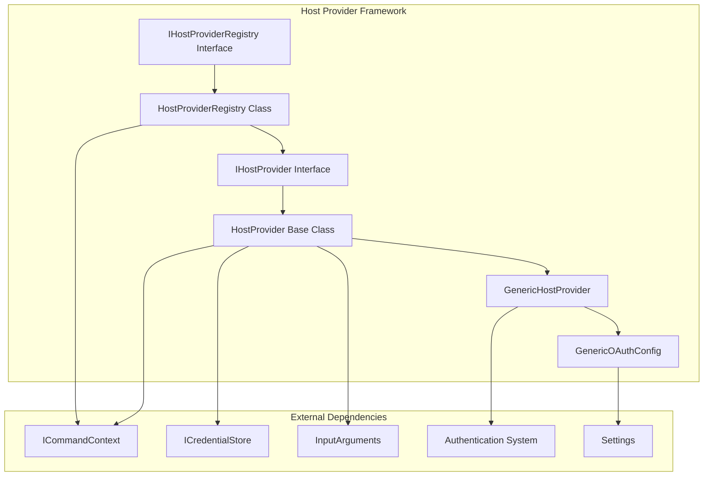
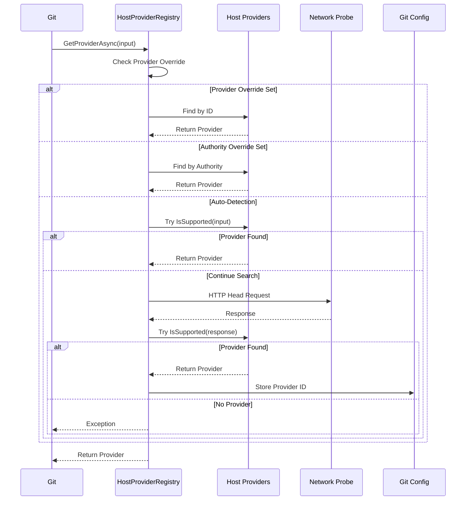

# Host Provider Framework

## Overview

The Host Provider Framework is a core component of the Git Credential Manager that provides a pluggable architecture for supporting different Git hosting services. It enables the system to automatically detect and interact with various Git hosting providers (GitHub, GitLab, Bitbucket, Azure Repos, etc.) using their specific authentication mechanisms and APIs.

## Purpose

The framework serves as the central hub for:
- **Provider Discovery**: Automatically detecting which hosting service a Git repository belongs to
- **Authentication Orchestration**: Coordinating different authentication methods (OAuth, Basic Auth, Windows Integrated Authentication)
- **Credential Management**: Handling the storage, retrieval, and generation of credentials for different providers
- **Extensibility**: Allowing new hosting providers to be added without modifying the core system

## Architecture



## Core Components

### 1. IHostProvider Interface
The fundamental contract that all host providers must implement. Defines the basic operations for credential management and provider identification.

**Key Responsibilities:**
- Provider identification (ID, Name, Supported Authorities)
- Support detection for input arguments and HTTP responses
- Credential operations (Get, Store, Erase)

### 2. HostProvider Base Class
An abstract base class that provides common functionality for all host providers, including:
- Default credential store integration
- Service name generation for credential storage
- Basic credential lifecycle management

### 3. IHostProviderRegistry Interface
Manages the collection of registered host providers and handles provider selection logic.

**Key Features:**
- Provider registration with priority levels
- Auto-detection of appropriate providers
- Support for provider overrides

### 4. HostProviderRegistry Implementation
The concrete implementation that:
- Maintains providers in priority-based collections
- Performs auto-detection through network probing
- Handles fallback mechanisms
- Caches detection results in Git configuration

### 5. GenericHostProvider
A universal provider that supports standard authentication methods for any Git hosting service:
- Basic Authentication
- Windows Integrated Authentication
- OAuth 2.0 (with configurable endpoints)
- Custom OAuth configurations

### 6. GenericOAuthConfig
Handles OAuth configuration for generic providers, including:
- Endpoint configuration
- Client credentials
- Scope management
- Gitea-specific defaults

## Provider Selection Process



## Authentication Flow

The GenericHostProvider implements a sophisticated authentication flow:

1. **Protocol Check**: Validates the remote URL protocol
2. **OAuth Configuration**: Checks for custom OAuth settings
3. **Windows Integrated Auth**: Detects WIA support on Windows
4. **Basic Authentication**: Falls back to username/password prompt

## Sub-modules

The Host Provider Framework consists of several specialized sub-modules:

### [Host Provider Registry](Host%20Provider%20Registry.md)
Manages provider registration, selection, and auto-detection logic. Details the priority-based provider selection system and auto-detection mechanisms.

### [Generic Host Provider](Generic%20Host%20Provider.md)
Implements universal authentication support for any Git hosting service. Covers the fallback authentication mechanisms and OAuth integration.

### [Generic OAuth Configuration](Generic%20OAuth%20Configuration.md)
Handles OAuth 2.0 configuration for generic providers. Explains custom OAuth endpoint configuration and Gitea integration.

## Integration Points

### With Authentication System
The framework integrates with the [Authentication System](Authentication%20System.md) to provide various authentication methods:
- OAuth 2.0 flows (Authorization Code, Device Code)
- Basic Authentication
- Windows Integrated Authentication

### With Credential Management
Works closely with the [Credential Management](Credential%20Management.md) system for:
- Secure credential storage
- Credential retrieval and updates
- Cross-platform credential operations

### With Core Application Framework
Leverages the [Core Application Framework](Core%20Application%20Framework.md) for:
- Command context and settings
- Trace logging and diagnostics
- Configuration management

## Configuration

The framework supports various configuration options:

```ini
[credential]
    provider = github
    authority = oauth
    oauthAuthzEndpoint = https://example.com/oauth/authorize
    oauthTokenEndpoint = https://example.com/oauth/token
    oauthClientId = your-client-id
    oauthScopes = repo read:user
```

## Error Handling

The framework implements comprehensive error handling:
- Provider detection failures with fallback mechanisms
- Network timeout handling during auto-detection
- Graceful degradation when providers are unavailable
- Detailed trace logging for troubleshooting

## Performance Considerations

- **Auto-detection Timeout**: Configurable timeout for network probes (default: 2000ms)
- **Provider Caching**: Successful auto-detection results are cached in Git configuration
- **Priority-based Selection**: Higher priority providers are checked first
- **Lazy Initialization**: Providers are created on-demand

## Security Features

- **Secure Credential Storage**: Integration with OS-specific credential stores
- **OAuth Token Refresh**: Automatic refresh token management
- **HTTPS Enforcement**: Warnings for HTTP remotes
- **Provider Validation**: Prevents registration of invalid providers

## Extensibility

New hosting providers can be added by:
1. Implementing `IHostProvider` or extending `HostProvider`
2. Registering with appropriate priority in the registry
3. Implementing provider-specific authentication logic
4. Adding any required UI components

The framework's modular design ensures that adding new providers doesn't require changes to existing code, maintaining backward compatibility and system stability.