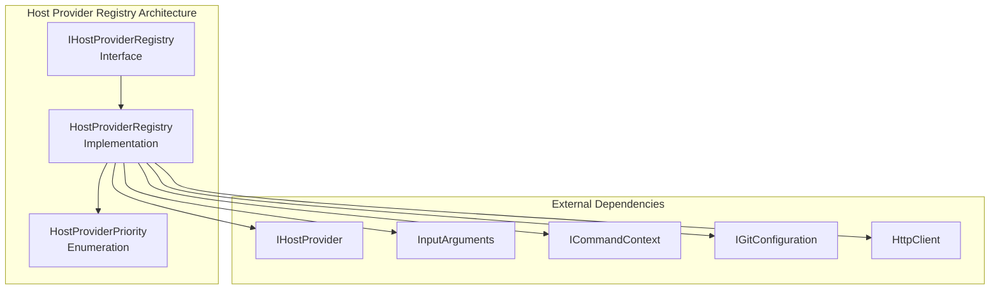
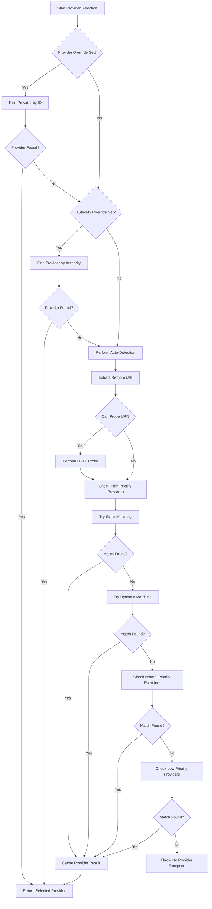

# Host Provider Registry Module

## Introduction

The Host Provider Registry module is a critical component of the Git Credential Manager that manages the discovery, registration, and selection of host providers. It serves as the central orchestrator for determining which provider should handle authentication requests for different Git hosting services.

The registry implements a priority-based selection mechanism that allows multiple host providers to coexist and compete for handling credential requests. It supports both manual provider selection through configuration overrides and automatic detection through network probing and provider capability matching.

## Architecture Overview

The Host Provider Registry follows a registry pattern with priority-based provider selection. It maintains collections of host providers organized by priority levels and implements sophisticated auto-detection logic to determine the most appropriate provider for a given Git operation.



## Core Components

### IHostProviderRegistry Interface

The `IHostProviderRegistry` interface defines the contract for host provider management. It provides methods for registering host providers with specific priorities and selecting the appropriate provider for Git credential operations.

**Key Responsibilities:**
- Provider registration with priority-based organization
- Provider selection based on input arguments
- Resource management through IDisposable pattern

### HostProviderRegistry Implementation

The `HostProviderRegistry` class implements the registry functionality with sophisticated provider selection logic. It maintains providers in priority-based collections and implements both manual override and automatic detection mechanisms.

**Key Features:**
- Priority-based provider organization (High, Normal, Low)
- Support for provider ID overrides
- Legacy authority ID override support
- Network-based auto-detection with HTTP probing
- Provider result caching in Git configuration

### HostProviderPriority Enumeration

Defines the priority levels for host provider registration and selection:
- `Low`: Providers with basic or fallback capabilities
- `Normal`: Standard providers with typical feature sets
- `High`: Providers with specialized or enhanced capabilities

## Provider Selection Process

The provider selection follows a hierarchical approach with multiple fallback mechanisms:



## Auto-Detection Mechanism

The auto-detection process uses a sophisticated two-phase approach:

### Phase 1: Static Matching
Providers are evaluated based on static Git input arguments (remote URL, protocol, host) without network calls. This is a fast, lightweight check that most providers can satisfy.

### Phase 2: Dynamic Matching
If static matching fails, the registry performs HTTP probing of the remote URL and allows providers to examine the HTTP response headers, status codes, and content to determine compatibility.

**Network Probing Features:**
- Configurable timeout (default: milliseconds from settings)
- HEAD request to minimize bandwidth usage
- Error handling for network failures
- Warning messages for timeout scenarios
- Single probe result shared across all providers

## Configuration Integration

The registry integrates with Git configuration to support manual overrides and result caching:

### Provider Override
Users can manually specify a provider using the `credential.provider` configuration setting or the `GCM_PROVIDER` environment variable.

### Authority Override (Deprecated)
Legacy support for `credential.authority` and `GCM_AUTHORITY` settings with appropriate warning messages.

### Result Caching
Successful auto-detection results are cached in Git configuration to avoid repeated network probes:
- Configuration key: `credential.<url>.provider`
- Global scope to apply across all repositories
- Graceful handling of configuration write failures

## Error Handling

The registry implements comprehensive error handling:

**Provider Not Found:** Throws exception with descriptive message when no suitable provider is available

**Network Failures:** Gracefully handles probe failures with warning messages and fallback to lower priority providers

**Configuration Errors:** Provides helpful error messages and manual configuration suggestions when caching fails

**Timeout Handling:** Configurable probe timeout with appropriate warnings for performance issues

## Performance Considerations

**Provider Organization:** Providers are organized by priority to enable early termination on successful matches

**Network Optimization:** Single HTTP probe shared across all providers to minimize network traffic

**Caching Strategy:** Successful detection results cached in Git configuration to avoid repeated probes

**Timeout Configuration:** Configurable probe timeout allows users to disable network probing for performance

## Integration with Other Modules

### Authentication System Integration
The registry works closely with the [Authentication System](Authentication System.md) to ensure selected providers have appropriate authentication capabilities.

### Provider Module Dependencies
The registry supports providers from various hosting platforms:
- [GitHub Provider](GitHub Provider.md)
- [GitLab Provider](GitLab Provider.md)
- [Bitbucket Provider](Bitbucket Provider.md)
- [Azure Repos Provider](Azure Repos Provider.md)

### Core Framework Dependencies
- **Command Context**: Provides access to settings, tracing, and HTTP client factory
- **Input Arguments**: Supplies Git credential query parameters
- **Git Configuration**: Enables result caching and override detection

## Usage Examples

### Provider Registration
```csharp
var registry = new HostProviderRegistry(commandContext);
registry.Register(new GitHubHostProvider(), HostProviderPriority.High);
registry.Register(new GenericHostProvider(), HostProviderPriority.Normal);
```

### Provider Selection
```csharp
var input = new InputArguments(args);
var provider = await registry.GetProviderAsync(input);
```

### Configuration Override
```bash
# Manual provider selection
git config --global credential.https://github.com.provider github

# Disable auto-detection probing
git config --global credential.autoDetectProviderTimeout 0
```

## Security Considerations

**Network Probing:** HTTP probes only performed on HTTP/HTTPS URLs to avoid security issues with other protocols

**Provider Validation:** Prevents registration of providers with reserved IDs that could conflict with auto-detection

**Configuration Security:** Provider caching uses Git configuration which respects existing Git security mechanisms

## Extensibility

The registry design supports easy extension with new providers:

1. Implement `IHostProvider` interface
2. Register with appropriate priority level
3. Implement both static and dynamic matching logic
4. Handle disposal for resource cleanup

The priority-based system allows new providers to be inserted at appropriate levels without disrupting existing functionality.