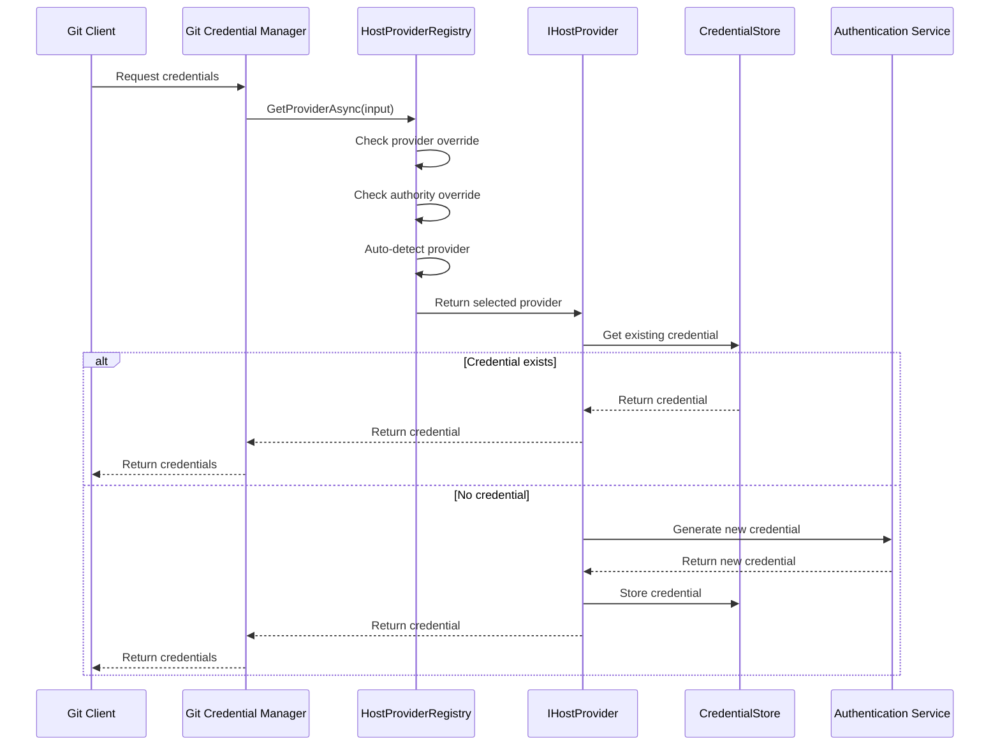
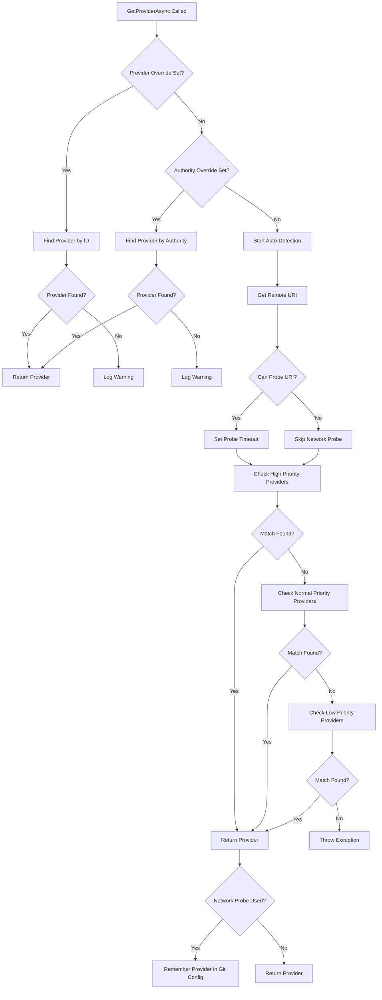
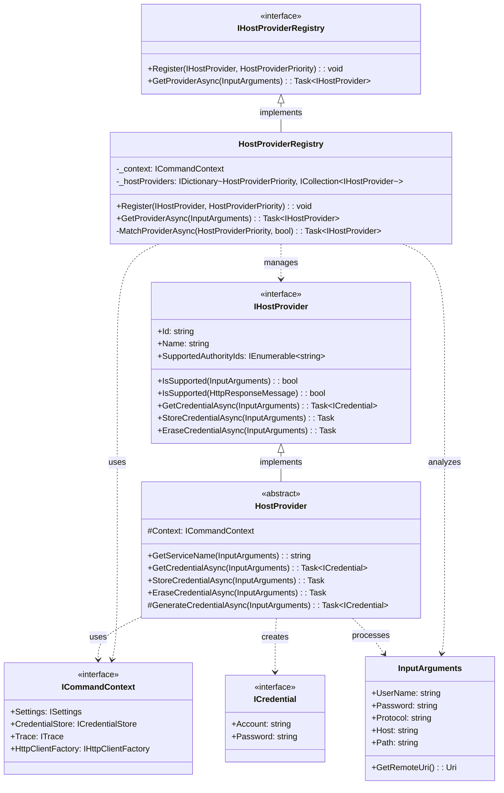

# HostProviderFramework Module Documentation

## Introduction

The HostProviderFramework module is the core component of the Git Credential Manager that enables extensible authentication support for various Git hosting services. It provides a pluggable architecture where different hosting providers (GitHub, GitLab, Bitbucket, Azure Repos, etc.) can register themselves and handle authentication requests specific to their platforms.

The framework acts as a central registry and selection mechanism, automatically detecting the appropriate hosting provider based on Git remote URLs or HTTP responses, and delegating credential operations to the correct provider implementation.

## Architecture Overview

The HostProviderFramework follows a provider pattern architecture with the following key components:

### Core Components

1. **IHostProvider Interface** - Defines the contract that all hosting providers must implement
2. **HostProvider Abstract Base Class** - Provides common functionality for all providers
3. **IHostProviderRegistry Interface** - Manages provider registration and selection
4. **HostProviderRegistry Implementation** - Handles provider discovery and auto-detection

### Provider Priority System

The framework supports a three-tier priority system (High, Normal, Low) that determines the order in which providers are evaluated during auto-detection.

## Detailed Component Documentation

### IHostProvider Interface

The `IHostProvider` interface defines the fundamental contract for all hosting providers:

```csharp
public interface IHostProvider : IDisposable
{
    string Id { get; }                    // Unique provider identifier
    string Name { get; }                  // Human-readable provider name
    IEnumerable<string> SupportedAuthorityIds { get; }  // Legacy authority support
    
    bool IsSupported(InputArguments input);           // Check if provider supports Git input
    bool IsSupported(HttpResponseMessage response);   // Check if provider supports HTTP response
    
    Task<ICredential> GetCredentialAsync(InputArguments input);      // Retrieve credentials
    Task StoreCredentialAsync(InputArguments input);                 // Store credentials
    Task EraseCredentialAsync(InputArguments input);                 // Remove credentials
}
```

### HostProvider Base Class

The abstract `HostProvider` class provides common implementation for all providers:

- **Credential Management**: Default implementation for get, store, and erase operations
- **Service Name Generation**: Creates stable identifiers for credential storage
- **Context Access**: Provides access to command context, tracing, and services

Key methods:
- `GetServiceName()` - Generates a stable service identifier for credential storage
- `GetCredentialAsync()` - Default implementation that checks credential store first
- `StoreCredentialAsync()` - Handles credential persistence with empty credential filtering
- `GenerateCredentialAsync()` - Abstract method for provider-specific credential creation

### HostProviderRegistry

The `HostProviderRegistry` manages provider registration and selection with sophisticated auto-detection capabilities:

#### Provider Selection Logic

1. **Explicit Provider Override**: If a specific provider is configured, use it directly
2. **Legacy Authority Override**: Support for deprecated authority-based selection
3. **Auto-Detection**: Network probing and provider matching based on priority

#### Auto-Detection Process

```
1. Check High Priority Providers (static matching first, then HTTP response)
2. Check Normal Priority Providers (static matching first, then HTTP response)  
3. Check Low Priority Providers (static matching first, then HTTP response)
4. Throw exception if no provider found
```

#### Network Probing

- Performs HTTP HEAD requests to remote URLs for provider detection
- Configurable timeout (default: 5 seconds)
- Caches probe responses to avoid duplicate network calls
- Remembers detected providers in Git configuration for future use

## Data Flow Diagrams

### Credential Retrieval Flow



### Provider Auto-Detection Flow



## Component Interaction Diagram



## Integration with Other Modules

### Authentication Module
The HostProviderFramework integrates with various authentication mechanisms:
- **Basic Authentication**: For username/password credentials
- **OAuth Authentication**: For token-based authentication ([OAuth2.md](OAuth2.md))
- **Microsoft Authentication**: For Azure AD/MSA integration ([MicrosoftAuthentication.md](MicrosoftAuthentication.md))
- **Windows Integrated Authentication**: For Windows domain authentication

### Credential Management Module
Providers work closely with the credential storage system:
- **ICredentialStore**: Interface for credential persistence ([CredentialManagement.md](CredentialManagement.md))
- **Platform-specific stores**: Windows Credential Manager, macOS Keychain, Linux Secret Service
- **Credential caching**: Automatic retrieval and storage of credentials

### Platform Module
The framework leverages platform-specific services:
- **IEnvironment**: Access to environment variables and system information ([Platform.md](Platform.md))
- **IFileSystem**: File system operations for configuration
- **IHttpClientFactory**: HTTP client creation for network probing

### Git Integration Module
Integration with Git configuration and operations:
- **IGit**: Git command execution and configuration access ([GitIntegration.md](GitIntegration.md))
- **IGitConfiguration**: Reading and writing Git configuration values
- Configuration persistence for provider selection

## Configuration and Settings

### Provider Selection Settings

The framework supports several configuration options for controlling provider selection:

- **credential.provider**: Explicitly set the provider ID to use
- **credential.authority**: Legacy setting for authority-based selection (deprecated)
- **credential.autoDetectProviderTimeout**: Timeout for network probing in milliseconds (default: 5000)

### Git Configuration Persistence

When auto-detection successfully identifies a provider, the framework automatically sets:
```
git config --global credential.<remote-url>.provider <provider-id>
```

This optimization avoids future network probes for the same remote URL.

## Error Handling and Diagnostics

### Provider Selection Failures

The framework provides detailed error messages and warnings for:
- Missing or invalid provider overrides
- Network probe timeouts or failures
- No matching providers found
- Git configuration write failures

### Diagnostic Integration

Providers can implement diagnostic capabilities through the [Diagnostics.md](Diagnostics.md) module to help troubleshoot authentication issues.

## Security Considerations

### Credential Storage

- All credentials are stored in platform-specific secure storage
- Service names are generated consistently to avoid authentication loops
- Empty credentials (WIA signals) are not stored

### Network Probing

- Only HTTP/HTTPS URLs are probed for security reasons
- Probe responses are cached to minimize network exposure
- Timeouts prevent indefinite blocking

## Extensibility

### Creating Custom Providers

To implement a custom hosting provider:

1. Inherit from `HostProvider` base class
2. Implement required abstract members: `Id`, `Name`, `IsSupported()`, `GenerateCredentialAsync()`
3. Override virtual methods as needed for custom behavior
4. Register with appropriate priority in the registry

### Provider Registration

Providers are typically registered during application initialization:

```csharp
var registry = new HostProviderRegistry(context);
registry.Register(new GitHubHostProvider(context), HostProviderPriority.High);
registry.Register(new GitLabHostProvider(context), HostProviderPriority.High);
registry.Register(new GenericHostProvider(context), HostProviderPriority.Low);
```

## Performance Considerations

### Auto-Detection Optimization

- Static matching (InputArguments) is performed before network probing
- Probe responses are cached across provider checks
- Successful detections are remembered in Git configuration
- Configurable timeout prevents excessive delays

### Provider Priority Strategy

- High priority: Popular providers (GitHub, GitLab, Bitbucket)
- Normal priority: Enterprise or specialized providers
- Low priority: Generic or fallback providers

This ensures the most likely providers are checked first, minimizing detection time.