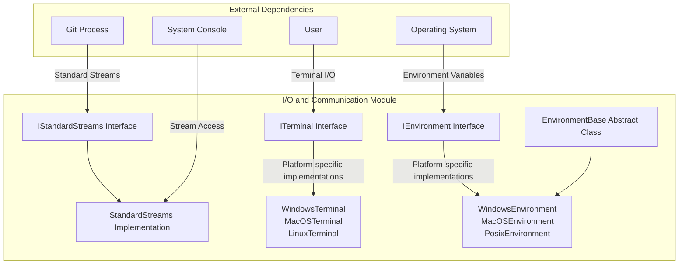
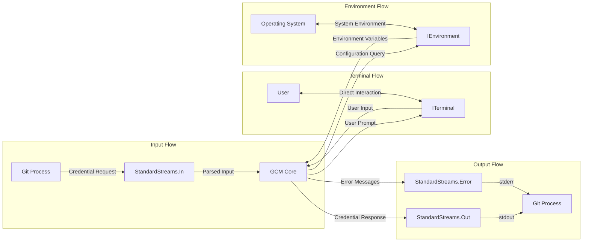
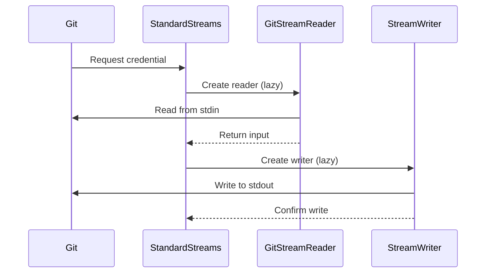
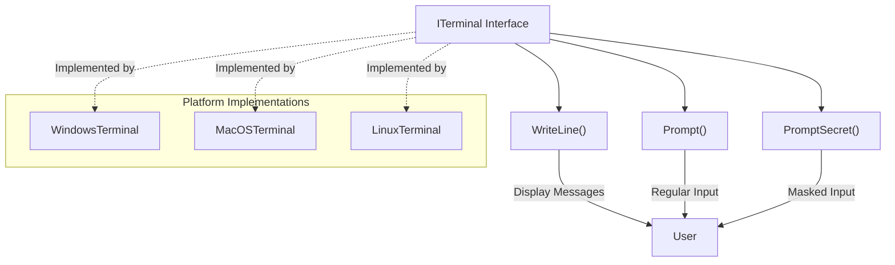
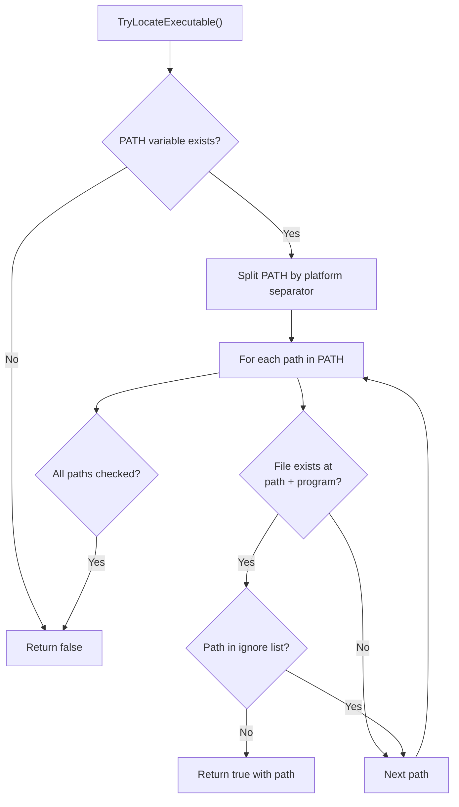

# I/O and Communication Module

## Introduction

The I/O and Communication module provides the foundational infrastructure for input/output operations and communication between Git Credential Manager (GCM) and external processes, particularly Git. This module handles standard streams, terminal interactions, and environment management, serving as the primary communication bridge between GCM and the calling process.

## Overview

The module consists of three core components that work together to provide comprehensive I/O capabilities:

1. **StandardStreams** - Manages standard input, output, and error streams
2. **ITerminal** - Provides terminal interaction capabilities
3. **EnvironmentBase** - Handles environment variable management and process environment

These components ensure reliable communication with Git processes, user interaction through terminals, and proper environment configuration across different platforms.

## Architecture

### Component Architecture



### Data Flow Architecture



## Core Components

### StandardStreams

The `StandardStreams` component manages the three standard I/O streams that Git Credential Manager uses to communicate with Git:

- **Standard Input (In)**: Receives credential requests from Git
- **Standard Output (Out)**: Sends credential responses back to Git
- **Standard Error (Error)**: Reports errors and diagnostic information

#### Key Features

- **UTF-8 Encoding**: All streams use UTF-8 encoding without BOM for consistent character handling
- **Lazy Initialization**: Streams are created only when first accessed
- **Auto-flush**: Output streams automatically flush to ensure immediate delivery
- **Line Feed Normalization**: Uses consistent line feed characters across platforms

#### Implementation Details



### ITerminal

The `ITerminal` interface provides a platform-agnostic way to interact with the terminal for user input and output. This is crucial for scenarios where GCM needs to prompt users for credentials or display information directly to the terminal.

#### Key Features

- **Cross-platform Support**: Abstract interface with platform-specific implementations
- **Secure Input**: Supports masked input for sensitive data like passwords
- **Error Handling**: Comprehensive exception handling for terminal operations
- **Extension Methods**: Provides convenient utility methods

#### Terminal Operations



### EnvironmentBase

The `EnvironmentBase` component provides a comprehensive abstraction for managing the process environment, including environment variables and executable location. This is essential for GCM to understand its execution context and locate necessary tools.

#### Key Features

- **Environment Variable Management**: Get, set, and refresh environment variables
- **PATH Manipulation**: Add/remove directories from PATH and locate executables
- **Cross-platform Path Handling**: Proper path splitting and comparison across platforms
- **Lazy Loading**: Environment variables are loaded only when needed

#### Executable Location Process



## Integration with Other Modules

### Application Management Integration

The I/O and Communication module serves as the foundation for the Application Management module:

- **CommandContext**: Uses `IStandardStreams` to communicate with Git
- **Application**: Relies on `IEnvironment` for configuration
- **InputArguments**: Processes input received through `StandardStreams`

### Cross-Platform Support Integration

The module integrates with platform-specific implementations:

- **Platform Terminals**: `ITerminal` is implemented by platform-specific terminal classes
- **Platform Environments**: `EnvironmentBase` is extended by platform-specific environment classes
- **File System**: Uses `IFileSystem` for path operations in environment management

### Git Integration

Direct integration with Git processes:

- **GitProcess**: Uses `StandardStreams` for process communication
- **GitStreamReader**: Specialized reader for Git input streams
- **Configuration**: Environment variables affect Git configuration

## Usage Patterns

### Basic Stream Communication

```csharp
// Reading from Git
var input = standardStreams.In.ReadLine();

// Writing response to Git
standardStreams.Out.WriteLine("username=john.doe");
standardStreams.Out.WriteLine("password=secret123");

// Error reporting
standardStreams.Error.WriteLine("Authentication failed");
```

### Terminal Interaction

```csharp
// Display message
terminal.WriteLine("Please enter your credentials");

// Regular input
var username = terminal.Prompt("Username: ");

// Secret input
var password = terminal.PromptSecret("Password: ");
```

### Environment Management

```csharp
// Get environment variable
var path = environment.GetEnvironmentVariable("PATH");

// Set environment variable
environment.SetEnvironmentVariable("GCM_TRACE", "1");

// Locate executable
if (environment.TryLocateExecutable("git", out string gitPath))
{
    // Use gitPath
}
```

## Error Handling

### Stream Errors

- **IOException**: Handled gracefully with fallback mechanisms
- **Encoding Issues**: UTF-8 encoding ensures character compatibility
- **Stream Disposal**: Proper cleanup of stream resources

### Terminal Errors

- **InteropException**: Platform-specific terminal errors are wrapped
- **Terminal Unavailable**: Graceful degradation when terminal access is denied
- **Input Validation**: User input is validated and sanitized

### Environment Errors

- **Permission Issues**: Environment variable modifications respect system permissions
- **Path Resolution**: Robust path handling across different file systems
- **Executable Location**: Comprehensive search with fallback mechanisms

## Security Considerations

### Stream Security

- **No Buffering**: Streams are auto-flushed to prevent credential leakage
- **UTF-8 Encoding**: Prevents character encoding attacks
- **Stream Isolation**: Proper separation of input/output/error streams

### Terminal Security

- **Masked Input**: Secret prompts hide user input
- **No Echo**: Password input is not displayed or logged
- **Secure Memory**: Sensitive data is handled securely in memory

### Environment Security

- **Path Validation**: Executable location prevents PATH-based attacks
- **Variable Sanitization**: Environment variables are properly validated
- **Permission Checks**: Environment modifications respect system security

## Performance Characteristics

### Stream Performance

- **Lazy Initialization**: Streams are created only when needed
- **Buffered I/O**: Efficient stream reading and writing
- **Minimal Overhead**: Direct access to system streams

### Terminal Performance

- **Native Implementation**: Platform-specific implementations for optimal performance
- **Minimal Allocation**: Efficient string handling and memory management
- **Async Support**: Non-blocking operations where possible

### Environment Performance

- **Lazy Loading**: Environment variables loaded on-demand
- **Caching**: Variables are cached after first access
- **Efficient Search**: Optimized executable location algorithms

## Testing and Diagnostics

### Stream Testing

- **Mock Streams**: Test implementations for unit testing
- **Stream Capture**: Ability to capture and verify stream content
- **Error Simulation**: Controlled error conditions for testing

### Terminal Testing

- **Mock Terminal**: Test implementation of ITerminal
- **Input Simulation**: Programmatic input for automated testing
- **Output Verification**: Capture and verify terminal output

### Environment Testing

- **Mock Environment**: Test environment with controlled variables
- **Path Simulation**: Virtual file system for path testing
- **Executable Mocking**: Mock executables for location testing

## Platform-Specific Considerations

### Windows

- **Console API**: Uses Windows Console API for terminal operations
- **PATH Separator**: Uses semicolon (;) for PATH variable splitting
- **Executable Extensions**: Handles .exe, .cmd, .bat extensions

### macOS

- **Terminal Access**: Uses POSIX terminal interfaces
- **PATH Separator**: Uses colon (:) for PATH variable splitting
- **Keychain Integration**: Terminal operations may integrate with Keychain

### Linux

- **TTY Interface**: Uses Linux TTY subsystem
- **PATH Separator**: Uses colon (:) for PATH variable splitting
- **Secret Service**: May integrate with Secret Service for secure storage

## Future Enhancements

### Stream Enhancements

- **Async Streams**: Full async/await support for stream operations
- **Stream Compression**: Optional compression for large data transfers
- **Stream Encryption**: End-to-end encryption for sensitive data

### Terminal Enhancements

- **Rich UI**: Enhanced terminal UI with colors and formatting
- **Multi-language Support**: Internationalization for terminal messages
- **Accessibility**: Screen reader support and accessibility features

### Environment Enhancements

- **Dynamic Environment**: Runtime environment modification detection
- **Environment Templates**: Predefined environment configurations
- **Remote Environment**: Support for remote/cloud environments

## References

- [Application Management Module](Application Management.md) - Uses I/O components for Git communication
- [Cross-Platform Support Module](Cross-Platform Support.md) - Platform-specific implementations
- [Git Integration Module](Git Integration.md) - Direct integration with Git processes
- [Configuration and Settings Module](Configuration and Settings.md) - Environment-based configuration