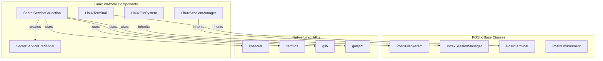
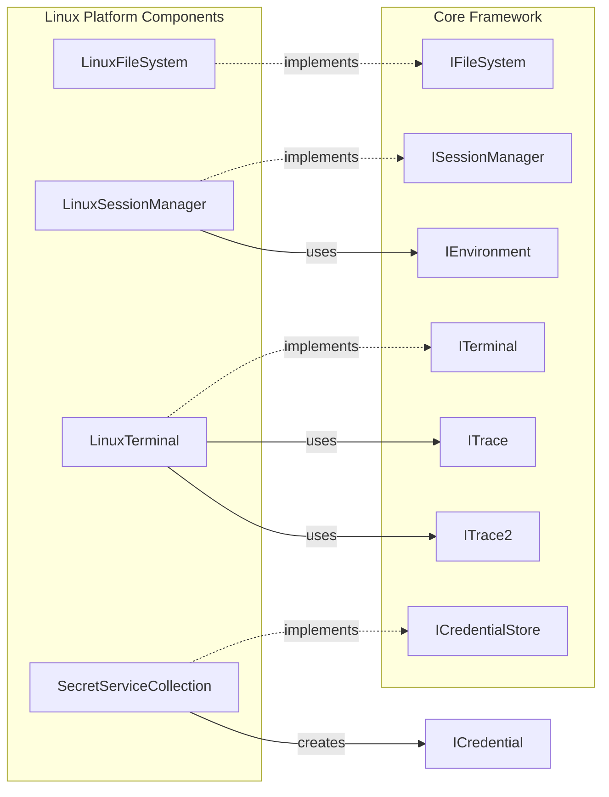
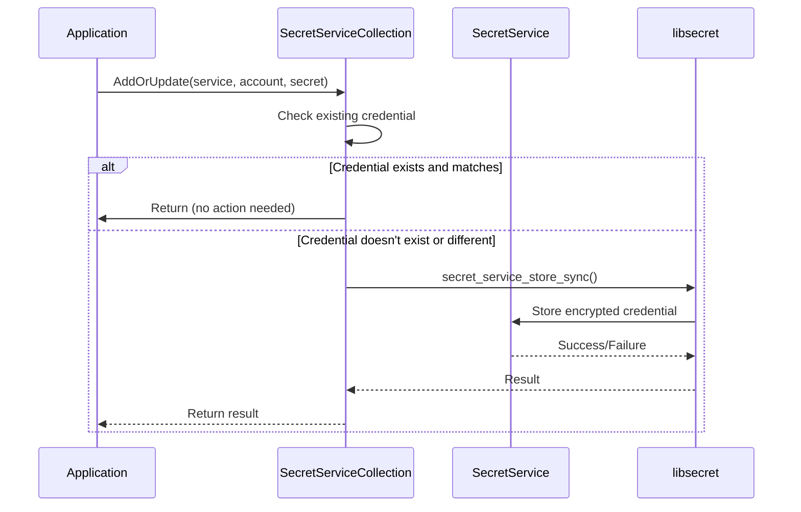
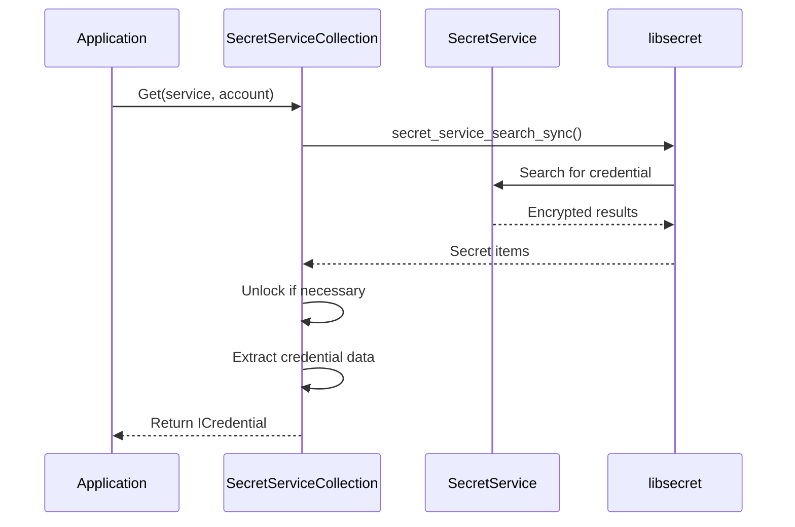

# Linux Platform Components Module

## Introduction

The Linux Platform Components module provides Linux-specific implementations of cross-platform abstractions for the Git Credential Manager. This module enables secure credential storage, terminal interaction, file system operations, and session management on Linux systems, with special considerations for Windows Subsystem for Linux (WSL) environments.

## Module Overview

The Linux Platform Components module is part of the Cross-Platform Support layer and provides essential Linux-specific functionality including:

- **File System Operations**: Linux-specific file system handling with symbolic link resolution
- **Session Management**: Browser availability detection and WSL integration
- **Terminal Operations**: TTY context management for secure user input
- **Credential Storage**: Integration with Linux Secret Service API for secure credential management

## Architecture

### Component Structure



### Dependencies



## Core Components

### LinuxFileSystem

**Purpose**: Provides Linux-specific file system operations with symbolic link resolution.

**Key Features**:
- Inherits from `PosixFileSystem` for basic POSIX file operations
- Implements `IsSamePath()` with symbolic link resolution
- Handles path normalization and comparison

**Implementation Details**:
- Uses `Path.GetFullPath()` for path normalization
- Resolves symbolic links using `ResolveSymbolicLinks()`
- Performs case-sensitive path comparison using `StringComparer.Ordinal`

### LinuxSessionManager

**Purpose**: Manages user sessions and determines browser availability on Linux systems.

**Key Features**:
- WSL (Windows Subsystem for Linux) detection and integration
- Browser availability assessment
- Desktop session detection

**WSL Integration**:
- Detects if running in a WSL distribution
- Checks for Windows session ID to determine interactivity
- Validates shell execute handler availability for browser launching
- Handles session 0 restrictions for non-interactive scenarios

**Browser Availability Logic**:
```
If WSL environment:
    Check shell execute handler
    If Windows session ID == 0:
        Return false (non-interactive)
    Else:
        Return true (assume interactive)
Else:
    Return IsDesktopSession
```

### LinuxTerminal

**Purpose**: Provides Linux-specific terminal operations for secure user input.

**Key Features**:
- TTY context management using Linux termios
- Secure password input with echo control
- Terminal setting preservation and restoration

**Implementation Details**:
- Uses `termios_Linux` structure for terminal settings
- Implements `TtyContext` class for disposable terminal state management
- Handles terminal echo control for password input
- Provides error handling with `Trace2InteropException`

### SecretServiceCollection

**Purpose**: Implements secure credential storage using Linux Secret Service API.

**Key Features**:
- Integration with Linux Secret Service (libsecret)
- Credential CRUD operations (Create, Read, Update, Delete)
- Namespace support for credential scoping
- Automatic credential unlocking

**Security Implementation**:
- Uses predefined schema (`com.microsoft.GitCredentialManager`)
- Stores credentials with service and account attributes
- Implements automatic collection unlocking
- Provides secure memory management with proper cleanup

**Credential Operations**:
- **Get**: Retrieves credentials by service and account
- **AddOrUpdate**: Stores or updates credentials with deduplication
- **Remove**: Deletes credentials by service and account
- **GetAccounts**: Lists all accounts for a given service

### SecretServiceCredential

**Purpose**: Represents a credential stored in the Linux Secret Service.

**Properties**:
- `Service`: The service identifier
- `Account`: The account/username
- `Password`: The secret/password

**Features**:
- Debugger display support for development
- Immutable design for security
- Internal constructor to prevent unauthorized creation

## Data Flow

### Credential Storage Flow



### Credential Retrieval Flow



## Integration with Other Modules

### Cross-Platform Support
The Linux Platform Components integrate with the broader Cross-Platform Support module:

- **POSIX Components**: Inherits from POSIX base classes for shared functionality
- **Windows Components**: Coordinates through WSL detection and integration
- **macOS Components**: Shares interface contracts but implements Linux-specific behavior

### Credential Management
Integrates with the Credential Management module:

- **ICredentialStore**: Implements the credential store interface
- **ICredential**: Provides Linux-specific credential implementation
- **Session Management**: Coordinates with session managers for credential access

### Authentication System
Supports authentication flows by:

- Storing OAuth tokens securely
- Managing authentication credentials
- Providing secure credential retrieval for authentication providers

## WSL Considerations

### Browser Detection in WSL
The module includes sophisticated logic for determining browser availability in WSL environments:

1. **WSL Detection**: Uses `WslUtils.IsWslDistribution()` to detect WSL environment
2. **Session Analysis**: Checks Windows session ID to determine interactivity
3. **Shell Handler Validation**: Ensures shell execute handler is available
4. **Security Constraints**: Respects session 0 restrictions for non-interactive scenarios

### Cross-Platform Integration
When running in WSL, the module can:
- Launch Windows browsers for OAuth flows
- Access Windows credential stores if needed
- Coordinate between Linux and Windows environments

## Security Considerations

### Secret Service Integration
- Uses standard Linux Secret Service API
- Implements proper memory management with native cleanup
- Handles credential unlocking automatically
- Provides namespace isolation for credential scoping

### Terminal Security
- Implements secure TTY context management
- Preserves and restores terminal settings
- Controls echo state for password input
- Handles errors gracefully without exposing sensitive information

### Memory Management
- Proper cleanup of native resources
- Safe handling of native pointers
- Error handling with proper resource disposal
- Protection against memory leaks in native interop

## Error Handling

### Native Interop Errors
- `InteropException`: Handles native library errors with error codes
- `Trace2InteropException`: Provides detailed tracing for debugging
- Proper cleanup in error scenarios
- Graceful degradation when services are unavailable

### Service Availability
- Handles Secret Service unavailability
- Provides fallback mechanisms
- Graceful handling of permission issues
- User-friendly error messages

## Performance Considerations

### Caching
- Browser availability result is cached after first check
- Session information is reused across operations
- Avoids redundant service calls

### Native Operations
- Efficient native library usage
- Minimal memory allocations in hot paths
- Proper resource pooling for native handles
- Asynchronous operations where possible

## Platform-Specific Features

### Linux Desktop Integration
- Detects desktop session availability
- Integrates with Linux Secret Service
- Supports standard Linux authentication flows
- Provides native terminal integration

### WSL-Specific Features
- Windows session detection
- Cross-platform browser launching
- Integration with Windows authentication
- Session 0 awareness for server scenarios

## References

- [Cross-Platform Support](Cross-Platform%20Support.md) - Parent module documentation
- [Credential Management](Credential%20Management.md) - Credential storage integration
- [Authentication System](Authentication%20System.md) - Authentication provider support
- [Core Application Framework](Core%20Application%20Framework.md) - Base framework components