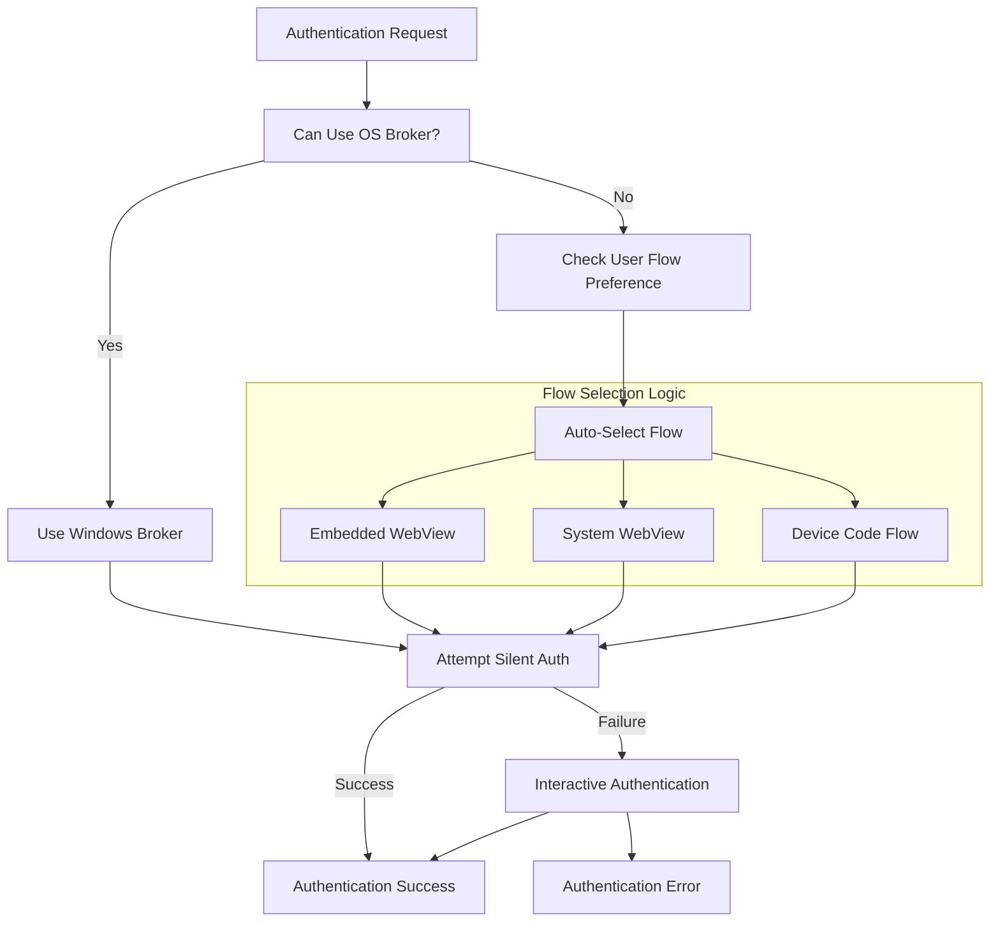
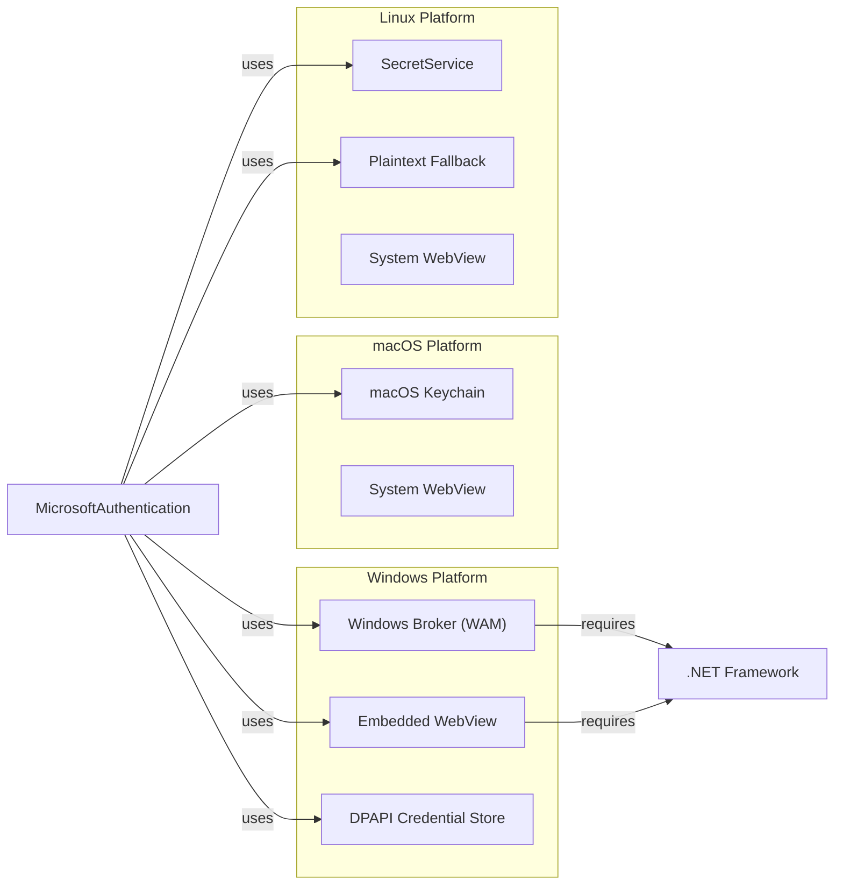
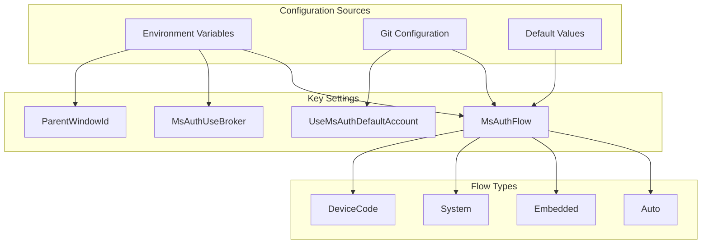
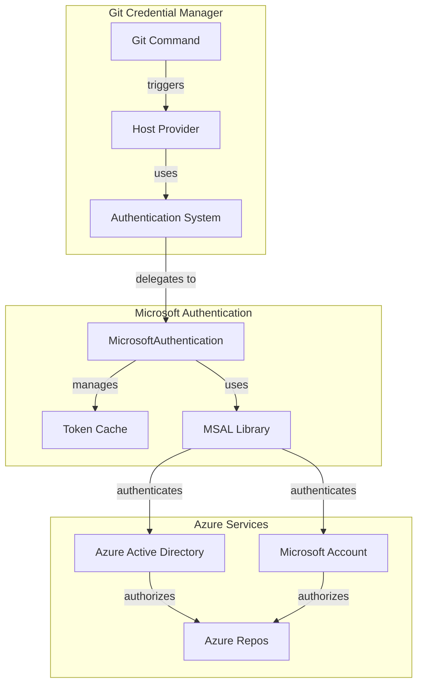

# Microsoft Authentication Module

## Introduction

The Microsoft Authentication module provides comprehensive authentication capabilities for Microsoft Azure Active Directory (AAD) and Microsoft Account (MSA) services. It serves as a specialized authentication provider within the Git Credential Manager ecosystem, handling user authentication, service principal authentication, and managed identity scenarios for Microsoft-hosted Git services like Azure Repos.

## Architecture Overview

The module is built on top of the Microsoft Authentication Library (MSAL) and provides a unified interface for different authentication flows including interactive authentication, silent authentication, device code flow, and system/embedded web views. It integrates with the broader authentication framework while providing Microsoft-specific functionality.

```mermaid
graph TB
    subgraph "Microsoft Authentication Module"
        IMicrosoftAuthentication["IMicrosoftAuthentication Interface"]
        MicrosoftAuthentication["MicrosoftAuthentication Class"]
        ServicePrincipalIdentity["ServicePrincipalIdentity"]
        IMicrosoftAuthenticationResult["IMicrosoftAuthenticationResult"]
        MsalResult["MsalResult"]
    end
    
    subgraph "Core Framework Dependencies"
        AuthenticationBase["AuthenticationBase"]
        ICommandContext["ICommandContext"]
        IHttpClientFactory["IHttpClientFactory"]
        ISettings["ISettings"]
        ISessionManager["ISessionManager"]
    end
    
    subgraph "MSAL Integration"
        IPublicClientApplication["IPublicClientApplication"]
        IConfidentialClientApplication["IConfidentialClientApplication"]
        IManagedIdentityApplication["IManagedIdentityApplication"]
        MsalCacheHelper["MsalCacheHelper"]
    end
    
    subgraph "UI Framework"
        AvaloniaUI["AvaloniaUI"]
        TerminalMenu["TerminalMenu"]
        DefaultAccountView["DefaultAccountView"]
    end
    
    IMicrosoftAuthentication --> MicrosoftAuthentication
    MicrosoftAuthentication -->|implements| IMicrosoftAuthentication
    MicrosoftAuthentication -->|inherits| AuthenticationBase
    MicrosoftAuthentication -->|uses| ServicePrincipalIdentity
    MicrosoftAuthentication -->|returns| MsalResult
    MsalResult -->|implements| IMicrosoftAuthenticationResult
    
    MicrosoftAuthentication -->|depends on| ICommandContext
    MicrosoftAuthentication -->|uses| IHttpClientFactory
    MicrosoftAuthentication -->|reads| ISettings
    MicrosoftAuthentication -->|checks| ISessionManager
    
    MicrosoftAuthentication -->|creates| IPublicClientApplication
    MicrosoftAuthentication -->|creates| IConfidentialClientApplication
    MicrosoftAuthentication -->|creates| IManagedIdentityApplication
    MicrosoftAuthentication -->|configures| MsalCacheHelper
    
    MicrosoftAuthentication -->|shows| AvaloniaUI
    MicrosoftAuthentication -->|uses| TerminalMenu
    MicrosoftAuthentication -->|displays| DefaultAccountView
```



## Core Components

### IMicrosoftAuthentication Interface

The primary interface defining the contract for Microsoft authentication operations:

- **GetTokenForUserAsync**: Acquires access tokens for user principals with support for silent authentication, interactive flows, and MSA passthrough
- **GetTokenForServicePrincipalAsync**: Handles service principal authentication using certificates or client secrets
- **GetTokenForManagedIdentityAsync**: Supports both system-assigned and user-assigned managed identities

### MicrosoftAuthentication Class

The main implementation providing Microsoft-specific authentication logic:

- **Multi-flow Support**: Automatically selects the best authentication flow based on platform capabilities and user preferences
- **Token Caching**: Integrates with MSAL's token cache for persistent token storage
- **Platform Optimization**: Leverages OS-specific features like Windows Broker on Windows 10+
- **Fallback Mechanisms**: Provides graceful degradation when preferred authentication methods aren't available

### ServicePrincipalIdentity

Encapsulates service principal authentication credentials:

- Supports both certificate-based and secret-based authentication
- Includes X5C (certificate chain) sending capability
- Provides tenant and client ID validation

## Authentication Flows



### User Authentication Flow

1. **Silent Authentication**: Attempts to acquire tokens without user interaction using cached accounts
2. **OS Broker Integration**: On Windows 10+, leverages the Web Account Manager (WAM) for seamless authentication
3. **Interactive Flows**: Falls back to embedded webview, system webview, or device code flow based on platform capabilities
4. **Default Account Support**: Provides option to use the current OS account without explicit user selection

### Service Principal Authentication

- **Certificate-based**: Uses X.509 certificates for secure service-to-service authentication
- **Secret-based**: Supports client secret authentication as fallback
- **Token Caching**: Maintains separate application token cache for service principals

### Managed Identity Authentication

- **System-assigned**: Supports system-assigned managed identities
- **User-assigned**: Supports user-assigned managed identities by client ID or resource ID
- **Multiple Formats**: Accepts various identity specification formats (GUID, id://, resource://)

## Platform Integration



## Token Cache Management

The module implements sophisticated token caching to minimize authentication prompts:

### User Token Cache
- **Shared Cache**: Uses Microsoft's standard `.IdentityService/msal.cache` location
- **Cross-Application**: Shared with other Microsoft developer tools like Azure PowerShell CLI
- **Platform Security**: Leverages platform-specific secure storage (DPAPI, Keychain, SecretService)

### Application Token Cache
- **Isolated Storage**: Separate cache for service principal tokens at `~/.gcm/msal/app.cache`
- **Application-specific**: Not shared with other applications

### Cache Fallback Strategy
- **Linux Fallback**: Falls back to plaintext storage when SecretService is unavailable
- **Error Handling**: Graceful degradation with user warnings when secure storage fails

## Configuration and Settings



## Error Handling and Diagnostics

The module provides comprehensive error handling and diagnostic capabilities:

### Exception Handling
- **MSAL Integration**: Catches and logs MSAL-specific exceptions
- **UI Required Detection**: Handles `MsalUiRequiredException` for fallback to interactive flows
- **Cache Persistence**: Manages `MsalCachePersistenceException` with platform-specific fallbacks

### Tracing and Logging
- **MSAL Tracing**: Optional MSAL library logging with PII control
- **Flow Tracking**: Detailed trace information about authentication flow selection
- **Error Context**: Comprehensive exception logging with contextual information

## Security Considerations

### Token Security
- **Secure Storage**: Platform-specific credential storage with encryption
- **Token Lifecycle**: Proper token refresh and expiration handling
- **Scope Management**: Validates requested scopes against available permissions

### Authentication Flow Security
- **HTTPS Enforcement**: All authentication flows use secure HTTPS endpoints
- **Redirect URI Validation**: Validates loopback addresses for system webview
- **Certificate Validation**: Proper X.509 certificate chain validation

### Platform Security
- **Windows**: Integration with Windows Credential Manager and DPAPI
- **macOS**: Leverages Keychain services with appropriate access controls
- **Linux**: Uses SecretService with fallback to encrypted files

## Integration with Git Credential Manager



## Dependencies

### Core Framework Dependencies
- **[Authentication Base](Core Application Framework.md)**: Inherits from `AuthenticationBase` for common authentication functionality
- **[Command Context](Core Application Framework.md)**: Uses `ICommandContext` for settings, tracing, and HTTP client access
- **[Session Management](Cross-Platform Support.md)**: Leverages `ISessionManager` for desktop session detection
- **[HTTP Client Factory](Utilities.md)**: Uses `IHttpClientFactory` for HTTP client management

### UI Framework Dependencies
- **[Avalonia UI](UI Framework.md)**: Uses Avalonia for cross-platform UI components
- **[Terminal Interface](Core Application Framework.md)**: Falls back to terminal-based prompts

### Platform Integration Dependencies
- **[Windows Components](Cross-Platform Support.md)**: Windows-specific implementations for broker support
- **[macOS Components](Cross-Platform Support.md)**: Keychain integration for secure storage
- **[Linux Components](Cross-Platform Support.md)**: SecretService integration with fallback mechanisms

## Usage Examples

### User Authentication
```csharp
// Create Microsoft authentication instance
var microsoftAuth = new MicrosoftAuthentication(commandContext);

// Acquire token for user
var result = await microsoftAuth.GetTokenForUserAsync(
    authority: "https://login.microsoftonline.com/common",
    clientId: "your-client-id",
    redirectUri: new Uri("http://localhost"),
    scopes: new[] { "https://dev.azure.com/user_impersonation" },
    userName: "user@example.com",
    msaPt: false
);

// Use the access token
string accessToken = result.AccessToken;
```

### Service Principal Authentication
```csharp
// Create service principal identity
var servicePrincipal = new ServicePrincipalIdentity
{
    Id = "client-id",
    TenantId = "tenant-id",
    Certificate = new X509Certificate2("certificate.pfx", "password"),
    SendX5C = true
};

// Acquire token for service principal
var result = await microsoftAuth.GetTokenForServicePrincipalAsync(
    sp: servicePrincipal,
    scopes: new[] { "https://dev.azure.com/.default" }
);
```

### Managed Identity Authentication
```csharp
// System-assigned managed identity
var result = await microsoftAuth.GetTokenForManagedIdentityAsync(
    managedIdentity: "system",
    resource: "https://dev.azure.com"
);

// User-assigned managed identity
var result = await microsoftAuth.GetTokenForManagedIdentityAsync(
    managedIdentity: "client-id-guid",
    resource: "https://dev.azure.com"
);
```

## Future Enhancements

### Planned Improvements
- **.NET 5+ Broker Support**: Extend OS broker support to .NET 5+ platforms
- **Enhanced Linux Support**: Improve SecretService integration and fallback mechanisms
- **Device Code GUI**: Add GUI support for device code flow when terminal is unavailable
- **Custom HTML Pages**: Implement custom success/error pages for system webview

### Extensibility Points
- **Custom Flow Types**: Support for additional authentication flows
- **Token Cache Providers**: Pluggable token cache implementations
- **UI Customization**: Enhanced UI theming and customization options
- **Multi-factor Authentication**: Enhanced MFA support and user experience

This module represents a comprehensive Microsoft authentication solution that balances security, usability, and platform compatibility while providing seamless integration with the Git Credential Manager ecosystem.