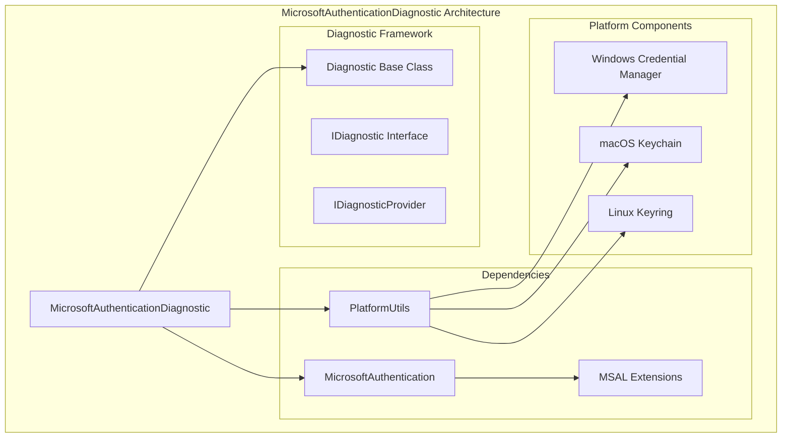
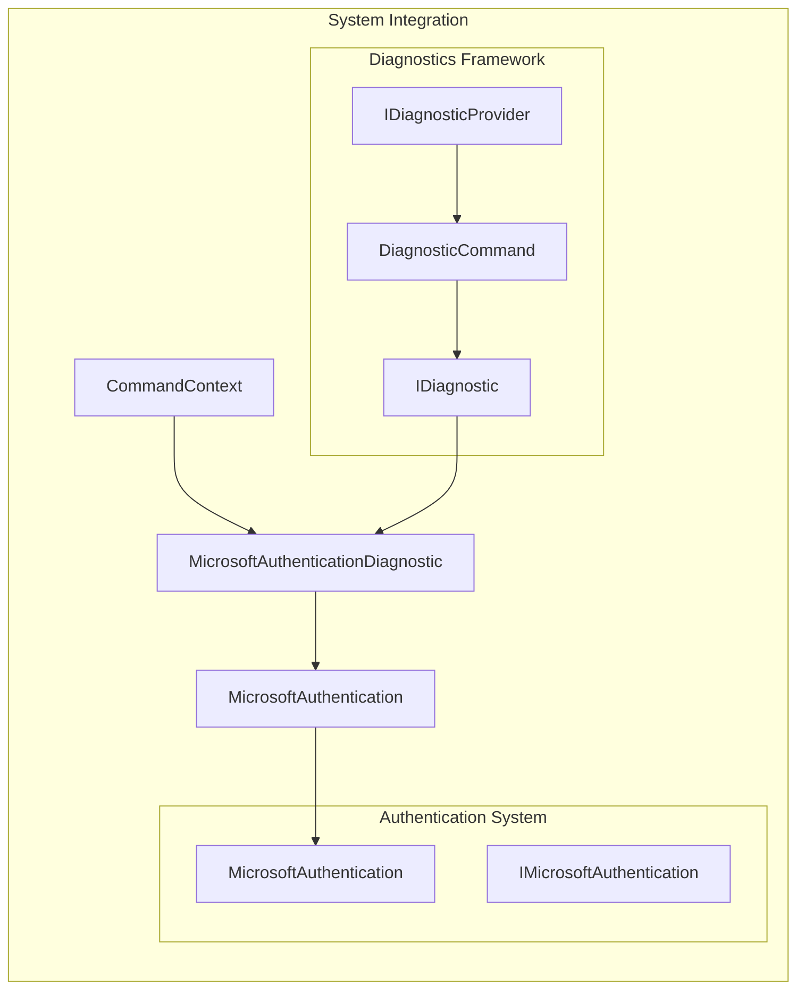
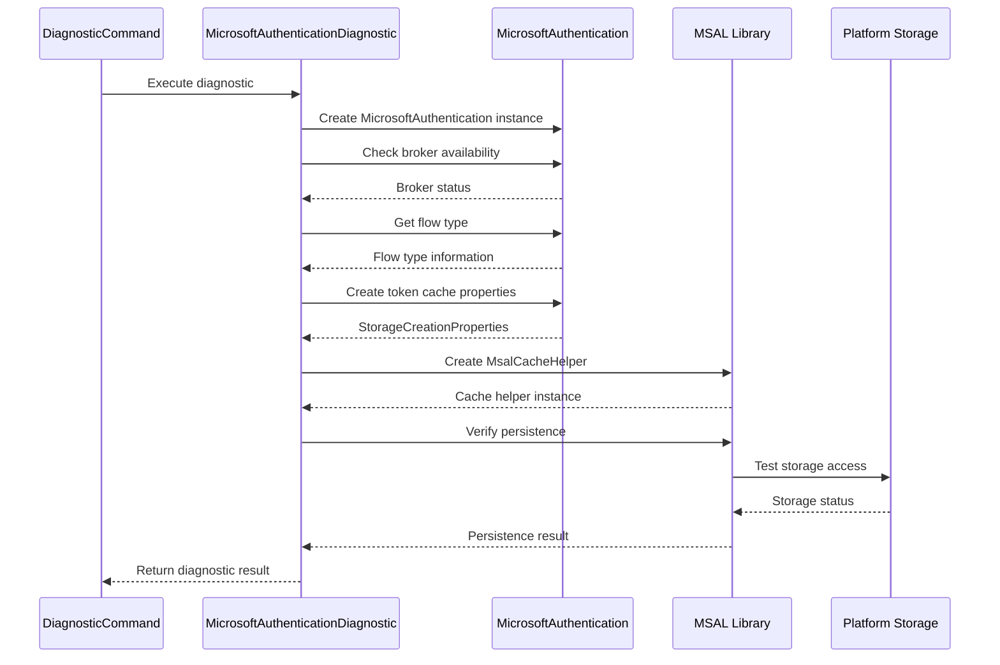
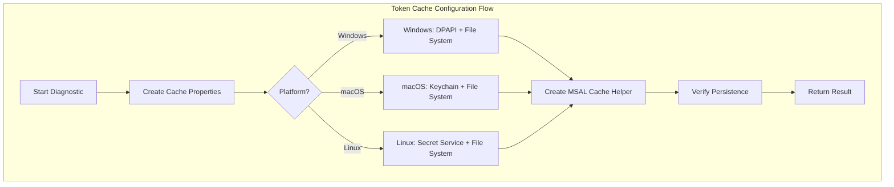
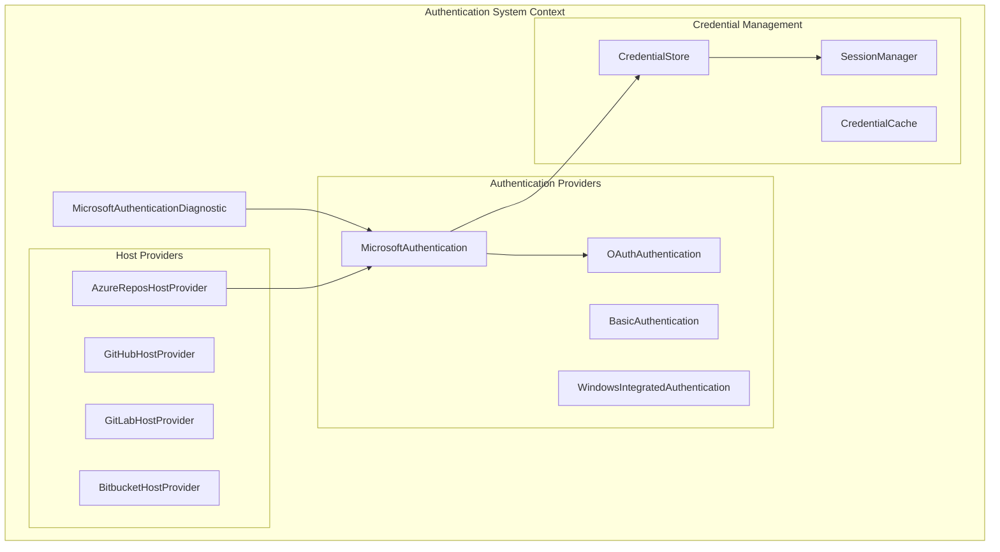

# MicrosoftAuthenticationDiagnostic Module Documentation

## Overview

The MicrosoftAuthenticationDiagnostic module is a specialized diagnostic component within the Git Credential Manager's diagnostics framework. It provides comprehensive analysis and verification of Microsoft authentication systems, including Azure Active Directory (AAD) and Microsoft Account (MSA) authentication mechanisms. This diagnostic tool helps troubleshoot authentication issues by examining token cache configurations, broker availability, and persistence verification across different platforms.

## Purpose and Core Functionality

The primary purpose of the MicrosoftAuthenticationDiagnostic module is to:

- **Validate Microsoft Authentication Configuration**: Examine the current Microsoft authentication setup, including broker status and flow type
- **Analyze Token Cache Properties**: Inspect MSAL (Microsoft Authentication Library) token cache configuration and file paths
- **Verify Cross-Platform Compatibility**: Ensure proper authentication behavior on Windows, macOS, and Linux platforms
- **Test Token Cache Persistence**: Validate that authentication tokens can be properly stored and retrieved
- **Provide Diagnostic Logging**: Generate detailed logs for troubleshooting authentication issues

## Architecture and Component Relationships

### Core Architecture

### Component Integration

## Data Flow and Process Flow

### Diagnostic Execution Flow

### Platform-Specific Token Cache Flow

## Key Components and Dependencies

### MicrosoftAuthenticationDiagnostic Class

The main diagnostic class that inherits from the base `Diagnostic` class and implements Microsoft authentication-specific validation logic.

**Key Methods:**
- `RunInternalAsync()`: Executes the diagnostic checks and generates detailed logs
- Platform-specific cache property inspection
- MSAL token cache persistence verification

### Dependencies

1. **MicrosoftAuthentication**: Provides authentication functionality and broker detection
2. **MSAL Extensions**: Handles token cache management and persistence
3. **PlatformUtils**: Determines platform-specific behavior and storage mechanisms
4. **CommandContext**: Provides execution context and configuration access

### Platform-Specific Storage

The diagnostic examines different storage mechanisms based on the operating system:

- **Windows**: DPAPI-protected file system storage with Windows Credential Manager integration
- **macOS**: Keychain-based storage with file system backup
- **Linux**: Secret Service API integration with file system fallback

## Integration with System Architecture

### Authentication System Integration

The MicrosoftAuthenticationDiagnostic module integrates with the broader authentication system:

### Diagnostic Framework Integration

The module is part of the comprehensive diagnostics framework:

- **Diagnostic Base Class**: Provides common diagnostic functionality and result formatting
- **Diagnostic Command**: Integrates with the Git command system for diagnostic execution
- **Diagnostic Provider Registry**: Allows dynamic discovery and execution of diagnostics
- **Cross-Diagnostic Communication**: Shares context with other diagnostics like [EnvironmentDiagnostic](EnvironmentDiagnostic.md), [NetworkingDiagnostic](NetworkingDiagnostic.md), and [CredentialStoreDiagnostic](CredentialStoreDiagnostic.md)

## Usage and Configuration

### Execution Context

The diagnostic requires an `ICommandContext` instance that provides:
- Settings and configuration access
- Environment information
- Trace and logging capabilities
- Platform-specific services

### Diagnostic Output

The diagnostic generates comprehensive logs including:
- Broker availability status
- Authentication flow type
- Token cache directory and file information
- Platform-specific storage configuration
- MSAL cache persistence verification results

### Error Handling

The diagnostic implements robust error handling:
- Platform detection failures
- MSAL library initialization errors
- Token cache access permission issues
- Persistence verification failures

## Platform Considerations

### Windows Platform
- Utilizes DPAPI for credential protection
- Integrates with Windows Credential Manager
- Supports both user and system-level storage

### macOS Platform
- Leverages macOS Keychain services
- Provides secure token storage with keychain attributes
- Supports keychain access control and sharing

### Linux Platform
- Uses Secret Service API (D-Bus based)
- Falls back to file system storage with appropriate permissions
- Supports various keyring implementations (GNOME Keyring, KWallet, etc.)

## Related Documentation

For comprehensive understanding of the authentication and diagnostic ecosystem, refer to:

- [MicrosoftAuthentication Module](MicrosoftAuthentication.md) - Core Microsoft authentication functionality
- [Authentication System Overview](AuthenticationSystem.md) - Complete authentication architecture
- [Diagnostics Framework](DiagnosticsFramework.md) - General diagnostic system documentation
- [EnvironmentDiagnostic](EnvironmentDiagnostic.md) - Environment-related diagnostics
- [CredentialStoreDiagnostic](CredentialStoreDiagnostic.md) - Credential storage diagnostics
- [NetworkingDiagnostic](NetworkingDiagnostic.md) - Network connectivity diagnostics

## Troubleshooting Guide

### Common Issues

1. **Broker Detection Failures**
   - Check Windows broker service status
   - Verify Microsoft identity broker installation
   - Review application registration settings

2. **Token Cache Access Issues**
   - Verify file system permissions
   - Check credential store accessibility
   - Review platform-specific security settings

3. **Persistence Verification Failures**
   - Ensure adequate disk space
   - Check antivirus/security software interference
   - Verify platform storage service availability

### Diagnostic Interpretation

The diagnostic output provides detailed information for troubleshooting:

- **"Broker is enabled/disabled"**: Indicates WAM (Web Account Manager) availability
- **"Flow type"**: Shows the authentication method being used
- **Cache file paths**: Reveals where tokens are stored
- **Platform-specific attributes**: Shows security configuration details
- **Persistence verification**: Confirms token storage functionality

This comprehensive diagnostic tool ensures reliable Microsoft authentication functionality across all supported platforms and helps identify configuration issues before they impact user authentication experiences.